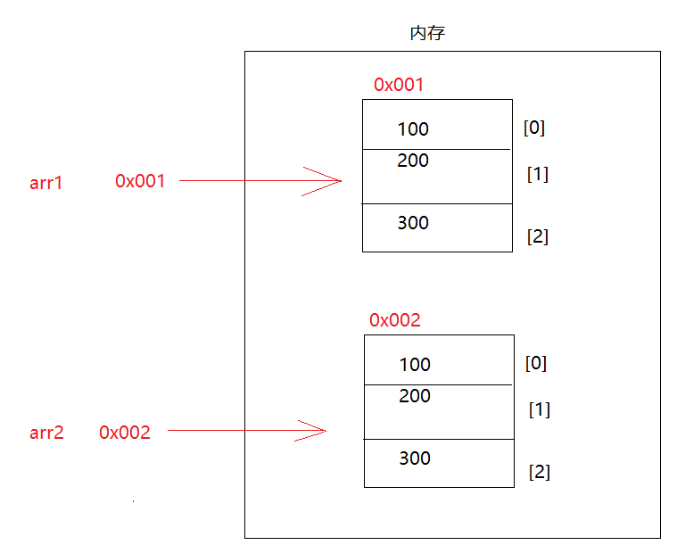
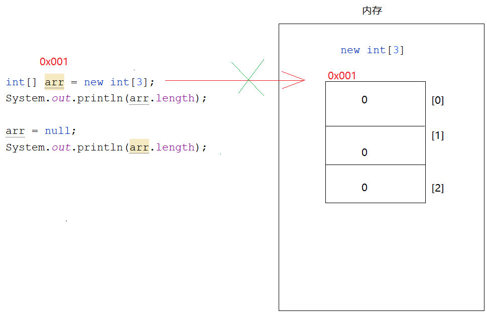
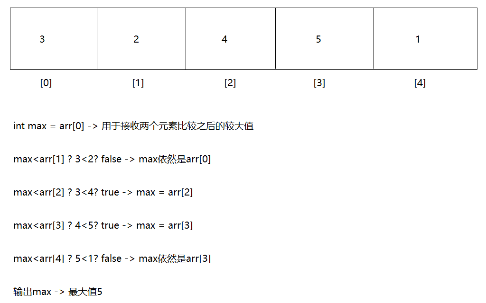

# day04._数组

```java
课前回顾:
 1.Scanner:键盘录入
   a.概述:java提前定义好的类
   b.作用:通过键盘录入的形式将数据放到代码中参与运行
   c.用法:
     导包:import java.util.Scanner
     创建对象: Scanner 变量名 = new Scanner(System.in)
     调用方法:
              变量名.nextInt()录入int型整数的
              变量名.next()录入String型的数据
 2.switch语句:
   a.格式:
     switch(变量名){
         case 目标值1:
             执行语句1;
             break;
         case 目标值2:
             执行语句2;
             break;
         ... 
         default:
             执行语句n;
             break;
     }
   b.执行流程:
     用变量名接受的值和下面的case后面的目标值做匹配,匹上哪个case,就走哪个case对应的执行语句,break结束switch语句
     如果以上所有的case都没有匹配上,就走default对应的执行语句n
    
 3.if的第一种格式:
   if(boolean表达式){
       执行语句
   }

   先走if后面的boolean表达式,如果是true,就走if后面的执行语句,否则不走
 4.if的第二种格式:
   if(boolean表达式){
       执行语句1
   }else{
       执行语句2
   }

   先走if后面的boolean表达式,如果是true,就走if后面的执行语句1,否则就走else后面的执行语句2
       
 5.if的第三种格式:
   if(boolean表达式){
       执行语句1
   }else if(boolean表达式){
       执行语句 2
   }...else{
       执行语句n
   }

   从上到下挨个判断,哪个if条件为true,就走哪个if对应的执行语句,如果以上所有的判断都不成立,就走else对应的执行语句n
       
  6.for循环:
    a.格式:
      for(初始化变量;比较;步进表达式){
          循环语句
      }
    b.执行流程:
      先走初始化变量,然后比较,如果是true,就走循环语句;走步进表达式(初始化的变量的值变化),然后再比较,如果还是true,继续走循环语句,然后走步进表达式,继续比较,直到比较为false,循环结束了
          
今日重点:
  1.会while循环的使用
  2.会dowhile循环的使用(开发不用)
  3.会使用嵌套循环
  4.会使用Random对象在指定的范围内随机一个整数
  5.直到数组的作用以及特点
  6.会定义数组,存数据,取数据,遍历数据
```

# 第一章.数组的介绍以及定义

```java
1.概述:数组本身属于引用类型,都是当做容器使用
2.作用:一次存储多个数据
3.特点:
  a.定长(数组定义出来之后长度是多少就是多少,不能更改)
  b.既能存储引用类型的数据,还能存储基本类型的数据
4.定义:
  动态初始化:
           a.数据类型[] 数组名 = new 数据类型[数组长度]
           b.数据类型 数组名[] = new 数据类型[数组长度]  
               
           c.各部分解释:
             等号左边的数据类型:规定了数组中只能存什么类型的数据
             []:代表的是数组
             数组名:给数组取的名字
             等号右边的new:真正将数组创建出来
             等号右边的数据类型:和等号左边的数据类型一致
             [数组长度]:规定了数组的长度,规定了数组最多能存多少个数据    
  静态初始化:
          a.数据类型[] 数组名 = new 数据类型[]{元素1,元素2,元素3...} -> 不推荐使用
          b.数据类型 数组名[] = new 数据类型[]{元素1,元素2,元素3...} -> 不推荐使用
          c.简化静态初始化:数据类型[] 数组名 = {元素1,元素2,元素3...} -> 推荐使用
              
              
              
5.动态初始化和静态初始化区别:
  a.动态初始化:在创建的时候只给了数组长度,并没有给具体存储的值,需要后续单独存值
  b.静态初始化:在创建的时候没有给具体长度,但是直接往里面存数据了,定义之后存多少个数据,长度就是多少
          
```

```java
public class Demo01Array {
    public static void main(String[] args) {
        //动态初始化
        int[] arr1 = new int[3];

        String[] arr2 = new String[3];

        //静态初始化
        int[] arr3 = {1,2,3};
        String[] arr4 = {"乾隆","纪晓岚","和珅"};
    }
}

```

> 潘家园地铁站 -> 搜 "北京眼镜城"
>
> 8种基本数据类型以及字符串的数组,用动态初始化以及静态初始化都定义一遍

# 第二章.操作数组

## 1.获取数组的长度

```java
1.格式:
  数组名.length
2.注意:
  length是数组的属性,不是方法,所以length后面不要带小括号
```

```java
public class Demo02Array {
    public static void main(String[] args) {
        String[] arr = {"熊出没","喜洋洋与灰太狼","邋遢大王","百变小樱","巴啦啦小魔仙"};
        System.out.println(arr.length);
    }
}
```

## 2.索引

```java
1.概述:元素在数组中的位置(编号,下标)
2.特点:
  a.索引都是从0开始,最大索引是数组长度-1
  b.唯一的
3.注意:
  操作数组中的元素,必须根据索引来操作
```

## 3.存储元素

```java
1.格式:
  数组名[索引值] = 值  -> 将等号右边的值存储到等号左边指定数组的指定索引位置上
  比如: arr[0] = 100 -> 将100存储到arr这个数组的0索引上
```

```java
public class Demo03Array {
    public static void main(String[] args) {
        //动态初始化
        int[] arr1 = new int[3];
        //将100存储到了arr1数组的0索引上
        arr1[0] = 100;
        //将200存储到了arr1数组的1索引上
        arr1[1] = 200;
        //将300存储到了arr1数组的2索引上
        arr1[2] = 300;

        //获取数组名[索引值]
        System.out.println(arr1[0]);
        System.out.println(arr1[1]);
        System.out.println(arr1[2]);
    }
}

```

```java
public class Demo04Array {
    public static void main(String[] args) {
        //动态初始化
        int[] arr1 = new int[3];
        Scanner sc = new Scanner(System.in);
//        arr1[0] = sc.nextInt();
//        arr1[1] = sc.nextInt();
//        arr1[2] = sc.nextInt();

        for (int i = 0; i < 3; i++) {
            /*
               当i = 0,arr1[0] = 输入的值
               当i = 1,arr1[1] = 输入的值
               当i = 2,arr1[2] = 输入的值
             */
            arr1[i] = sc.nextInt();
        }
        System.out.println(arr1[0]);
        System.out.println(arr1[1]);
        System.out.println(arr1[2]);
    }
}
```

```java
public class Demo05Array {
    public static void main(String[] args) {
        //动态初始化
        int[] arr1 = new int[3];
        Random rd = new Random();

        for (int i = 0; i < 3; i++) {
            /*
               当i = 0,arr1[0] = 随机的数
               当i = 1,arr1[1] = 随机的数
               当i = 2,arr1[2] = 随机的数
             */
            arr1[i] = rd.nextInt(100);
        }
        System.out.println(arr1[0]);
        System.out.println(arr1[1]);
        System.out.println(arr1[2]);
    }
}

```

## 4.获取元素

```java
1.格式:
  数组名[索引值]
2.注意:
  a.获取数组中的元素时,不要直接输出数组名,因为直接输出数组名会出现地址值(原因是数组属于引用类型,在内存中会有地址的指向,这个地址值代表了数组或者对象在内存中的位置)
      
  b.如果数组中没有存元素,那么每一个索引位置上也会有值,只不过是默认值
    整数默认值  0
    小数默认值  0.0
    字符默认值  '\u0000' -> 空白字符的特殊写法
    布尔默认值  false
    引用默认值  null
      
3.地址值:是每一个数据在内存中的一个唯一标识,我们会根据地址值去内存中找这个数据
        基本类型直接输出名字是值
        引用类型直接输出名字是地址值
```

```java
public class Demo06Array {
    public static void main(String[] args) {
        int[] arr1 = {1,2,3};
        System.out.println(arr1);//[I@776ec8df

        int[] arr2 = {4,5,6};
        System.out.println(arr2);//[I@4eec7777

        System.out.println("=================");

        String[] arr3 = new String[3];
        System.out.println(arr3[0]);//0
        System.out.println(arr3[1]);//0
        System.out.println(arr3[2]);//0

        System.out.println("========================");

        String[] arr4 = new String[3];
        arr4[0] = "七龙珠";
        arr4[1] = "灌篮高手";
        arr4[2] = "网球王子";

        System.out.println(arr4[0]);
        System.out.println(arr4[1]);
        System.out.println(arr4[2]);
    }
}
```



> arr1[1] = arr2[1]  -> 先将arr2数组的1索引上的元素获取出来,放到arr1这个数组的1索引上

## 5.遍历数组

```java
1.概述:利用循环将元素获取出来
```

```java
public class Demo07Array {
    public static void main(String[] args) {
        String[] arr = {"努尔哈赤","皇太极","顺治","康熙","雍正","乾隆","嘉庆","道光","咸丰","同治","光绪","宣统"};
        for (int i = 0;i<arr.length;i++){
            System.out.println(arr[i]);
        }

        System.out.println("=====================");

        /*
          快捷键: 数组名.fori
         */
        for (int i = 0; i < arr.length; i++) {
            System.out.println(arr[i]);
        }
    }
}
```

> ```java
> 快捷键: 数组名.fori
>   ```

## 6.操作数组时容易出现的问题

### 6.1.数组索引越界异常_ArrayIndexOutOfBoundsException

```java
1.出现的原因:
  操作的索引超出了数组的索引范围
```

```java
public class Demo08Array {
    public static void main(String[] args) {
        int[] arr = new int[3];
        System.out.println(arr[-1]);
        System.out.println(arr[4]);
    }
}

```

### 6.2.空指针异常_NullPointerException

```java
1.出现的原因:
  如果引用类型为null,然后再操作
```

```java
public class Demo09Array {
    public static void main(String[] args) {
        int[] arr = new int[3];
        System.out.println(arr.length);

        arr = null;
        System.out.println(arr.length);//NullPointerException
    }
}
```



> 以上两个问题知道出现的原因即可

# 第三章.数组练习

## 1.练习

```java
获取数组最大值
步骤:
  1.定义一个max用于接收两个数之间的较大值
  2.遍历数组,将每一个元素获取出来
  3.在遍历的过程中判断,如果max<遍历出来的元素,证明遍历出来的元素大,就将遍历出来的元素给max
  4.输出max
```

```java
public class Demo01ArrayTest {
    public static void main(String[] args) {
        int[] arr = {5,43,4,6,67,5,5};
        //1.定义一个max用于接收两个数之间的较大值
        int max = arr[0];
        //2.遍历数组,将每一个元素获取出来
        for (int i = 0; i < arr.length; i++) {
        //3.在遍历的过程中判断,如果max<遍历出来的元素,证明遍历出来的元素大,就将遍历出来的元素给max
            if (max < arr[i]){
                max = arr[i];
            }
        }
        //4.输出max
        System.out.println("max = " + max);
    }
}
```



## 2.练习

```java
随机产生10个[0,100]之间整数，统计既是3又是5，但不是7的倍数的个数
步骤:
  1.创建Random对象
  2.定义一个数组,长度为10
  3.定义一个变量count,用于统计
  4.随机10个整数保存到数组中
  5.遍历数组,如果符合条件,count++
  6.输出count    
```

```java
public class Demo02ArrayTest {
    public static void main(String[] args) {
        //1.创建Random对象
        Random rd = new Random();
        //2.定义一个数组,长度为10
        int[] arr = new int[10];
        //3.定义一个变量count,用于统计
        int count = 0;
        //4.随机10个整数保存到数组中
        for (int i = 0; i < arr.length; i++) {
            arr[i] = rd.nextInt(101);
        }
        //5.遍历数组,如果符合条件,count++
        for (int i = 0; i < arr.length; i++) {
            if (arr[i] % 5 == 0 && arr[i] % 3 == 0 && arr[i] % 7 != 0) {
                count++;
            }
        }
        //6.输出count
        System.out.println("count = " + count);
    }
}

```

## 3.练习

```java
用一个数组存储本组学员的姓名，从键盘输入，并遍历显示
```

```java
自己写
```

## 4.练习

```java
需求:
  1.定义一个数组 int[] arr = {1,2,3,4}
  2.遍历数组,输出元素按照[1,2,3,4]
```

```java
public class Demo03ArrayTest {
    public static void main(String[] args) {
        int[] arr = {1, 2, 3, 4};
        System.out.print("[");
        for (int i = 0; i < arr.length; i++) {
            if (i == arr.length - 1) {
                System.out.print(arr[i] + "]");
            } else {
                System.out.print(arr[i] + ",");
            }
        }
    }
}
```

> 需求:在以上问题的基础上,不用输出语句打印出指定格式了,用String拼接的方式,拼接成[1,2,3,4]格式
>
> ```java
> public class Demo04ArrayTest {
>     public static void main(String[] args) {
>         //1.定义数组
>         int[] arr = {1,2,3,4};
>         //2.定义一个字符串用于拼接
>         String str = "[";
>         //3.遍历数组,进行拼接
>         for (int i = 0; i < arr.length; i++) {
>             if (i==arr.length-1){
>                 str+=arr[i]+"]";//str = str+arr[i]+"]";
>             }else {
>                 str+=arr[i]+",";
>             }
>         }
>         System.out.println(str);
>     }
> }
> 
> ```

## 5.练习

```java
键盘录入一个整数,找出整数在数组中存储的索引位置
步骤:
  1.定义一个数组,随便存几个数据
  2.创建Scanner对象,调用nextInt方法录入一个整数
  3.遍历数组,将遍历出来的元素和录入的数据比较
  4.如果相等,输出对应的索引
```

```java
public class Demo05ArrayTest {
    public static void main(String[] args) {
       // 1.定义一个数组,随便存几个数据
        int[] arr = {11,22,33,44,55,66,77,88};
       // 2.创建Scanner对象,调用nextInt方法录入一个整数
        Scanner sc = new Scanner(System.in);
        int data = sc.nextInt();
        // 3.遍历数组,将遍历出来的元素和录入的数据比较
        for (int i = 0; i < arr.length; i++) {
       // 4.如果相等,输出对应的索引
            if (arr[i] == data){
                System.out.println(i);
            }
        }
    }
}
```

```java
问题升级:如果找不到,输出-1
```

```java
public class Demo06ArrayTest {
    public static void main(String[] args) {
        // 1.定义一个数组,随便存几个数据
        int[] arr = {11, 22, 33, 44, 55, 66, 77, 88};
        // 2.创建Scanner对象,调用nextInt方法录入一个整数
        Scanner sc = new Scanner(System.in);
        int data = sc.nextInt();

        //定义一个flag,作为一个标记使用
        int flag = 0;

        // 3.遍历数组,将遍历出来的元素和录入的数据比较
        for (int i = 0; i < arr.length; i++) {
            // 4.如果相等,输出对应的索引
            if (arr[i] == data) {
                flag++;
                System.out.println(i);
            }
        }

        /*
             判断flag出了for循环之后的值,如果还是0,
             证明在循环的过程中,if语句没有执行
         */
        if (flag == 0){
            System.out.println("-1");
        }
    }
}

```

# 第四章.内存的说明

```java
1.概述:所谓的内存,就可以理解为"内存条",说的是运行内存,我们的代码执行都会进入到内存中执行,在java的世界中,我们将内存划分成5块,每一块内存的作用是不一样的
    
2.具体分那几块呢?
  堆(Heap)***
    a.引用类型的数据
    b.我们每new一次,都会在堆内存中产生一个空间,堆内存会为每个空间自动分配一个地址值
    c.在堆内存中的数据都有默认值
      整数 0
      小数 0.0
      字符 '\u0000'
      布尔 false
      引用 null
    
  栈(Stack)***
    a.专门运行方法的,方法一旦调用就运行起来了,一旦运行就会去栈内存中
    
  方法区(Method Area)*
    a.可以理解为是代码运行前的"预备区"
    b.包含了类的信息以及方法的信息
    
  本地方法栈(Native Method Stack)
    a.专门运行本地方法(定义方法的时候带native关键字)
    b.本地方法是c语言编写的,我们不用自己手动定义
    c.本地方法是对java语言无法完成的功能,进行功能上的扩充
    
  寄存器(pc register) :和CPU有关 
```


## 1.一个数组内存图


## 2.两个数组内存图

```java
arr1和arr2是不同的地址值,指向的是不同的内存空间,所以修改一个空间中的数据不会影响另外一个空间中的数据
```


## 3.两个数组指向同一片内存空间

```java
arr2是arr1直接赋值的,所以arr1和arr2的地址值是一样的,所以指向的是同一片空间,此时修改一个数组的数据会影响另外一个数组
```


# 第五章.数组复杂操作

## 1.练习

```java
数组扩容

需求:  arr1数组保存1,2,3   -> 将arr1数组扩容到5    
```

```java
public class Demo04Array {
    public static void main(String[] args) {
        int[] arr1 = {1,2,3};
        //创建新数组,长度定为5
        int[] arr2 = new int[5];
        //将arr1中的元素复制到arr2中
        for (int i = 0; i < arr1.length; i++) {
            arr2[i] = arr1[i];
        }
        //将arr2的地址值给arr1
        arr1 = arr2;
        //遍历arr1
        for (int i = 0; i < arr1.length; i++) {
            System.out.print(arr1[i]+" ");
        }
    }
}
```


