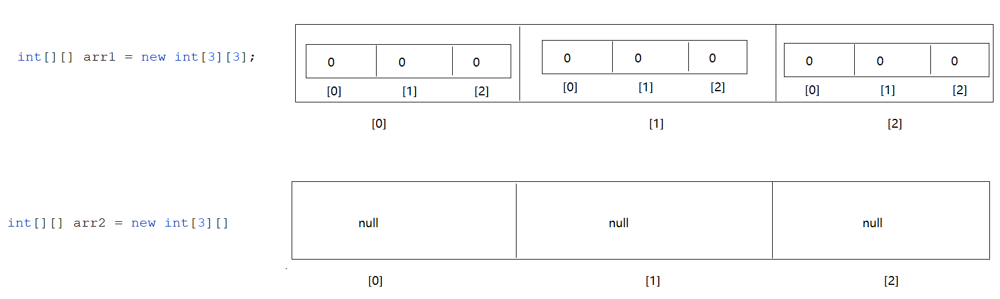
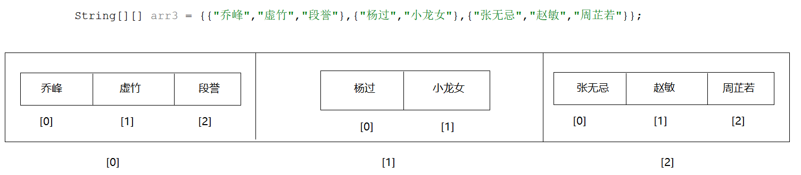
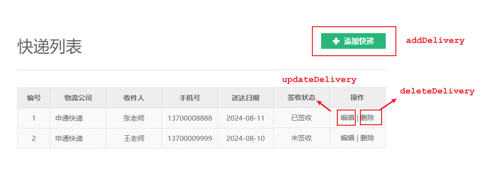
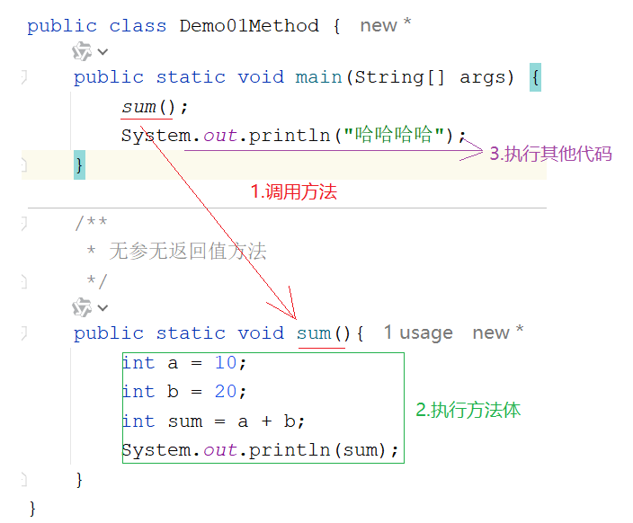
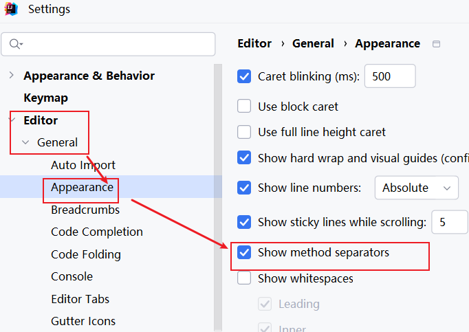
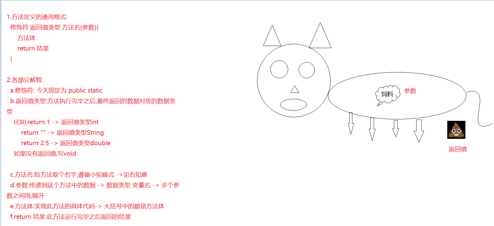
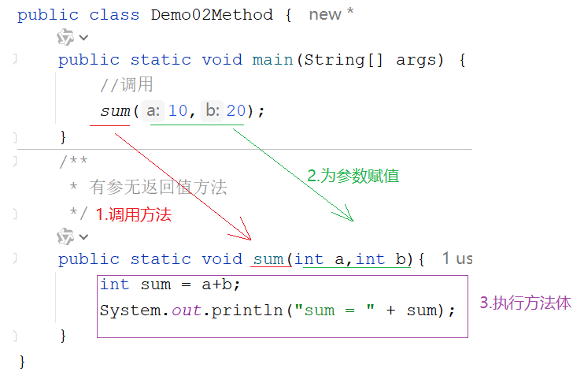
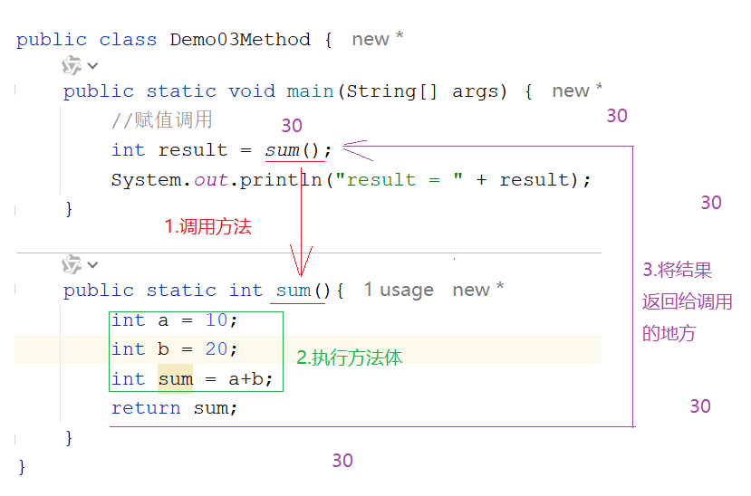
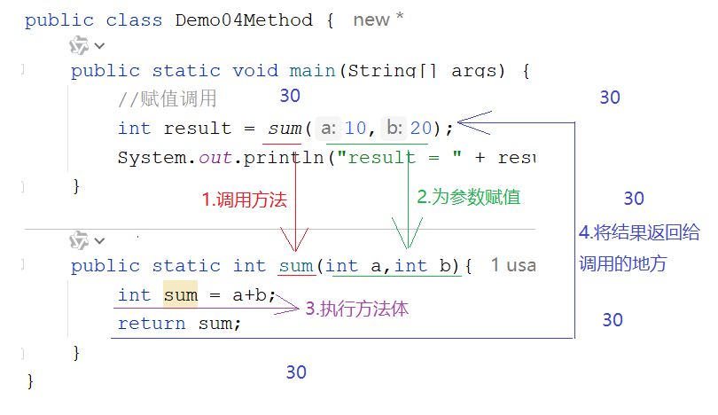
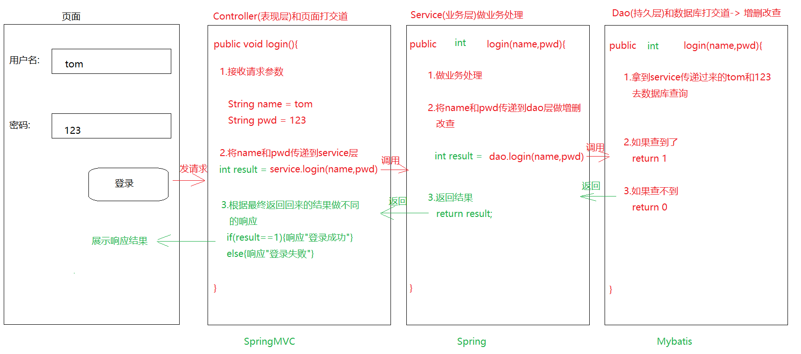

# day05.数组_方法

```java
课前回顾:
  1.while循环:
    a.格式:
      初始化变量
      while(比较){
          循环语句
          步进表达式
      }
    b.执行流程:
      先走初始化变量,如果是true,就走循环语句,走步进表达式
      再比较,如果还是true,继续走循环语句,走步进表达式
      再比较,直到比较为false,循环结束
  2.do...while循环:
    a.格式:
      初始化变量;
      do{
          循环语句
          步进表达式    
      }while(比较);
    b.执行流程:
      先初始化变量,走循环语句,走步进表达式,比较,如果是true,继续循环,直到比较为false,循环结束
  3.循环控制语句:
    break:结束循环
    continue:结束当前循环,自动进入下一次循环
  4.死循环:条件永远成立
  5.嵌套循环:
    先走外层循环,再走内层循环,内层循环就一直循环,直到内层循环结束了,外层循环进入下一次循环,直到外层循环都结束了,整体结束
        
  6.Random:
    a.概述:java提前定义好的类
    b.作用:在指定的范围内随机一个整数
    c.使用:
      导包:import java.util.Random
      new对象: Random 变量名 = new Random()
      调用方法:nextInt()-> 在int的取值范围内随机一个整数
             nextInt(int bound) -> 在0-(bound-1)之间随机一个整数
  7.数组:
    a.概述:容器,本身属于引用类型
    b.作用:一次存储多个数据
    c.特点:
      定长
      存储的元素既能是基本类型,还能是引用类型
    d.定义:
      动态初始化:数据类型[] 数组名 = new 数据类型[长度]
      静态初始化:数据类型[] 数组名 = {元素1,元素2...}
    e.获取数组长度: 数组名.length
    f.索引:元素在数组中的存储位置
      从0开始,最大索引为数组的长度-1
      唯一
    g.存储数据: 数组名[索引值] = 值
    h.获取数据: 数组名[索引值]
    i.遍历: 数组名.fori
    j.操作数组时出现的两个问题
      ArrayIndexOutOfBoundsException 数组索引越界异常 -> 操作的索引超出了数组索引范围
      NullPointerException 空指针异常 -> 引用类型为null之后,再操作
        
      
今日重点:
  1.知道内存中的堆和栈的作用
  2.知道方法的作用和好处
  3.会定义无参无返回值方法以及调用
  4.会定义有参无返回值方法以及调用
  5.会定义无参有返回值方法以及调用
  6.会定义有参有返回值方法以及调用
```

> 晚自习所有人先干:
>
> 用最简单的需求,分别定义四种方法以及调用,直到给个需求,想定义一个啥样的方法就定义啥样的方法,并且能顺利调用执行为止
>
> 否则,其他的知识点,不要干

# 第一章.数组常见算法

## 1.数组翻转

## 2.冒泡排序

## 3.二分查找

# 第二章.数组工具类

## 1.数组工具类

### 1.1.System类

```java
1.概述:系统相关类
2.特点:
  a.构造私有
  b.成员静态
```

| 方法                                                         | 说明                                                         |
| ------------------------------------------------------------ | ------------------------------------------------------------ |
| static void arraycopy(Object src, int srcPos, Object dest, int destPos, int length) | 数组复制<br/>src:源数组<br/>srcPos:从源数组的哪个索引开始复制<br/>dest:目标数组<br/>destPos:从目标数组的哪个索引开始粘贴<br/>length:复制多少个 |

```java
public class Demo01System {
    public static void main(String[] args) {
        /*
          static void arraycopy(Object src, int srcPos, Object dest, int destPos, int length)
                                src:源数组
                                srcPos:从源数组的哪个索引开始复制
                                dest:目标数组->复制到哪个数组中去
                                destPos:从目标数组的哪个索引位置开始粘贴
                                length:复制多少个数据
         */

        int[] arr1 = {1,2,3,4,5,6,7,8,9,10};
        int[] arr2 = new int[20];

        System.arraycopy(arr1,0,arr2,1,5);

        for (int i = 0; i < arr2.length; i++) {
            System.out.print(arr2[i]+" ");
        }

    }
}

```

### 1.2.Arrays类

```java
1.概述:数组工具类
2.作用:操作数组
3.特点:
  构造私有
  方法静态
```

| 方法                                               | 说明                               |
| -------------------------------------------------- | ---------------------------------- |
| static void sort(int[] a)                          | 数组升序                           |
| static String toString(int[] a)                    | 将数组元素打印出来[元素1,元素2...] |
| static int binarySearch(int[] a, int key)          | 二分查找,前提数组是升序的          |
| static int[] copyOf(int[] original, int newLength) | 数组扩容,返回新数组                |

```java
public class Demo01Arrays {
    public static void main(String[] args) {
        int[] arr = {5,4,3,2,1};
        //static void sort(int[] a)数组升序
        Arrays.sort(arr);
        //static String toString(int[] a)将数组元素打印出来[元素1,元素2...]
        System.out.println(Arrays.toString(arr));

        //static int binarySearch(int[] a, int key)二分查找,前提数组是升序的
        int[] arr2 = {1,2,3,4,5,6,7,8,9};
        int index = Arrays.binarySearch(arr2, 5);
        System.out.println("index = " + index);
        //static int[] copyOf(int[] original, int newLength)数组扩容,返回新数组
        int[] arr3 = Arrays.copyOf(arr2, 20);

        System.out.println(Arrays.toString(arr3));

        //将扩容好的新数组地址值给arr2,相当于给arr2扩容了
        arr2 = arr3;
        System.out.println(Arrays.toString(arr2));
    }
}

```


## 2.Hutool工具

官网：https://www.hutool.cn/


### 2.1.引入jar


### 2.2.ArrayUtil工具类

```java
import cn.hutool.core.util.ArrayUtil;

import java.util.Arrays;

public class HuToolTest {
    public static void main(String[] args) {
        int[] arr = {2, 8, 6, 9, 7, 2, 3, 1};

        //在数组中找最大值
        int max = ArrayUtil.max(arr);
        System.out.println("max = " + max);//max = 9

        int target = 7;
        //因为数组是无序的，所以不能用二分查找，只能用顺序查找
        int index = ArrayUtil.indexOf(arr, target);
        System.out.println("7的index = " + index);//7的index = 4

        target = 10;
        index = ArrayUtil.indexOf(arr, target);
        System.out.println("10的index = " + index);//10的index = -1

        //反转数组
        ArrayUtil.reverse(arr);
        System.out.println("arr的元素：" + Arrays.toString(arr));
        //arr的元素：[1, 3, 2, 7, 9, 6, 8, 2]

    }
}

```

# 第三章.二维数组

## 2.1二维数组的定义格式

```java
1.概述:数组中嵌套多个一维数组
2.定义:
  a.动态初始化:
    数据类型[][] 数组名 = new 数据类型[m][n]
    数据类型 数组名[][] = new 数据类型[m][n]
    数据类型[] 数组名[] = new 数据类型[m][n]    

    m:二维数组的长度 -> 二维数组中最多能存多少个一维数组
    n:每一个一维数组长度
        
    数据类型[][] 数组名 = new 数据类型[m][]   -> 此时证明二维数组中的每一个一维数组没有创建  
        
  b.静态初始化:
    数据类型[][] 数组名 = new 数据类型[][]{{元素1,元素2...},{元素1,元素2...}...}
    数据类型 数组名[][] = new 数据类型[][]{{元素1,元素2...},{元素1,元素2...}...}
    数据类型[] 数组名[] = new 数据类型[][]{{元素1,元素2...},{元素1,元素2...}...} 

  c.简化静态初始化:数据类型[][] 数组名 = {{元素1,元素2...},{元素1,元素2...}...}
```



```java
public class Demo01Array {
    public static void main(String[] args) {
        //动态初始化
        int[][] arr1 = new int[3][3];
        int[][] arr2 = new int[3][];

        //静态初始化
        String[][] arr3 = {{"乔峰","虚竹","段誉"},{"杨过","小龙女"},{"张无忌","赵敏","周芷若"}};
    }
}

```



## 2.2获取二维数组长度

```java
1.格式:
  数组名.length
```

```java
public class Demo02Array {
    public static void main(String[] args) {
        //静态初始化
        String[][] arr3 = {{"乔峰","虚竹","段誉"},{"杨过","小龙女"},{"张无忌","赵敏","周芷若"}};
        System.out.println(arr3.length);
        //获取每一个一维数组长度
        for (int i = 0; i < arr3.length; i++) {
            System.out.println(arr3[i].length);
        }
    }
}
```

## 2.3获取二维数组中的元素

```java
格式:数组名[i][j]
    i:代表的是一维数组在二维数组中的索引位置
    j:代表的是每一个元素在一维数组中的索引位置
```

```java
public class Demo03Array {
    public static void main(String[] args) {
        //静态初始化
        String[][] arr3 = {{"乔峰","虚竹","段誉"},{"杨过","小龙女"},{"张无忌","赵敏","周芷若"}};
        System.out.println(arr3[0][2]);
        System.out.println(arr3[1][1]);
        System.out.println(arr3[2][0]);
    }
}

```


## 2.4二维数组中存储元素

```java
格式:数组名[i][j] = 值
    i:代表的是一维数组在二维数组中的索引位置
    j:代表的是每一个元素在一维数组中的索引位置
```

```java
public class Demo04Array {
    public static void main(String[] args) {
        int[][] arr = new int[3][3];
        arr[0][0] = 100;
        arr[0][1] = 200;
        arr[0][2] = 300;

        arr[1][0] = 1000;
        arr[1][1] = 2000;
        arr[1][2] = 3000;

        arr[2][0] = 10000;
        arr[2][1] = 20000;
        arr[2][2] = 30000;

        System.out.println(arr[0][0]);
        System.out.println(arr[0][1]);
        System.out.println(arr[0][2]);
        System.out.println(arr[1][0]);
        System.out.println(arr[1][1]);
        System.out.println(arr[1][2]);
        System.out.println(arr[2][0]);
        System.out.println(arr[2][1]);
        System.out.println(arr[2][2]);
    }
}

```

## 2.5.二维数组的遍历

```java
1.遍历:嵌套循环
  先遍历二维数组,将每一个一维数组获取出来
  然后在遍历每一个一维数组,将元素获取出来
```

```java
public class Demo05Array {
    public static void main(String[] args) {
        int[][] arr = new int[3][3];
        arr[0][0] = 100;
        arr[0][1] = 200;
        arr[0][2] = 300;

        arr[1][0] = 1000;
        arr[1][1] = 2000;
        arr[1][2] = 3000;

        arr[2][0] = 10000;
        arr[2][1] = 20000;
        arr[2][2] = 30000;

       //先遍历二维数组,将每一个一维数组获取出来
        for (int i = 0; i < arr.length; i++) {
            //遍历每一个一维数组
            for (int j = 0; j < arr[i].length; j++) {
                System.out.println(arr[i][j]);
            }
        }
    }
}

```

# 第四章.方法的使用

```java
1.问题描述:
  将来我们会开发很多功能,我们不可能将所有功能的代码都放到一个main方法中,我们应该一个按钮就是一个功能,一个功能就应该对应一个方法
      
2.概述:拥有功能性代码的代码块,将来开发我们应该一个按钮就是一个功能,一个功能就应该对应一个方法
    
3.方法的分类:
  a.无参无返回值方法
  b.有参无返回值方法
  c.无参有返回值方法
  d.有参有返回值方法
      
4.方法的通用格式:在这个通用格式的基础上分成了以上4种方法
  修饰符 返回值类型 方法名(参数){
      方法体
      return 结果
  }
```



## 1.无参无返回值方法定义和调用

```java
1.格式:
  public static void 方法名(){
      方法体    
  }

2.调用:
  在其他方法中: 方法名()
```

```java
需求:定义一个方法,实现两个整数相加
```

```java
public class Demo01Method {
    public static void main(String[] args) {
        sum();
    }

    /**
     * 无参无返回值方法
     */
    public static void sum(){
        int a = 10;
        int b = 20;
        int sum = a + b;
        System.out.println(sum);
    }
}
```



> 

注意事项:

>    1.方法不调用不执行,main是jvm自动调用
>
>    2.方法之间不能互相嵌套,方法之间是平级关系
>
> 3. void关键字代表无返回值
> 4. 方法的执行顺序只和调用顺序有关,哪个方法先被调用哪个方法先执行

## 2.方法定义各部分解释

```java
1.方法定义的通用格式:
  修饰符 返回值类型 方法名(参数){
      方法体
      return 结果
  }

2.各部分解释:
  a.修饰符: 今天固定为 public static
  b.返回值类型:方法执行完毕之后,最终返回的数据对应的数据类型
    比如:return 1 -> 返回值类型int
        return "" -> 返回值类型String
        return 2.5 -> 返回值类型double
    如果没有返回值,写void
        
  c.方法名:给方法取个名字,遵循小驼峰式 ->见名知意
  d.参数:传递到这个方法中的数据 -> 数据类型 变量名 -> 多个参数之间用,隔开
  e.方法体:实现此方法的具体代码-> 大括号中的都是方法体
  f.return 结果:此方法运行完毕之后返回的结果
```



## 3.有参数无返回值的方法定义和执行流程

```java
1.格式:
  public static void 方法名(参数){
      方法体
  }
2.调用:
  方法名(具体的值)
```

```java
需求:定义一个方法,实现两个整数相加
```

```java
public class Demo02Method {
    public static void main(String[] args) {
        //调用
        sum(10,20);
    }
    /**
     * 有参无返回值方法
     */
    public static void sum(int a,int b){
        int sum = a+b;
        System.out.println("sum = " + sum);
    }
}
```



## 4.无参数有返回值定义以及执行流程

```java
1.格式:
  public static 返回值类型 方法名(){
      方法体
      return 结果
  }

2.调用:
  a.打印调用(不推荐): sout(方法名())
  b.赋值调用(推荐) : 数据类型 变量名 = 方法名()  
      
3.问题:方法的返回值返回给了谁?
  哪里调用返回给哪里  
```

```java
需求:定义一个方法实现两个整数相加,将结果返回
```

```java
public class Demo03Method {
    public static void main(String[] args) {
        //赋值调用
        int result = sum();
        System.out.println("result = " + result);
    }

    public static int sum(){
        int a = 10;
        int b = 20;
        int sum = a+b;
        return sum;
    }
}

```



## 5.有参数有返回值定义以及执行流程

```java
1.格式:
  public static 返回值类型 方法名(参数){
      方法体
      return 结果
  }

2.调用:
  a.打印调用(不推荐): sout(方法名(具体的值))
  b.赋值调用(推荐) : 数据类型 变量名 = 方法名(具体的值)  
```

```java
需求:定义一个方法实现两个整数相加,将结果返回
```

```java
public class Demo04Method {
    public static void main(String[] args) {
        //赋值调用
        int result = sum(10,20);
        System.out.println("result = " + result);
    }

    public static int sum(int a,int b){
        int sum = a+b;
        return sum;
    }
}
```



## 6.形参和实参的区别

```java
1.形式参数(形参):在[定义方法]的时候,形式上定义的参数,此时参数没有具体的值
2.实际参数(实参):在[调用方法]的时候,给形参传递了具体的值    
```

## 7.参数和返回值使用的时机

```java
1.参数:
  当想将一个方法中的数据传递到另外一个方法中,那么被调用方法需要定义参数,调用时传递想要传递过去的数据
2.返回值:
  调用方法时,想要此方法的结果,去参与其他操作,那么被调用的方法需要将自己的结果返回
```

```java
public class Demo05Method {
    public static void main(String[] args) {
        int a = 10;
        int b = 20;
        int result = method(a, b);
        if (result>=100){
            System.out.println("大于等于100");
        }else{
            System.out.println("小于100");
        }
    }
    public static int method(int a,int b){
       int sum = a+b;
       return sum;
    }
}
```

> 1.问题描述:
>
> ​    我们不能将所有功能的代码放到一个方法中,同理我们也不能将所有方法放到同一个类中,同理我们也不能将所有的类放到一个包中
>
> ​    将来我们需要分包分层写代码 -> 不同的包放不同类型的类

> ```java
> 1.我们将来开发需要学习一个架构 -> 三层架构-> 说白了通过创建不同的package去分层
> 2.将来创建package都有哪几层呢?
>   com.atguigu.controller(表现层) -> 专门放和页面打交道的类-> 接收请求,回响应
>   com.atguigu.service(业务层) -> 专门放业务逻辑相关的类
>   com.atguigu.dao/mapper(持久层) -> 专门放和数据库打交道的类   
>   com.atguigu.pojo -> 专门放javabean类
>   com.atguigu.utils -> 专门放工具类
> ```
>
> 

## 8.方法注意事项终极版

```java
1.方法不调用不执行 -> main是jvm调用的
2.方法之间不能嵌套,方法之间是平级关系
3.方法的执行顺序只和调用顺序有关
4.void不能和[return 结果]共存,但是void能和[return]共存
  a.void:代表无返回值
  b.return 结果:代表有返回值,先将结果返回,然后结束本方法
  c.return:仅仅代表结束方法  
      
5.一个方法中不能连续写多个return-> 除非有if...else
6.调用方法的时候需要看看下面有没有此方法(方法名,参数个数,参数类型都匹配才不会报错)    
    
```

> 作为初学者:
>
> 1.先定义,再调用
>
> 2.没有返回值的-> 直接调用
>
> 3.有返回值的 -> 赋值调用
