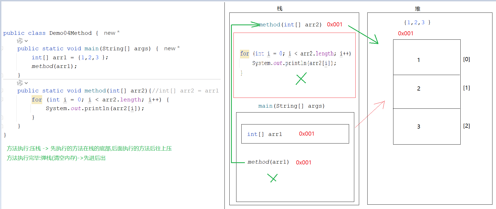
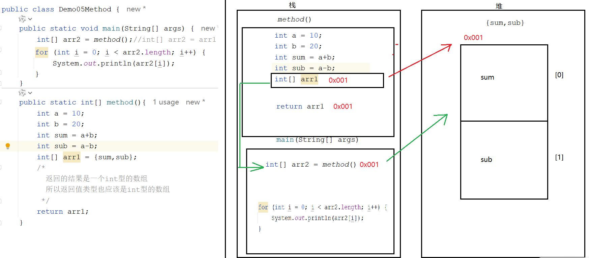
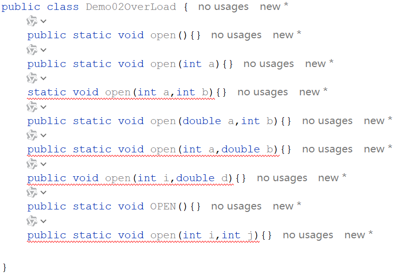
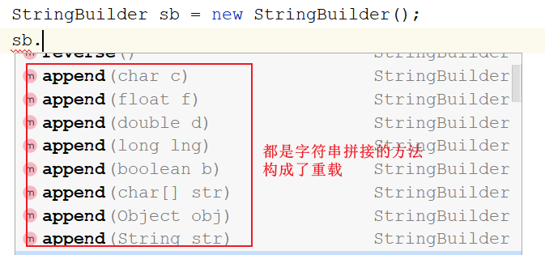
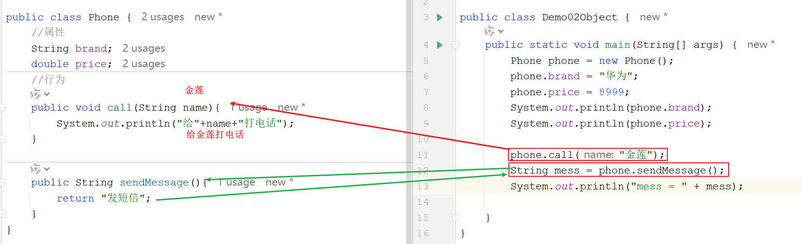
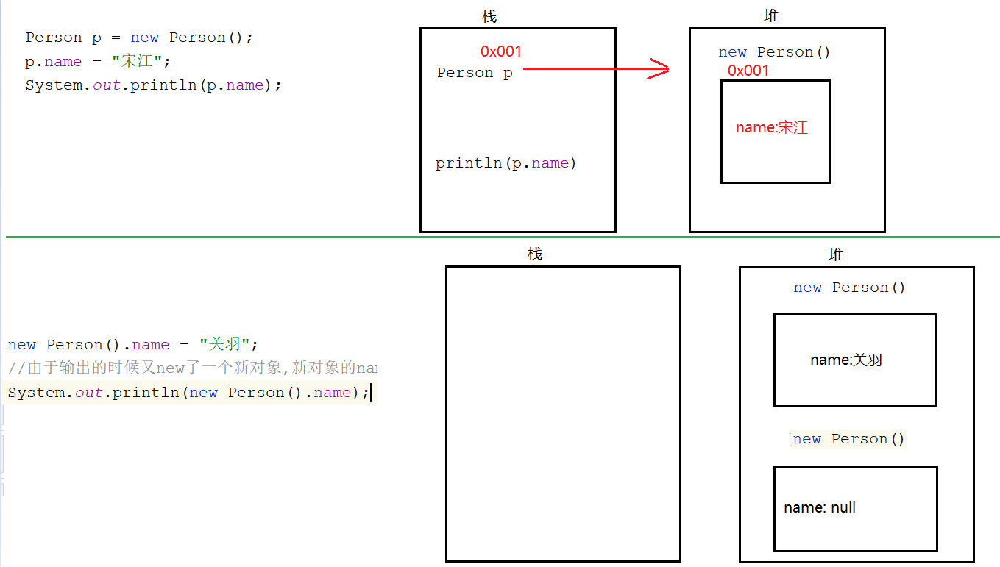
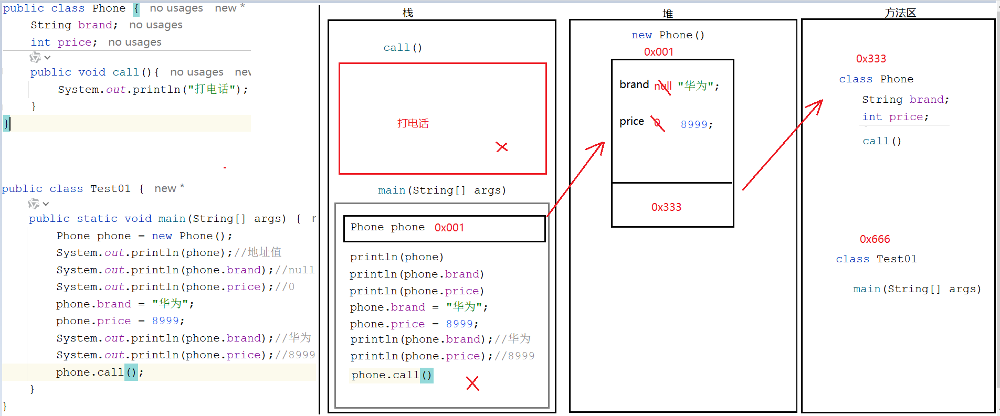
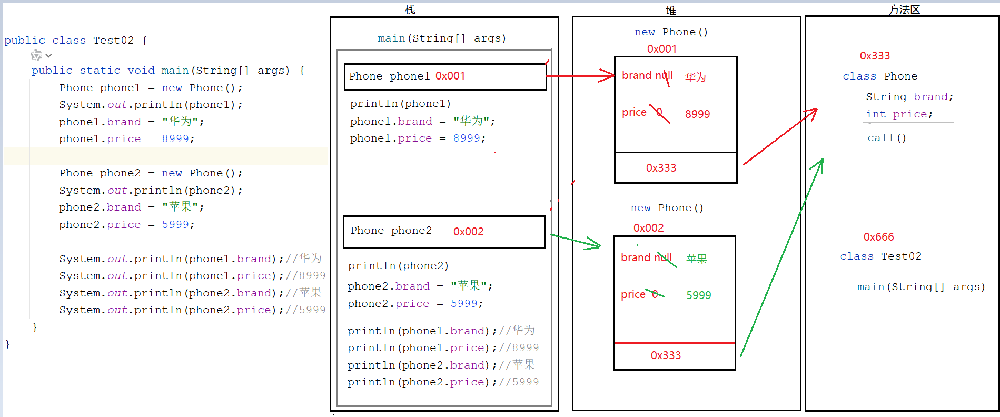
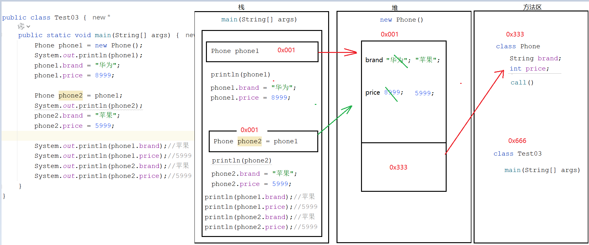

# day06  方法  面向对象

```java
课前回顾:
  1.二维数组:数组中嵌套数组
  2.定义:
    a.动态初始化:数据类型[][] 数组名 = new 数据类型[m][n]
               m:代表的是二维数组长度
               n:代表的是每一个一维数组的长度
    b.静态初始化:
      数据类型[][] 数组名 = {{元素1,元素2...},{元素1,元素2...},{元素1,元素2...}...}
  3.二维数组的操作:
    a.获取长度:数组名.length
    b.存值:数组名[i][j] = 值
          i:代表一维数组在二维数组中的索引位置
          j:代表的是元素在一维数组中的索引位置
    c.取值: 数组名[i][j]
  4.遍历:嵌套循环
  5.方法:一个按钮就是一个功能,一个功能就对应一个方法
    a.通用定义格式:
      修饰符 返回值类型 方法名(形参){
          方法体
          return 结果
      }

    b.无参无返回值方法:
      public static void 方法名(){
          方法体
      }
      
      方法名();

    c.有参无返回值方法:
      public static void 方法名(形参){
          方法体
      }
      方法名(实参)
     
    d.无参有返回值方法:
      public static 返回值类型 方法名(){
          方法体
          return 结果
      }
     
      数据类型 变量 = 方法名()
          
    e.有参有返回值方法:
      public static 返回值类型 方法名(形参){
          方法体
          return 结果
      }

      数据类型 变量名 = 方法名(实参)
          
    f.方法的注意事项:
      方法不调用不执行,main方法是jvm调用的
      方法之间不能互相嵌套
      方法的执行顺序只和调用顺序有关
      void关键字不能和[return 值]共存,但是能和[return]共存
      调用方法的时候要看看下面有没有这个方法
          
   
今日重点:
  1.能分清什么是方法的重载
  2.知道什么是面向对象
  3.面向对象的作用是啥
  4.什么时候使用面向对象思想编程
  5.怎么使用面向对象思想编程
  6.会定义一个实体类(世间万物的分类:人类,动物类,手机类,猫类,狗类等)
  7.会通过new对象的方式去调用别的类中的成员
  8.知道成员变量和局部变量的区别    
```

# 第一章.方法练习

## 1.方法练习1(判断奇偶性)

```java
需求:
   键盘录入一个整数,将整数传递到另外一个方法中,在此方法中判断这个整数的奇偶性
   如果是偶数,方法返回"偶数"  否则返回"奇数"

参数:要
方法名:要
返回值:要
```

```java
public class Demo01Method {
    public static void main(String[] args) {

    }

    public static String method(int data){
       /* if (data%2==0){
            return "偶数";
        }else if (data%2==1){
            return "奇数";
        }*/

        if (data%2==0){
            return "偶数";
        }else{
            return "奇数";
        }
    }
}

```

## 2.方法练习2(1-100的和)

```java
需求 :  求出1-100的和,并将结果返回
参数:不要
返回值:要
方法名:要
```

```java
public class Demo02Method {
    public static void main(String[] args) {
        int sum = sum();
        System.out.println("sum = " + sum);
    }
    public static int sum(){
        int sum = 0;
        for (int i = 1; i <= 100; i++){
            sum+=i;
        }
        return sum;
    }
}
```

## 3.方法练习3(不定次数打印)

```java
需求:
   定义一个方法,给这个方法传几,就让这个方法循环打印几次"我是一个有经验的JAVA开发工程师"
参数:要
返回值:不要
方法名:要
```

```java
public class Demo03Method {
    public static void main(String[] args) {
        print(10);
    }
    public static void print(int n) {
        for (int i = 0; i < n; i++) {
            System.out.println("我是一个有经验的java开发工程师");
        }
    }
}

```

## 4.方法练习4(遍历数组)

```java
需求:
  在main方法中定义一个数组,将数组传递到方法中,在此方法中遍历数组

```

```java
public class Demo04Method {
    public static void main(String[] args) {
        int[] arr1 = {1,2,3,4,5};
        method(arr1);
    }
    public static void method(int[] arr2){//int[] arr2 = arr1
        for (int i = 0; i < arr2.length; i++) {
            System.out.println(arr2[i]);
        }
    }
}

```

> 方法执行:压栈 -> 先执行的方法在栈的底部,后面执行的方法后往上压
> 方法执行完毕:弹栈(清空内存)->先进后出



> 如果参数为引用数据类型,传递的是地址值

## 5.方法练习5(求数组最大值)

```java
需求: 
  在main方法中定义数组,传递到另外一个方法中,在此方法中实现获取数组最大值
```

```java
自己做
```

## 6.方法练习6(按照指定格式输出数组元素)

```java
需求:
  1.定义一个数组 int[] arr = {1,2,3,4}
  2.遍历数组,输出元素按照[1,2,3,4]
```

```java
自己做
```

## 7.练习7

```java
数组作为返回值返回
```

```java
public class Demo05Method {
    public static void main(String[] args) {
        int[] arr2 = method();//int[] arr2 = arr1
        for (int i = 0; i < arr2.length; i++) {
            System.out.println(arr2[i]);
        }
    }
    public static int[] method(){
        int a = 10;
        int b = 20;
        int sum = a+b;
        int sub = a-b;
        int[] arr1 = {sum,sub};
        /*
          返回的结果是一个int型的数组
          所以返回值类型也应该是int型的数组
         */
        return arr1;
    }
}

```



> 数组作为方法返回值返回,返回的是地址值

# 第二章.方法的重载(Overload)

```java
需求:
  定义三个方法,实现两个整数相加,三个整数相加,四个整数相加
```

```java
public class Demo01OverLoad {
    public static void main(String[] args) {
      sum(10,20);
      sum(10,20,30);
      sum(10,20,30,40);
    }
    public static void sum(int a, int b) {
        System.out.println(a + b);
    }
    public static void sum(int a, int b, int c) {
        System.out.println(a + b + c);
    }
    public static void sum(int a, int b, int c, int d) {
        System.out.println(a + b + c + d);
    }
}
```

> 按住ctrl不放鼠标点击方法名,对象,变量名变成"小手"的时候,单击 -> 会跳到我们调用的位置

```java
1.概述:
  方法名相同,参数列表不同的方法,叫做重载的方法
2.什么叫做参数列表不同:
  a.参数个数不同
  b.参数类型不同
  c.参数类型的顺序不同
3.和什么无关:
  a.和参数名无关
  b.和返回值无关
```

```java
public class Demo01OverLoad {
    public static void main(String[] args) {
      sum(10,20);
      sum(10,20,30);
      sum(10,20,30,40);
    }
    public static void sum(int a, int b) {
        System.out.println(a + b);
    }

/*    public static int sum(int a, int b) {
       return a+b;
    }*/
    
    /*public static void sum(int x, int y) {
        System.out.println(x + y);
    }*/
    public static void sum(int a, int b, int c) {
        System.out.println(a + b + c);
    }
    public static void sum(int a, int b, int c, int d) {
        System.out.println(a + b + c + d);
    }
}

```

```java
public static void open(){}
public static void open(int a){}
static void open(int a,int b){}
public static void open(double a,int b){}
public static void open(int a,double b){}
public void open(int i,double d){}
public static void OPEN(){}
public static void open(int i,int j){}
```



```java
使用场景:功能一样,但是实现细节不一样
```



# 第三章.类和对象

```java
java核心编程思想:面向对象
  面向对象:自己的事情找对象去帮我们做
  面向过程:C语言的编程思想 -> 讲究的是自己的事情自己做
```

## 1.面向对象的介绍

```java
1.什么是面向对象思想:java核心编程思想
  讲究的是自己的事情别人做 -> 找个对象,调用这个对象实现好的功能帮我们去做事儿
    
2.为啥要使用面向对象思想
  a.省事 -> 少写代码,减少代码量 -> 有很多功能别人帮我们实现好了,我们只需要将这个人视为我们的对象,然后直接调用这个对象实现好的功能即可
    
3.什么时候使用面向对象思想
  在一个类中想使用别的类中实现好的功能时,就需要使用面向对象思想编程  
    
4.怎么使用面向对象思想:
  a.new呀,new完了点呀 -> 调用
  b.特殊情况:调用这个对象中的成员时,此成员带static关键字 -> 直接不用new,直接用类名点
```

```java
public class Demo01Object {
    public static void main(String[] args) {
        Scanner sc = new Scanner(System.in);
        String data1 = sc.next();
        System.out.println("data1 = " + data1);

        System.out.println("====================");
        Random rd = new Random();
        int data2 = rd.nextInt();
        System.out.println("data2 = " + data2);

        System.out.println("====================");
        int[] arr = {10, 20, 30, 40, 50};
        System.out.print("[");
        for (int i = 0; i < arr.length; i++) {
            if (i == arr.length - 1) {
                System.out.print(arr[i] + "]");
            } else {
                System.out.print(arr[i] + ",");
            }
        }
        System.out.println();
        System.out.println(Arrays.toString(arr));
    }
}
```

## 2.类和对象

### 2.1类(实体类)_class

```java
1.实体类:用代码去描述的世间万物的分类 -> 人类,动物类,猫类,狗类,手机类,电脑类....
2.测试类:带main方法的类,用于让代码执行起来,测试一下代码是否能顺利执行,结果是啥
```

```java
1.类的概述:一类事物的抽象表示形式
2.怎么定义实体类:
  属性:这个类都啥  -> 成员变量
      a.定义位置:类中方法外
      b.定义格式:数据类型 变量名
      c.作用范围:整个类 -> 在当前类中都能使用
      d.有默认值:
        整数 0
        小数 0.0
        字符 '\u0000'
        布尔 false
        引用 null
            
  行为:这个类能干啥-> 功能 -> 成员方法
      将之前的方法去掉static关键字,其他的定义方式一毛一样
```

```java
public class Person {
    //属性-> 成员变量
    String name;
    int age;
    
    //行为-> 成员方法
    public void eat(){
        System.out.println("吃饭");
    }
    public void drink(){
        System.out.println("喝水");
    }
    
    public void la(){
        System.out.println("拉屎");
    }
    
    public void sa(){
        System.out.println("嘘嘘");
    }
}

```

> 描述动物类
>
> ```java
> public class Animal {
>     //属性 -> 成员变量
>     String name;
>     int age;
>     String color;
>     
>     //行为-> 成员方法
>     public void eat() {
>         System.out.println("吃");
>     }
>     public void drink() {
>         System.out.println("喝");
>     }
>     public void la() {
>         System.out.println("拉");
>     }
>     public void sa() {
>         System.out.println("撒");
>     }
> }
> ```
>
> 描述手机类
>
> ```java
> public class Phone {
>     //属性
>     String brand;
>     double price;
>     //行为
>     public void call(String name){
>         System.out.println("给"+name+"打电话");
>     }
>     
>     public String sendMessage(){
>         return "发短信";
>     }
> }
> 
> ```

### 2.2.对象

``` java
1.概述:一类事物的具体体现
2.使用:
  a.导包:import 包名.类名
    如果两个类在同一个包下,使用对方的成员时不需要导包
    如果两个类不在同一个包下,使用对方的成员时需要导包  
  b.new对象:想使用哪个类中的成员,就new哪个类的对象
    类名 对象名 = new 类名()
  c.调用成员:想使用哪个类中的成员,就用哪个类的对象去点哪个成员
    对象名.方法名(实参)
    对象名.属性名    
```

```java
public class Person {
    //属性-> 成员变量
    String name;
    int age;

    //行为-> 成员方法
    public void eat(){
        System.out.println("吃饭");
    }
    public void drink(){
        System.out.println("喝水");
    }

    public void la(){
        System.out.println("拉屎");
    }

    public void sa(){
        System.out.println("嘘嘘");
    }
}
```

```java
public class Demo01Object {
    public static void main(String[] args) {
       /*
          创建Person对象
          类名 对象名 = new 类名()
        */
        Person person = new Person();
        System.out.println(person.name);
        System.out.println(person.age);

        //为属性赋值
        person.name = "金莲";
        person.age = 18;
        System.out.println(person.name);
        System.out.println(person.age);

        person.eat();
        person.drink();
        person.la();
        person.sa();
    }
}

```

```java
public class Phone {
    //属性
    String brand;
    double price;
    //行为
    public void call(String name){
        System.out.println("给"+name+"打电话");
    }

    public String sendMessage(){
        return "发短信";
    }
}

```

```java
public class Demo02Object {
    public static void main(String[] args) {
        Phone phone = new Phone();
        phone.brand = "华为";
        phone.price = 8999;
        System.out.println(phone.brand);
        System.out.println(phone.price);

        phone.call("金莲");
        String mess = phone.sendMessage();
        System.out.println("mess = " + mess);
    }
}

```



### 2.3.练习

```java
需求:用代码去描述一个动物类,在测试类中为动物类中的属性赋值,并且调用动物类中的功能
```

```java
自己做
```

## 3.匿名对象的使用

> ```java
> 1.解析:int i = 10
>   a.int:数据类型
>   b.i:变量名
>   c.10:是真正的值
>       
> 2.解析:Person p = new Person()
>   a.Person:代表的是数据类型
>   b.p:变量名
>   c.new Person():是真正的值 -> 是p这个变量的值 -> 相当于真正将对象创建出来
> ```

```java
1.匿名对象的概述:new对象的时候没有等号左边的部分,相当于对象没有名字,只有new 类名()
  a.Person p = new Person()  有名的对象
  b.new Person() 匿名的对象
2.注意:
  a.如果只让一个方法简单执行,就可以使用匿名对象
  b.但是如果涉及到赋值了,千万不要使用
```

```java
public class Person {
    //属性-> 成员变量
    String name;
    int age;

    //行为-> 成员方法
    public void eat(){
        System.out.println("吃饭");
    }
    public void drink(){
        System.out.println("喝水");
    }

    public void la(){
        System.out.println("拉屎");
    }

    public void sa(){
        System.out.println("嘘嘘");
    }
}

```

```java
public class Demo01Object {
    public static void main(String[] args) {
        //有名对象调用
        Person p = new Person();
        p.name = "宋江";
        System.out.println(p.name);

        p.name = "刘备";
        System.out.println(p.name);

        System.out.println("======================");
        //匿名对象调用
        new Person().name = "关羽";
        //由于输出的时候又new了一个新对象,新对象的name没赋值,所有取出来是默认值
        System.out.println(new Person().name);

        new Person().eat();
    }
}

```



## 4.一个对象的内存图

```java
public class Phone {
    String brand;
    int price;
    public void call(){
        System.out.println("打电话");
    }
}
```

```java
public class Test01 {
    public static void main(String[] args) {
        Phone phone = new Phone();
        System.out.println(phone);//地址值
        System.out.println(phone.brand);//null
        System.out.println(phone.price);//0
        phone.brand = "华为";
        phone.price = 8999;
        System.out.println(phone.brand);//华为
        System.out.println(phone.price);//8999
        phone.call();
    }
}

```



## 5.两个对象的内存图



> phone1和phone2都是new出来的,产生了两个不同的空间,此时修改一个空间中的数据不会影响另外一个空间的数据

## 6.两个对象指向同一片空间内存图



> phone2不是new的,而是phone1给的,所以phone2和phone1的地址值是一样的,所以修改一个对象的数据会影响另外一个对象

# 第四章.成员变量和局部变量区别

```java
1.定义位置不同:
  a.成员变量:类中方法外
  b.局部变量:方法中或者参数位置
2.作用范围不同:
  a.成员变量:作用于整个类
  b.局部变量:只作用于当前所在的方法,其他方法不能直接使用    
3.初始化值不同:
  a.成员变量:有默认值,所以可以直接使用
  b.局部变量:没有默认值,必须先初始化再使用
4.内存位置不同:
  a.成员变量:在堆中
  b.局部变量:在栈中    
5.生命周期不同:
  a.成员变量:随着对象的创建而创建,随着对象的消失而消失
  b.局部变量:随着方法的执行而创建,随着方法的执行完毕而消失    
```

```java
public class Person {
    //成员变量
    String name;

    public void eat(){
        //局部变量
        int i = 10;

        System.out.println(name);
        System.out.println(i);

        //int j;
        //System.out.println(j);局部变量没有默认值,需要初始化才能使用
    }

    public void drink(){
        System.out.println(name);
        //System.out.println(i);i这个变量属于eat方法
    }
}

```

# 第五章.练习

```java
1.定义一个类MyDate,代表生日,类中定义三个属性,分别为 year  month  day,并为三个属性赋值
```

```java

```

```java
2.定义一个公民类Citizen,类中定义三个属性,分别为cardId(String),name(String),MyDate(MyDate),并为三个属性赋值
    
  注意:如果属性为自定义的类型,赋值是需要new对象赋值,不然直接调用时会出现空指针异常 
```

```java

```

```java

```

