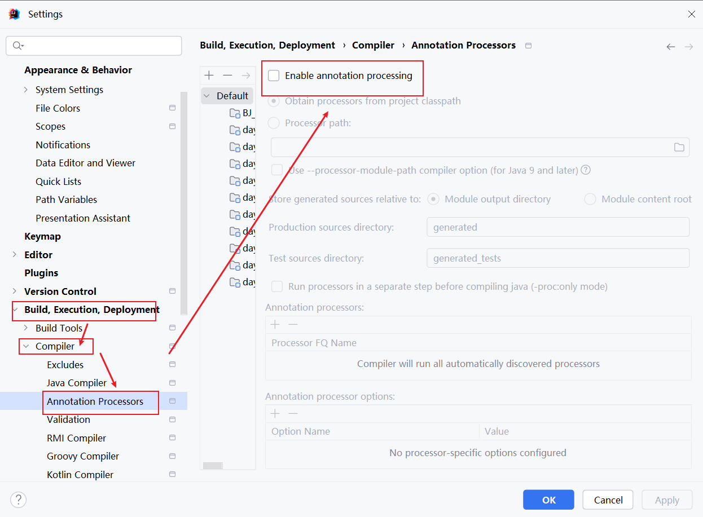
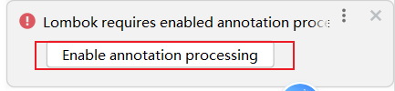

# day11.Maven_Junit

```java
课前回顾:
  1.多态:
    前提:必须有子父类继承关系或者接口实现关系,必须有方法的重写,必须有父类引用指向子类对象
  2.成员访问特点:
    a.成员变量:看等号左边是谁
    b.成员方法:看new的是谁
  3.多态的好处:扩展性强
  4.多态的弊端:不能直接调用子类特有功能
  5.多态的转型:
    a.向上转型:父类引用指向子类对象
    b.向下转型:将父类类型强转回子类类型
  6.类型判断: 
    a.关键字:instanceof
    b.使用: 对象名 instanceof 类型 ->判断关键字前面的对象名是否属于关键字后面的类型
    c.jdk新特性: 对象名 instanceof 类型 对象名2 -> 省略强转的过程
  7.权限修饰符:
    public -> protected -> 默认 -> private
    a.属性要用private:封装思想
    b.构造要用public:便于new对象
    c.方法要用public:便于调用
  8.final关键字:
    a.修饰类 -> 不能被继承
    b.修饰方法 -> 不能被重写
    c.修饰局部变量 -> 不能被二次赋值
    d.修饰成员变量 -> 不能二次赋值,需要手动赋值
    e.修饰对象 -> 地址值不能改变,但是属性值可以变
  9.代码块:
    a.构造代码快:优先于构造方法执行,每new一次就会执行一次
      {}
    b.静态代码块:优先于构造代码块和构造方法执行,只执行一次
      static{}

  10.匿名内部类:我们直接记new对象即可,jvm会根据对象自动生成内部类
               

今日重点:
  1.会使用匿名内部类
  2.会为注解赋值
  3.会maven的安装以及maven的使用
  4.会使用lombok简化javabean的开发
  5.会使用单元测试,测试某个方法
  6.会定义枚举,以及使用枚举
  7.会使用debug调试代码
```

# 第一章.枚举

## 1.枚举介绍

```java
1.引用类型:类 数组 接口 枚举 注解 Record
2.定义:
  public enum 枚举类名{
      
  }
3.枚举类中的枚举成员:
  默认是public static final修饰的,但是不要写出来
4.枚举类的使用场景:一般表示一个对象的状态
5.注意:
  a.枚举类中的每一个枚举成员都是这个枚举类的对象
  b.所以枚举类中的枚举成员的类型都是当前枚举类的类型 
  c.枚举类其实还可以有其他成员:比如构造,但是构造必须是private的,不写也是private的    
```

```java
/**
 * 物流状态
 */
public enum State{
    //State WEIFUKUAN = new State()
    //State WEIFUKUAN = new State("未付款")
    WEIFUKUAN("未付款"),
    //State YIFUKUAN = new State()
    //State YIFUKUAN = new State("已付款")
    YIFUKUAN("已付款"),
    //State WEIFAHUO = new State()
    //State WEIFAHUO = new State("未发货)
    WEIFAHUO("未发货"),
    //State YIFAHUO = new State()
    //State YIFAHUO = new State("已发货")
    YIFAHUO("已发货");

    //定义成员变量
    private String name;

    State(String name){
        this.name = name;
    }

    public String getName() {
        return name;
    }
}

```

```java
public class Test01 {
    public static void main(String[] args) {
        System.out.println(State.WEIFAHUO);
        State weifahuo = State.WEIFAHUO;
        System.out.println(weifahuo.getName());
    }
}

```

## 2.枚举的方法_Enum

| 方法名              | 说明                            |
| ------------------- | ------------------------------- |
| String toString()   | 返回枚举值的名字,返回的是字符串 |
| values()            | 返回所有的枚举值                |
| valueOf(String str) | 将一个字符串转成枚举类型        |

```java
/**
 * 物流状态
 */
public enum State{
    //State WEIFUKUAN = new State()
    //State WEIFUKUAN = new State("未付款")
    WEIFUKUAN("未付款"),
    //State YIFUKUAN = new State()
    //State YIFUKUAN = new State("已付款")
    YIFUKUAN("已付款"),
    //State WEIFAHUO = new State()
    //State WEIFAHUO = new State("未发货)
    WEIFAHUO("未发货"),
    //State YIFAHUO = new State()
    //State YIFAHUO = new State("已发货")
    YIFAHUO("已发货");

    //定义成员变量
    private String name;

    State(String name){
        this.name = name;
    }

    public String getName() {
        return name;
    }
}
```

```java
public class Test02 {
    public static void main(String[] args) {
        State weifahuo = State.WEIFAHUO;
        String s = weifahuo.toString();
        System.out.println(s);
        System.out.println("===================");
        State[] values = State.values();
        for (int i = 0; i < values.length; i++) {
            System.out.println(values[i]);
        }
        System.out.println("===================");
        State yifahuo = State.valueOf("YIFAHUO");
        System.out.println(yifahuo);
    }
}
```

# 第二章.debug的使用

```java
1.概述:debug是一个代码调试工具
2.作用:让代码逐行执行,清晰地看到代码中每一个值的变化情况
3.使用:
  a.在想要开始debug的代码对应的左边,单击一下子,出现"小红点"(断点)
  b.右键,点debug运行    
```


# 第三章.Record和密封类

## 1.Record类

Record类在JDK14、15预览特性，在JDK16中转正。

record是一种全新的类型，它本质上是一个 final类，同时所有的属性都是 final修饰，它会自动编译出get(不是getxxx方法,而是属性名())、hashCode 、比较所有属性值的equals、toString 等方法，减少了代码编写量。使用 Record 可以更方便的创建一个常量类。

**1.注意:**

- Record只会有一个全参构造

- 重写的equals方法比较所有属性值

- 可以在Record声明的类中定义静态字段、静态方法或实例方法(非静态成员方法)。

- 不能在Record声明的类中定义实例字段(非静态成员变量)；

- 类不能声明为abstract；

- 不能显式的声明父类，默认父类是java.lang.Record类

- 因为Record类是一个 final类，所以也没有子类等。

  ```java
  public record Person(String name) {
      //int i;//不能声明实例变量
  
      static int i;//可以声明静态变量
  
  //不能声明空参构造
  /*    public Person(){
  
      }*/
  
      //可以声明静态方法
      public static void method(){
  
      }
  
      //可以声明非静态方法
      public void method01(){
  
      }
  }
  
  ```

  ```java
  public class Test01 {
      public static void main(String[] args) {
          Person person = new Person("张三",16);
          /*
            public String name(){
               return name;
            }
           */
          String name = person.name();
          System.out.println(name);
      }
  }
  ```

## 2.密封类

其实很多语言中都有`密封类`的概念，在Java语言中,也早就有`密封类`的思想，就是final修饰的类，该类不允许被继承。而从JDK15开始,针对`密封类`进行了升级。

Java 15通过密封的类和接口来增强Java编程语言，这是新引入的预览功能并在Java 16中进行了二次预览，并在Java17最终确定下来。这个预览功能用于限制超类的使用，密封的类和接口限制其他可能继承或实现它们的其他类或接口。

```java
【修饰符】 sealed class 密封类 【extends 父类】【implements 父接口】 permits 子类{
    
}
【修饰符】 sealed interface 接口 【extends 父接口们】 permits 实现类{
    
}
```

- 密封类用 sealed 修饰符来描述，
- 使用 permits 关键字来指定可以继承或实现该类的类型有哪些
- 一个类继承密封类或实现密封接口，该类必须是sealed、non-sealed、final修饰的。
- sealed修饰的类或接口必须有子类或实现类

```java
public sealed class Animal permits Dog,Cat{
}

public non-sealed class Dog extends Animal{
}

public non-sealed class Cat extends Animal{
}
```

```java
package com.atguigu.sealed;

import java.io.Serializable;

public class TestSealedInterface {
}
sealed interface Flyable /*extends Serializable*/ permits Bird {
    
}
non-sealed class Bird implements Flyable{
    
}
```

# 第四章.Java其他操作_API文档

## 1.API文档

```java
1.什么是API(Application Programming Interface):应用程序接口 -> 说白了就是类以及类中的属性,方法等成员
2.什么是API文档:根据API生成的文档    
```


# 第五章.Object类

```java
1.概述:所有类的根类,所有的类都会直接或者间接继承Object
2.比如:
  public class Animal{}
  public class Dog extends Animal{}
```

## 1.toString方法

```java
1.Object中的toString方法:返回该对象的字符串表示
  public String toString() {
      return getClass().getName() + "@" + Integer.toHexString(hashCode());
  }
2.结论:
  a.如果不重写Object中的toString,直接输出对象名会按照Object中的toString方法输出地址值
  b.如果重写了Object中的toString,直接输出对象名会按照重写之后的toString方法输出对象的内容
```

```java
public class Person {
    private String name;
    private int age;

    public Person() {
    }

    public Person(String name, int age) {
        this.name = name;
        this.age = age;
    }

    public String getName() {
        return name;
    }

    public void setName(String name) {
        this.name = name;
    }

    public int getAge() {
        return age;
    }

    public void setAge(int age) {
        this.age = age;
    }

    /**
     * 重写toString方法
     */
    @Override
    public String toString() {
        return "Person{" +
                "name='" + name + '\'' +
                ", age=" + age +
                '}';
    }
}

```

```java
public class Test01 {
    public static void main(String[] args) {
        Person p1 = new Person("张三", 10);
        System.out.println(p1);
        System.out.println(p1.toString());
        System.out.println("===========================");
        ArrayList<String> list = new ArrayList<>();
        list.add("张三");
        list.add("李四");
        list.add("王五");
        list.add("赵六");
        System.out.println(list);
    }
}
```

> 小结:直接输出对象名,不想输出地址值,而是想输出对象的内容,就重写toString方法

## 2.equals方法

```java
1.Object中的equals方法:指示其他某个对象是否与此对象“相等”。
    public boolean equals(Object obj) {
        return (this == obj);
    }  

2.注意:
  == 针对于基本类型来说:比较的是值
  == 针对于引用类型来说:比较的是地址值
      
3.总结:
  a.如果没有重写equals方法,会调用Object中的equals,比较对象的地址值
  b.如果重写了equals方法,会调用重写的equals方法,比较对象的内容
```


```java
public class Person {
    private String name;
    private int age;

    public Person() {
    }

    public Person(String name, int age) {
        this.name = name;
        this.age = age;
    }

    public String getName() {
        return name;
    }

    public void setName(String name) {
        this.name = name;
    }

    public int getAge() {
        return age;
    }

    public void setAge(int age) {
        this.age = age;
    }

    /**
     * 重写toString方法
     */
    @Override
    public String toString() {
        return "Person{" +
                "name='" + name + '\'' +
                ", age=" + age +
                '}';
    }

    /**
     * 重写equals方法
     * 问题1:obj.name和obj.age为啥报错?
     * 原因是obj是Object类型,name和age属于子类特有内容,所以多态前提下
     * 无法直接调用子类特有内容
     *
     * 解决:向下转型
     *
     * 问题2:如果传递null呢?直接给false,不用判断类型了
     *
     * 问题3:如果传递自己呢?直接返回true
     */
   /* public boolean equals(Object obj) {
        if (this == obj){
            return true;
        }

        if (obj == null){
            return false;
        }
        if (obj instanceof Person) {
            Person person = (Person) obj;
            return this.name.equals(person.name) && this.age == person.age;
        }
        return false;
    }*/

    @Override
    public boolean equals(Object o) {
        if (this == o) return true;
        if (o == null || getClass() != o.getClass()) return false;
        Person person = (Person) o;
        return age == person.age && Objects.equals(name, person.name);
    }
    
}
```

```java
 public class Test02 {
    public static void main(String[] args) {
        Person p1 = new Person("张三", 10);
        Person p2 = new Person("张三", 10);
        System.out.println(p1 == p2);

        ArrayList<String> list = new ArrayList<>();

        System.out.println(p1.equals(p1));

        System.out.println("=================");

        String s1 = new String("张三");
        String s2 = new String("张三");
        System.out.println(s1 == s2);
        System.out.println(s1.equals(s2));
    }
}
```

> 小结:比较对象时,不想比较地址值,而是想比较对象的内容,就重写equals方法

# 第六章.Maven

## 1.为什么使用Maven工具

### 1.1从构建的角度说明


```java
之前我们使用Hutool工具,需要导入jar包,那么这个jar包是跟老师要的,那么将来开发的时候找谁要呢?所以就需要我们自己将开发好的class文件打到jar包中,或者将开发好的web项目打到war包中
    
还有就是我们脱离了idea,我们的代码怎么编译,怎么运行呢?
    
所以我们使用maven工具构建项目,maven会帮我们编译,然后打成war包并部署到服务器中运行,不然就需要我们自己手动打war包,然后放到tomcat下面运行  -> 也节省了我们的时间
```

### 1.2.从依赖的角度说明

```java
随着我们使用越来越多的框架，或者框架封装程度越来越高，项目中使用的jar包也越来越多。项目中，一个模块里面用到上百个jar包是非常正常的
    
框架中使用的jar包，不仅数量庞大，而且彼此之间存在错综复杂的依赖关系。依赖关系的复杂程度，已经上升到了完全不能靠人力手动解决的程度。另外，jar包之间有可能产生冲突。进一步增加了我们在jar包使用过程中的难度。    
    
将来我们使用的技术,除了导入主要jar包之外,还会有依赖包,比如junit-4.12依赖hamcrest-core-1.3,如果让程序员手动梳理用啥技术导入什么jar包以及导入啥依赖包,那么工作成本就太大了,所以使用maven来管理jar包就会非常方便
我们导入主要jar包,里面会自动包含其他的依赖jar包
```


## 2.Maven的介绍

```java
1.概述:
  Maven是Apache软件基金会组织维护的一款专门为Java项目提供**构建**和**依赖**管理支持的工具。Maven是项目进行模型抽象，充分运用的面向对象的思想，Maven可以通过一小段描述信息来管理项目的构建，报告和文档的软件项目管理工具。Maven 除了以程序构建能力为特色之外，还提供高级项目管理工具。由于 Maven 的缺省构建规则有较高的可重用性，所以常常用两三行 Maven 构建脚本就可以构建简单的项目。
      
2.作用:
  a.maven对项目的第三方构件（jar包）进行统一管理。向工程中加入jar包不要手工从其它地方拷贝，通过maven定义jar包的坐标，自动从maven仓库中去下载到工程中。
  b.maven提供一套对项目生命周期管理的标准，开发人员、和测试人员统一使用maven进行项目构建。项目生命周期管理：编译、测试、打包、部署 、运行。
  c.maven对工程分模块构建，提高开发效率。
```

## 3.Maven的下载和仓库配置

```java
仓库:放jar包的地方
```

### 3.1.Maven下载

```java
https://maven.apache.org/docs/history.html
```

| 发布时间   | maven版本 | jdk最低版本 |
| ---------- | --------- | ----------- |
| 2023-03-08 | 3.8.8     | Java 7      |

### 3.2.Maven安装

```java
1.解压:将apache-maven-3.8.8-bin.zip解压到自己找到的位置
2.配置Maven环境变量:MAVEN_HOME
3.命令测试:打开dos命令窗口
  mvn -v 
  # 输出版本信息即可，如果错误，请仔细检查环境变量即可！
```


### 3.3.仓库配置

| 仓库名称 | 作用                                                         |
| -------- | ------------------------------------------------------------ |
| 本地仓库 | 相当于缓存，工程第一次会从远程仓库（互联网）去下载jar 包，将jar包存在本地仓库（在程序员的电脑上）。第二次不需要从远程仓库去下载。先从本地仓库找，如果找不到才会去远程仓库找。 |
| 中央仓库 | 就是远程仓库，仓库中jar由专业团队（maven团队）统一维护。中央仓库的地址：http://repo1.maven.org/maven2/ |
| 远程仓库 | 在公司内部架设一台私服，其它公司架设一台仓库，对外公开。-> 比如阿里仓库 |


```java
1.打开maven里面的conf文件夹中的setting.xml
2.配置仓库
```

```xml
配置本地仓库
====================================================================
 <!-- localRepository
   | The path to the local repository maven will use to store artifacts.
   |
   | Default: ${user.home}/.m2/repository
  <localRepository>/path/to/local/repo</localRepository>
  -->
 <!-- conf/settings.xml 55行 -->
 <localRepository>D:\repository</localRepository>
```

```xml
配置国内阿里镜像

由于Maven的中央仓库的服务器在国外，会受到网络因素的影响，配置阿里云仓库是非常好的解决办法，配置settings.xml文件
====================================================================
<!--在mirrors节点(标签)下添加中央仓库镜像 160行附近-->
<mirror>
    <id>alimaven</id>
    <name>aliyun maven</name>
    <url>http://maven.aliyun.com/nexus/content/groups/public/</url>
    <mirrorOf>central</mirrorOf>
</mirror>   
```

```xml
配置jdk17版本项目构建
====================================================================
<!--在profiles节点(标签)下添加jdk编译版本 268行附近-->
<profile>
    <id>jdk-17</id>
    <activation>
      <activeByDefault>true</activeByDefault>
      <jdk>17</jdk>
    </activation>
    <properties>
      <maven.compiler.source>17</maven.compiler.source>
      <maven.compiler.target>17</maven.compiler.target>
      <maven.compiler.compilerVersion>17</maven.compiler.compilerVersion>
    </properties>
</profile>
```

## 4.idea集成maven

> 我们需要将配置好的Maven软件，配置到IDEA开发工具中即可！ 注意：IDEA工具默认自带Maven配置软件，但是因为没有修改配置，建议替换成本地配置好的Maven！

### 4.1.打开maven设置

```java
File / Settings /  Build /  Build tools / Maven
```

### 4.2.配置本地maven


## 5.创建maven项目


## 6.导入依赖

```java
maven依赖仓库网址:
https://mvnrepository.com/
```

```java
创建的maven项目,下面有一个pom.xml,这个配置文件是我们maven项目导入依赖的重要文件,我们需要在pom.xml中导入依赖
```

```xml
<dependencies>
    <dependency>
        <groupId>cn.hutool</groupId>
        <artifactId>hutool-all</artifactId>
        <version>5.8.38</version>
    </dependency>
</dependencies>
```

```java
第一次导入本地仓库没有的依赖,会报错,需要刷新一下,才能去远程仓库中自动下载
```


```java
public class Demo01Hutool {
    public static void main(String[] args) {
        int[] arr = {5,3,4,5,7,5,4};
        System.out.println(ArrayUtil.max(arr));
    }
}

```

# 第七章.lombok

```java
1.概述:是一个第三方工具
2.作用:主要是简化javabean开发的
```

```xml
<dependency>
    <groupId>org.projectlombok</groupId>
    <artifactId>lombok</artifactId>
    <version>1.18.30</version>
</dependency>
```

```java
@Data
@AllArgsConstructor
@NoArgsConstructor
public class Person {
    private String name;
    private int age;
}
```

```java
public class Test01 {
    public static void main(String[] args) {
        Person person = new Person();
        person.setName("张三");
        person.setAge(18);
        System.out.println(person.getName()+"..."+person.getAge());
        System.out.println("===========================");
        Person person1 = new Person("李四", 20);
        System.out.println(person1.getName()+"..."+person1.getAge());
    }
}
```

## 1.lombok介绍

Lombok通过增加一些“处理程序”，可以让javabean变得简洁、快速。

Lombok能以注解形式来简化java代码，提高开发效率。开发中经常需要写的javabean，都需要花时间去添加相应的getter/setter，也许还要去写构造器、equals等方法，而且需要维护。

Lombok能通过注解的方式，在编译时自动为属性生成构造器、getter/setter、equals、hashcode、toString方法。出现的神奇就是在源码中没有getter和setter方法，但是在编译生成的字节码文件中有getter和setter方法。这样就省去了手动重建这些代码的麻烦，使代码看起来更简洁些。



## 2.lombok常用注解

### @Getter和@Setter

- 作用：生成成员变量的get和set方法。
- 写在成员变量上，指对当前成员变量有效。
- 写在类上，对所有成员变量有效。
- 注意：静态成员变量无效。

### @ToString

- 作用：生成toString()方法。
- 注解只能写在类上。

### @NoArgsConstructor和@AllArgsConstructor

- @NoArgsConstructor：无参数构造方法。
- @AllArgsConstructor：满参数构造方法。
- 注解只能写在类上。

### @EqualsAndHashCode

- 作用：生成hashCode()和equals()方法。
- 注解只能写在类上。

### @Data

- 作用：生成get/set，toString，hashCode，equals，无参构造方法
- 注解只能写在类上。



#  第八章.单元测试

## 1.Junit介绍

```java
1.概述:单元测试框架,可以代替main方法去测试开发好的功能是否能正常运行,包括运行结果等
```

```xml
<dependency>
    <groupId>junit</groupId>
    <artifactId>junit</artifactId>
    <version>4.13.2</version>
    <scope>compile</scope>
</dependency>
```

## 2.Junit的基本使用(重点)

```java
1.Junit中的常用注解
  a.@Test:单独执行一个方法  
```

```java
public class Test01 {
    @Test
    public void test01(){
        System.out.println("test01...");
    }

    @Test
    public void test02(){
        System.out.println("test02...");
    }
}
```


## 3.Junit的注意事项

```java
@Test:不能修饰带参数的方法
@Test:不能修饰带返回值的方法
@Test:不能修饰带static的方法
```

## 4.Junit相关注解

```java
@Before:在@Test之前执行,有多少个@Test一起执行@Before就执行多少次 -> 里面的代码一般可以写初始化数据
@After:在@Test之后执行,有多少个@Test一起执行@After就执行多少次 -> 里面的代码一般写关闭资源
```

```java
public class Test01 {
    @Test
    public void test01(){
        System.out.println("test01...");
    }

    @Test
    public void test02(){
        System.out.println("test02...");
    }

    @Before
    public void before(){
        System.out.println("before...");
    }

    @After
    public void after(){
        System.out.println("after...");
    }
}

```

## 5.@Test以后怎么使用

> 将来我们会单独定义一个类(测试类),这个类中所写的方法,都是用于测试其他开发好的功能的

```java
public interface CategoryInterface {
    /**
     * 添加商品分类功能
     */
    boolean addCategory(String...arr);

    /**
     * 查询所有商品分类
     */
    ArrayList<String> findAllCategory();
}

```

```java
public class CategoryImpl implements CategoryInterface {
    /**
     * 添加商品分类功能
     * @param arr
     * @return
     */
    @Override
    public boolean addCategory(String... arr) {
        ArrayList<String> list = new ArrayList<>();
        for (int i = 0; i < arr.length; i++) {
            list.add(arr[i]);
        }

        if (list.size() > 0) {
            return true;
        } else {
            return false;
        }
    }

    /**
     * 查询所有商品分类功能
     * @return
     */
    @Override
    public ArrayList<String> findAllCategory() {
        ArrayList<String> list = new ArrayList<>();
        list.add("服装");
        list.add("箱包");
        list.add("手机");
        list.add("手表");
        list.add("零食");
        return list;
    }
}

```

```java
public class Test01 {

    /**
     * 定义一个方法,专门测添加功能
     */
    @Test
    public void addCategory(){
        CategoryInterface category = new CategoryImpl();
        boolean flag = category.addCategory("服装", "箱包", "手机", "手表", "零食");
        System.out.println(flag);
    }

    /**
     * 定义一个方法,专门测查询功能
     */
    @Test
    public void findAllCategory(){
        CategoryInterface category = new CategoryImpl();
        ArrayList<String> list = category.findAllCategory();
        System.out.println(list);
    }
}
```

