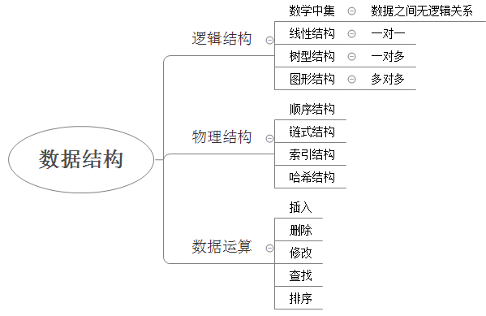
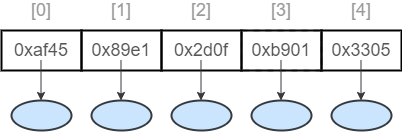
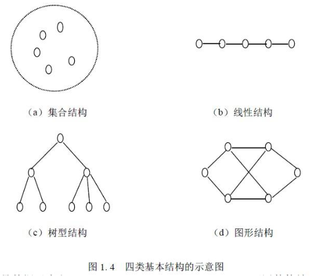

# day16.集合

```java
课前回顾:
  1.实现多线程方式1:
    继承Thread
  2.实现多线程方式2:
    实现Runnable
  3.Thread中的方法:
    a.sleep
    b.start
    c.run
    d.currentThread
  4.实现线程同步:
    a.同步代码块:
      synchronized(锁对象){}
    b.同步方法:
      非静态的:默认锁this
      静态的:默认锁当前类.class
  5.Lambda表达式:
    a.格式: ()->{}
    b.使用前提:
      必须有函数式接口做方法参数传递或者返回值返回
    c.省略规则:
      重写方法的参数类型可以省略
      重写方法的参数如果只有一个,所在的小括号可以省略
      重写方法的方法体只有一句话,所在的大括号,分号,return都省略
今日重点:
  1.会Stream流的使用
  2.知道单列集合的集合特点
  3.会使用迭代器遍历集合
  4.会使用ArrayList和LinkedList集合的使用
  5.会使用增强for遍历集合
```

# 第一章.函数式接口

```java
1.概述:必须有,且只能有一个抽象方法的接口
2.检测:@FunctionalInterface
```

## 1.Supplier 

```java
1.Supplier接口
   java.util.function.Supplier<T>接口，它意味着"供给"->我们想要什么就给什么
2.方法:
  T get() -> 我们想要什么,get方法就可以返回什么

3.需求:
   使用Supplier接口作为方法的参数
   用Lambda表达式求出int数组中的最大值
       
4.泛型:
  <引用数据类型>-> 规定了我们操作的数据是什么类型
  <>中只能写引用数据类型,不能写基本数据类型
  泛型的作用就是为了统一类型 
```

| 基本类型 | 包装类    |
| -------- | --------- |
| byte     | Byte      |
| short    | Short     |
| int      | Integer   |
| long     | Long      |
| float    | Float     |
| double   | Double    |
| char     | Character |
| boolean  | Boolean   |

```java
public class Demo01Supplier {
    public static void main(String[] args) {
        method(new Supplier<Integer>() {
            @Override
            public Integer get() {
                int[] arr = {5,34,4,5,76,7};
                Arrays.sort(arr);
                return arr[arr.length-1];
            }
        });
        System.out.println("=======================");
        method(()->{
                int[] arr = {5,34,4,5,76,7};
                Arrays.sort(arr);
                return arr[arr.length-1];
        });
    }

    public static void method(Supplier<Integer>  supplier){
        System.out.println(supplier.get());
    }
}
```

## 2.Consumer

```java
java.util.function.Consumer<T>->消费型接口->操作
  方法:
    void accept(T t)，意为消费一个指定泛型的数据
        
"消费"就是"操作",至于怎么操作,就看重写accept方法之后,方法体怎么写了
```

```java
public class Demo02Consumer {
    public static void main(String[] args) {
        method(new Consumer<String>() {
            @Override
            public void accept(String s) {
                System.out.println(s.length());
            }
        },"abcdefg");

        System.out.println("===================");
        method(s-> System.out.println(s.length()),"abcdefg");
    }
    public static void method(Consumer<String> consumer,String s){
        consumer.accept(s);
    }
}
```

## 3.Function

```java
java.util.function.Function<T,R>接口用来根据一个类型的数据得到另一个类型的数据
  方法:
     R apply(T t)根据类型T参数获取类型R的结果
```

```java
public class Demo03Function {
    public static void main(String[] args) {
        method(new Function<Integer, String>() {
            @Override
            public String apply(Integer integer) {
                return integer+"";
            }
        },100);
        System.out.println("=======================");
        method(integer -> integer+"",1000);
    }
    public static void method(Function<Integer,String> function,int a){
        String s = function.apply(a);
        System.out.println(s+1);
    }
}

```

## 4.Predicate

```java
java.util.function.Predicate<T>接口。->判断型接口
    boolean test(T t)->用于判断的方法,返回值为boolean型
```

```java
public class Demo04Predicate {
    public static void main(String[] args) {
        method(new Predicate<String>() {
            @Override
            public boolean test(String s) {
                return s.length()==7;
            }
        },"abcdefg");
        System.out.println("===================");
        method(s->s.length()==7,"abcdefg");
    }
    public static void method(Predicate<String> predicate, String s){
        boolean test = predicate.test(s);
        System.out.println(test);
    }
}

```

# 第二章.Stream流

```java
1.概述:这个"流"是"流水线"的流,不是IO流的流
```


```java
public class Demo01Stream {
    public static void main(String[] args) {
        ArrayList<String> list = new ArrayList<>();
        list.add("古力娜扎");
        list.add("迪丽热巴");
        list.add("马尔扎哈");
        list.add("张三");
        list.add("张无忌");
        list.add("马帅");
        list.add("张杰");
        list.add("鹿晗");
        list.add("蔡徐坤");
        list.add("张三丰");
        list.add("张友人");
     
    }
}

```

```java
    @Test
    public void test01(){
        ArrayList<String> list = new ArrayList<>();
        list.add("古力娜扎");
        list.add("迪丽热巴");
        list.add("马尔扎哈");
        list.add("张三");
        list.add("张无忌");
        list.add("马帅");
        list.add("张杰");
        list.add("鹿晗");
        list.add("蔡徐坤");
        list.add("张三丰");
        list.add("张友人");
       /* //需要1:筛选出姓张的人名
        ArrayList<String> list1 = new ArrayList<>();
        for (String s : list) {
            if(s.startsWith("张")){
                list1.add(s);
            }
        }
        //需求2:筛选出长度为3的人名
        ArrayList<String> list2 = new ArrayList<>();
        for (String s : list1) {
            if(s.length() == 3){
                list2.add(s);
            }
        }

        //需求3:遍历list2
        for (String s : list2) {
            System.out.println(s);
        }*/

        Stream<String> stream = list.stream();
        stream.filter(s -> s.startsWith("张")).filter(s -> s.length() == 3).forEach(s -> System.out.println(s));
    }
```

## 1.Stream的获取

```java
1.针对于数组:
  of(T...t)
2.针对于集合:Collection接口中有一个方法
  stream()
```

```java
    @Test
    public void test02() {
        //1.针对于数组
        Stream<String> stream1 = Stream.of("樱桃小丸子", "喜洋洋", "猫和老鼠", "黑猫警长");
        System.out.println(stream1);
        //2.针对于集合
        ArrayList<String> list = new ArrayList<>();
        list.add("古力娜扎");
        list.add("迪丽热巴");
        list.add("马尔扎哈");
        Stream<String> stream2 = list.stream();
        System.out.println(stream2);

    }
```

## 2.Stream的方法

### 2.1.Stream中的forEach方法:void forEach(Consumer<? super T> action);

```java
forEach : 逐一处理->遍历
void forEach(Consumer<? super T> action);

注意:forEach方法是一个[终结方法],使用完之后,Stream流不能用了
```

```java
@Test
public void test03() {
    Stream<String> stream = Stream.of("cherry", "apple", "banana", "orange");
    stream.forEach(s -> System.out.println(s));
}
```

### 2.2.Stream中的long count()方法

```java
1.作用:统计元素个数
2.注意:count也是一个终结方法
```

```java
    @Test
    public void test04() {
        Stream<String> stream = Stream.of("熊出没", "数码宝贝", "神厨小福贵", "啄木鸟");
        System.out.println(stream.count());
    }
```

### 2.3.Stream中的Stream<T> filter(Predicate<? super T> predicate)方法

```java
1.方法:Stream<T> filter(Predicate<? super T> predicate)方法,返回一个新的Stream流对象
2.作用:根据某个条件进行元素过滤
```

```java
    @Test
    public void test05() {
        Stream<String> stream = Stream.of("熊出没", "数码宝贝", "神厨小福贵", "啄木鸟","灌篮高手","七龙珠");
        /*Stream<String> stream1 = stream.filter(new Predicate<String>() {
            @Override
            public boolean test(String s) {
                return s.length() > 3;
            }
        });

        stream1.forEach(new Consumer<String>() {
            @Override
            public void accept(String s) {
                System.out.println(s);
            }
        });*/
        /*stream.filter(new Predicate<String>() {
            @Override
            public boolean test(String s) {
                return s.length()>3;
            }
        }).forEach(new Consumer<String>() {
            @Override
            public void accept(String s) {
                System.out.println(s);
            }
        });*/
        stream.filter(s -> s.length()>3).forEach(s -> System.out.println(s));
    }
```

### 2.4.Stream<T> limit(long maxSize):获取Stream流对象中的前n个元素,返回一个新的Stream流对象

```java
1.Stream<T> limit(long maxSize):获取Stream流对象中的前n个元素,返回一个新的Stream流对象
```

```java
    @Test
    public void test06() {
        Stream<String> stream = Stream.of("熊出没", "数码宝贝", "神厨小福贵", "啄木鸟","灌篮高手","七龙珠");
        stream.limit(3).forEach(s -> System.out.println(s));
    }
```

### 2.5.Stream<T> skip(long n): 跳过Stream流对象中的前n个元素,返回一个新的Stream流对象

```java
Stream<T> skip(long n): 跳过Stream流对象中的前n个元素,返回一个新的Stream流对象
```

```java
    @Test
    public void test07() {
        Stream<String> stream = Stream.of("熊出没", "数码宝贝", "神厨小福贵", "啄木鸟","灌篮高手","七龙珠");
        stream.skip(3).forEach(s -> System.out.println(s));
    }
```

### 2.6.static <T> Stream<T> concat(Stream<? extends T> a, Stream<? extends T> b):两个流合成一个流

```java
1.方法:static <T> Stream<T> concat(Stream<? extends T> a, Stream<? extends T> b):两个流合成一个流
```

```java
     @Test
    public void test08() {
        Stream<String> stream1 = Stream.of("熊出没", "数码宝贝", "神厨小福贵", "啄木鸟","灌篮高手","七龙珠");
        Stream<String> stream2 = Stream.of("火力少年王","开心宝贝","神奇宝贝","甜心宝贝","恐龙宝贝");
        Stream.concat(stream1,stream2).forEach(s -> System.out.println(s));
    }
```

### 2.7.将Stream流变成集合

```java
从Stream流对象转成集合对象，使用Stream接口方法collect()
```

```java
    @Test
    public void test09() {
        Stream<String> stream = Stream.of("熊出没", "数码宝贝", "神厨小福贵", "啄木鸟","灌篮高手","七龙珠");
        List<String> list = stream.collect(Collectors.toList());
        System.out.println(list);
    }
```

### 2.8.dinstinct方法

```java
Stream<T> distinct()
元素去重复,重写hashCode和equals方法
```

```java
@Data
@NoArgsConstructor
@AllArgsConstructor
public class Person {
    private String name;
    private Integer age;
}

```

```java
    @Test
    public void test10() {
        Stream<String> stream = Stream.of("熊出没", "数码宝贝", "神厨小福贵", "啄木鸟","灌篮高手","七龙珠","七龙珠");
        stream.distinct().forEach(s -> System.out.println(s));

        System.out.println("====================");
        Stream<Person> stream2 = Stream.of(new Person("张三", 18), new Person("张三", 18), new Person("张三", 28));
        stream2.distinct().forEach(person-> System.out.println(person));
    }
```

### 2.9.转换流中的类型

```java
Stream<R> map(Function<T,R> mapper)-> 转换流中的数据类型
```

```java
@Test
public void test11() {
    Stream<Integer> stream = Stream.of(1, 2, 3, 4, 5);
    stream.map(integer-> integer+"").forEach(s -> System.out.println(s+1));
}
```

### 2.10.Stream流练习

```java
   1. 第一个队伍只要名字为3个字的成员姓名；//filter
       
   2. 第一个队伍筛选之后 只要前3个人；//limit
       
   3. 第二个队伍只要姓张的成员姓名； //filter
       
   4. 第二个队伍筛选之后不要前2个人；//skip
       
   5. 将两个队伍合并为一个队伍；//concat
       
   6. 打印整个队伍的姓名信息;//forEach
```

```java
public class Demo12Stream {
    public static void main(String[] args) {
        ArrayList<String> one = new ArrayList<>();
        one.add("迪丽热巴");
        one.add("宋远桥");
        one.add("苏星河");
        one.add("老子");
        one.add("庄子");
        one.add("孙子");
        one.add("洪七公");

        ArrayList<String> two = new ArrayList<>();
        two.add("古力娜扎");
        two.add("张无忌");
        two.add("张三丰");
        two.add("赵丽颖");
        two.add("张二狗");
        two.add("张天爱");
        two.add("张三"); 
    }
}

```

```java
    @Test
    public void test12() {
        ArrayList<String> one = new ArrayList<>();
        one.add("迪丽热巴");
        one.add("宋远桥");
        one.add("苏星河");
        one.add("老子");
        one.add("庄子");
        one.add("孙子");
        one.add("洪七公");

        ArrayList<String> two = new ArrayList<>();
        two.add("古力娜扎");
        two.add("张无忌");
        two.add("张三丰");
        two.add("赵丽颖");
        two.add("张二狗");
        two.add("张天爱");
        two.add("张三");

        //将两个集合转成Stream流
        Stream<String> stream1 = one.stream();
        Stream<String> stream2 = two.stream();
        Stream<String> streamOne = stream1.filter(s -> s.length() == 3).limit(3);
        Stream<String> streamTwo = stream2.filter(s -> s.startsWith("张")).skip(2);

        Stream.concat(streamOne,streamTwo).forEach(s -> System.out.println(s));
    }
```

# 第三章.方法引用

## 1.方法引用的介绍

```java
1.概述:就是在Lambda表达式的基础上再次简化
2.条件:
  a.被引用的方法需要在重写的方法中被引用
  b.被引用的方法从参数上以及返回值上要和所在的重写的方法一样
    open(){//无参无返回值的
      引用过eat()//无参无返回值的  
    }
  c.干掉重写方法的参数位置以及->,以及被引用方法的参数,将调用方法的.改成::   
```

## 2.方法引入的体验

```java
    @Test
    public void test01() {
        Stream<String> stream = Stream.of("张三", "李四", "王五", "赵六", "田七", "朱八");
        /*stream.forEach(new Consumer<String>() {
         *//**
         * accpet是重写的方法,而且是有一个String类型参数还有无返回值的方法
         * println方法在accept中被调用,它是一个有一个String类型参数的而且无返回值的方法
         *
         * 可以在accept中引用println方法
         *//*
            @Override
            public void accept(String s) {
                System.out.println(s);
            }
        });*/

        stream.forEach(System.out::println);
    }
```

## 3.对象名--引用成员方法

```java
1.使用对象名引用成员方法
  格式:
    对象::成员方法名
         
2.需求:
    函数式接口:Supplier
        java.util.function.Supplier<T>接口
    抽象方法:
        T get()。用来获取一个泛型参数指定类型的对象数据。
        Supplier接口使用什么泛型,就可以使用get方法获取一个什么类型的数据
```

```java
public class Demo02Method {
    public static void main(String[] args) {
        method(new Supplier<String>() {
            /**
             * get:是重写的方法,无参,返回值类型为String
             * trim:无参,返回值类型为String
             * @return
             */
            @Override
            public String get() {
                return " abcdefg ".trim();
            }
        });
        System.out.println("=====================");
        method(" abcdefg "::trim);
    }

    public static void method(Supplier<String> supplier) {
        String result = supplier.get();
        System.out.println(result);
    }
}
```

## 4.类名--引用静态方法

```java
类名--引用静态方法
    格式:
      类名::静态成员方法
```

```java
public class Demo03Method {
    public static void main(String[] args) {
       method(new Supplier<Double>() {
           /**
            * get:是重写方法,无参,返回值类型为Double
            * random:
            * @return
            */
           @Override
           public Double get() {
               return Math.random();
           }
       });
        System.out.println("===================");
        method(Math::random);
    }

    public static void method(Supplier<Double> supplier) {
        Double result = supplier.get();
        System.out.println(result);
    }
}

```

## 5.类--构造引用

```java
1. 类--构造方法引用
   格式:
     构造方法名称::new
             
2.需求:
    函数式接口:Function
        java.util.function.Function<T,R>接口
    抽象方法:
        R apply(T t)，根据类型T的参数获取类型R的结果。用于数类型转换
```

```java
@Data
@NoArgsConstructor
@AllArgsConstructor
public class Person {
    private String name;
}
```

```java
public class Demo04Method {
    public static void main(String[] args) {
        method(new Function<String, Person>() {

            /**
             * apply:是重写方法,参数为String,返回值为Person
             * Person中的有参构造:参数为String,返回值可以看成是Person类型
             * @param s
             * @return
             */
            @Override
            public Person apply(String s) {
                //return new Person("张三")
                return new Person(s);
            }
        },"张三");

        System.out.println("=====================");
        method(Person::new,"张三");
    }
    public static void method(Function<String,Person> function, String name){
        Person person = function.apply(name);
        System.out.println(person);
    }
}
```

## 6.数组--数组引用

```java
数组--数组引用
     格式:
          数组的数据类型[]::new
          int[]::new  创建一个int型的数组
          double[]::new  创建于一个double型的数组
```

```java
public class Demo05Method {
    public static void main(String[] args) {
        method(new Function<Integer, int[]>() {
            /**
             * apply:是重写方法,参数为Integer,返回值为int[]
             * 将数组的长度看成是方法参数,返回值为int[]
             *
             * @param len the function argument
             * @return
             */
            @Override
            public int[] apply(Integer len) {
                return new int[len];
            }
        },10);
        System.out.println("=====================");
        method(int[]::new,10);
    }
    public static void method(Function<Integer,int[]> function,int len){
        int[] arr = function.apply(len);
        System.out.println(arr.length);
    }
}
```

> github -> 搜索毕设

# 第四章.集合框架(单列集合)

```java
1.概述:是一种容器,类似于数组
2.特点:
  a.长度可变
  b.只能存引用类型数据 -> 如果存基本的也能存,但是到了集合中会自动装箱
  c.由于集合都是一个一个的类,所以集合有强大的方法操作元素
3.分类:
  a.单列集合:元素只由一部分构成:
    list.add("元素")
  b.双列集合:元素由两部分构成 -> key(键) 和 value(值) -> 键值对
    map.put(1,"涛哥")
```


# 第五章.Collection接口

```java
1.概述:是单列集合的顶级接口
2.使用:
  Collection<E> 集合名 = new 实现类集合对象<E>()
3.泛型:
  a.概述:<E> -> 叫做泛型
  b.作用:统一集合中元素的数据类型
  c.特点:
    泛型只能写引用类型,如果向操作基本类型数据,请写包装类
    如果不写泛型,元素默认类型为Object类型
    等号前面写泛型了,等号后面可写可不写,但是尖括号不能省略,除非不指定泛型
4.方法:
  boolean add(E e) : 将给定的元素添加到当前集合中(我们一般调add时,不用boolean接收,因为add一定会成功)
  boolean addAll(Collection<? extends E> c) :将另一个集合元素添加到当前集合中 (集合合并)
  void clear():清除集合中所有的元素
  boolean contains(Object o)  :判断当前集合中是否包含指定的元素
  boolean isEmpty() : 判断当前集合中是否有元素->判断集合是否为空
  boolean remove(Object o):将指定的元素从集合中删除
  int size() :返回集合中的元素个数。
  Object[] toArray(): 把集合中的元素,存储到数组中  
```

```java
    @Test
    public void test01() {
        Collection<String> collection1 = new ArrayList<>();
        //boolean add(E e) : 将给定的元素添加到当前集合中(我们一般调add时,不用boolean接收,因为add一定会成功)
        collection1.add("张无忌");
        collection1.add("敏敏妹妹");
        collection1.add("芷若妹妹");
        System.out.println(collection1);
        //boolean addAll(Collection<? extends E> c) :将另一个集合元素添加到当前集合中 (集合合并)
        Collection<String> collection2 = new ArrayList<>();
        collection2.add("小昭妹妹");
        collection2.add("不悔妹妹");

        collection1.addAll(collection2);
        System.out.println(collection1);
        //void clear():清除集合中所有的元素
        collection2.clear();
        System.out.println(collection2);
        //boolean contains(Object o)  :判断当前集合中是否包含指定的元素
        System.out.println(collection1.contains("小昭妹妹"));
        //boolean isEmpty() : 判断当前集合中是否有元素->判断集合是否为空
        System.out.println(collection1.isEmpty());
        //boolean remove(Object o):将指定的元素从集合中删除
        collection1.remove("小昭妹妹");
        System.out.println(collection1);
        //int size() :返回集合中的元素个数。
        System.out.println(collection1.size());
        //Object[] toArray(): 把集合中的元素,存储到数组中
        Object[] arr = collection1.toArray();
        for (Object o : arr) {
            System.out.println(o);
        }
    }
```

# 第六章.迭代器

## 1.迭代器基本使用

```java
1.概述:迭代其实是一个Iterator接口
2.作用:遍历集合
3.获取:Collection接口中的方法:
  Iterator<E> iterator()
4.方法:
  hasNext()判断有没有下一个元素
  next()获取下一个元素
```

```java
    @Test
    public void test01() {
        ArrayList<String> list = new ArrayList<>();
        list.add("张三");
        list.add("李四");
        list.add("王五");
        //获取迭代器对象
        Iterator<String> iterator = list.iterator();
        while(iterator.hasNext()){
            String s = iterator.next();
            System.out.println(s);
        }
    }
```

> ```java
>     注意:在迭代的过程中,获取的次数要和元素个数对应,不然很容易出现"没有可操作的元素异常"
>    ```
>    
>    

## 2.迭代器迭代过程


## 3.迭代器底层原理

```java
Iterator<String> iterator = list.iterator();其中Iterator指向的哪个实现类对象? -> ArrayList底层的一个内部类,叫做

Itr,这个内部类实现了Iterator
```


> ```java
> 注意:不是说遍历所有集合Iterator接口都会指向Itr,不同的集合,Iterator指向的实现类不一样
>    ```
>    

## 4.并发修改异常

```java
需求:定义一个集合,存储 唐僧,孙悟空,猪八戒,沙僧,遍历集合,如果遍历到猪八戒,往集合中添加一个白龙马    
```

```java
    @Test
    public void test02() {
      /*
        需求:定义一个集合,存储 唐僧,孙悟空,猪八戒,沙僧,遍历集合,
        如果遍历到猪八戒,往集合中添加一个白龙马
       */
        ArrayList<String> list = new ArrayList<>();
        list.add("唐僧");
        list.add("孙悟空");
        list.add("猪八戒");
        list.add("沙僧");
        Iterator<String> iterator = list.iterator();
        while(iterator.hasNext()){
            String element = iterator.next();
            if("猪八戒".equals(element)){
                list.add("白龙马");
            }
        }
        System.out.println(list);
    }
```

> ```java
> java.util.ConcurrentModificationException   -> 并发修改异常
> 	at java.base/java.util.ArrayList$Itr.checkForComodification(ArrayList.java:1013)
> 	at java.base/java.util.ArrayList$Itr.next(ArrayList.java:967)
> 	at com.atguigu.e_iterator.Demo01Iterator.test02(Demo01Iterator.java:35)
> ```
>
> 结论:在使用迭代器迭代集合的过程中,不要随意修改集合长度

```java
int expectedModCount = modCount;
=================================
modCount:实际操作次数
expectedModCount:预期操作次数
=================================
iterator.next()
 public E next() {
    checkForComodification();
 }
 
final void checkForComodification() {
    if (modCount != expectedModCount)
        throw new ConcurrentModificationException();//并发修改异常
}

出现并发修改异常的底层原因:当实际操作次数和预期操作次数不相等时,出现并发修改异常
```

```java
我们干啥了,导致了实际操作次数和预期操作次数不相等了
=============================================
list.add("白龙马")   
public boolean add(E e) {
    modCount++;
}    
```

```java
我们在迭代的过程中,调用了add方法,add底层修改了实际操作次数,那么导致了预期操作次数和实际操作次数不相等了,就出现了并发修改异常
```

> 扩展:ListIterator
>
> ```java
>     @Test
>     public void test04() {
>         ArrayList<String> list = new ArrayList<>();
>         list.add("唐僧");
>         list.add("悟空");
>         list.add("八戒");
>         list.add("沙僧");
>         ListIterator<String> iterator = list.listIterator();
>         while(iterator.hasNext()){
>             String element = iterator.next();
>             if ("八戒".equals(element)){
>                 iterator.add("白龙马");
>             }
>         }
>         System.out.println(list);
>     }
> ```
>

# 第七章.数据结构

```properties
数据结构是一种具有一定逻辑关系，在计算机中应用某种存储结构，并且封装了相应操作的数据元素集合。它包含三方面的内容，逻辑关系、存储关系及操作。
```

### 为什么需要数据结构

```properties
随着应用程序变得越来越复杂和数据越来越丰富，几百万、几十亿甚至几百亿的数据就会出现，而对这么大对数据进行搜索、插入或者排序等的操作就越来越慢，数据结构就是用来解决这些问题的。
```






数据的逻辑结构指反映数据元素之间的逻辑关系，而与他们在计算机中的存储位置无关：

* 集合（数学中集合的概念）：数据结构中的元素之间除了“同属一个集合” 的相互关系外，别无其他关系；
* 线性结构：数据结构中的元素存在一对一的相互关系；
* 树形结构：数据结构中的元素存在一对多的相互关系；
* 图形结构：数据结构中的元素存在多对多的相互关系。



数据的物理结构/存储结构：是描述数据具体在内存中的存储（如：顺序结构、链式结构、索引结构、哈希结构）等，一种数据逻辑结构可表示成一种或多种物理存储结构。

数据结构是一门完整并且复杂的课程，那么我们今天只是简单的讨论常见的几种数据结构，让我们对数据结构与算法有一个初步的了解。

## 1.栈

```java
先进后出 -> 手枪压子弹
```

## 2.队列

```java
先进先出-> 排队
```

## 3.数组

```java
查询快:有索引,咱们可以根据索引快速定位到指定的元素
增删慢:定长
```

## 4.链表

```java
查询慢
增删快
```

### 4.1单向链表

```java
1.表现形式:
  一个节点由两部分构成
  
  第一部分:数据域 -> 放数据
  第二部分:指针域 -> 存下一个节点地址
2.特点:
  前面一个节点记录后面一个节点地址
  后面节点不记录前面节点地址
3.注意:
  集合底层如果使用单向链表,不能保证元素有序
```


### 4.2双向链表

```java
1.表现形式:
  一个节点由三部分构成
  第一部分:指针域 -> 存上一个节点地址
  第二部分:数据域 -> 放数据
  第三部分:指针域 -> 存下一个节点地址
2.特点:
  前面一个节点记录后面一个节点地址
  后面节点也记录前面节点地址
3.注意:
  集合底层如果使用双向链表,能保证元素有序
```


# 第八章.List接口

```java
1.概述:List是一个接口
2.实现类:
  ArrayList LinkedList Vector
```

# 第九章.List集合下的实现类

## 1.ArrayList集合

```java
1.概述:是List接口的实现类
2.特点:
  a.元素有序
  b.有索引
  c.元素可重复
  d.线程不安全
3.数据结构:数组  
```

### 1.1.ArrayList集合使用

```java
方法:
  boolean add(E e)  -> 将元素添加到集合中->尾部(add方法一定能添加成功的,所以我们不用boolean接收返回值)
  void add(int index, E element) ->在指定索引位置上添加元素
  boolean remove(Object o) ->删除指定的元素,删除成功为true,失败为false
  E remove(int index) -> 删除指定索引位置上的元素,返回的是被删除的那个元素
  E set(int index, E element) -> 将指定索引位置上的元素,修改成后面的element元素
  E get(int index) -> 根据索引获取元素
  int size()  -> 获取集合元素个数
```

```java
      @Test
    public void test01() {
        ArrayList<String> list = new ArrayList<>();
        //boolean add(E e)  -> 将元素添加到集合中->尾部(add方法一定能添加成功的,所以我们不用boolean接收返回值)
        list.add("张三");
        list.add("李四");
        list.add("王五");
        System.out.println(list);
        //void add(int index, E element) ->在指定索引位置上添加元素
        list.add(1, "赵六");
        System.out.println(list);
        //boolean remove(Object o) ->删除指定的元素,删除成功为true,失败为false
        list.remove("王五");
        System.out.println(list);
        //E remove(int index) -> 删除指定索引位置上的元素,返回的是被删除的那个元素
        String element = list.remove(1);
        System.out.println(element);
        System.out.println(list);
        //E set(int index, E element) -> 将指定索引位置上的元素,修改成后面的element元素
        String element2 = list.set(0, "涛哥");
        System.out.println(element2);
        System.out.println(list);
        //E get(int index) -> 根据索引获取元素
        System.out.println(list.get(0));
        //int size()  -> 获取集合元素个数
        System.out.println(list.size());

        System.out.println("=============================");
        //迭代器
        Iterator<String> iterator = list.iterator();
        while(iterator.hasNext()){
            String element3 = iterator.next();
            System.out.println(element3);
        }

        System.out.println("==========================");
        //快捷键:集合名.fori
        for (int i = 0; i < list.size(); i++) {
            System.out.println(list.get(i));
        }

        System.out.println("==========================");

        //增强for: 集合名.for
        for (String s : list) {
            System.out.println(s);
        }

    } 
```

## 2.增强for

```java
1.格式:
  for(元素类型 变量名 : 集合名或者数组名){
      变量名就代表每一个元素
  }
2.快捷键:
  集合名或者数组名.for
3.增强for底层实现原理:
  a.在遍历数组的时候:底层原理为普通for
  b.在遍历集合的时候:底层原理为迭代器(在使用增强for遍历集合的过程中不要随便修改集合长度)
```

```java
    @Test
    public void test02() {
        ArrayList<String> list = new ArrayList<>();
        list.add("张三");
        list.add("李四");
        list.add("王五");
        for (String s : list) {
            System.out.println(s);
        }
    }
```

