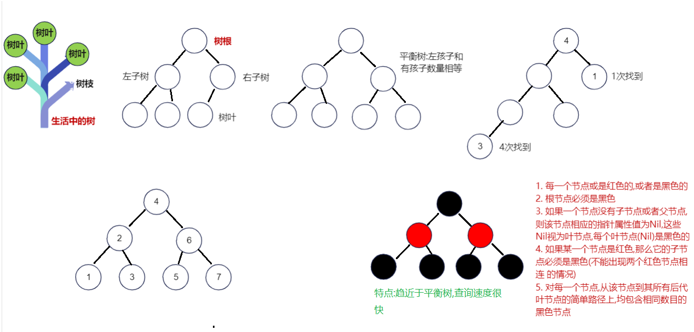
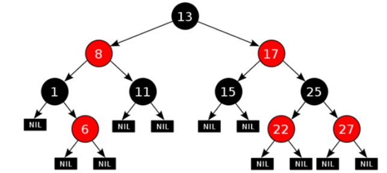

# day17.集合

```java
课前回顾:
  1.Stream流:
    a.获取:
      针对于数组:Stream.of
      针对于集合:stream()
    b.方法:
      foreach  count limit skip concat collect map filter
  2.方法引用:
    a.引用成员方法: 对象名::方法名
    b.引用静态方法: 类名::方法名
    c.引用构造:类名::new
    d.引用数组:数据类型[]::new
  3.Collection:单列集合顶级接口
    add addAll clear remove size toArray isEmpty contains
  4.迭代器:Iterator
    a.获取:集合名.iterator()
    b.方法:
      hasNext
      next
  5.ArrayList:
    a.特点:元素有序  有索引 元素可重复 线程不安全 
    b.数据结构:数组
    c.方法: add remove size set  get
  6.增强for:遍历集合或者数组
    a.格式: for(元素类型 变量名:集合名或者数组名){}
    b.注意:
      遍历数组,底层原理为普通for
      遍历集合,底层原理为迭代器
今日重点:
  1.知道LinkedList特点以及基本使用
  2.知道HashSet以及LinkedHashSet的特点以及基本使用
  3.知道set集合如何保证元素唯一的过程
```

# 第一章.List集合下的实现类

## 1.ArrayList底层源码分析

```java
1.无参构造:ArrayList() 构造一个初始容量为 10 的空列表

2.有参构造:ArrayList(int initialCapacity) 构造一个具有指定初始容量的空列表
    
3.结论:
  a.不是一new底层就会创建一个长度为10的空数组,而是第一次add的时候底层才会创建一个长度为10的空数组
     如果超出了数组的容量,会自动扩容,每次扩容1.5倍   -> [背下来]
  b.如果要是用有参构造创建对象,我们可以直接指定数组长度
```

```java
空参构造创建对象:ArrayList<String> list = new ArrayList()
===========================================================
//transient Object[] elementData就是ArrayList底层数组
public ArrayList() {
    this.elementData = DEFAULTCAPACITY_EMPTY_ELEMENTDATA;
}   

=========================================================
第一次add的时候才会创建一个长度为10的空数组
list.add("abc")

public boolean add(E e) {
    modCount++;
    add(e, elementData, size);
    return true;
}    
private void add(E e, Object[] elementData, int s) {
    if (s == elementData.length)
        elementData = grow();
    elementData[s] = e;
    size = s + 1;
}

private Object[] grow() {
    return grow(size + 1);
}

private Object[] grow(int minCapacity) {
    int oldCapacity = elementData.length;
    if (oldCapacity > 0 || elementData != DEFAULTCAPACITY_EMPTY_ELEMENTDATA) {
        int newCapacity = ArraysSupport.newLength(oldCapacity,
                minCapacity - oldCapacity, /* minimum growth */
                oldCapacity >> 1           /* preferred growth */);
        return elementData = Arrays.copyOf(elementData, newCapacity);
    } else {
        //return elementData = new Object[10]
        return elementData = new Object[Math.max(DEFAULT_CAPACITY, minCapacity)];
    }
}
```

```java
有参构造:ArrayList<String> list = new ArrayList(15);
public ArrayList(int initialCapacity) {
    if (initialCapacity > 0) {
        //this.elementData = new Object[15]
        this.elementData = new Object[initialCapacity];
    } else if (initialCapacity == 0) {
        this.elementData = EMPTY_ELEMENTDATA;
    } else {
        throw new IllegalArgumentException("Illegal Capacity: "+
                                           initialCapacity);
    }
}
```

> ```java
> public class Demo01ArrayList {
>     @Test
>     public void test01() {
>         ArrayList<Integer> list = new ArrayList<>();
>         list.add(2);
> 
>         /*
>            如果调用remove方法,直接传递int类型实参,会直接调用根据索引删除元素的remove
>            如果调用remove方法,想调用直接删除指定的元素,需要将int型实参装箱
>          */
>         //list.remove(2);
>         list.remove(Integer.valueOf(2));
>         System.out.println(list);
> 
>     }
> }
> ```

> ```java
> 将来集合不是我们自己单独new,new完之后自己往集合中添加元素去操作,我们都是从数据库中查询出来的一些数据,自动放到集合中
> ```
> 
>

# 第二章.LinkedList集合

```java
1.概述:LinkedList是List接口的实现类
2.特点:
  a.元素有序
  b.无索引
  c.元素可重复
  d.线程不安全
3.数据结构:
  双向链表
4.LinkedList特有方法:有大量直接操作首尾元素的方法
  public void addFirst(E e):将指定元素插入此列表的开头。
  public void addLast(E e):将指定元素添加到此列表的结尾。
  public E getFirst():返回此列表的第一个元素。
  public E getLast():返回此列表的最后一个元素。
  public E removeFirst():移除并返回此列表的第一个元素。
  public E removeLast():移除并返回此列表的最后一个元素。
  public E pop():从此列表所表示的堆栈处弹出一个元素。
  public void push(E e):将元素推入此列表所表示的堆栈。
```

```java
    @Test
    public void test01() {
        LinkedList<String> list = new LinkedList<>();
        list.add("开心超人");
        list.add("哆啦A梦");
        list.add("柯南");
        list.add("加菲猫");

        //public void addFirst(E e):将指定元素插入此列表的开头。
        list.addFirst("小猫");
        System.out.println(list);
        //public void addLast(E e):将指定元素添加到此列表的结尾。
        list.addLast("小狗");
        System.out.println(list);
        //public E getFirst():返回此列表的第一个元素。
        System.out.println(list.getFirst());
        //public E getLast():返回此列表的最后一个元素。
        System.out.println(list.getLast());
        //public E removeFirst():移除并返回此列表的第一个元素。
        list.removeFirst();
        System.out.println(list);
        //public E removeLast():移除并返回此列表的最后一个元素。
        list.removeLast();
        System.out.println(list);

        System.out.println("===========================");
        for (String s : list) {
            System.out.println(s);
        }
    }
```

```java
  public E pop():从此列表所表示的堆栈处弹出一个元素。
  public void push(E e):将元素推入此列表所表示的堆栈。
```

```java
栈:先进后出
```

```java
    @Test
    public void test03() {
        LinkedList<String> list = new LinkedList<>();
        list.push("开心超人");
        list.push("哆啦A梦");
        list.push("柯南");
        list.push("加菲猫");
        System.out.println(list);
        System.out.println(list.pop());
        System.out.println(list.pop());
        System.out.println(list.pop());
        System.out.println(list.pop());
    }
```

## 1.1 LinkedList底层成员解释说明

```java
1.LinkedList底层成员
  transient int size = 0;  元素个数
  transient Node<E> first; 第一个节点对象
  transient Node<E> last;  最后一个节点对象
  
2.Node代表的是节点对象
   private static class Node<E> {
        E item;//节点上的元素
        Node<E> next;//记录着下一个节点地址
        Node<E> prev;//记录着上一个节点地址

        Node(Node<E> prev, E element, Node<E> next) {
            this.item = element;
            this.next = next;
            this.prev = prev;
        }
    }
```


## 1.2 LinkedList中add方法源码分析

```java
LinkedList<String> list = new LinkedList<>();
list.add("a");
list.add("b");    

void linkLast(E e) {
        final Node<E> l = last;
        final Node<E> newNode = new Node<>(l, e, null);
        last = newNode;
        if (l == null)
            first = newNode;
        else
            l.next = newNode;
        size++;
        modCount++;
}
```

## 1.3.LinkedList中get方法源码分析

```java
public E get(int index) {
    checkElementIndex(index);
    return node(index).item;
} 

Node<E> node(int index) {
    // assert isElementIndex(index);

    if (index < (size >> 1)) {
        Node<E> x = first;
        for (int i = 0; i < index; i++)
            x = x.next;
        return x;
    } else {
        Node<E> x = last;
        for (int i = size - 1; i > index; i--)
            x = x.prev;
        return x;
    }
}
```

```java
index < (size >> 1)采用二分思想，先将index与长度size的一半比较，如果index<size/2，就只从位置0往后遍历到位置index处，而如果index>size/2，就只从位置size往前遍历到位置index处。这样可以减少一部分不必要的遍历
```

# 第三章.Collections集合工具类

```java
1.概述:集合工具类
2.特点:
  a.构造私有
  b.方法静态
3.使用:类名直接调用
4.常用方法:
  static <T> boolean addAll(Collection<? super T> c, T... elements)->批量添加元素 
  static void shuffle(List<?> list) ->将集合中的元素顺序打乱
  static <T> void sort(List<T> list) ->将集合中的元素按照默认规则排序-> ASCII码值
  static <T> void sort(List<T> list, Comparator<? super T> c)->将集合中的元素按照指定规则排序
```

```java
    @Test
    public void test01() {
        ArrayList<String> list = new ArrayList<>();
        Collections.addAll(list, "小猫", "小狗", "小猪", "小牛", "小羊");
        System.out.println(list);

        Collections.shuffle(list);
        System.out.println(list);
    }

    @Test
    public void test02() {
        ArrayList<String> list = new ArrayList<>();
        list.add("b.疑是地上霜");
        list.add("a.床前明月光");
        list.add("c.举头望明月");
        list.add("d.低头思故乡");
        Collections.sort(list);
        System.out.println(list);
    }
```

```java
static <T> void sort(List<T> list, Comparator<? super T> c)->将集合中的元素按照指定规则排序
```

```java
Comparator:比较器:
  int compare(T o1, T o2)  
              o1-o2:升序
              o2-o1:降序
```

```java
    @Test
    public void test03() {
        ArrayList<Person> list = new ArrayList<>();
        list.add(new Person("张三",18));
        list.add(new Person("李四",16));
        list.add(new Person("王五",20));
        Collections.sort(list, (o1,o2)-> o1.getAge()-o2.getAge());
        System.out.println(list);
    }
```

```java
Comparable:比较器:
  int compareTo(T o) 
        this-o:升序
        o-this:降序
```

```java
@Data
@NoArgsConstructor
@AllArgsConstructor
public class Student implements Comparable<Student>{
    private String name;
    private Integer score;

    @Override
    public int compareTo(Student o) {
        return this.getScore()-o.getScore();
    }
}

```

```java
    @Test
    public void test04() {
        ArrayList<Student> list = new ArrayList<>();
        list.add(new Student("张三",100));
        list.add(new Student("李四",90));
        list.add(new Student("王五",95));
        Collections.sort(list);
        System.out.println(list);
    }
```

> ```java
> Arrays中的静态方法:
> static <T> List<T> asList(T...a) -> 直接指定元素,转存到list集合中
> 
> 1.注意:
> 使用此方法批量添加之后不要修改集合长度了,因为底层是一个数组,数组被final定死了   
> ```
>
> ```java
>     @Test
>     public void test05() {
>         List<String> list = Arrays.asList("小猫", "小狗", "小猪", "小牛", "小羊");
>         System.out.println(list);
>         list.add("小马");
>         System.out.println(list);
>     }
> ```

# 第四章.泛型

```java
1.概述:是为了统一数据类型的
2.格式:<E>  R  T  K  V
3.注意:
  泛型<>必须写引用类型,如果想操作基本类型,写包装类
  如果<>里面啥也不写,默认类型Object类型
```

## 1.为什么要使用泛型

```java
1.从使用的层面看:可以直接指定一个类型,统一类型,可以防止类型转换异常  
2.从定义的层面看:定义的时候不确定将来统一什么类型,此时我们可以定义泛型,等着将来使用的时候再规定和统一类型,代码更灵活 
```

```java
    @Test
    public void test01() {
        ArrayList list = new ArrayList();
        list.add("abc");
        list.add(1);
        list.add(true);
        list.add("haha");
        for (Object o : list) {
            String s = (String) o;
            System.out.println(s.length());
        }
    }
```


## 2.泛型的定义

### 2.1含有泛型的类

```java
1.格式:
  public class 类名<E>{
      
  }
2.什么时候确定类型:
  new对象的时候确定类型
```

```java
public class MyArrayList <E>{
    //定义一个数组
    private Object[] arr = new Object[10];
    //定义一个长度
    private int size = 0;
    //定义一个add方法
    public void add(E e) {
        arr[size] = e;
        size++;
    }

    /**
     * 定义get方法用于根据索引获取元素
     * @param index
     * @return
     */
    public E get(int index) {
        return (E) arr[index];
    }

    public String toString(){
        return Arrays.toString(arr);
    }
}
```

```java
    @Test
    public void test02() {
        MyArrayList<String> list1 = new MyArrayList<>();
        list1.add("abc");
        list1.add("haha");
        String element1 = list1.get(0);
        String element2 = list1.get(1);
        System.out.println(element1);
        System.out.println(element2);
    }
```

### 2.2含有泛型的方法

```java
1.格式:
  修饰符 <E> 返回值类型 方法名(形参){
      方法体
      return 结果
  }
2.什么时候确定类型:
  调用的时候确定类型
```

```java
              public class MyCollections {
    private MyCollections(){

    }

    public static <E> void addAll(ArrayList<E> list, E... elements){
        for (E e : elements) {
            list.add(e);
        }
    }
}
```

```java
    @Test
    public void test03() {
        ArrayList<String> list = new ArrayList<>();
        MyCollections.addAll(list, "小猫", "小狗", "小猪", "小牛", "小羊");
        System.out.println(list);
    } 
```

### 2.3含有泛型的接口

```java
1.格式:
  public interface 接口名<E>{}
2.什么时候确定类型:
  a.在实现类的时候直接确定类型 -> 比如Scanner
  b.在实现类的时候还不确定类型,需要等到创建实现类对象的时候确定类型 -> 比如ArrayList
```

```java
public interface MyList<E> {
    void add(E e);
}

```

```java
public class MyArrayList <E> implements MyList<E>{
    //定义一个数组
    private Object[] arr = new Object[10];
    //定义一个长度
    private int size = 0;
    //定义一个add方法
    public void add(E e) {
        arr[size] = e;
        size++;
    }

    /**
     * 定义get方法用于根据索引获取元素
     * @param index
     * @return
     */
    public E get(int index) {
        return (E) arr[index];
    }

    public String toString(){
        return Arrays.toString(arr);
    }
}
```

```java
    @Test
    public void test04() {
        MyArrayList<Integer> list = new MyArrayList<>();
        list.add(1);
        list.add(2);
        list.add(3);
        System.out.println(list);
    }
```

```java
public interface MyIterator <E>{
    E next();
}
```

```java
public class MyScanner implements MyIterator<String>{
    @Override
    public String next() {
        return "键盘录入字符串";
    }
}

```

```java
    @Test
    public void test05() {
        MyScanner myScanner = new MyScanner();
        String data = myScanner.next();
        System.out.println(data);
    }
```

## 3.泛型的高级使用

### 3.1 泛型通配符 ?

```java
1.? -> 一般情况出现在方法的参数位置->其实也可以出现在别的地方
```

```java
    @Test
    public void test01() {
        ArrayList<String> list = new ArrayList<>();
        list.add("小猫");
        list.add("小狗");
        list.add("小猪");
        list.add("小牛");

        ArrayList<Integer> list2 = new ArrayList<>();
        list2.add(1);
        list2.add(2);
        list2.add(3);

        method(list);
        method(list2);
    }

    public void method(ArrayList<?> list) {
        for (Object o : list) {
            System.out.println(o);
        }
    }
```

### 3.2 泛型的上限下限

```java
1.作用:可以规定泛型的范围
2.上限:
  a.格式:<? extends 类型>
  b.含义:?只能接收extends后面的本类类型以及子类类型    
3.下限:
  a.格式:<? super 类型>
  b.含义:?只能接收super后面的本类类型以及父类类型  
```

```java
/**
 * Integer -> Number -> Object
 * String -> Object
 */
public class Demo03FanXing {
    public static void main(String[] args) {
        ArrayList<Integer> list1 = new ArrayList<>();
        ArrayList<String> list2 = new ArrayList<>();
        ArrayList<Number> list3 = new ArrayList<>();
        ArrayList<Object> list4 = new ArrayList<>();

        //get1(list1);
        //get1(list2);
        //get1(list3);
        //get1(list4);

        System.out.println("=================");

        //get2(list1);
        //get2(list2);
        //get2(list3);
        //get2(list4);
    }
    //上限  ?只能接收extends后面的本类类型以及子类类型
    public static void get1(Collection<? extends Number> collection){

    }

    //下限  ?只能接收super后面的本类类型以及父类类型
    public static void get2(Collection<? super Number> collection){

    }
}
```

> 应用场景:
>
> 1.如果我们在定义类,方法,接口的时候,如果类型不确定,我们可以考虑定义含有泛型的类,方法,接口
>
> 2.如果类型不确定,但是能知道以后只能传递某个类的继承体系中的子类或者父类,就可以使用泛型的上限或者下限 -> 给泛型类型规定了范围

# 第五章.红黑树(了解)

```java
加入红黑树的目的:提高查询效率
```



```java
1. 每一个节点或是红色的,或者是黑色的

2. 根节点必须是黑色

3. 如果一个节点没有子节点或者父节点,则该节点相应的指针属性值为Nil,这些Nil视为叶节点,每个叶节点(Nil)是黑色的

4. 如果某一个节点是红色,那么它的子节点必须是黑色(不能出现两个红色节点相连 的情况)

5. 对每一个节点,从该节点到其所有后代叶节点的简单路径上,均包含相同数目的黑色节点
```



https://www.cs.usfca.edu/~galles/visualization/RedBlack

# 第六章.Set集合

## 1.Set的介绍

```java
1.概述:是一个接口
2.实现类:HashSet LinkedHashSet TreeSet
3.注意:
  a.Set集合中的功能没有对Collection接口中的功能进行扩充
  b.所有的set集合底层都是依靠map集合实现的    
```


## 2.HashSet集合的介绍和使用

```java
1.概述:是Set接口的实现类
2.特点:
  a.元素无序
  b.无索引
  c.元素不可重复
  d.线程不安全
3.数据结构:哈希表
  jdk8之前:哈希表 = 数组+链表
  jdk8开始:哈希表 = 数组+链表+红黑树
4.使用:
  和Collection一样
```

```java
    @Test
    public void test01() {
        HashSet<String> set = new HashSet<>();
        set.add("小猫");
        set.add("小狗");
        set.add("小猪");
        set.add("小牛");
        System.out.println(set);

        for (String s : set) {
            System.out.println(s);
        }
    }
```

## 3.LinkedHashSet的介绍以及使用

```java
1.概述:是HashSet的子类
2.特点:
  a.元素有序
  b.无索引
  c.元素不可重复
  d.线程不安全
3.数据结构:哈希表+双向链表
4.使用:
  和Collection一样 
```

```java
   @Test
    public void test02() {
        LinkedHashSet<String> set = new LinkedHashSet<>();
        set.add("小猫");
        set.add("小狗");
        set.add("小猪");
        set.add("小牛");
        System.out.println(set);

        for (String s : set) {
            System.out.println(s);
        }
    }
```

## 4.哈希值

```java
1.概述:是计算机自动计算出来的一个十进制数,可以理解为对象的地址值
  public native int hashCode();  
2.结论:
  a.如果想要获取对象内容的哈希值,就重写hashCode方法
      
3.背下来的结论:
  哈希值不一样,内容肯定不一样
  哈希值一样,内容也有可能不一样(哈希冲突,哈希碰撞)
```

```java
public class Person {
    private String name;
    private Integer age;

    public Person() {
    }

    public Person(String name, Integer age) {
        this.name = name;
        this.age = age;
    }

    public String getName() {
        return name;
    }

    public void setName(String name) {
        this.name = name;
    }

    public Integer getAge() {
        return age;
    }

    public void setAge(Integer age) {
        this.age = age;
    }

    @Override
    public boolean equals(Object o) {
        if (this == o) return true;
        if (o == null || getClass() != o.getClass()) return false;
        Person person = (Person) o;
        return Objects.equals(name, person.name) && Objects.equals(age, person.age);
    }

    @Override
    public int hashCode() {
        return Objects.hash(name, age);
    }
}
```

```java
 @Test
    public void test03() {
        Person p1 = new Person("张三", 18);
        Person p2 = new Person("张三", 18);
        System.out.println(p1.hashCode());
        System.out.println(p2.hashCode());

        System.out.println("================");
        String s1 = "abc";
        String s2 = new String("abc");
        System.out.println(s1.hashCode());//96354
        System.out.println(s2.hashCode());//96354

        System.out.println("================");
        String s3 = "通话";
        String s4 = "重地";
        System.out.println(s3.hashCode());//1179395
        System.out.println(s4.hashCode());//1179395
    }
```


## 5.字符串的哈希值是如何算出来的

```java
String s1 = "abc";   -> byte[] value = {97,98,99}
System.out.println(s1.hashCode());

=============================
public static int hashCode(byte[] value) {
    int h = 0;
    for (byte v : value) {
        h = 31 * h + (v & 0xff);
    }
    return h;
}

第一圈:h = 31*0+97 = 97
第二圈:h = 31*97+98 = 3105
第三圈:h = 31*3105+99 = 96354    
```

```java
为啥每次都用31去乘呢? -> 31是一个质数,31可以极大减少哈希冲突的问题
```

## 6.HashSet的存储去重复的过程_背下来

```java
先比较元素哈希值,再比较内容
如果哈希值不一样,存
如果哈希值一样,再比较内容
如果哈希值一样,内容不一样,存
如果哈希值一样,内容也一样,去重复
```

```java
    @Test
    public void test04() {
        HashSet<String> set = new HashSet<>();
        set.add("abc");
        set.add("通话");
        set.add("重地");
        set.add("abc");
        System.out.println(set);//[通话, 重地, abc]
    }
```

## 7.HashSet存储自定义类型如何去重复

```java
set集合存储自定义对象,想要保证元素唯一,自定义对象中需要重写hashCode和equals方法
让set集合比较对象内容的哈希值以及对象的内容
```

```java
public class Person {
    private String name;
    private Integer age;

    public Person() {
    }

    public Person(String name, Integer age) {
        this.name = name;
        this.age = age;
    }

    public String getName() {
        return name;
    }

    public void setName(String name) {
        this.name = name;
    }

    public Integer getAge() {
        return age;
    }

    public void setAge(Integer age) {
        this.age = age;
    }

    @Override
    public boolean equals(Object o) {
        if (this == o) return true;
        if (o == null || getClass() != o.getClass()) return false;
        Person person = (Person) o;
        return Objects.equals(name, person.name) && Objects.equals(age, person.age);
    }

    @Override
    public int hashCode() {
        return Objects.hash(name, age);
    }

    @Override
    public String toString() {
        return "Person{" +
                "name='" + name + '\'' +
                ", age=" + age +
                '}';
    }
}
```

```java
    @Test
    public void test05() {
        HashSet<Person> set = new HashSet<>();
        set.add(new Person("张三", 18));
        set.add(new Person("张三", 18));
        set.add(new Person("张三", 19));
        System.out.println(set);
    }
```

> 万优汇地下一层 -> 龙德广场
