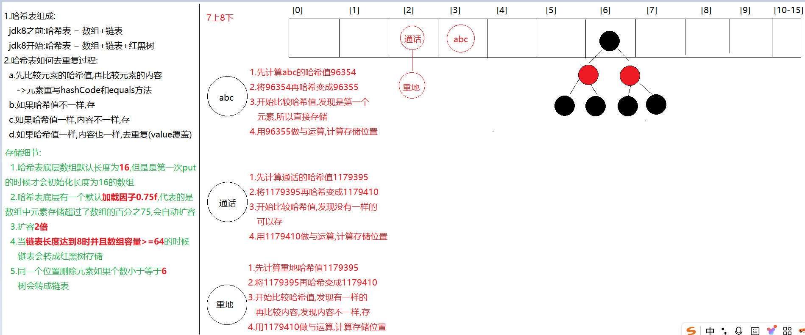

# day18.Map集合

```java
课前回顾:
  1.ArrayList:
    a.空参构造:在第一次add的时候会创建一个长度为10的空列表
      如果超出数组范围,会自动扩容,扩容1.5倍
    b.有参构造:直接创建指定容量的数组
  2.LinkedList:
    有序 无索引 元素可重复 线程不安全 数据结构:双向链表
    方法:大量直接操作首尾元素的方法
  3.泛型:
    a.含有泛型的类: public class 类名<E>{} -> new对象的时候确定类型
    b.含有泛型的方法:修饰符 <E> 返回值类型 方法名(形参){} -> 调用的时候确定类型
    c.含有泛型的接口:public interface 接口名<E>{} -> 在实现类的时候确定类型或者在实现类中还不确定类型,等到new的时候
    d.泛型上限下限: 规定泛型的范围
      <? extends 类型>:?接收的类型应该是extends后面类型的本类以及子类
      <? super 类型> : ?接收的类型应该是super后面类型的本类以及父类
  4.集合工具类:Collections
    addAll shuffle sort sort(集合,比较器)
  5.红黑树:主要目的就是提高查询效率
  6.HashSet:
    无序 无索引 元素不重复 线程不安全 数据结构:哈希表
  7.LinkedHashSet:
    有序 无索引 元素不重复 线程不安全 数据结构:哈希表+双向链表
  8.哈希值不一样,内容肯定不一样
    哈希值一样,内容也有可能不一样 -> 哈希冲突
  9.哈希表如何保证元素唯一的:去重复过程  -> 元素需要重写hashCode和equals方法
    先比较哈希值,再比较内容
    如果哈希值不一样,可以存
    如果哈希值一样,内容不一样,存
    如果哈希值一样,内容也一样,去重复
      
      
今日重点:
  1.除了第九章,都是重点
```

# 第一章.Map集合 


## 1.Map的介绍

```java
1.概述:双列集合
2.元素:一个元素由两个部分构成
      key和value -> 键值对
```

## 2.HashMap的介绍和使用

```java
1.概述:是Map的实现类
2.特点:
  a.无序
  b.无索引
  c.key唯一,value可重复
  d.线程不安全
  e.可以存null
3.数据结构:
  哈希表
4.方法:
  V put(K key, V value)  -> 添加元素,返回的是被替换的value值
  V remove(Object key)  ->根据key删除键值对,返回的是被删除的value
  V get(Object key) -> 根据key获取value
  boolean containsKey(Object key)  -> 判断集合中是否包含指定的key
  Collection<V> values() -> 获取集合中所有的value,转存到Collection集合中    
  Set<K> keySet()->将Map中的key获取出来,转存到Set集合中 
  Set<Map.Entry<K,V>> entrySet()->获取Map集合中的键值对,转存到Set集合中
```

```java
@Test
    public void test01(){
        HashMap<String, String> map = new HashMap<>();
        //V put(K key, V value)  -> 添加元素,返回的是被替换的value值
        map.put("1", "小马宝莉");
        String value = map.put("1", "小鲤鱼历险记");
        System.out.println(value);
        System.out.println(map);

        map.put("3", "路易十六");
        map.put("2", "商鞅");
        map.put("4", "小李广");
        map.put(null,null);
        System.out.println(map);
        //V remove(Object key)  ->根据key删除键值对,返回的是被删除的value
        System.out.println(map.remove("1"));
        System.out.println(map);
        //V get(Object key) -> 根据key获取value
        System.out.println(map.get("2"));
        //boolean containsKey(Object key)  -> 判断集合中是否包含指定的key
        System.out.println(map.containsKey("2"));
        //Collection<V> values() -> 获取集合中所有的value,转存到Collection集合中
        Collection<String> collection = map.values();
        System.out.println(collection);
    }
```

```java
1.概述:LinkedHashMap 是HashMap的子类
2.特点:
  a.有序
  b.无索引
  c.key唯一,value可重复
  d.线程不安全
3.数据结构:
  哈希表+链表
4.使用:和HashMap一样
```

```java
    @Test
    public void test02(){
        LinkedHashMap<String, String> map = new LinkedHashMap<>();
        map.put("1", "小马宝莉");
        map.put("3", "路易十六");
        map.put("2", "商鞅");
        map.put("4", "小李广");
        System.out.println(map);
    }
```

## 3.HashMap的两种遍历方式

### 3.1.方式1:获取key,根据key再获取value

```java
Set<K> keySet()->将Map中的key获取出来,转存到Set集合中 
```

```java
    @Test
    public void test03(){
        HashMap<String, String> map = new HashMap<>();
        map.put("涛哥","金莲");
        map.put("张浩","老蒯");
        map.put("张浩","雨姐");
        map.put("候磊","明杨");
        Set<String> set = map.keySet();
       //遍历set集合,将所有的key获取出来
        for (String key : set) {
            System.out.println(key+"..."+map.get(key));
        }
    }
```

### 3.2.方式2:同时获取key和value


```java
Set<Map.Entry<K,V>> entrySet()->获取Map集合中的键值对,转存到Set集合中
```

```java
    @Test
    public void test04(){
        HashMap<String, String> map = new HashMap<>();
        map.put("涛哥","金莲");
        map.put("张浩","老蒯");
        map.put("张浩","雨姐");
        map.put("候磊","明杨");
        Set<Map.Entry<String, String>> set = map.entrySet();
        for (Map.Entry<String, String> entry : set) {
            System.out.println(entry.getKey()+"..."+entry.getValue());
        }
    }
```

## 4.Map存储自定义对象时如何保证key唯一

```java
1.注意:Set集合存储元素都是存到了map集合的key的位置,所以Set集合保证元素唯一和Map集合保证key唯一的方式一样
      key需要重写hashCode和equals方法
2.去重复过程:
  先比较key的哈希值,再比较key的内容
  如果哈希值不一样,存
  如果哈希值一样,内容不一样,存
  如果哈希值一样,内容也一样,去重复(value覆盖)
```

```java
@Data
@AllArgsConstructor
@NoArgsConstructor
public class Person {
    private String name;
    private Integer age;
}
```

```java
    @Test
    public void test05(){
        HashMap<Person, String> map = new HashMap<>();
        map.put(new Person("金莲",26),"清河");
        map.put(new Person("涛哥",18),"廊坊");
        map.put(new Person("涛哥",18),"北京");
        System.out.println(map);
    }
```

## 5.Map的练习

```java
需求:用Map集合统计字符串中每一个字符出现的次数
    
步骤:
  1.创建Map集合,key用于存储字符,value用于统计个数
  2.定义一个字符串,随意给点内容
  3.遍历字符串,将每一个字符获取出来
  4.在遍历的过程中,判断map集合中是否包含指定的字符
  5.如果不包含,证明该字符第一次出现,将该字符和1放到map集合中
  6.如果包含,根据字符将对应的value获取出来,让value+1
  7.重新将该字符和改变后的value存到map中
    
```


```java
@Test
    public void test06() {
        //1.创建Map集合,key用于存储字符,value用于统计个数
        HashMap<Character, Integer> map = new HashMap<>();
        //2.定义一个字符串,随意给点内容
        String s = "abdsafda";
        //3.遍历字符串,将每一个字符获取出来
        char[] chars = s.toCharArray();
        for (char data : chars) {
            //4.在遍历的过程中,判断map集合中是否包含指定的字符
            if (!map.containsKey(data)) {
                //5.如果不包含,证明该字符第一次出现,将该字符和1放到map集合中
                map.put(data, 1);
            } else {
                //6.如果包含,根据字符将对应的value获取出来,让value+1
                Integer value = map.get(data);
                value++;
                //7.重新将该字符和改变后的value存到map中
                map.put(data, value);
            }

        }
        System.out.println(map);
    }
```

# 第二章.TreeSet

```java
1.概述:是Set接口的实现类
2.特点:
  a.对元素进行排序
  b.无索引
  c.元素不可重复
  d.线程不安全
3.数据结构:
  红黑树
4.构造:
  TreeSet():对元素进行自然排序 -> ASCII 
  TreeSet(Comparator<? super E> comparator):对元素进行指定规则排序     
```

```java
@Data
@AllArgsConstructor
@NoArgsConstructor
public class Person {
    private String name;
    private Integer age;
}
```

```java
 @Test
    public void test01(){
        TreeSet<String> set = new TreeSet<>();
        set.add("a.床前明月光");
        set.add("d.低头思故乡");
        set.add("c.举头望明月");
        set.add("b.疑是地上霜");
        System.out.println(set);
    }
    @Test
    public void test02(){
        TreeSet<Person> set = new TreeSet<>(new Comparator<Person>() {
            @Override
            public int compare(Person o1, Person o2) {
                return o1.getAge()-o2.getAge();
            }
        });
        set.add(new Person("小马宝莉", 18));
        set.add(new Person("黑魔仙", 16));
        set.add(new Person("小李广", 30));
        System.out.println(set);
    }
```

# 第三章.TreeMap

```java
1.概述:TreeMap是Map接口的实现类
2.特点:
  a.对key进行排序
  b.无索引
  c.key不可重复,value可重复
  d.线程不安全
3.数据结构:
  红黑树
4.构造:
  TreeMap() :对key进行自然排序 -> ASCII
  TreeMap(Comparator<? super K> comparator)  : 对key进行指定顺序排序   
```

```java
@Data
@AllArgsConstructor
@NoArgsConstructor
public class Person {
    private String name;
    private Integer age;
}

```

```java
    @Test
    public void test01(){
        TreeMap<Integer, String> map = new TreeMap<>();
        map.put(1, "猫眼三姐妹");
        map.put(6, "我为歌狂");
        map.put(2, "七龙珠");
        map.put(5, "排球少年");
        map.put(3, "灌篮高手");
        map.put(4, "网球王子");
        System.out.println(map);
    }
    @Test
    public void test02(){
        TreeMap<Person, String> map = new TreeMap<>(new Comparator<Person>() {
            @Override
            public int compare(Person o1, Person o2) {
                return o1.getAge()-o2.getAge();
            }
        });
        map.put(new Person("金莲", 26), "清河");
        map.put(new Person("涛哥", 18), "廊坊");
        map.put(new Person("柳岩", 36), "湖南");
        map.put(new Person("王宝强", 19), "邢台");
        System.out.println(map);
    }
```

# 第四章.Hashtable和Vector集合(了解)

## 1.Hashtable集合

```java
1.概述:是Map的实现类
2.特点:
  a.无序
  b.无索引
  c.key唯一,value可重复
  d.不能存null
  e.线程安全
3.数据结构:
  哈希表
4.方法:和HashMap一样      
```

```java
@Test
public void test01(){
    Hashtable<String, String> table = new Hashtable<>();
    table.put("2", "小李广");
    table.put("1", "小马宝莉");
    table.put("3", "小张");
    System.out.println(table);
}
```

> Hashtable和HashMap区别:
>
> 相同点:元素无序,无索引,key唯一,都是哈希表
>
> 不同点:HashMap线程不安全,Hashtable线程安全
>
> ​               HashMap可以存储null键null值;Hashtable不能

## 2.Vector集合

```java
1.概述:是List的实现类
2.特点:
  a.元素有序
  b.有索引
  c.元素可重复
  d.线程安全
3.数据结构:
  数组
      
4.源码分析:
  a.用无参构造new对象,会直接创建一个长度为10的数组,如果超出了数组容量,自动扩容,扩容2倍
  b.用有参构造new对象,会创建一个指定长度的数组,如果超出了数组容量,自动扩容,按照指定的容量增量扩容          
```

```java
    @Test
    public void test01(){
        Vector<String> vector = new Vector<>();
        vector.add("小马宝莉");
        vector.add("小李广");
        vector.add("小王五");

        for (String s : vector) {
            System.out.println(s);
        }
        //System.out.println(vector);
    }
```

> ```java
> Vector<Integer> vector = new Vector<>();
> public Vector() {
>     this(10);
> }
> public Vector(int initialCapacity) {
>     this(initialCapacity, 0);
> }
> 
> public Vector(int initialCapacity->10, int capacityIncrement->0) {
>     super();
>     if (initialCapacity < 0)
>         throw new IllegalArgumentException("Illegal Capacity: "+
>                                            initialCapacity);
>     //this.elementData = new Object[10]
>     this.elementData = new Object[initialCapacity];
>     this.capacityIncrement = capacityIncrement;
> }
> 
> ======================================
> 假如我们add了第11个元素,需要自动扩容,每次2倍
> vector.add(1);
> public synchronized boolean add(E e) {
>     modCount++;
>     add(e, elementData, elementCount);
>     return true;
> }
> private void add(E e, Object[] elementData, int s) {
>     if (s == elementData.length)
>         elementData = grow();
>     elementData[s] = e;
>     elementCount = s + 1;
> }
> private Object[] grow() {
>     return grow(elementCount + 1);
> }
> private Object[] grow(int minCapacity) {
>     int oldCapacity = elementData.length;
>     int newCapacity = ArraysSupport.newLength(oldCapacity,
>             minCapacity - oldCapacity, /* minimum growth */
>             capacityIncrement > 0 ? capacityIncrement : oldCapacity
>                                        /* preferred growth */);
>     return elementData = Arrays.copyOf(elementData, newCapacity);
> }
> ```
>
> ```java
> Vector<Integer> vector = new Vector<>(10,5);
> public Vector(int initialCapacity, int capacityIncrement) {
>     super();
>     if (initialCapacity < 0)
>         throw new IllegalArgumentException("Illegal Capacity: "+
>                                            initialCapacity);
>     this.elementData = new Object[initialCapacity];
>     this.capacityIncrement = capacityIncrement;
> }
> 
> ==========================================================
> 假如我们add了第11个元素,需要自动扩容,每次扩容按照老容量+容量增量
> vector.add(1);   
> public synchronized boolean add(E e) {
>     modCount++;
>     add(e, elementData, elementCount);
>     return true;
> }
> private void add(E e, Object[] elementData, int s) {
>     if (s == elementData.length)
>         elementData = grow();
>     elementData[s] = e;
>     elementCount = s + 1;
> }
> private Object[] grow() {
>     return grow(elementCount + 1);
> }
> private Object[] grow(int minCapacity) {
>     int oldCapacity = elementData.length;
>     int newCapacity = ArraysSupport.newLength(oldCapacity,
>             minCapacity - oldCapacity, /* minimum growth */
>             capacityIncrement > 0 ? capacityIncrement : oldCapacity
>                                        /* preferred growth */);
>     return elementData = Arrays.copyOf(elementData, newCapacity);
> }
> ```
>

# 第五章.Properties集合(属性集)

```java
1.概述:是Hashtable的子类
2.特点:
  a.无序
  b.无索引
  c.key唯一,value可重复
  d.线程安全
  e.key和value固定是String
  f.可以和IO流结合使用
3.数据结构:
  哈希表
4.常用方法:
  a.setProperty(String key, String value)  存键值对
  b.String getProperty(String key)  根据key获取value
  c.Set<String> stringPropertyNames()  获取所有的key保存到set集合中,类似于keySet    
  d.void load(InputStream inStream)  -> 将流中的数据加载到properties集合中
```

```java
    @Test
    public void test01(){
        Properties properties = new Properties();
        properties.setProperty("username","tom");
        properties.setProperty("password","123456");
        Set<String> set = properties.stringPropertyNames();
        for (String key : set) {
            System.out.println(key+"..."+properties.getProperty(key));
        }
    }
```

> 使用场景:解析配置文件使用
>
> ```java
> 1.配置文件的类型:
>   xxx.properties    xxx.xml    xxx.yml
> 2.我们将来有很多"硬数据",比如:用户名和密码,这种数据放到源码中不合适,将来密码改了,我们就要去源码中修改这个数据
> 所以我们可以将这些"硬数据",从源码中提取出来,放到配置文件中,用java代码动态读取,到时候要修改数据,直接去配置文件中修改,就不用频繁修改源代码了 
> 3.配置文件放到什么地方?
>   resources目录下
> 4.怎么创建配置文件:
>   对着resources右键 -> new -> file -> 取名xxx.properties
> 5.properties配置文件中的数据怎么写:
>   a.必须是key=value形式
>   b.key和value必须都是String的,但是不要加""
>   c.每一个键值对写完,需要换行下一对
>   d.key和value不要写中文    
> ```
>
> ```properties
> username=tom
> password=123
> ```
>
> ```java
> @Test
>     public void test01()throws Exception {
>         //1.创建Properties对象
>         Properties properties = new Properties();
>         //2.创建字节输入流对象->使用类加载器读取
>         //ClassLoader classLoader = Demo02Properties.class.getClassLoader();
>         //InputStream in = classLoader.getResourceAsStream("pro.properties");
>         InputStream in = Demo02Properties.class.getClassLoader().getResourceAsStream("pro.properties");
>         properties.load(in);
>         //System.out.println(properties);
>         String username = properties.getProperty("username");
>         String password = properties.getProperty("password");
>         System.out.println(username+"..."+password);
> 
>     }
> ```

# 第六章.集合嵌套

## 1.List嵌套List

```java
需求:创建2个List集合,每个集合中分别存储一些字符串,将2个集合存储到第3个List集合中
```

```java
    @Test
    public void test01(){
        ArrayList<String> list1 = new ArrayList<>();
        list1.add("小马");
        list1.add("小李");
        list1.add("小王");
        ArrayList<String> list2 = new ArrayList<>();
        list2.add("小张");
        list2.add("小赵");
        list2.add("小刘");

        ArrayList<ArrayList<String>> list = new ArrayList<>();
        list.add(list1);
        list.add(list2);

        //先遍历大list集合,将两个小list集合遍历出来
        for (ArrayList<String> arrayList : list) {
            for (String s : arrayList) {
                System.out.println(s);
            }
        }
    }
```

## 2.List嵌套Map

```java
1班级有三名同学，学号和姓名分别为：1=张三，2=李四，3=王五，2班有三名同学，学号和姓名分别为：1=黄晓明，2=杨颖，3=刘德华,请将同学的信息以键值对的形式存储到2个Map集合中，再将2个Map集合存储到List集合中。
```

```java
 @Test
    public void test02(){
        HashMap<Integer, String> map1 = new HashMap<>();
        map1.put(1, "张三");
        map1.put(2, "李四");
        map1.put(3, "王五");

        HashMap<Integer, String> map2 = new HashMap<>();
        map2.put(1, "黄晓明");
        map2.put(2, "杨颖");
        map2.put(3, "刘德华");

        ArrayList<HashMap<Integer, String>> list = new ArrayList<>();
        list.add(map1);
        list.add(map2);

        //先遍历大list集合,将两个小map集合遍历出来
        for (HashMap<Integer, String> map : list) {
            Set<Map.Entry<Integer, String>> set = map.entrySet();
            for (Map.Entry<Integer, String> entry : set) {
                System.out.println(entry.getKey()+"..."+entry.getValue());
            }
        }
    }   
```

## 3.Map嵌套Map

```java
- JavaSE  集合 存储的是 学号 键，值学生姓名
  - 1(key)  张三(value)
  - 2  李四
    
- JavaEE 集合 存储的是 学号 键，值学生姓名
  - 1  王五
  - 2  赵六
```

```java
作业
  小map的key为学号,value为姓名
  大map的key为字符串(javase,javaee),value为小map
```

```java
  
```

> ArrayList
>
> ```java
>1.元素有序
> 2.有索引
> 3.元素可重复
> 4.线程不安全
> 5.数据结构:数组
> ```
> 
> LinkedList
>
> ```java
>1.元素有序
> 2.无索引
> 3.元素可重复
> 4.线程不安全
> 5.数据结构:双向链表
> ```
> 
> Vector
>
> ```java
>1.元素有序
> 2.有索引
> 3.元素可重复
> 4.线程安全
> 5.数据结构:数组
> ```
> 
> HashSet
>
> ```java
>1.元素无序
> 2.无索引
> 3.元素唯一
> 4.线程不安全
> 5.数据结构:哈希表
> ```
> 
> LinkedHashSet
>
> ```java
>1.元素有序
> 2.无索引
> 3.元素唯一
> 4.线程不安全
> 5.数据结构:哈希表+双向链表
> ```
> 
> TreeSet
>
> ```java
>1.对元素进行排序
> 2.无索引
> 3.元素唯一
> 4.线程不安全
> 5.数据结构:红黑树
> ```

> HashMap
>
> ```java
> 1.无序
> 2.无索引
> 3.key唯一,value可重复
> 4.线程不安全
> 5.可以存null键null值
> 6.数据结构:哈希表
> ```
>
> LinkedHashMap
>
> ```java
> 1.有序
> 2.无索引
> 3.key唯一,value可重复
> 4.线程不安全
> 5.可以存null
> 6.数据结构:哈希表+双向链表    
> ```
>
> TreeMap
>
> ```java
> 1.可以对key进行排序
> 2.无索引
> 3.key唯一,value可重复
> 4.线程不安全
> 5.key不能为null
> 6.数据结构:红黑树
> ```
>
> Hashtable
>
> ```java
> 1.无序
> 2.无索引
> 3.key唯一,value可重复
> 4.线程安全
> 5.不能存null
> 6.数据结构:哈希表    
> ```
>
> Properties
>
> ```java
> 1.无序
> 2.无索引
> 3.key唯一,value可重复
> 4.线程安全
> 5.key和value只能是String
> 6.数据结构:哈希表
>     
> 是唯一一个能和IO流结合使用的集合,解析配置文件使用
> ```

# 第七章.哈希表

```java
  a.哈希表底层数组默认长度为16,是第一次put的时候才会创建长度为16的数组
  b.哈希表有一个默认的加载因子(扩容临界值)0.75F,代表的是数组存储达到百分之75的时候
扩容
  c.每次扩容:2倍
  d.链表长度达到8并且数组容量大于等于64时,链表会转成红黑树,否则两个条件有一个不满足,会扩容
  e.如果在同一个索引下删除元素,元素个数小于等于6了,红黑树会自动转回链表
```



> 1.问题:哈希表中有数组的存在,但是为啥说没有索引呢?
>
> 将来存元素,同一个索引位置上可能存储多个元素,如果按照索引来获取元素的话,咱们不知道要获取哪个元素
>
> 所以哈希表取消了按照索引操作元素的方法 
>
> 2.问题:为啥说HashMap是无序的,LinkedHashMap是有序的呢?
>
> 原因:HashMap的链表是单向链表
>
> 
>
> ​        LinkedHashMap链表是双向链表
>
> 

