# day01_数据库基础

# 第一章.数据库介绍

## 1.数据库介绍

```java
1.概述:数据的仓库
2.作用:存储数据
3.问题:之前学过数组,集合存储数据,但是他们是临时存储,代码运行结束,集合和数组中的数据就没了,所以后来我们学了IO流,可以将数据放到文件中永久保存,但是我们为啥还要学数据库呢?
  原因:IO流操作数据非常麻烦,读和写没问题,但是要对数据进行增删改查就比较麻烦了
      
  解决:将数据放到表中,然后用数据库独有的语言 -> sql语句 -> 可以根据条件快速定位到指定的单元格内,然后直接修改单元格中的数据(当然还可以添加数据,删除数据,查询数据)     
```

> 常见的关系型数据库:
>
> mysql    oracle

## 2.数据库管理系统

```java
1.注意:我们操作数据库,不是我们程序员直接去操作,中间会有一个数据库管理系统
2.数据库管理系统:在安装数据库的时候就自动安装好了,作用是:维护数据库数据的安全性,可靠性,统一性 
```

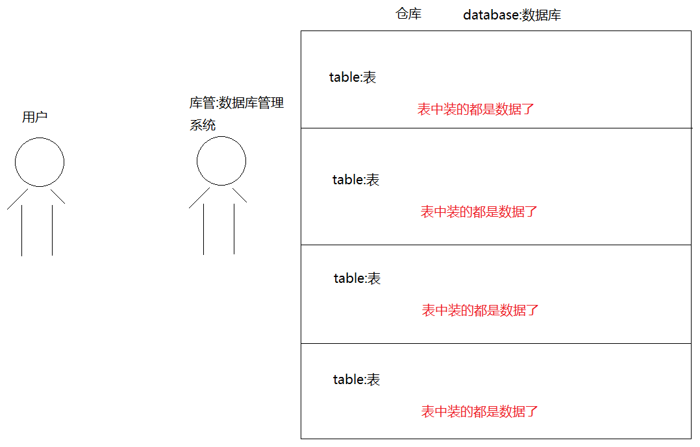

## 3.数据库表

```java
1.表的概述:说白了就是一个表格,里面装数据
2.表的组成部分:
  a.表名
  b.列名(字段名) -> 每一列都应该都一个统一的数据类型
  c.单元格:存数据
```

## 4.数据库表和Java类的对应关系

```java
1.表名 -> 类名
2.列名 -> 属性名
3.每一列的数据类型 -> 属性的数据类型
4.一条数据 -> 一个javabean对象
5.单元格中的数据 -> 属性值
```

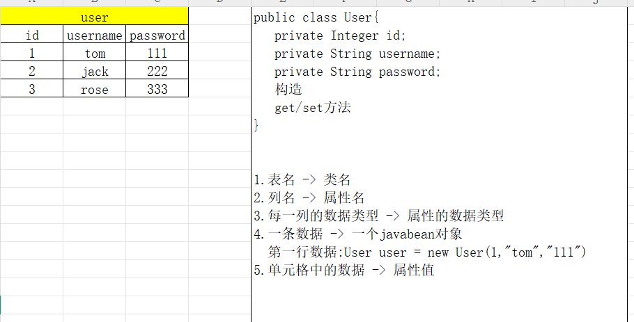

### 4.1.javabean在开发中如何跟表联系起来的->添加数据

```
将页面中的数据封装成javabean对象,将这一个javabean对象传递到dao层,然后将javabean封装好的数据获取出来,放到sql语句中进行添加
```

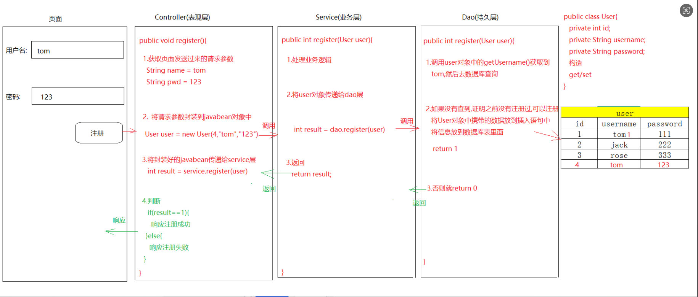

### 4.2.javabean在开发中如何跟表联系起来的->查询数据

```java
将数据库中查询出来的数据封装成多个javabean对象,然后将多个javabean对象放到一个集合中,最终返回给页面进行展示
```

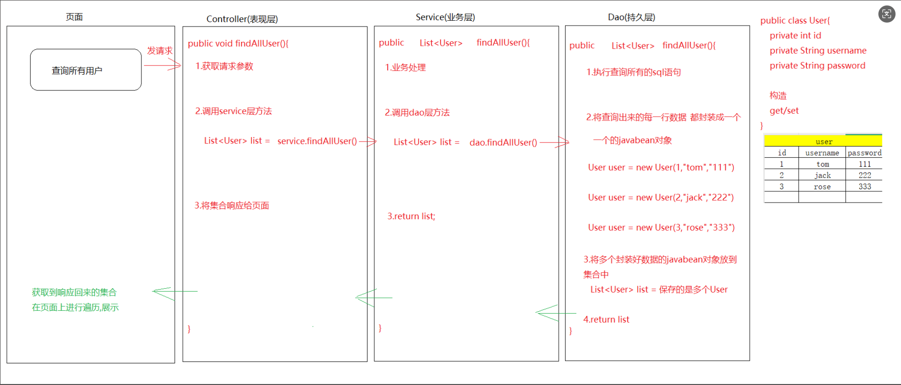

# 第二章.mysql8安装

## 1.MySQL数据库安装

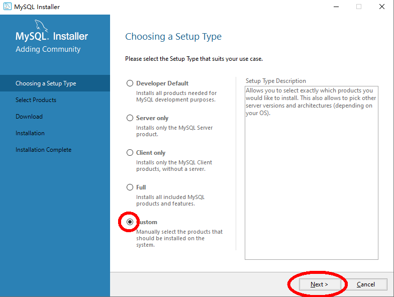

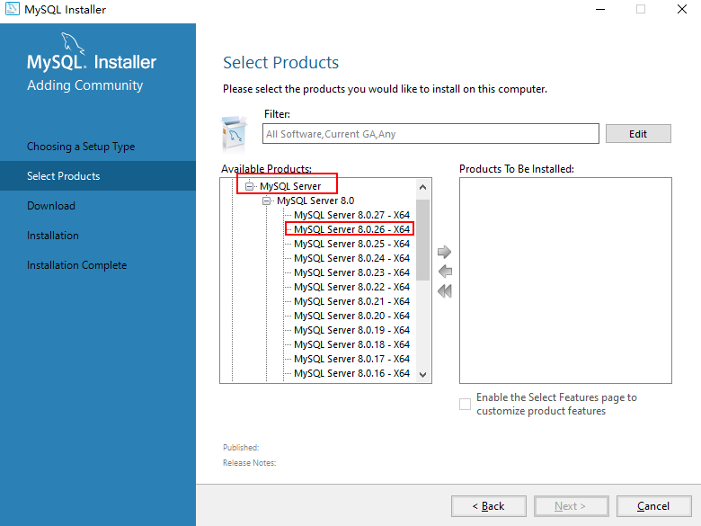

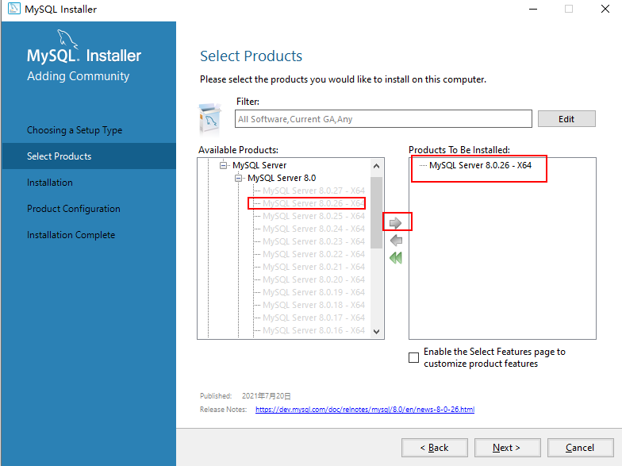

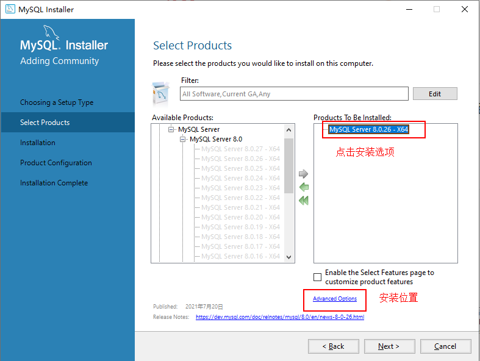


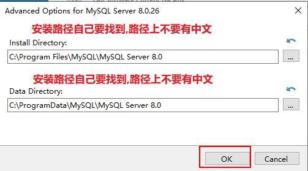

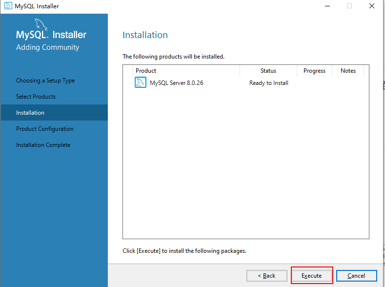


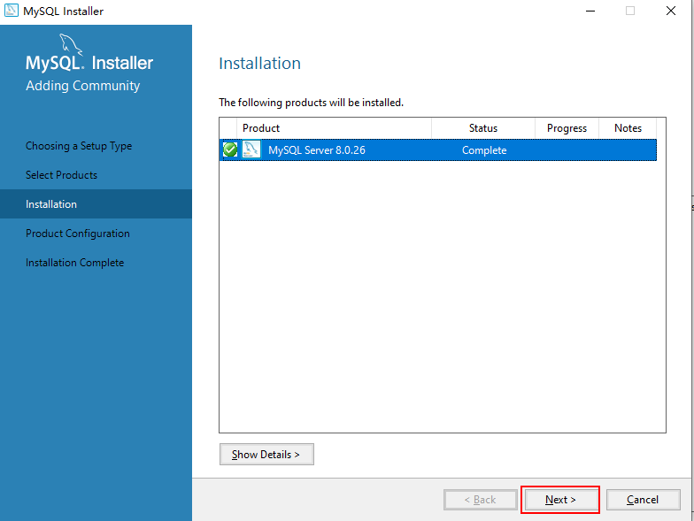

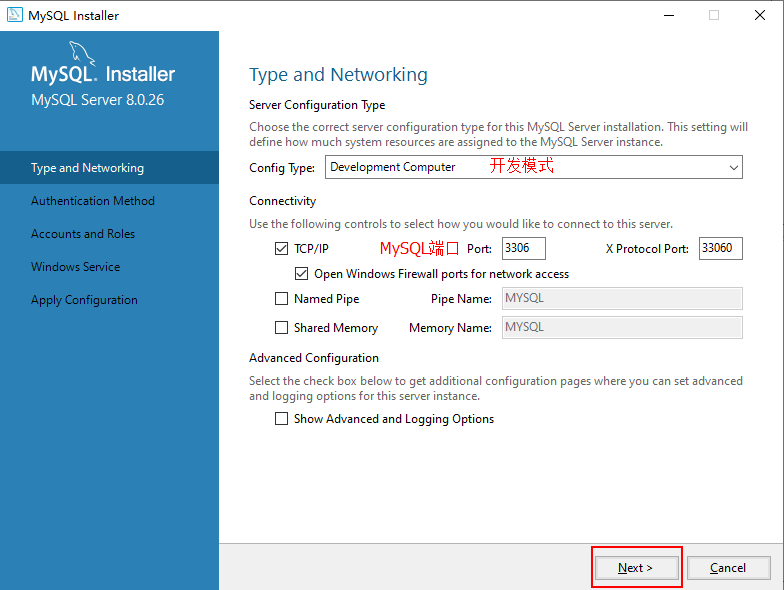


> *******全部都选择传统密码***

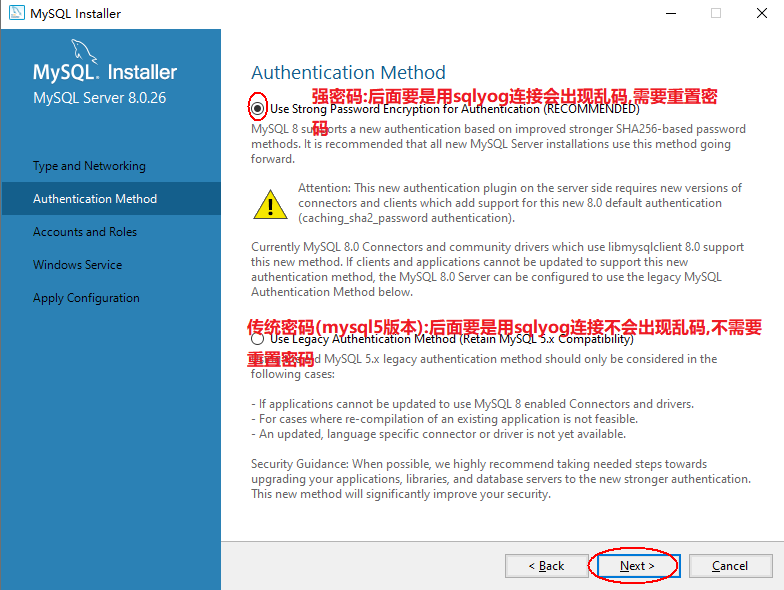

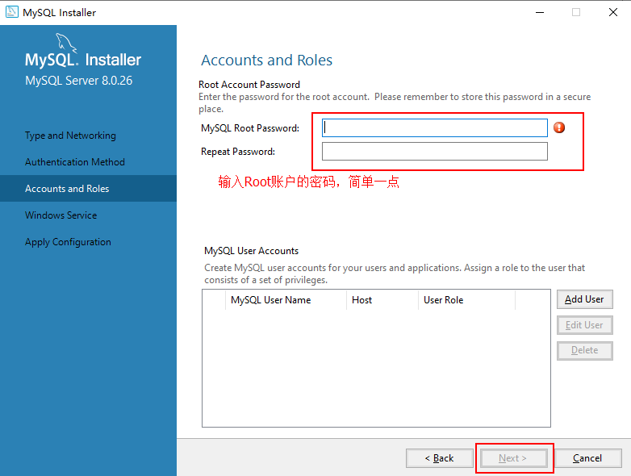

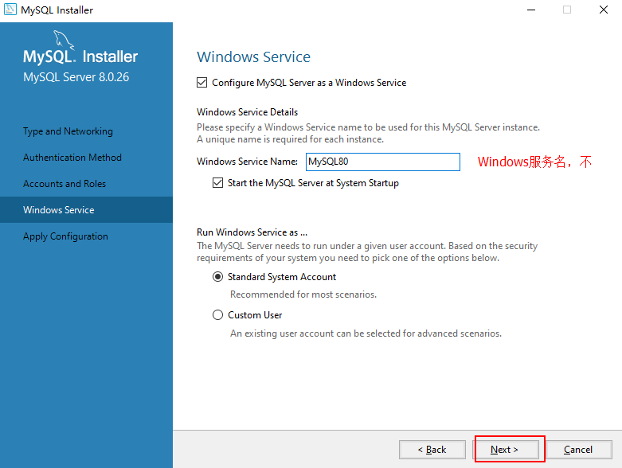

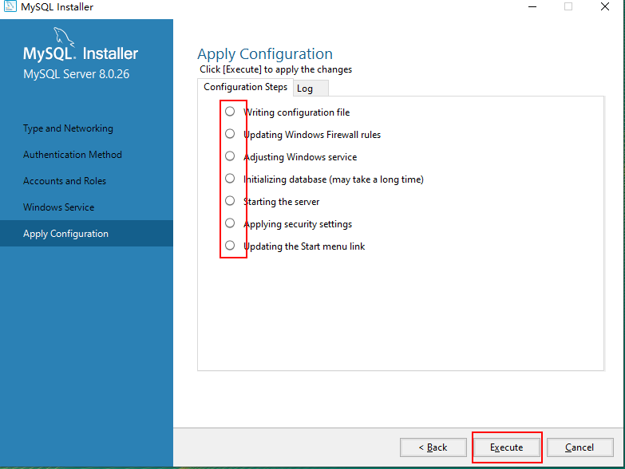


## 2.数据库服务启动和停止

```java
MySQL软件的服务器端必须先启动，客户端才可以连接和使用使用数据库。
```

### 2.1.方式1:图形化方式

```java
* 计算机（点击鼠标右键）==》管理（点击）==》服务和应用程序（点击）==》服务（点击）==》MySQL57（点击鼠标右键）==》启动或停止（点击）
* 控制面板（点击）==》系统和安全（点击）==》管理工具（点击）==》服务（点击）==》MySQL57（点击鼠标右键）==》启动或停止（点击）
* 任务栏（点击鼠标右键）==》启动任务管理器（点击）==》服务（点击）==》MySQL57（点击鼠标右键）==》启动或停止（点击）
```

### 2.2.方式2:命令方式

```java
启动 MySQL 服务命令：
net start MySQL80

停止 MySQL 服务命令：
net stop MySQL80
```

## 3.配置数据库环境变量

### 3.1.方式1:使用MYSQL_HOME

| 环境变量名 | 操作 |              环境变量值              |
| :--------: | :--: | :----------------------------------: |
| MYSQL_HOME | 新建 | D:\ProgramFiles\mysql\MySQLServer5.7 |
|    path    | 编辑 |           %MYSQL_HOME%\bin           |

### 3.2.方式2:直接配置mysql的bin路径

| 环境变量名 | 操作 |                环境变量值                |
| :--------: | :--: | :--------------------------------------: |
|    path    | 编辑 | D:\ProgramFiles\mysql\MySQLServer5.7\bin |

## 4.数据库服务端安装之后登陆

```java
1.win+R-->调出黑窗口
2.登录命令:
  a.mysql -u用户名 -p密码->回车   -> 缺点,在登录的时候密码显示出来了
  b.mysql -u 用户名 -p   ->回车
    输入密码(密码将显示成小星星)
```

```mysql
问题:输入mysql命令出现"不是内部或外部命令"
原因:环境变量没配置
解决:将mysql安装路径下的bin目录复制到环境变量下的path中
    如果path下有,还出现了"不是内部或者外部命令",干掉重新配置一下
```

```java
问题:ERROR 1045 (28000): Access denied for user 'root'@'localhost' (using password: YES)
原因:输入的mysql用户名或者密码有问题
```

```java
问题:ERROR 2003 (HY000): Can't connect to MySQL server on 'localhost' (10061)
原因:mysql服务没有启动
```

## 5.黑窗口乱码问题(可以忽略)

```java
1.在黑窗口中默认编码为GBK,而我们mysql为UTF-8,所以在黑窗口中操作中文就会乱码
2.解决:
  a.在黑窗口中输入:set names gbk   ->临时将mysql编码修改成gbk
  b.在mysql安装路径下修改my.ini文件，将涉及到编码的地方都修改了,重启服务所有地方生效。
```

```java
在路径：D:\ProgramFiles\mysql\MySQLServer8\Data 找到my.ini文件

修改内容1：
	找到[mysql]命令，大概在63行左右，在其下一行添加 
		default-character-set=utf8
修改内容2:
	找到[mysqld]命令，大概在76行左右，在其下一行添加
		character-set-server=utf8
		collation-server=utf8_general_ci

修改完毕后，重启MySQL57服务
```

```java
show variables like 'character_%';
show variables like 'collation_%';
```

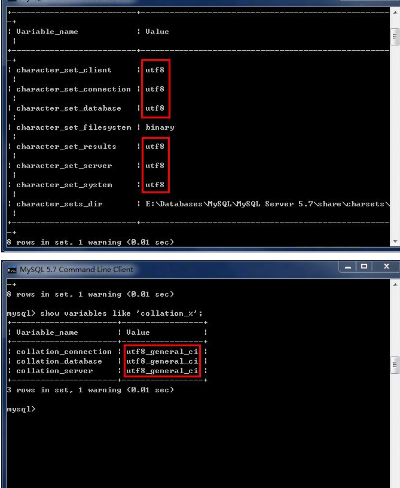


## 6.mysql客户端(可视化工具)安装

```java
例如：Navicat Preminum，SQLyog 等工具
```

### 6.1.SQLyog

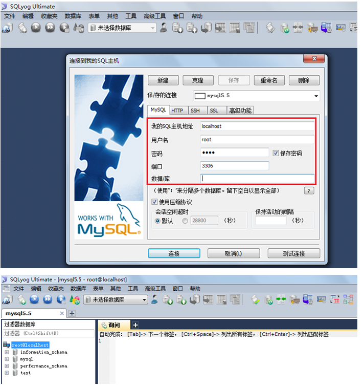

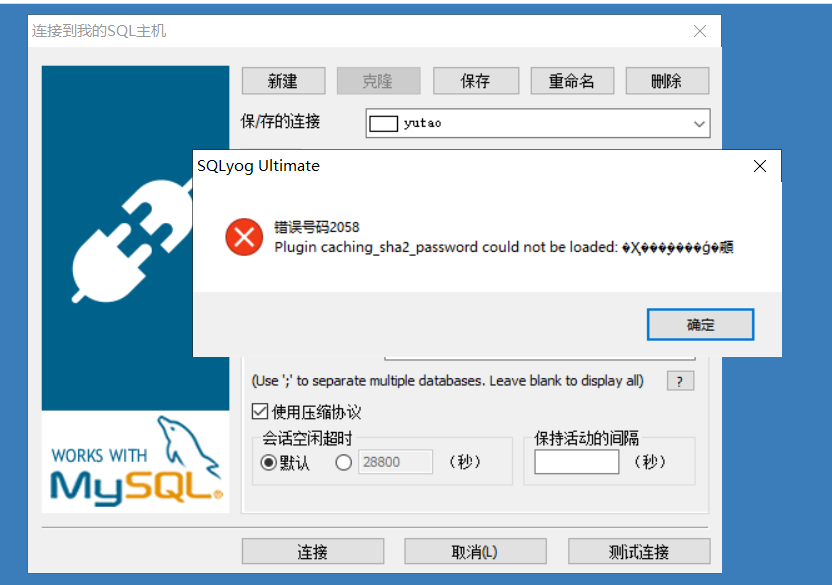

```java
通过黑窗口先登录数据库
处理无法连接：ALTER USER 'root'@'localhost' IDENTIFIED WITH mysql_native_password BY '你的密码';
```

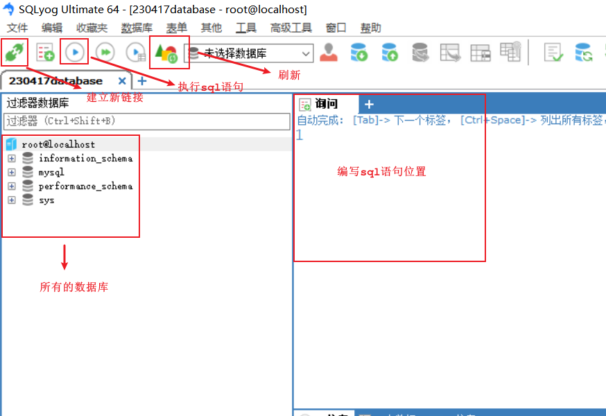

### 6.2.Navicat

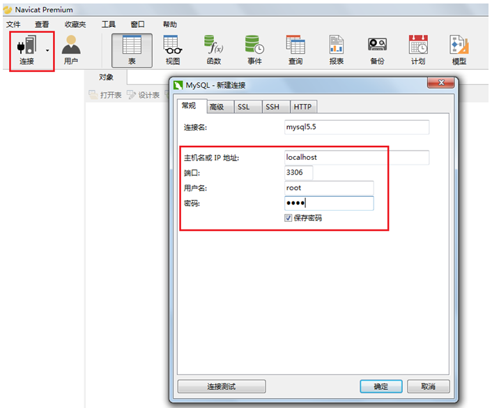

# 第三章.sql语言

## 1.sql语言介绍

```java
1.什么叫做sql语言:是所有关系型数据库语法的一个标准,规范
2.作用:规范了关系型数据库的语法以及一些关键字的使用: create drop insert select update等
3.注意:不同的关系型数据库在都遵守sql语言规范的基础上,会有一些差异,这些差异叫做sql方言
```

## 2.sql语言分类

```java
- 数据定义语言：简称DDL(Data Definition Language)，用来定义数据库对象：数据库，表，列等。关键字：create，alter，drop等

- 数据操作语言：简称DML(Data Manipulation Language)，用来对数据库中表的记录进行操作。关键字：insert，delete，update等

- 数据控制语言：简称DCL(Data Control Language)，用来定义数据库的访问权限和安全级别，及创建用户。

- 数据查询语言：简称DQL(Data Query Language)，用来查询数据库中表的记录。关键字：select，from，where等
```

## 3.sql语句的通用语法

```sql
1.- SQL语句可以单行或多行书写，以分号结尾
2.- 可使用空格和缩进来增强语句的可读性:基本上一个单词就一个空格
3.- MySQL数据库的SQL语句不区分大小写，关键字建议使用大写
    
  - 例如：SELECT * FROM user。
4.- 同样可以使用/**/的方式完成注释 
    /*
     我是一个注释
    */
    #我也是一个注释
   -- 我也是一个注释
```

## 4.sql中的数据类型

| **类型名称**          | 说明                                                         |
| --------------------- | ------------------------------------------------------------ |
| int                   | 整数类型                                                     |
| double                | 小数类型                                                     |
| decimal（m,d）        | 指定整数位与小数位长度的小数类型                             |
| date                  | 日期类型，格式为yyyy-MM-dd，包含年月日，不包含时分秒  2020-01-01 |
| datetime              | 日期类型，格式为 YYYY-MM-DD HH:mm:ss，包含年月日时分秒   到9999年 |
| timestamp             | 日期类型，时间戳  从1970年到2038年                           |
| varchar（字符串长度） | 文本类型， M为0~65535之间的整数                              |

```java
我们先学  mysql
```

# 第四章.mysql中语句

## 1.DDL之数据库操作：database

### 1.1 创建数据库

```mysql
1.语法: create database `库名`
```

```mysql
-- 创建库
CREATE DATABASE `250521_database`;
```

> 注意:我们在写库名,表名,列名,建议用``包裹
>
> ​         原因是:我们给库,表,列取名字的时候很容易和mysql中的关键字冲突,为了区分,用``
>
> 

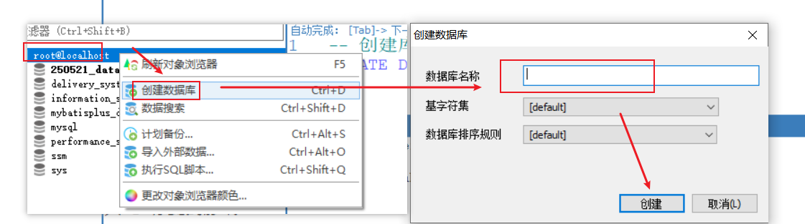

### 1.2 查看数据库(了解)

```mysql
1.语法:
  show databases;
```

```sql
-- 查看库
SHOW DATABASES;
```

### 1.3 删除数据库

```mysql
1.语法:drop database `库名`
```

```mysql
-- 删库
DROP DATABASE `250521_database`;
```

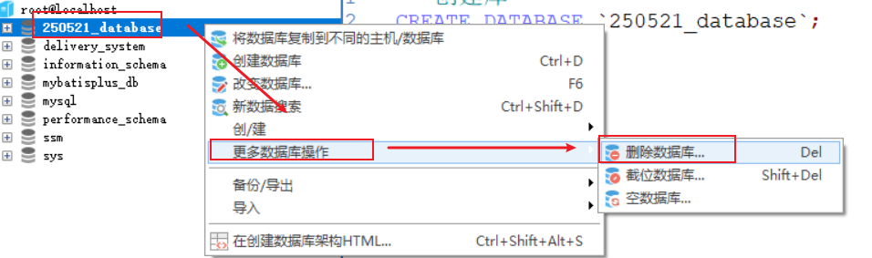

### 1.4 使用数据库(切换数据库)

```mysql
1.语法:
  use `库名`
```

```mysql
-- 切库
USE `250521_database`;
```

## 2.DDL之表操作->table

### 2.1 创建表

```mysql
1.语法:
  create table `表明`(
    字段名 数据类型(长度)[约束],
    字段名 数据类型(长度)[约束],
    字段名 数据类型(长度)[约束]  
  )  
```

```mysql
-- 创建表   商品分类表
CREATE TABLE category(
  cid INT,
  cname VARCHAR(10),
  `desc` VARCHAR(20)
);
```

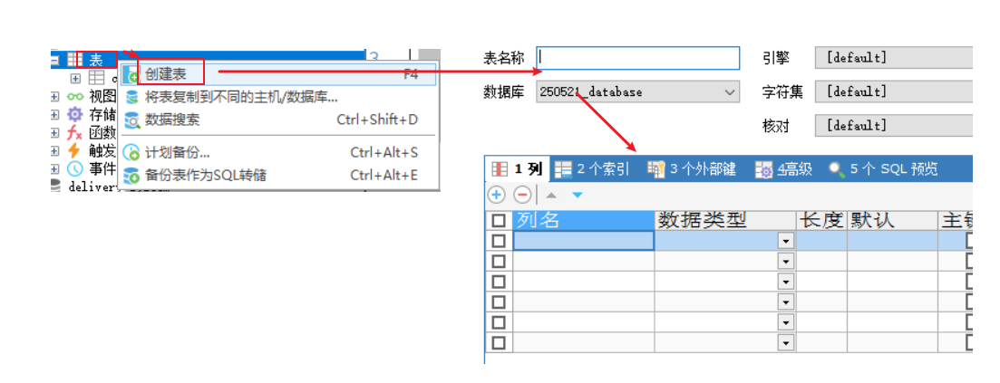

### 2.3 查看表(了解)

```mysql
#查看所有表
show tables;

#查看表结构
desc 表名;
```

```mysql
-- 查看所有表
SHOW TABLES;

-- 查看表结构
DESC category;
```

### 2.4 删除表

```mysql
1.语法:
  drop table `表名`
```

```mysql
-- 删表
DROP TABLE `category`;
```

### 2.5修改表结构(了解)

```java
alter table 表名 add 列名 类型(长度) [约束];
作用：添加列. 
```

```mysql
/*
  alter table 表名 add 列名 类型(长度) [约束];
   作用：添加列. 
*/
ALTER TABLE product ADD `desc` VARCHAR(20); 
```

```mysql
alter table 表名 modify 列名 类型(长度) [约束];
  作用：修改列的类型,长度及约束.
```

```mysql
/*
  alter table 表名 modify 列名 类型(长度) [约束];
  作用：修改列的类型,长度及约束.
*/

ALTER TABLE product MODIFY `desc` INT;
ALTER TABLE product MODIFY `desc` VARCHAR(20);
```

```mysql
  alter table 表名 change 旧列名 新列名 类型(长度) [约束]; 
  作用：修改列名.
```

```mysql
/*
    alter table 表名 change 旧列名 新列名 类型(长度) [约束]; 
    作用：修改列名.
*/
ALTER TABLE product CHANGE `desc` `miaoshu` VARCHAR(20);
ALTER TABLE product CHANGE `miaoshu` `desc` VARCHAR(20);
```

```mysql
  alter table 表名 drop 列名; 
  作用：修改表_删除列.
```

```mysql
/*
    alter table 表名 drop 列名; 
    作用：修改表_删除列.
*/
ALTER TABLE product DROP `desc`;
```

```mysql
 rename table 表名 to 新表名; 
 作用：修改表名
```

```mysql
/*
   rename table 表名 to 新表名; 
   作用：修改表名
*/
RENAME TABLE `product` TO `chanpin`;
RENAME TABLE `chanpin` TO `product`;
```

## 3.DML之数据操作语言

### 3.1 插入数据

```mysql
1.语法:
  a.insert into 表名 (列名,列名) values (值1,值2);
  b.insert into 表名 (列名,列名) values (值1,值2),(值1,值2),(值1,值2);一次添加多条数据
  c.insert into 表名 values (值1,值2)->如果不指定列名,添加数据的时候需要覆盖所有列
```

```mysql
INSERT INTO product (pid,pname,price,`desc`) VALUES (1,'小米15pro',5999,'小米产的');

INSERT INTO product (pid,pname,price,`desc`) VALUES (2,'内裤',49,'塑料的'),(3,'黄瓜',5,'打药的');

-- 注意:如果不指定列名,添加的数据要覆盖所有列(主键自增长也不例外)
INSERT INTO product  VALUES (4'张一元茉莉花茶',2000,'前门大街总店');
```

> 问题:如果数据是varchar类型的,那么在添加数据的时候我们可以用"" 也可以用 '',但是推荐用''
>
> 原因:将来我们不可能直接在sqlyog里面写sql语句,我们应该在java语言中写,如果在java中写,我们需要用String表示一条sql语句
>
> ​        如果用String表示的话,我们应该这样写:
>
> ​        String sql = "INSERT INTO product (pid,pname,price,`desc`) VALUES (5,"王致和臭豆腐",14,"王致和的")"这样写不对的
>
> ​       如果用单引号就行了: String sql = "INSERT INTO product (pid,pname,price,`desc`) VALUES (1,'小米15pro',5999,'小米产的')"

### 3.2 删除数据

```mysql
1.关键字: delete from 
2.语法: 
  a.delete from 表名 -> 一下子都删除
  b.delete from 表名 where 条件
```

| java | mysql      |
| ---- | ---------- |
| ==   | =          |
| >    | >          |
| <    | <          |
| >=   | >=         |
| <=   | <=         |
| !=   | != 或者 <> |

```sql
-- 删除pid为1的记录
-- 删除pid>=5的记录
-- 删除pid不等于3的记录
```

```sql
DELETE FROM product;

-- 删除pid为1的记录
DELETE FROM product WHERE pid = 1;
-- 删除pid>=5的记录
DELETE FROM product WHERE pid >= 5;
-- 删除pid不等于3的记录
DELETE FROM product WHERE pid != 3;
DELETE FROM product WHERE pid <> 3;
DELETE FROM product WHERE NOT (pid = 3);
```

### 3.3 修改数据

```mysql
1.语法:
  update 表名 set 列名 = 新值
  update 表名 set 列名 = 新值 where 条件
```

```mysql
-- 将表中的内裤改成裤衩

-- 将pid为5的desc改成涛哥买的

-- 将pid不等于1的pname都改成睡衣

```

```sql
UPDATE product SET pname = '吴裕泰茉莉花茶';

-- 将表中的内裤改成裤衩
UPDATE product SET pname = '裤衩' WHERE pname = '内裤';

-- 将pid为5的desc改成涛哥买的
UPDATE product SET `desc` = '涛哥买的' WHERE pid = 5;

-- 将pid不等于1的pname都改成睡衣
UPDATE product SET pname = '睡衣' WHERE pid != 1;
```

# 第五章.约束

```java
1.作用:对指定列的数据进行约束
```

## 1.主键约束

```mysql
1.关键字:primary key
2.注意:每张表都应该有一个主键列
3.特点:
  a.主键列中的数据不能重复
  b.不能是NULL
```

### 1.1.添加方式1:在创建表时,在字段后面直接指定(重点)

```mysql
  create table `表名`(
    字段名 数据类型 [约束],
    字段名 数据类型 [约束],
    字段名 数据类型 [约束]  
  );
```

```sql
CREATE TABLE `category` (
  cid INT PRIMARY KEY,
  cname VARCHAR(20),
  `desc` VARCHAR(30)
);

INSERT INTO category (cid,cname,`desc`) VALUES (1,'蔬菜','有机的');

-- INSERT INTO category (cid,cname,`desc`) VALUES (1,'水果','大棚的');
-- INSERT INTO category (cid,cname,`desc`) VALUES (null,'服装','二手的'); 

```

### 1.2.添加方式2:在constraint约束区域,去指定主键约束

```mysql
1.什么叫做constraint域
  创建表的时候,最后一列和右半个小括号之间的区域
2.语法:
  [constraint 名字] primary key (字段名)
3.注意:[constraint 名字]:可写可不写    
```

```mysql
CREATE TABLE `category` (
  cid INT,
  cname VARCHAR(20),
  `desc` VARCHAR(30),
  PRIMARY KEY (cid)
);

```

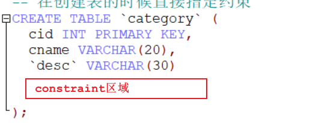

### 1.3.添加方式3:通过修改表结构的方式

```mysql
1.格式:ALTER TABLE 表名 ADD [CONSTRAINT 名称] PRIMARY KEY (字段列表)
2.注意:[CONSTRAINT 名称]可以省略不写
```

```mysql
CREATE TABLE `category` (
  cid INT,
  cname VARCHAR(20),
  `desc` VARCHAR(30)
);

ALTER TABLE category ADD PRIMARY KEY (cid);
```

### 1.4.联合主键

```mysql
1.概述:多个列合称为一个主键
2.特点:
  a.联合主键的多个列数据不能完全一样
  b.不能为NULL
```

```mysql
-- 联合主键
CREATE TABLE person(
  xing VARCHAR(10),
  ming VARCHAR(10),
  city VARCHAR(10),
  PRIMARY KEY (xing,ming)
);
```

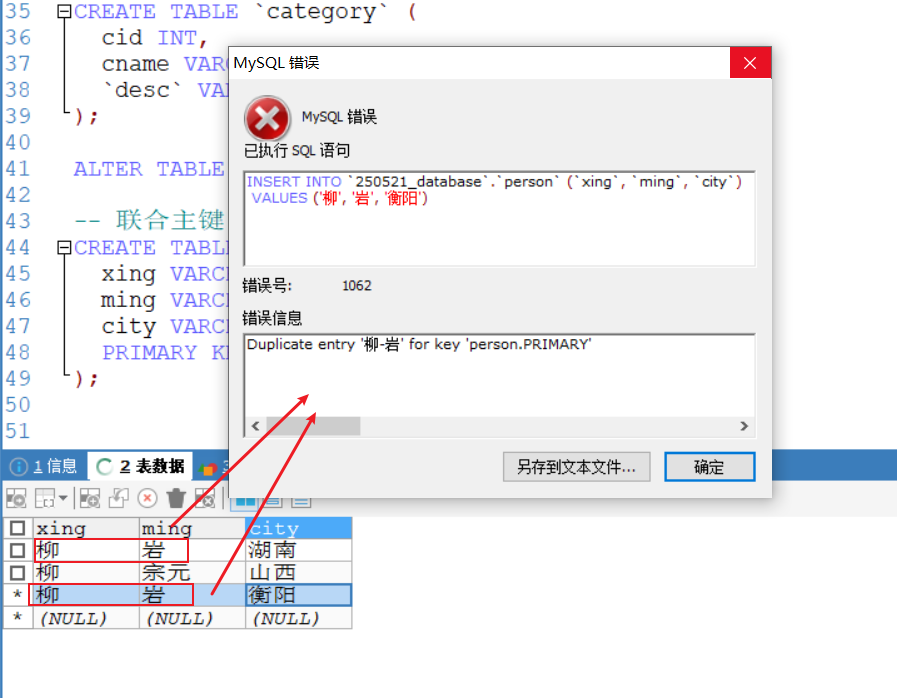

### 1.5.删除主键约束

```mysql
ALTER TABLE 表名 DROP PRIMARY KEY->删除主键约束
```

```mysql
ALTER TABLE person DROP PRIMARY KEY;
```

## 2.自增长约束

### 2.1.基本操作

```mysql
1.关键字:
  auto_increment
2.使用:都是和主键约束一起使用
3.特点:
  主键自增长的列中的数据不用我们单独维护,mysql自动维护
```

``` mysql
CREATE TABLE `user`(
  uid INT PRIMARY KEY AUTO_INCREMENT,
  username VARCHAR(20),
  pwd VARCHAR(20)
);

INSERT INTO `user` (uid,username,pwd) VALUES (NULL,'tom','111');

/*
  主键自增长的列,不用单独维护
  可以不指定列名
*/
INSERT INTO `user` (username,pwd) VALUES ('jack','222');

INSERT INTO `user` VALUES (NULL,'rose','333');

-- 删除一条数据
DELETE FROM `user` WHERE uid = 3;
/*
  将主键自增长数据删除,重新添加,不会重新编号
*/
INSERT INTO `user` VALUES (NULL,'rose','333');
/*
  摧毁表结构
*/
TRUNCATE TABLE `user`;
```

> ```mysql
> /*
> 自增长是一个约束,操作起来和其他约束不太一样
> 
> 如果自增长约束和主键约束合起来使用想删除
> 
> 先删除自增长约束
> 再删除主键约束
> 
> */
> 
> drop table category;
> create table category(
> cid int primary key auto_increment,
> cname varchar(100)
> );
> 
> alter table category modify cid int;
> 
> alter table category drop primary key;
> ```

### 2.2.truncate和delete区别

```mysql
1.delete:如果是主键自增长,删除之后,再次添加,编号不会重新编号,会接着被删除的那个编号往下继续编
2.truncate:摧毁表结构,主键自增长列,会重新编号
```

## 3.非空约束

```mysql
1.关键字:NOT NULL
2.特点:
  被非空约束修饰的列,数据不能是NULL
```

```mysql
CREATE TABLE student(
  sid INT PRIMARY KEY AUTO_INCREMENT,
  sname VARCHAR(20) NOT NULL,
  score INT
);

INSERT INTO student VALUES (NULL,'金莲',100);

/*
  好比是:String s = "null"
*/
INSERT INTO student VALUES (NULL,'null',50);

/*
  好比是:String s = ""
*/
INSERT INTO student VALUES (NULL,'',50);

/*
  好比是:String s = null
*/
INSERT INTO student VALUES (NULL,NULL,50);
```

## 4.唯一约束

```mysql
1.关键字:UNIQUE
2.特点:
  被UNIQUE修饰的列中的数据不能重复
3.主键约束和唯一约束有啥区别:
  a.相同点:都是唯一的
  b.不同点:
    一个表中能有多个唯一约束,而且可以存null
    一个表中只能有一个主键约束,而且主键约束代表一条数据,不能存null
```

```mysql
DROP TABLE student;
CREATE TABLE student(
  sid INT PRIMARY KEY AUTO_INCREMENT,
  sname VARCHAR(20) UNIQUE,
  score INT
);

INSERT INTO student VALUES (NULL,'金莲',100);
INSERT INTO student VALUES (NULL,'金莲',100);
INSERT INTO student VALUES (NULL,NULL,200);
INSERT INTO student VALUES (NULL,NULL,200);
INSERT INTO student VALUES (NULL,NULL,300);
```

```mysql
删除唯一约束:
 ALTER TABLE 表名 DROP INDEX 名称   [名称是CONSTRAINT后面的名称]
```

# 第六章.单表查询

```sql
#创建商品表：
create table product(
	pid int primary key,
	pname varchar(20),
	price double
);


INSERT INTO product(pid,pname,price) VALUES(1,'联想',5000);
INSERT INTO product(pid,pname,price) VALUES(2,'海尔',3000);
INSERT INTO product(pid,pname,price) VALUES(3,'雷神',5000);
INSERT INTO product(pid,pname,price) VALUES(4,'JACK JONES',800);
INSERT INTO product(pid,pname,price) VALUES(5,'真维斯',200);
INSERT INTO product(pid,pname,price) VALUES(6,'花花公子',440);
INSERT INTO product(pid,pname,price) VALUES(7,'劲霸',2000);
INSERT INTO product(pid,pname,price) VALUES(8,'香奈儿',800);
INSERT INTO product(pid,pname,price) VALUES(9,'相宜本草',200);
INSERT INTO product(pid,pname,price) VALUES(10,'面霸',5);
INSERT INTO product(pid,pname,price) VALUES(11,'好想你枣',56);
INSERT INTO product(pid,pname,price) VALUES(12,'香飘飘奶茶',1);
INSERT INTO product(pid,pname,price) VALUES(13,'果9',1);
```

## 1.简单查询

```sql
1.语法:
  a.select * from 表名 -> 查询所有,展示所有列的数据
  b.select 列名,列名 from 表名 -> 查询所有,展示指定列的数据
  
2.注意:
  我们查询出来的结果也是以表的格式呈现,但是这个表,我们称之为"伪表",此表是"只读的"
```

```mysql
-- 查询product所有数据


-- 查询product 所有数据,展示pname和pid


/*
  去重复值
  
  关键字: distinct(列名)
*/


/*
  给列中的数据做计算
*/
-- 查询所有数据,给price列中所有的数据+100


/*
  给列和表取别名
  
  as 别名
  
  as可以省略
*/


-- 也可以给表取别名,但是不涉及到多表查询,给表取别名看不出效果来

```

```sql
-- 查询product所有数据
SELECT * FROM product;

-- 查询product 所有数据,展示pname和pid
SELECT pid,pname FROM product;
-- SELECT pname,pid FROM product;

/*
  去重复值
  
  关键字: distinct(列名)
*/
SELECT DISTINCT(price) FROM product;


/*
  给列中的数据做计算
*/
-- 查询所有数据,给price列中所有的数据+100
SELECT pid,pname,price+100 FROM product;


/*
  给列和表取别名
  
  as 别名
  
  as可以省略
*/
SELECT pid,pname,price+100 newprice FROM product;
SELECT pid,pname,price+100 `newprice` FROM product;
-- SELECT pid,pname,price+100 'newprice' FROM product;

-- 也可以给表取别名,但是不涉及到多表查询,给表取别名看不出效果来
SELECT * FROM product p;
```

