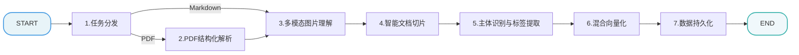
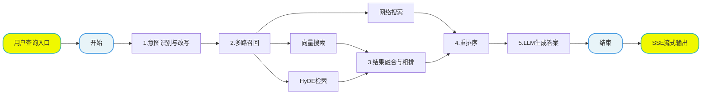

# 掌柜智库项目(RAG)实战

## 2. 模块流程设计

### 2.1 导入核心业务流程

#### 2.1.1 设计目标

本模块旨在构建一套高效的数据处理流水线，将非结构化文档 (PDF, Markdown) 转化为计算机可处理、AI 可理解的结构化知识单元。重点解决以下技术痛点：

1.  **复杂文档解析**：针对 PDF 文档排版丢失、图文分离等问题，采用高精度解析工具完整保留文档层级结构 (标题、章节) 并关联图片上下文，确保信息无损还原。
2.  **语义完整性增强**：解决传统文本切片导致的“上下文缺失”问题。通过结构化处理，为每个切片附加元数据 (如产品名称、层级标题)，将孤立文本转化为具备独立语义的知识单元。

处理后的数据将经过向量化编码，存入 **Milvus 向量数据库**，为后续的 RAG 检索提供高保真、高关联的数据基座。

#### 2.1.2 处理链路详解

本系统采用 **LangGraph** 进行流水线编排，通过状态机管理数据流转。主要处理节点如下：

1.  **Step 1: 任务分发 (node_entry)**
    *   **功能**：作为流水线入口，依据文件类型决定处理路径。
    *   **逻辑**：PDF 文件路由至解析节点 (`node_pdf_to_md`)；Markdown 文件直接路由至图片处理节点 (`node_md_img`)。

2.  **Step 2: PDF 结构化解析 (node_pdf_to_md)**
    *   **背景**：PDF 格式缺乏语义结构，直接提取文本易造成信息混淆。
    *   **方案**：集成 **MinerU (Magic-PDF)** 工具，精准识别文档布局，将 PDF 转换为保留多级标题及表格结构的 Markdown 格式，并提取图片占位符。

3.  **Step 3: 多模态图片理解 (node_md_img)**
    *   **背景**：技术文档中的图表往往蕴含关键信息，需转化为文本以支持检索。
    *   **方案**：将 Markdown 中的图片上传至 MinIO 对象存储，并调用 **多模态大模型（VLM）** 进行图像语义分析，生成详细的文本描述 (如“电路结构图，左侧标识为电源模块...”)，替换原始图片链接。
    *   **转换**：`` -> ``

4.  **Step 4: 智能文档切片 (node_document_split)**
    *   **背景**：为适配 LLM 上下文窗口限制，需将长文档拆分为细粒度文本块 (Chunk)。
    *   **方案**：采用层级切分策略，优先基于**段落**进行语义切分，超长段落降级为**句子**切分。
    *   **上下文保留**：在每个 Chunk 前拼接所属的**标题路径** (如“【操作手册-故障排查-电源故障】...”)，消除切片歧义。

5.  **Step 5: 主体识别与标签提取 (node_item_name_recognition)**
    *   **背景**：文档切片常省略主语 (如“重量为 200g”)，导致跨文档检索时指代不明。
    *   **方案**：提取文档头部关键信息输入 LLM，自动识别文档描述的主体对象 (如“iPhone 17 Pro Max”)，并将该 **Item Name** 作为全局元数据附加至该文档的所有切片。

6.  **Step 6: 混合向量化 (node_bge_embedding)**
    *   **背景**：将自然语言转化为机器可计算的高维向量。
    *   **方案**：采用 **BGE-M3** 模型，将 `item_name` 与 `content` 拼接后进行编码。
    *   **能力**：同时生成 **稠密向量 (Dense Vector)** (用于语义模糊匹配) 和 **稀疏向量 (Sparse Vector)** (用于关键词精确匹配)，支持混合检索。

7.  **Step 7: 数据持久化 (node_import_milvus)**
    *   **功能**：将结构化数据写入 **Milvus** 向量数据库。
    *   **Schema 设计**：
        *   `chunk_id` (Int64): 全局唯一标识
        *   `content` (String): 文本切片内容
        *   `title` (String): 完整标题路径
        *   `file_title` (String): 原始文件名
        *   `item_name` (String): 实体/商品名称
        *   `dense_vector` (Float Vector): 语义向量
        *   `sparse_vector` (Sparse Float Vector): 稀疏关键词向量
        *   `parent_title`, `part`: 辅助层级信息

#### 2.1.3 核心技术栈

*   **LangGraph**: 复杂的流程编排与状态管理。
*   **MinerU**: 业界领先的高精度 PDF 解析工具。
*   **BGE-M3**: 支持长文本、多语言及混合检索的旗舰级 Embedding 模型。
*   **Milvus**: 高性能云原生向量数据库，支持海量数据低延迟检索。
*   **Minio: **图片文件云存储，避免切换md文字导致图片失效 

#### 2.1.4 向量数据库设计和说明

* **文档级索引 (kb_item_names)**

  存储单个文档的基本信息，包含文档的文件名称（file_title）、文档描述的设备名称（item_name）以及设备名称对应的稠密和稀疏向量！

  

* **切片级索引 (kb_chunks)**

  存储文档中具体切片内容，主要思路根据段落进行切片，但是段落数据过大（添加max文本大小限制），还会进行二次切片！最终将切面存储到kb_chunks集合中

  

---

### 2.2 检索核心业务流程

#### 2.2.1 设计目标

本模块旨在构建一套高精度、低延迟的智能问答检索流水线，将用户的自然语言问题转化为精准的答案。重点解决以下技术痛点：

1. **意图理解偏差**：针对用户提问模糊、指代不明（如“它多少钱”）的问题，通过多轮对话上下文和实体识别技术以及重写提问，精准还原用户真实意图。
2. **召回率与准确率平衡**：单一的向量检索难以应对复杂语义，通过**多路召回（Multi-path Retrieval）**策略，结合语义检索、关键词匹配和网络搜索，确保关键信息不遗漏。
3. **答案幻觉抑制**：通过**重排序（Rerank）**机制剔除无关噪声文档，并利用高质量的上下文提示工程，最大程度减少幻觉。

#### 2.2.2 处理链路详解

本系统采用 **LangGraph** 进行检索流水线的编排，按照 **意图理解 -> 多路召回 -> 排序融合 -> 答案生成** 的流水线进行处理。主要处理节点如下：

1. **Step 1: 意图识别与改写 (Item Name Confirm)**
   - **背景**：用户提问往往口语化且缺乏关键实体（如“这款手机续航多久？”），直接检索效果差。
   - **方案**：调用 LLM 分析历史对话上下文，提取或补全关键实体名称（Item Name），并将问题改写为更适合检索的陈述句。
2. **Step 2: 多路召回 (Multi-path Retrieval)**
   - **背景**：单一检索方式存在盲区，例如向量检索对专有名词不敏感，关键词检索无法理解语义。
   - **方案**：并发执行多种检索策略：
     - **向量检索 (Vector Search)**：基于 BGE-M3 模型计算语义相似度，检索 Milvus 中的文档切片。
     - **假设性文档嵌入 (HyDE)**：利用 LLM 生成“虚构答案”，将其向量化后进行检索，提升对隐式意图的召回能力。
     - **网络搜索 (Web Search)**：通过搜索引擎获取外部信息。
3. **Step 3: 结果融合与粗排 (Join & RRF)**
   - **背景**：多路召回返回的结果分数标准不一（如距离分 vs 匹配度），无法直接比较。
   - **方案**：采用 **倒排秩融合 (RRF)** 算法，仅依据排名进行加权融合，生成统一的候选文档列表，去重并保留 Top-N。
4. **Step 4: 精准重排序 (Rerank)**
   - **背景**：召回阶段为了覆盖率通常会引入部分噪声文档，直接输入 LLM 会消耗 Token 并引发幻觉。
   - **方案**：引入高精度的 **Cross-Encoder** 模型（如 BGE-Reranker），对“问题-文档”对进行深度语义打分，只保留相关性最高的 Top-K 文档（如 Top 5）。
5. **Step 5: 答案生成 (Answer Generation)**
   - **方案**：将精选的 Top-K 文档片段作为上下文（Context），配合精心设计的 Prompt 模板输入给大模型（LLM）。
   - **流式输出**：通过 Server-Sent Events (SSE) 技术，将 LLM 生成的答案逐字实时推送到前端，提供丝滑的交互体验。

#### 2.2.3 核心技术栈

- **LangGraph**: 编排复杂的检索与生成流程（RAG Pipeline）。
- **Milvus**: 承载海量文档切片的向量检索。
- **BGE-Reranker**: 高性能重排序模型，显著提升 RAG 系统的最终准确率。
- **LLM (Qwen)**: 负责意图理解、HyDE 生成及最终答案合成。

