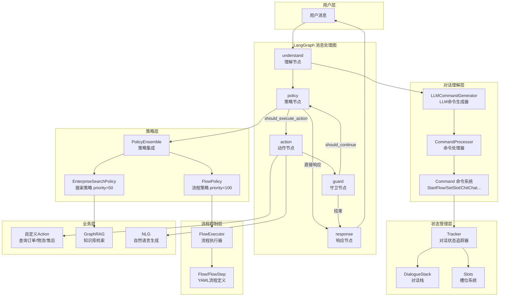

---
tags:
  - AI/Agent
  - AI/对话系统
  - 项目笔记
  - 尚硅谷
created: 2026-06-29
---

# 尚硅谷大模型项目之智能客服系统

> [!info] 项目来源
> 尚硅谷大模型项目之智能客服系统。一个基于 LLM + LangGraph 的电商智能客服系统，核心理念是"让 LLM 负责理解，让框架负责控制，让开发者负责业务"。

## 核心架构一句话

用 LLM 理解用户意图并生成结构化命令，用 Flow（YAML）定义对话流程，用对话栈管理上下文，用 LangGraph 编排处理流程，用可插拔 Action 执行业务逻辑。

## 架构全景图



## 技术栈速览

| 类别 | 技术 | 用途 |
|------|------|------|
| 图式编排 | LangGraph | 消息处理流程编排（5节点循环图） |
| LLM 集成 | LangChain + DashScope | 大模型调用（通义千问 qwen-plus） |
| Web 框架 | FastAPI | REST API + WebSocket 服务 |
| 数据模型 | Pydantic v2 | 数据验证与序列化 |
| ORM | SQLAlchemy 2.0 | MySQL 数据库操作 |
| 配置 | PyYAML | Flow/Domain YAML 配置解析 |
| 向量检索 | sentence-transformers (BGE) | 文本嵌入 |
| 图数据库 | Neo4j + APOC | GraphRAG 知识检索 |
| 关系数据库 | MySQL | 电商业务数据 |

## 核心设计模式：CAM 三元组

| 要素 | 职责 | 实现 |
|------|------|------|
| **C**ontext | 提供完整上下文 | Tracker + 对话历史 + 槽位 |
| **A**ction | 执行具体动作 | 可插拔 Action 体系 |
| **M**emory | 记忆对话状态 | 对话栈 + Flow 历史 |

## 笔记索引

1. [[01-对话系统架构设计]] — 对话系统类型、LLM 驱动架构、与传统 Pipeline 对比
2. [[02-对话状态管理]] — Tracker、Slot 槽位系统、DialogueTurn 对话轮次
3. [[03-对话栈与栈帧]] — DialogueStack、6 种栈帧类型、中断与恢复
4. [[04-Flow流程系统]] — Flow 定义、7 种步骤类型、FlowExecutor 执行引擎
5. [[05-命令系统]] — Command 体系、LLMCommandGenerator、CommandProcessor
6. [[06-LangGraph图式编排]] — StateGraph、5 节点、条件边路由
7. [[07-Agent核心系统]] — Agent 类、消息处理全流程、自定义 Action 加载
8. [[08-策略系统]] — Policy 基类、FlowPolicy、EnterpriseSearchPolicy、PolicyEnsemble
9. [[09-NLG与多渠道集成]] — TemplateNLG、ResponseRephraser、REST/SocketIO/Console 通道
10. [[10-检索增强RAG]] — InformationRetrieval 接口、GraphRAG 实现、降级机制
11. [[11-电商客服实战]] — ECS Demo 项目结构、配置、Flow 定义、自定义 Action

## 项目目录结构

```
llm_customer_service/
├── atguigu_ai/                    # 核心框架（类似 mini-Rasa）
│   ├── agent/                     # Agent + LangGraph 图编排
│   │   ├── agent.py               # Agent 主类
│   │   ├── actions.py             # Action 基类 + 注册表
│   │   └── graph/                 # LangGraph 图
│   │       ├── builder.py         # 图构建器
│   │       ├── state.py           # MessageProcessingState
│   │       ├── edges.py           # 条件边路由
│   │       └── nodes/             # 5 个节点实现
│   ├── core/                      # 核心数据结构
│   │   ├── tracker.py             # 对话状态追踪器
│   │   ├── domain.py              # 领域定义
│   │   ├── slots.py               # 槽位系统
│   │   └── stores/                # 持久化存储（JSON/MySQL）
│   ├── dialogue_understanding/    # 对话理解模块
│   │   ├── commands/              # 命令系统（7 种命令）
│   │   ├── flow/                  # Flow 定义 + 加载器 + 执行器
│   │   ├── generator/             # LLM 命令生成器 + Prompt 构建
│   │   ├── processor/             # 命令处理器
│   │   └── stack/                 # 对话栈 + 栈帧
│   ├── policies/                  # 策略系统
│   │   ├── base_policy.py         # 策略基类
│   │   ├── flow_policy.py         # Flow 策略（priority=100）
│   │   ├── enterprise_search_policy.py  # 搜索策略（priority=50）
│   │   └── policy_ensemble.py     # 策略集成
│   ├── nlg/                       # 自然语言生成
│   ├── retrieval/                 # 检索器（BGE 嵌入）
│   ├── channels/                  # 多渠道（REST/SocketIO/Console）
│   ├── shared/                    # 共享工具（Config/LLM Client/异常）
│   └── training/                  # 训练 + 微调
├── ecs_demo/                      # 电商客服 Demo
│   ├── config.yml                 # Pipeline + 策略配置
│   ├── endpoints.yml              # 模型/数据库连接配置
│   ├── domain/                    # 领域定义（订单/物流/售后）
│   ├── data/flows/                # Flow 定义（YAML）
│   ├── actions/                   # 自定义 Action + DB
│   └── addons/                    # GraphRAG 检索模块
```

## 关键学习路径

```
对话系统基础 → CAM 架构 → Tracker/Slots → 对话栈
    → Flow 系统 → 命令系统 → LangGraph 编排
    → Agent → 策略系统 → NLG/Channel/RAG
    → 电商客服实战
```

## 环境配置要点

```bash
# 1. 创建 conda 环境
conda create -n atguigu_ai python=3.10 -y && conda activate atguigu_ai

# 2. 安装框架（在 llm_customer_service 根目录）
pip install -e . -i https://pypi.tuna.tsinghua.edu.cn/simple

# 3. 配置 .env
# DASHSCOPE_API_KEY=你的百炼平台API_KEY
# NEO4J_PASSWORD=你的neo4j密码
# MYSQL_PASSWORD=你的mysql密码
# EMBEDDING_MODEL=./models/bge-base-zh-v1.5

# 4. 准备 MySQL 数据（导入 ecs.sql + 执行 gen_data.py）
# 5. 准备 Neo4j 数据（安装 APOC + 导入命令）
# 6. 启动服务
python -m atguigu_ai shell ecs_demo/          # 交互模式
python -m atguigu_ai run ecs_demo/ --port 5005  # REST API
```
