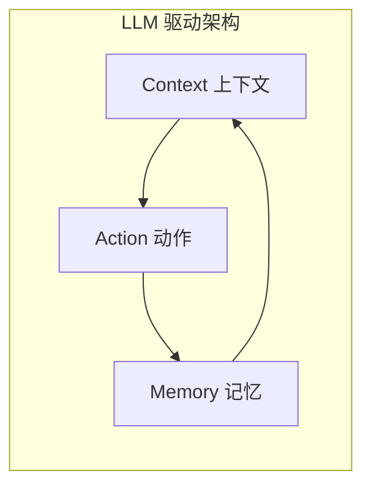

---
tags:
  - AI/对话系统
  - AI/Agent
  - 架构设计
created: 2026-06-29
---

# 对话系统架构设计

> [!abstract] 概要
> 对话系统的三大类型、技术演进路线，以及本项目采用的 LLM 驱动架构（CAM 三元设计）。核心理念：让 LLM 负责理解，让框架负责控制，让开发者负责业务。

## 对话系统三大类型

| 类型 | 目标 | 对话轮次 | 技术难点 | 典型应用 |
|------|------|----------|----------|----------|
| 任务型 | 完成特定任务 | 多轮 | 状态管理、流程控制 | 智能客服、订票 |
| 问答型 | 回答问题 | 单轮/少轮 | 检索精度 | FAQ 机器人 |
| 闲聊型 | 陪伴交流 | 多轮 | 生成质量 | 聊天助手 |

本项目是**任务型对话系统**，以电商客服为场景，支持订单查询、物流追踪、售后处理等任务。

## 技术演进：三种架构

### 1. 传统 Pipeline（NLU → DM → NLG）

```
用户输入 → [NLU: 意图识别+实体提取] → [DM: 状态追踪+策略] → [NLG: 语言生成] → 系统响应
```

优点：模块化、可解释性强。缺点：误差累积、需大量标注数据、对新领域适应性差。

### 2. 端到端（Seq2Seq / LLM 直接生成）

```
用户输入 → [LLM] → 系统响应
```

优点：无需人工特征、生成自然。缺点：幻觉问题、难以融入业务逻辑、无法精确控制流程。

### 3. LLM 驱动架构（本项目采用）

结合传统架构的可控性和 LLM 的理解能力：



核心思想：**用 LLM 理解用户意图，用结构化命令控制对话流程，用可编程动作执行业务逻辑。**

## CAM 三元设计

### Context（上下文）

对话系统在任意时刻做决策所需的全部信息：

- **Tracker**：统一管理对话状态（对话历史、槽位、Flow 栈）
- **对话历史**：`dialogue_turns` 列表
- **槽位状态**：已收集的用户信息
- **Flow 栈**：当前执行流程的嵌套状态
- **最新消息**：`latest_message`

### Action（动作）

对话系统执行的原子操作单元，可插拔：

| 类型 | 示例 | 说明 |
|------|------|------|
| 系统动作 | `action_listen` | 等待用户输入 |
| 响应动作 | `utter_greet` | 发送固定话术 |
| 业务动作 | `action_query_order` | 执行业务逻辑 |
| Flow 动作 | `action_flow_completed` | Flow 生命周期 |

```python
class Action:
    name: str

    async def run(self, tracker, domain, **kwargs) -> ActionResult:
        # 执行逻辑
        return ActionResult(responses=[...], events=[...])
```

### Memory（记忆）

| 层次 | 存储内容 | 生命周期 |
|------|----------|----------|
| 会话内存 | Tracker 状态 | 单次会话 |
| 持久存储 | TrackerStore | 跨会话 |
| Flow 记忆 | flow_history | 会话内 |
| 栈记忆 | dialogue_stack | 会话内 |

## 与传统架构对比

| 维度 | 传统 Pipeline | LLM 驱动架构 |
|------|--------------|-------------|
| 理解方式 | 意图分类+实体提取 | LLM 生成结构化命令 |
| 对话管理 | 状态机/规则 | Flow 定义+对话栈 |
| 扩展方式 | 增加意图/实体 | 增加 Flow/Action |
| 中断恢复 | 复杂/困难 | 原生支持（栈结构） |
| 开发效率 | 需要标注数据 | YAML 配置为主 |

### 示例：用户查订单时中途问退货政策

**传统 Pipeline**：意图从"查询订单"切换到"查询政策"，上下文丢失，无法关联订单。

**LLM 驱动架构**：

```
用户：我想查订单12345
系统：[StartFlow(订单查询), SetSlot(order_id=12345)]
      → 压入 Flow 栈 → 执行查询

用户：退货政策是什么？
系统：[KnowledgeAnswer(退货政策)]
      → 订单查询 Flow 仍在栈中（被中断）
      → 回答后自动恢复订单查询
```

## 技术栈核心：LangGraph

LangGraph 是本项目的编排引擎，核心概念：

| 概念 | 说明 | 本项目实现 |
|------|------|------------|
| **Node** | 处理单元 | understand/policy/action/guard/response |
| **Edge** | 连接关系 | 条件边（should_execute_action 等） |
| **State** | 状态载体 | MessageProcessingState |

图结构：`START → understand → policy → [action → guard → policy...] → response → END`

详见 [[06-LangGraph图式编排]]。

## 相关笔记

- [[02-对话状态管理]] — Tracker 和 Slot 的详细实现
- [[03-对话栈与栈帧]] — 对话栈如何管理 Flow 嵌套和中断
- [[06-LangGraph图式编排]] — 5 节点图的具体实现
- [[00-项目总览]] — 回到总览
