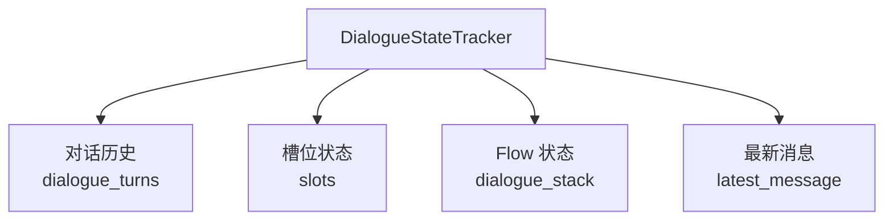
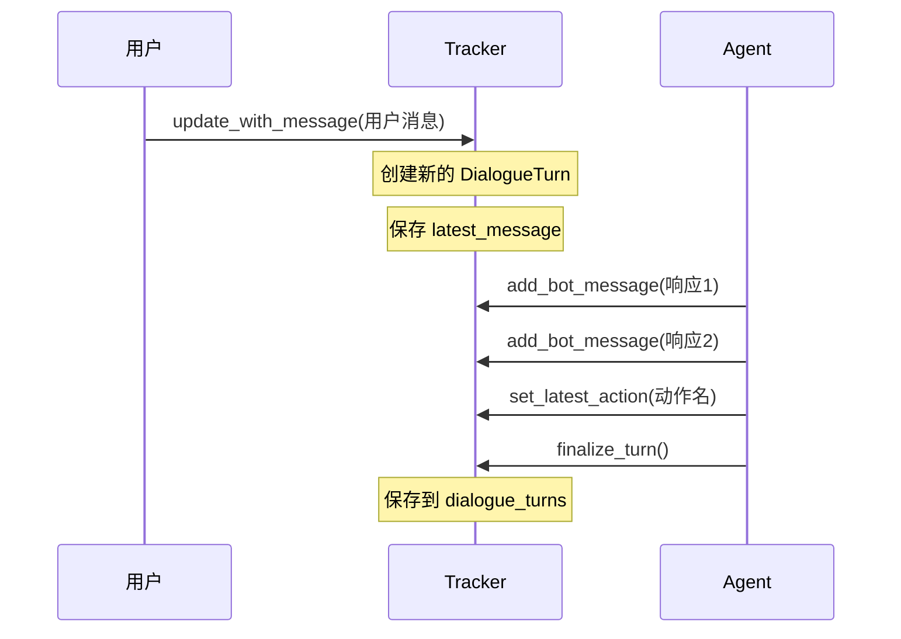

---
tags:
  - AI/对话系统
  - 状态管理
  - 数据结构
created: 2026-06-29
---

# 对话状态管理

> [!abstract] 概要
> DialogueStateTracker（对话状态追踪器）是整个系统的核心数据结构，统一管理槽位、对话历史、Flow 状态和最新消息。所有组件共享同一份 Tracker 状态。

## Tracker 核心职责

Tracker 是对话系统的"记忆本"，记录四类信息：



### 核心属性

| 属性 | 类型 | 说明 |
|------|------|------|
| `sender_id` | str | 会话 ID（用户 ID） |
| `slots` | Dict[str, Slot] | 槽位状态字典 |
| `dialogue_turns` | List[DialogueTurn] | 对话轮次历史 |
| `dialogue_stack` | DialogueStack | 对话栈（唯一状态源） |
| `latest_message` | UserMessage | 最新的用户消息 |
| `latest_action_name` | str | 最新执行的动作 |
| `active_flow` | str (property) | 当前活跃 Flow（从栈计算） |

> [!important] 关键设计
> `active_flow` 是从 `dialogue_stack` 派生的计算属性，不是独立存储的字段。对话栈是 Flow 状态的唯一状态源。

## 槽位系统（Slots）

槽位是对话系统中存储收集信息的容器，类似"表单字段"。

### 6 种槽位类型

| 类型 | 验证规则 | 示例 |
|------|----------|------|
| `TextSlot` | 必须是字符串 | 订单号、地址 |
| `BoolSlot` | 必须是布尔值 | 是否确认 |
| `FloatSlot` | 数字，可设范围 | 金额、数量 |
| `ListSlot` | 必须是列表 | 商品列表 |
| `CategoricalSlot` | 必须在预定义值中 | 支付方式 |
| `AnySlot` | 接受任何值 | 通用存储 |

### 槽位映射类型

```mermaid
graph LR
    LLM[from_llm<br/>LLM 自动提取] -->|用户说"订单号12345"| S1[order_id = 12345]
    CTL[controlled<br/>Action 代码控制] -->|Action 查询数据库后| S2[order_status = 已发货]
```

- `from_llm`：LLM 从用户输入中自动提取（用户主动提供的信息）
- `controlled`：由 Action 代码填充（系统查询/计算的结果），LLM 不会自动提取

### 槽位核心接口

```python
# 设置槽位
tracker.set_slot("order_id", "12345")

# 获取槽位
order_id = tracker.get_slot("order_id")

# 获取所有槽位
all_slots = tracker.get_all_slots()

# 重置所有槽位
tracker.reset_slots()
```

### 槽位验证

```python
class TextSlot(Slot):
    type_name = "text"
    def _validate_value(self, value) -> bool:
        return isinstance(value, str)

class FloatSlot(Slot):
    type_name = "float"
    def _validate_value(self, value) -> bool:
        if not isinstance(value, (int, float)):
            return False
        if self.min_value is not None and value < self.min_value:
            return False
        return True
```

## 对话历史管理

### DialogueTurn 结构

每个对话轮次包含：

```python
@dataclass
class DialogueTurn:
    user_message: Optional[UserMessage]     # 用户消息
    bot_messages: List[BotMessage]           # Bot 响应列表
    commands: List[Dict[str, Any]]           # 生成的命令
    action_name: Optional[str]               # 执行的动作名称
    timestamp: float                         # 时间戳
```

### 对话历史流程



### LLM 消息格式转换

`get_messages_for_llm()` 方法将对话历史转换为 LLM 消息格式：

```python
[
    {"role": "user", "content": "我想查订单"},
    {"role": "assistant", "content": "好的，请告诉我订单号"},
    {"role": "user", "content": "12345"},
]
```

## 序列化与持久化

Tracker 支持完整的序列化/反序列化，用于会话持久化和恢复：

```python
# 序列化为字典
data = tracker.to_dict()

# 从字典恢复
tracker = DialogueStateTracker.from_dict(data, domain_slots)

# 创建深拷贝
tracker_copy = tracker.copy()
```

支持两种持久化后端：
- **JSON 文件存储**：开发调试用
- **MySQL 存储**：生产环境用

详见 [[07-Agent核心系统]] 中的 TrackerStore 部分。

## Flow 管理

Tracker 通过对话栈管理 Flow 生命周期：

```python
# 启动 Flow（压入栈）
tracker.start_flow("query_order_detail")

# 结束当前 Flow（弹出栈）
tracker.end_flow()

# 取消所有 Flow
tracker.cancel_flow()

# 当前活跃 Flow（从栈计算）
current_flow = tracker.active_flow
```

> [!note] 设计要点
> Tracker 不直接管理 Flow 状态，而是委托给 `dialogue_stack`。这样保证了 Flow 嵌套、中断、恢复的一致性。

## 相关笔记

- [[03-对话栈与栈帧]] — 对话栈的详细实现和栈帧类型
- [[04-Flow流程系统]] — Flow 定义和执行引擎
- [[01-对话系统架构设计]] — CAM 架构中的 Context 角色
- [[00-项目总览]] — 回到总览
