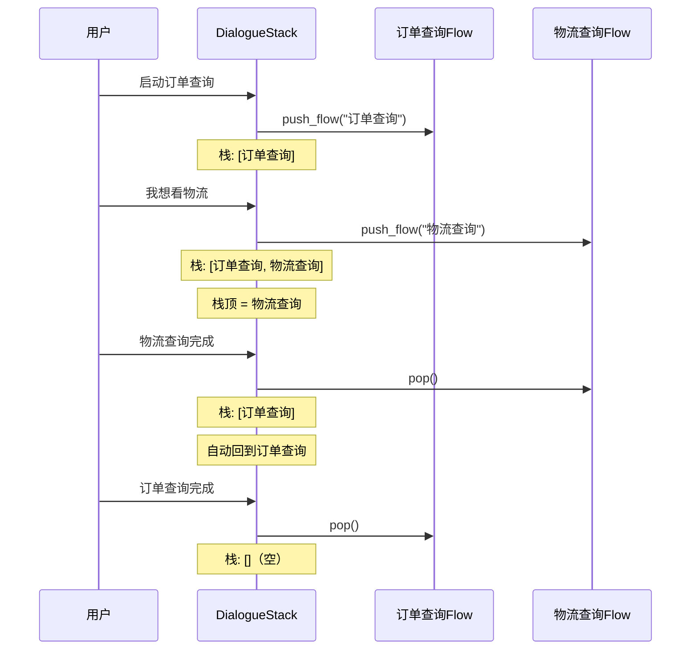
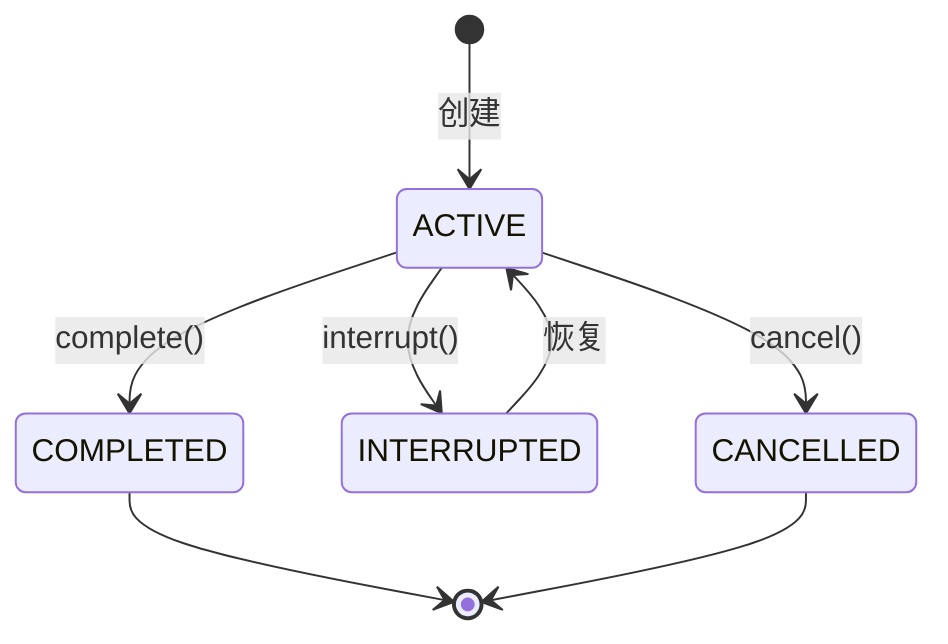
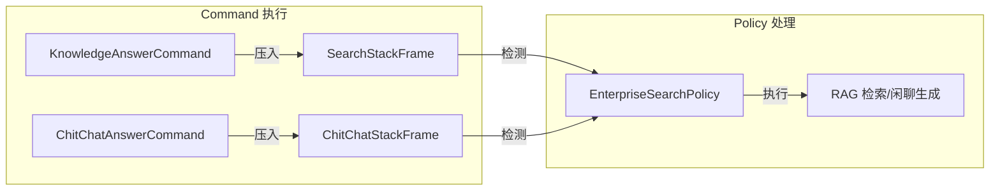

---
tags:
  - AI/对话系统
  - 数据结构
  - 状态管理
created: 2026-06-29
---

# 对话栈与栈帧

> [!abstract] 概要
> DialogueStack 是管理对话上下文的 LIFO 栈结构，支持 Flow 嵌套、中断恢复和多模式触发。6 种栈帧类型覆盖 Flow 执行、知识搜索、闲聊、人工转接等场景。

## 设计理念

对话栈就像"浏览器的标签页管理"：

- **压栈（push）** = 打开新标签页（启动新 Flow）
- **弹栈（pop）** = 关闭当前标签页（完成 Flow）
- **栈顶（top）** = 当前活动标签页（当前正在处理的 Flow）
- **中断** = 切换到其他标签页处理紧急事务，之后再回来

### 为什么需要对话栈？

1. **Flow 嵌套**：A Flow 执行中可以调用 B Flow，B 完成后自动返回 A
2. **中断恢复**：用户在 A Flow 中突然问别的问题，回答后可以继续 A
3. **上下文隔离**：每个 Flow 有独立的执行状态，互不干扰
4. **多模式支持**：Flow、搜索、闲聊、人工转接都用栈帧表示

## 栈操作示意



## 6 种栈帧类型

| 类型 | 说明 | 使用场景 |
|------|------|----------|
| `FlowStackFrame` | Flow 帧 | 执行定义的 Flow 流程 |
| `SearchStackFrame` | 搜索帧 | 执行知识库搜索（RAG） |
| `ChitChatStackFrame` | 闲聊帧 | 处理闲聊对话 |
| `CannotHandleStackFrame` | 无法处理帧 | 系统无法处理的请求 |
| `CompletedStackFrame` | 完成帧 | Flow 完成后的空闲状态 |
| `HumanHandoffStackFrame` | 人工转接帧 | 需要转接人工客服 |

### 栈帧状态机



### FlowStackFrame 核心字段

```python
@dataclass
class FlowStackFrame(StackFrame):
    flow_id: str = ""                          # Flow ID
    step_id: str = "START"                     # 当前步骤 ID
    flow_frame_type: FlowFrameType = REGULAR   # 帧类型
    slot_to_collect: Optional[str] = None      # 正在收集的槽位
    completing: bool = False                   # 是否正在完成
```

三种 Flow 帧类型：
- `REGULAR`：普通 Flow
- `INTERRUPT`：中断 Flow
- `LINK`：链接 Flow

## 核心方法

### 基础栈操作

```python
stack = DialogueStack()

# 压栈
stack.push_flow("订单查询", "START")

# 查看栈顶
top = stack.top()  # FlowStackFrame(flow_id="订单查询")

# 弹栈
popped = stack.pop()

# 栈大小
stack.size()  # 0
stack.is_empty()  # True
```

### Flow 专用操作

| 方法 | 说明 |
|------|------|
| `top_flow_frame()` | 获取栈顶的 Flow 帧（跳过非 Flow 帧） |
| `active_flow_frame()` | 获取当前活动的 Flow 帧（状态为 ACTIVE） |
| `push_flow(flow_id, step_id)` | 压入新的 Flow 帧 |
| `find_flow_frame(flow_id)` | 查找指定 Flow 的帧 |
| `has_flow(flow_id)` | 检查栈中是否包含指定 Flow |
| `pop_to_flow(flow_id)` | 弹出直到到达指定 Flow |
| `interrupt_top_flow()` | 中断栈顶 Flow |

### 中断与恢复示例

```python
# 场景：用户在订单查询中突然问其他问题

# 1. 订单查询进行中
stack.push_flow("订单查询", "collect_order_id")

# 2. 用户突然问退货政策
stack.interrupt_top_flow()  # 中断订单查询
stack.push(SearchStackFrame())  # 压入搜索帧

# 3. 搜索完成后
stack.pop()  # 弹出搜索帧
# 订单查询自动恢复（仍在栈中，状态从 INTERRUPTED → ACTIVE）
print(stack.active_flow_frame().flow_id)  # 订单查询
```

## 帧类型注册机制

使用装饰器模式自动注册帧类型，支持反序列化时动态创建：

```python
_FRAME_TYPE_REGISTRY: Dict[str, Type[StackFrame]] = {}

def register_frame_type(cls):
    _FRAME_TYPE_REGISTRY[cls.frame_type()] = cls
    return cls

@register_frame_type
@dataclass
class FlowStackFrame(StackFrame):
    @classmethod
    def frame_type(cls) -> str:
        return "flow"

# 反序列化时根据 type 字段创建对应帧
def create_frame_from_dict(data):
    frame_type = data.get("type")
    frame_cls = _FRAME_TYPE_REGISTRY.get(frame_type)
    return frame_cls.from_dict(data)
```

## 栈帧化设计：Command 与 Policy 的桥梁

> [!important] 核心设计模式
> 回答类命令（ChitChat、Knowledge、CannotHandle）采用"栈帧化"设计：Command 只负责压入栈帧，Policy 检测栈帧并执行实际操作。



这种设计实现了 Command 和 Policy 的解耦：
- Command 只负责"声明"需要做什么（压入栈帧）
- Policy 负责"决定"怎么做（检测栈帧类型并执行对应逻辑）

详见 [[05-命令系统]] 和 [[08-策略系统]]。

## 序列化

```python
# 栈转字典
data = stack.as_dict()
# {"frames": [{"type": "flow", "flow_id": "query_order", ...}, ...]}

# 从字典恢复
stack = DialogueStack.from_dict(data)
```

## 相关笔记

- [[02-对话状态管理]] — Tracker 如何使用对话栈
- [[04-Flow流程系统]] — Flow 如何通过栈实现嵌套
- [[05-命令系统]] — Command 的栈帧化设计
- [[08-策略系统]] — Policy 如何检测栈帧
- [[00-项目总览]] — 回到总览
