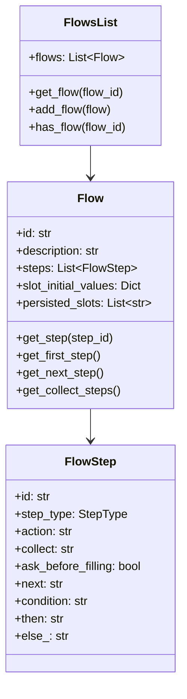
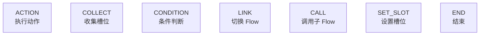
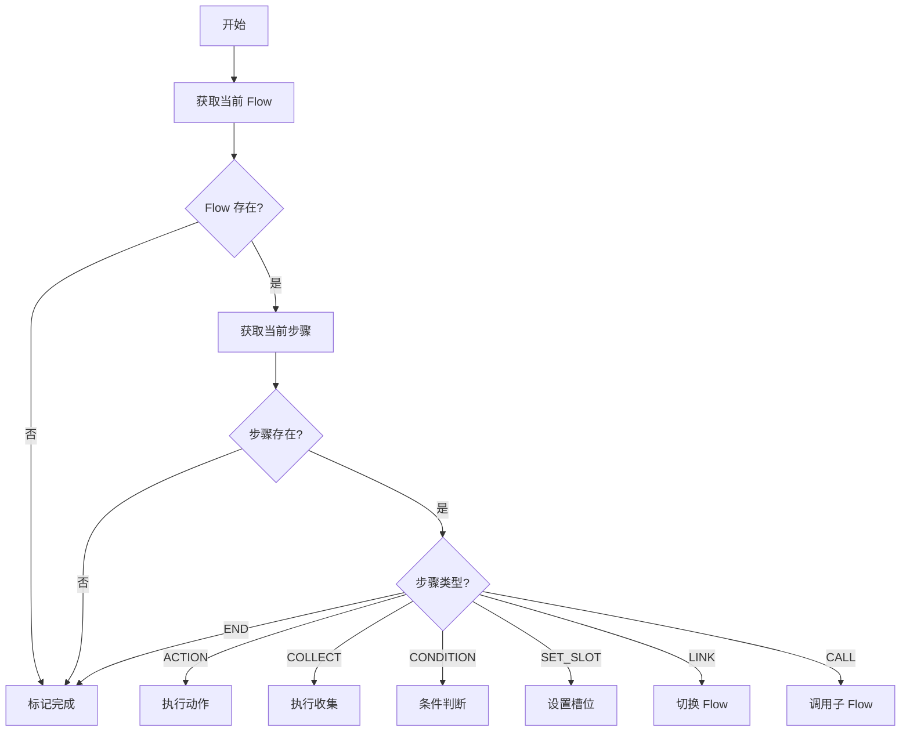
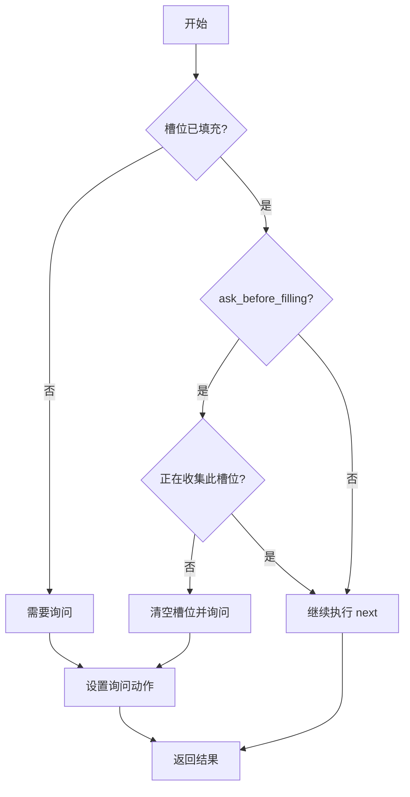

---
tags:
  - AI/对话系统
  - Flow
  - 流程控制
created: 2026-06-29
---

# Flow 流程系统

> [!abstract] 概要
> Flow 是对话流程的"蓝图"，用 YAML 声明式定义。7 种步骤类型覆盖动作执行、槽位收集、条件分支、子流程调用等场景。FlowExecutor 是"调度员"，负责执行步骤并管理状态转换。

## Flow 核心概念

Flow = 完成某个任务所需的步骤序列（类似"订餐流程"）：

- **Flow** = 整个流程（从选菜到支付）
- **FlowStep** = 每个具体步骤（选菜 → 填地址 → 选支付 → 确认 → 支付）
- **next** = 下一步指引
- **COLLECT** = 收集信息
- **ACTION** = 执行操作
- **CONDITION** = 条件分支

### 数据结构



## 7 种步骤类型



### 1. ACTION — 执行动作

```yaml
- id: query_order
  action: action_query_order
  next: show_result
```

执行指定的 action，然后跳转到 next 步骤。

### 2. COLLECT — 收集槽位

```yaml
- collect: order_id
  description: 订单号
  ask_before_filling: true      # 是否清空槽位重新询问
  reset_after_flow_ends: true   # Flow 结束后是否重置槽位
  next: process_order
```

执行逻辑：
1. 检查槽位是否已填充
2. 如果未填充或 `ask_before_filling=true`，执行询问动作
3. 询问动作降级策略：显式指定 → `utter_ask_{slot}` → `action_ask_{slot}`
4. 槽位填充后，跳转到 next

**带条件的 next**：

```yaml
- collect: order_id
  next:
    - if: slots.order_id != "false"
      then: process_order
    - else: END
```

### 3. CONDITION — 条件判断

```yaml
- id: check_balance
  if: slots.balance >= slots.total_price
  then: create_order
  else: recharge
```

支持三种条件表达式：

| 格式 | 示例 | 说明 |
|------|------|------|
| 相等 | `slots.status == "paid"` | 检查槽位值是否等于指定值 |
| 不等 | `slots.order_id != "false"` | 检查槽位值是否不等于指定值 |
| 布尔 | `slots.if_confirm` | 检查槽位值是否为真 |

### 4. LINK — 切换 Flow

```yaml
- id: go_to_logistics
  link: query_logistics
```

结束当前 Flow，启动目标 Flow。

### 5. CALL — 调用子 Flow

```yaml
- id: call_address_flow
  call: collect_address
  next: confirm_order
```

将子 Flow 压入栈，执行完成后弹出栈，回到当前 Flow 的 next 步骤。

### 6. SET_SLOT — 设置槽位

```yaml
- id: init_status
  set_slot:
    order_status: "processing"
  next: process_order
```

### 7. END — 结束

```yaml
- id: end
  action: end
```

或简写为 `next: END`。

## next 字段的三种形式

**形式 1：简单字符串**

```yaml
next: step_2
```

**形式 2：条件列表**

```yaml
next:
  - if: slots.order_id != "false"
    then: process_order
  - else: END
```

**形式 3：嵌套动作**

```yaml
next:
  - if: slots.order_id != "false"
    then:
      - action: action_get_order_detail
        next: END
  - else: END
```

## FlowExecutor 执行引擎

### 执行流程



### ExecutionResult 结构

```python
@dataclass
class ExecutionResult:
    action: Optional[str] = None           # 要执行的动作名称
    slot_to_collect: Optional[str] = None  # 要收集的槽位名称
    events: List[Dict] = field(...)        # 产生的事件列表
    flow_completed: bool = False           # Flow 是否已完成
    next_step_id: Optional[str] = None     # 下一个步骤 ID
```

### COLLECT 步骤执行逻辑



### 条件表达式评估

```python
def _evaluate_condition(self, condition, tracker) -> bool:
    condition = condition.strip().replace("slots.", "")

    # 相等判断
    if "==" in condition:
        parts = condition.split("==")
        slot_name = parts[0].strip()
        expected = parts[1].strip().strip('"\'')
        return str(tracker.get_slot(slot_name)) == expected

    # 不等判断
    if "!=" in condition:
        parts = condition.split("!=")
        slot_name = parts[0].strip()
        expected = parts[1].strip().strip('"\'')
        return str(tracker.get_slot(slot_name)) != expected

    # 布尔判断（字符串 "true"/"false" 会转换）
    slot_value = tracker.get_slot(condition)
    if isinstance(slot_value, str):
        if slot_value.lower() == "true": return True
        if slot_value.lower() == "false": return False
    return bool(slot_value)
```

## FlowLoader 加载器

支持三种加载方式：

```python
from atguigu_ai.dialogue_understanding.flow import load_flows

# 从目录加载（扫描所有 .yml/.yaml 文件）
flows = load_flows("data/flows/")

# 从单个文件加载
flows = load_flows("flows.yml")

# 获取 Flow
order_flow = flows.get_flow("query_order_detail")
```

## 实战示例：修改收货信息 Flow

```yaml
modify_order_receive_info:
  name: 修改订单收货信息
  description: 修改订单收货信息
  steps:
    # 步骤1：查询可修改的订单
    - set_slots:
        - goto: action_ask_order_id_before_delivered

    # 步骤2：选择订单
    - collect: order_id
      next:
        - if: slots.order_id != "false"
          then: get_order_detail
        - else: END

    # 步骤3：显示订单详情
    - id: get_order_detail
      action: action_get_order_detail

    # 步骤4：选择收货信息
    - collect: receive_id
      ask_before_filling: true
      next:
        - if: slots.receive_id == "false"
          then: END
        - if: slots.receive_id == "modify"
          then: select_modify_content
        - else: confirm_receive_info

    # 步骤5：选择修改内容（嵌套条件分支）
    - id: select_modify_content
      collect: modify_content
      ask_before_filling: true
      next:
        - if: slots.modify_content == "收货人姓名"
          then:
            - collect: receiver_name
              ask_before_filling: true
              next: if_modify_continue
        - if: slots.modify_content == "收货人电话"
          then:
            - collect: receiver_phone
              ask_before_filling: true
              next: if_modify_continue
        - if: slots.modify_content == "收货地址"
          then:
            - collect: receive_province
              ask_before_filling: true
            - collect: receive_city
              ask_before_filling: true
            - collect: receive_district
              ask_before_filling: true
            - collect: receive_street_address
              ask_before_filling: true
              next: if_modify_continue
        - else: END

    # 步骤6：询问是否继续修改
    - id: if_modify_continue
      collect: if_modify_continue
      ask_before_filling: true
      next:
        - if: slots.if_modify_continue
          then:
            - set_slots:
                - receive_id: modified
              next: select_modify_content
        - else: confirm_receive_info

    # 步骤7：确认修改
    - id: confirm_receive_info
      collect: set_receive_info
      ask_before_filling: true
      next:
        - if: slots.set_receive_info
          then:
            - action: action_ask_set_receive_info
              next: END
        - else: END
```

> [!tip] 设计要点
> 这个 Flow 展示了 Flow 系统的几个关键能力：
> - 多层嵌套的条件分支（步骤5根据修改内容走不同路径）
> - 循环修改（步骤6可以回到步骤5继续修改）
> - `ask_before_filling: true` 确保每次进入步骤都重新询问

## 相关笔记

- [[03-对话栈与栈帧]] — Flow 如何通过栈实现嵌套和中断
- [[05-命令系统]] — StartFlowCommand 如何启动 Flow
- [[08-策略系统]] — FlowPolicy 如何执行 Flow 步骤
- [[11-电商客服实战]] — 更多 Flow 定义示例
- [[00-项目总览]] — 回到总览
