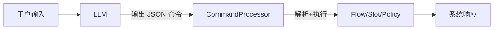
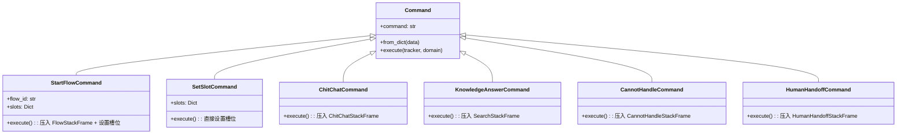
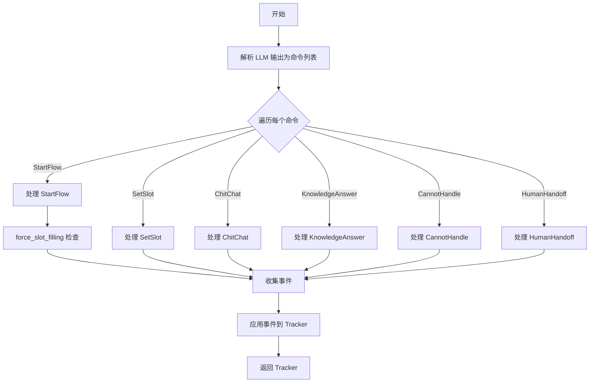
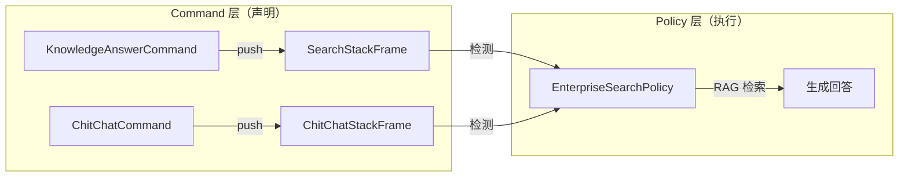

---
tags:
  - AI/对话系统
  - 命令系统
  - LLM
created: 2026-06-29
---

# 命令系统

> [!abstract] 概要
> 命令系统是 LLM 与对话框架之间的"协议层"。LLM 不直接执行操作，而是输出结构化命令（JSON），由 CommandProcessor 解析并执行。6 种命令类型覆盖 Flow 启动、槽位设置、知识回答、闲聊、无法处理和人工转接。

## 设计理念

传统方式中 LLM 直接生成自然语言响应，存在幻觉和不可控问题。本项目采用**"LLM 理解 + 命令执行"**模式：



LLM 的职责从"生成回复"变为"理解意图并输出命令"，回复内容由框架控制。

## 6 种命令类型

| 命令 | 说明 | 触发场景 | 对应栈帧 |
|------|------|----------|----------|
| `StartFlow` | 启动 Flow | 用户有明确任务意图 | FlowStackFrame |
| `SetSlot` | 设置槽位 | LLM 从用户输入提取信息 | 无（直接设置） |
| `ChitChat` | 闲聊回复 | 用户闲聊/问候 | ChitChatStackFrame |
| `KnowledgeAnswer` | 知识回答 | 用户问政策/FAQ | SearchStackFrame |
| `CannotHandle` | 无法处理 | 超出系统能力 | CannotHandleStackFrame |
| `HumanHandoff` | 人工转接 | 用户要求/系统判断 | HumanHandoffStackFrame |

## 命令数据结构

```python
# 基础命令
{
    "command": "StartFlow",
    "parameters": {
        "flow_id": "query_order_detail"
    }
}

# 带槽位设置
{
    "command": "StartFlow",
    "parameters": {
        "flow_id": "query_order_detail",
        "slots": {"order_id": "12345"}
    }
}

# 纯槽位设置
{
    "command": "SetSlot",
    "parameters": {
        "slots": {"order_id": "12345"}
    }
}
```

## 命令定义与处理

### 命令基类

```python
@dataclass
class Command:
    """所有命令的基类"""
    command: str  # 命令类型名称

    @classmethod
    def from_dict(cls, data: Dict) -> "Command":
        """从字典创建命令"""
        ...

    def to_dict(self) -> Dict:
        """序列化为字典"""
        ...

    def execute(self, tracker, domain, **kwargs) -> List[Dict]:
        """执行命令，返回事件列表"""
        ...
```

### 6 种命令类



## CommandProcessor 核心

### 处理流程



### force_slot_filling 机制

> [!important] 关键机制
> 当 StartFlow 命令携带 slots 时，CommandProcessor 会检查这些槽位是否匹配 Flow 中 COLLECT 步骤定义的槽位。如果匹配，则将槽位值直接填充到 Tracker，避免重复询问。

```python
def _process_start_flow(self, command, tracker, domain):
    flow_id = command.flow_id
    slots = command.slots or {}

    events = []

    # 1. 压入 Flow 栈帧
    flow_frame = FlowStackFrame(flow_id=flow_id, step_id="START")
    events.append({"event": "push", "frame": flow_frame})

    # 2. force_slot_filling：检查并填充槽位
    if slots:
        flow = domain.flows.get_flow(flow_id)
        if flow:
            collect_slots = set(flow.get_collect_steps_slots())
            for slot_name, slot_value in slots.items():
                if slot_name in collect_slots:
                    events.append({
                        "event": "slot",
                        "name": slot_name,
                        "value": slot_value
                    })

    return events
```

**示例**：

```yaml
# Flow 定义中有 COLLECT 步骤
steps:
  - collect: order_id    # 需要收集 order_id
    next: query
```

```python
# 用户说"我想查订单 12345"
# LLM 输出：
{
    "command": "StartFlow",
    "parameters": {
        "flow_id": "query_order_detail",
        "slots": {"order_id": "12345"}  # 携带槽位
    }
}

# CommandProcessor 处理：
# 1. 压入 Flow 栈帧
# 2. force_slot_filling：order_id 在 COLLECT 步骤中 → 直接填充
# 3. FlowExecutor 执行时发现 order_id 已填充 → 跳过询问步骤
```

## 回答类命令的栈帧化

> [!note] 设计模式
> 回答类命令（ChitChat、KnowledgeAnswer、CannotHandle、HumanHandoff）采用"栈帧化"设计：Command 只负责压入栈帧，不直接执行回答逻辑。



这种设计实现了两层解耦：
- **Command 层**：只声明"需要做什么"（压入栈帧）
- **Policy 层**：决定"怎么做"（检测栈帧类型并执行对应逻辑）

详见 [[08-策略系统]]。

## LLM Prompt 设计

### System Prompt 结构

```
你是一个智能客服系统的对话理解模块。根据用户输入和对话历史，生成相应的命令。

可用命令：
1. StartFlow: 启动业务流程
   - flow_id: 流程ID
   - slots: 已知槽位信息

2. SetSlot: 设置槽位（不启动流程）
   - slots: 槽位信息

3. ChitChat: 闲聊回复

4. KnowledgeAnswer: 知识库检索回答

5. CannotHandle: 无法处理

6. HumanHandoff: 转人工

可用 Flow 列表：
- query_order_detail: 查询订单详情
- query_logistics: 查询物流信息
- modify_order_receive_info: 修改收货信息
...

请以 JSON 格式输出命令，可以输出多个命令。
```

### 输出格式

```json
[
  {
    "command": "StartFlow",
    "parameters": {
      "flow_id": "query_order_detail",
      "slots": {"order_id": "12345"}
    }
  }
]
```

支持输出多个命令（如同时 StartFlow + SetSlot），按顺序执行。

## 相关笔记

- [[03-对话栈与栈帧]] — 栈帧类型详解
- [[04-Flow流程系统]] — Flow 的 COLLECT 步骤与 force_slot_filling 配合
- [[06-LangGraph图式编排]] — understand 节点如何调用 LLM 生成命令
- [[08-策略系统]] — Policy 如何检测栈帧并执行
- [[00-项目总览]] — 回到总览
