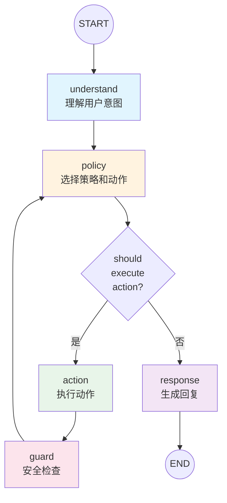
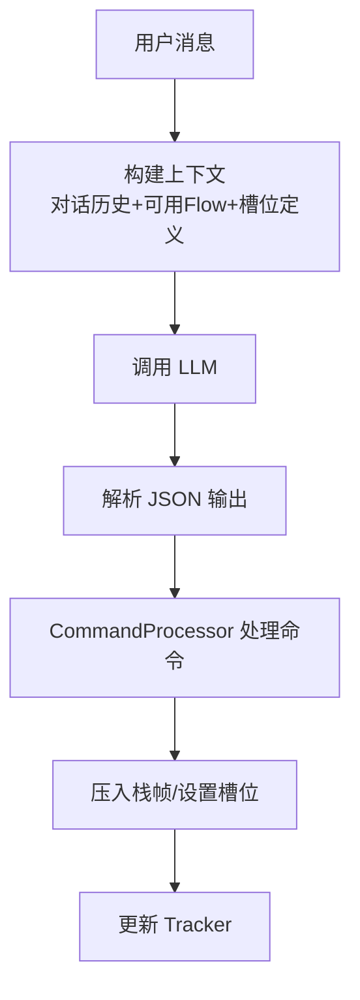
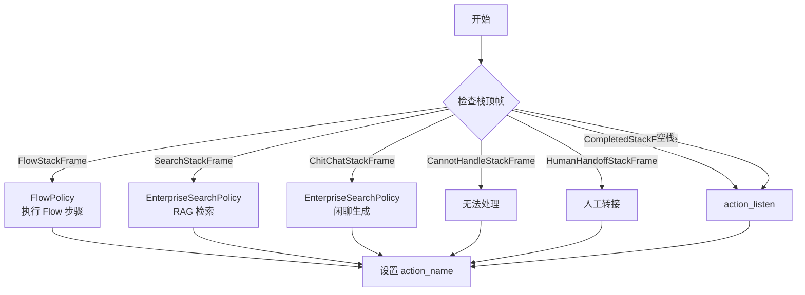
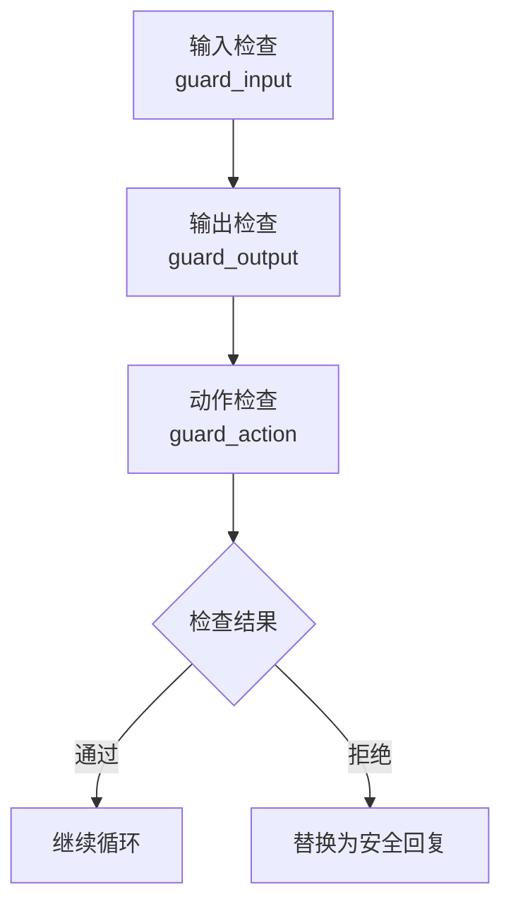
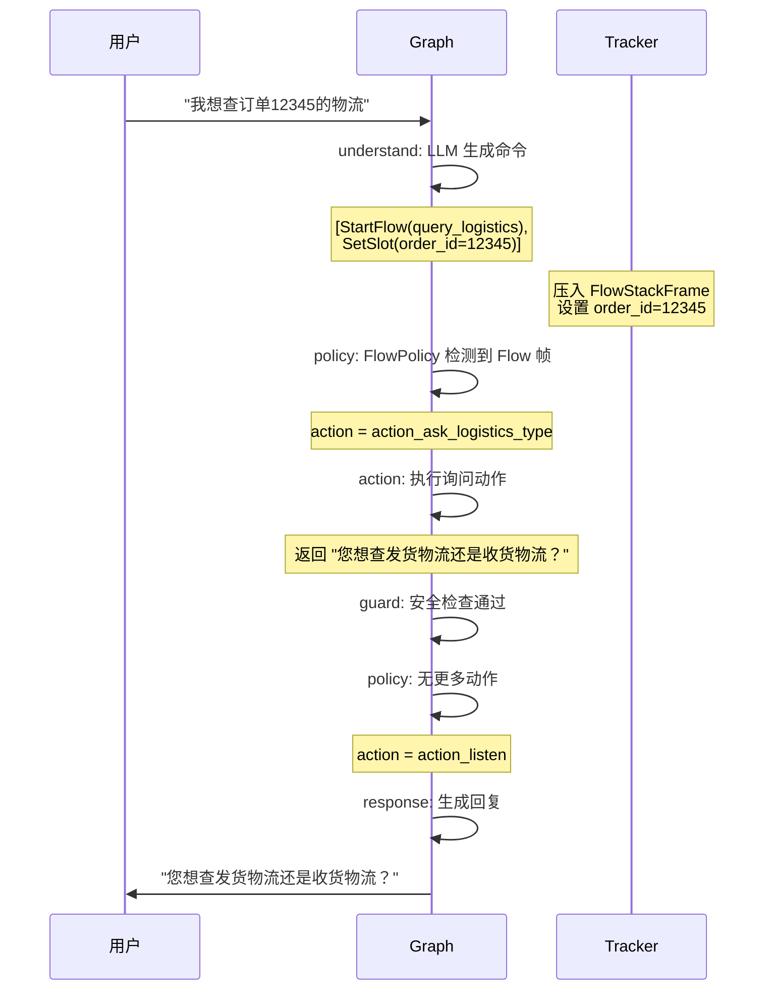

---
tags:
  - AI/对话系统
  - LangGraph
  - 架构设计
created: 2026-06-29
---

# LangGraph 图式编排

> [!abstract] 概要
> LangGraph 是本项目的编排引擎，用 StateGraph 将对话处理拆分为 5 个节点（understand → policy → action → guard → response），通过条件边实现循环执行和流程控制。每个节点职责单一，通过共享 State 传递数据。

## 为什么选择 LangGraph

| 特性 | 传统框架 | LangGraph |
|------|----------|-----------|
| 流程定义 | 代码硬编码 | 图结构声明 |
| 条件分支 | if-else 嵌套 | 条件边函数 |
| 循环执行 | 手动管理 | 内置循环支持 |
| 状态管理 | 自定义 | StateGraph 统一管理 |
| 可观测性 | 自建 | LangSmith 集成 |

## 5 节点图结构



### 节点职责

| 节点 | 职责 | 输入 | 输出 |
|------|------|------|------|
| **understand** | 调用 LLM 理解用户意图，生成命令 | 用户消息 + 对话历史 | 命令列表 + 压入栈帧 |
| **policy** | 检查栈帧，选择策略，决定执行动作 | Tracker 状态 | 动作名称 |
| **action** | 执行动作（业务逻辑/Flow 步骤） | 动作名称 + Tracker | 动作结果（响应+事件） |
| **guard** | 安全检查（输入/输出/动作） | 动作结果 | 检查结果（通过/拒绝） |
| **response** | 生成最终回复 | Tracker 状态 | Bot 消息 |

## State 定义

```python
class MessageProcessingState(TypedDict):
    """LangGraph 状态载体"""
    # 输入
    sender_id: str                          # 会话 ID
    message_text: str                       # 用户消息文本
    channel: str                            # 渠道

    # 中间状态
    tracker: DialogueStateTracker           # 对话状态追踪器
    commands: List[Dict[str, Any]]          # LLM 生成的命令
    action_name: Optional[str]              # 待执行的动作名称
    action_result: Optional[ActionResult]   # 动作执行结果

    # 输出
    responses: List[Dict[str, Any]]         # 最终响应列表
    events: List[Dict[str, Any]]           # 产生的事件列表
    should_continue: bool                   # 是否继续循环
```

## 节点详解

### 1. understand 节点



核心代码逻辑：

```python
async def understand_node(state):
    tracker = state["tracker"]

    # 1. 构建 LLM 上下文
    messages = tracker.get_messages_for_llm()
    available_flows = domain.get_flow_descriptions()
    slot_definitions = domain.get_slot_definitions()

    # 2. 调用 LLM 生成命令
    commands = await llm_provider.generate_commands(
        messages=messages,
        available_flows=available_flows,
        slot_definitions=slot_definitions
    )

    # 3. 处理命令（压入栈帧、设置槽位）
    for command in commands:
        command.execute(tracker, domain)

    return state
```

### 2. policy 节点



策略按优先级排序，第一个匹配的策略胜出：

```python
async def policy_node(state):
    tracker = state["tracker"]
    top_frame = tracker.dialogue_stack.top()

    # 按优先级遍历策略
    for policy in sorted(policies, key=lambda p: -p.priority):
        if policy.should_execute(tracker, top_frame):
            action_name = await policy.predict(tracker)
            state["action_name"] = action_name
            return state

    # 默认：等待用户输入
    state["action_name"] = "action_listen"
    return state
```

### 3. action 节点

```python
async def action_node(state):
    action_name = state["action_name"]
    tracker = state["tracker"]

    # 获取 Action 实例
    action = domain.get_action(action_name)

    # 执行 Action
    result = await action.run(tracker=tracker, domain=domain)

    # 更新状态
    state["action_result"] = result
    state["responses"].extend(result.responses)
    state["events"].extend(result.events)

    # 应用事件到 Tracker
    for event in result.events:
        apply_event(tracker, event)

    return state
```

### 4. guard 节点

三层安全检查：



```python
async def guard_node(state):
    action_result = state["action_result"]

    # 1. 输入检查
    input_check = input_guard.check(state["message_text"])
    if not input_check.passed:
        state["responses"] = [{"text": input_guard.safe_response}]
        return state

    # 2. 输出检查
    for response in action_result.responses:
        output_check = output_guard.check(response)
        if not output_check.passed:
            response["text"] = output_guard.safe_response

    # 3. 动作检查
    action_check = action_guard.check(state["action_name"])
    if not action_check.passed:
        state["responses"] = [{"text": action_guard.safe_response}]

    return state
```

### 5. response 节点

```python
async def response_node(state):
    tracker = state["tracker"]

    # 1. NLG：模板渲染 + LLM 改写
    responses = state["responses"]
    final_responses = []

    for resp in responses:
        # 模板渲染
        text = template_nlg.render(resp, tracker)
        # LLM 改写（可选）
        if config.get("nlg_rephrase", False):
            text = await rephraser.rephrase(text, tracker)
        final_responses.append({"text": text})

    # 2. 更新 Tracker
    for resp in final_responses:
        tracker.add_bot_message(resp)
    tracker.finalize_turn()

    # 3. 持久化
    await tracker_store.save(tracker)

    state["responses"] = final_responses
    return state
```

## 条件边

```python
def should_execute_action(state) -> str:
    """决定从 policy 节点走向哪个节点"""
    action_name = state.get("action_name")

    if action_name is None or action_name == "action_listen":
        # 不需要执行动作 → 直接生成回复
        return "response"
    else:
        # 需要执行动作 → 走 action → guard → 回 policy
        return "action"

def should_continue_loop(state) -> str:
    """决定从 guard 节点走向哪个节点"""
    if state.get("should_continue", False):
        return "policy"  # 继续循环
    else:
        return "response"  # 结束循环
```

## 图构建

```python
from langgraph.graph import StateGraph, END

def build_graph():
    graph = StateGraph(MessageProcessingState)

    # 添加节点
    graph.add_node("understand", understand_node)
    graph.add_node("policy", policy_node)
    graph.add_node("action", action_node)
    graph.add_node("guard", guard_node)
    graph.add_node("response", response_node)

    # 添加边
    graph.set_entry_point("understand")
    graph.add_edge("understand", "policy")

    # 条件边：policy → action 或 response
    graph.add_conditional_edges(
        "policy",
        should_execute_action,
        {"action": "action", "response": "response"}
    )

    # action → guard
    graph.add_edge("action", "guard")

    # 条件边：guard → policy（循环）或 response（结束）
    graph.add_conditional_edges(
        "guard",
        should_continue_loop,
        {"policy": "policy", "response": "response"}
    )

    # response → END
    graph.add_edge("response", END)

    return graph.compile()
```

## 完整处理流程示例

用户说"我想查订单 12345 的物流"：



## 相关笔记

- [[01-对话系统架构设计]] — CAM 架构与图设计的关系
- [[05-命令系统]] — understand 节点的命令生成
- [[07-Agent核心系统]] — Agent 如何编译和执行 Graph
- [[08-策略系统]] — policy 节点的策略选择
- [[09-NLG与多渠道集成]] — response 节点的 NLG
- [[00-项目总览]] — 回到总览
