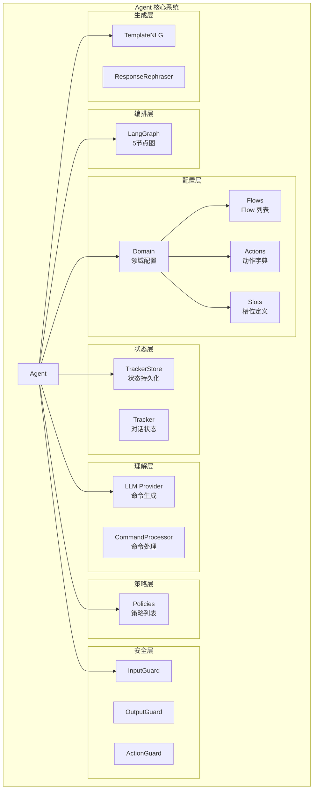
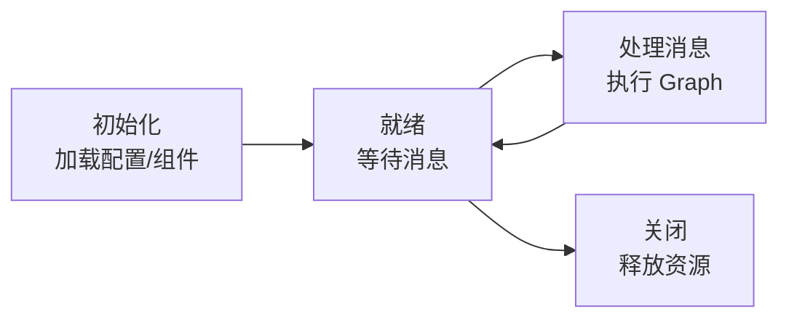

---
tags:
  - AI/对话系统
  - Agent
  - 系统架构
created: 2026-06-29
---

# Agent 核心系统

> [!abstract] 概要
> Agent 是整个对话系统的"总调度师"，负责编排 LangGraph 图、管理组件生命周期、处理消息流。核心组件包括 Agent 主类、Domain（领域配置）、TrackerStore（状态持久化）和 LLM Provider。

## Agent 架构总览



## Agent 主类

### 初始化流程

```python
class Agent:
    def __init__(
        self,
        domain_path: str,           # Domain 配置路径
        flows_path: str,            # Flow 定义路径
        llm_provider: LLMProvider,  # LLM 提供者
        tracker_store: TrackerStore, # 状态存储
        policies: List[Policy],     # 策略列表
        guards: List[Guard],        # 安全检查
        nlg: NLG,                   # 自然语言生成
        config: Dict                # 其他配置
    ):
        # 1. 加载 Domain
        self.domain = Domain.load(domain_path)

        # 2. 加载 Flows
        self.flows = load_flows(flows_path)
        self.domain.set_flows(self.flows)

        # 3. 注册 Actions
        self.domain.register_actions(action_modules)

        # 4. 设置组件
        self.llm_provider = llm_provider
        self.tracker_store = tracker_store
        self.policies = sorted(policies, key=lambda p: -p.priority)
        self.guards = guards
        self.nlg = nlg

        # 5. 构建 LangGraph
        self.graph = self._build_graph()
```

### 消息处理主流程

```python
async def handle_message(
    self,
    message_text: str,
    sender_id: str,
    channel: str = "web",
    metadata: Optional[Dict] = None
) -> List[Dict[str, Any]]:
    """处理用户消息，返回响应列表"""

    # 1. 获取或创建 Tracker
    tracker = await self.tracker_store.get_or_create(sender_id)

    # 2. 更新 Tracker with 用户消息
    user_message = UserMessage(
        text=message_text,
        sender_id=sender_id,
        channel=channel,
        metadata=metadata
    )
    tracker.update_with_message(user_message)

    # 3. 构建 Graph 初始状态
    initial_state = MessageProcessingState(
        sender_id=sender_id,
        message_text=message_text,
        channel=channel,
        tracker=tracker,
        commands=[],
        action_name=None,
        action_result=None,
        responses=[],
        events=[],
        should_continue=True
    )

    # 4. 执行 Graph
    final_state = await self.graph.ainvoke(initial_state)

    # 5. 持久化 Tracker
    await self.tracker_store.save(final_state["tracker"])

    # 6. 返回响应
    return final_state["responses"]
```

## Domain 领域配置

Domain 是对话系统的"配置中心"，集中管理所有可配置元素。

### Domain 结构

```yaml
# domain.yml
slots:
  order_id:
    type: text
    mappings:
      - type: from_llm
  order_status:
    type: text
    mappings:
      - type: controlled
  if_confirm:
    type: bool
    mappings:
      - type: from_llm

actions:
  - action_query_order
  - action_get_logistics
  - utter_ask_order_id
  - utter_greet

responses:
  utter_ask_order_id:
    - text: "请告诉我您的订单号"
  utter_greet:
    - text: "您好，有什么可以帮您？"

intents:
  - query_order
  - query_logistics
  - chitchat
```

### Domain 类核心方法

| 方法 | 说明 |
|------|------|
| `get_action(name)` | 获取 Action 实例 |
| `get_slot_definition(name)` | 获取槽位定义 |
| `get_response(template_name)` | 获取模板响应 |
| `get_flow(flow_id)` | 获取 Flow 定义 |
| `register_actions(modules)` | 注册 Action 模块 |
| `get_flow_descriptions()` | 获取 Flow 描述（供 LLM prompt） |
| `get_slot_definitions()` | 获取槽位定义（供 LLM prompt） |

### Action 注册机制

```python
# 方式1：装饰器注册
@register_action("action_query_order")
class QueryOrderAction(Action):
    async def run(self, tracker, domain, **kwargs):
        order_id = tracker.get_slot("order_id")
        result = await query_order_from_db(order_id)
        return ActionResult(
            responses=[{"text": f"订单状态：{result.status}"}],
            events=[{"event": "slot", "name": "order_status", "value": result.status}]
        )

# 方式2：Domain 加载时注册
domain.register_actions(["atguigu_ai.actions.order_actions"])
```

## TrackerStore 状态持久化

### 接口定义

```python
class TrackerStore(ABC):
    @abstractmethod
    async def get_or_create(self, sender_id: str) -> DialogueStateTracker:
        """获取或创建 Tracker"""
        ...

    @abstractmethod
    async def save(self, tracker: DialogueStateTracker) -> None:
        """保存 Tracker"""
        ...

    @abstractmethod
    async def delete(self, sender_id: str) -> None:
        """删除 Tracker"""
        ...
```

### 两种实现

**JSON 文件存储（开发用）**：

```python
class JSONTrackerStore(TrackerStore):
    def __init__(self, path: str = ".trackers"):
        self.path = Path(path)

    async def save(self, tracker):
        file_path = self.path / f"{tracker.sender_id}.json"
        data = tracker.to_dict()
        file_path.write_text(json.dumps(data, ensure_ascii=False, indent=2))
```

**MySQL 存储（生产用）**：

```python
class MySQLTrackerStore(TrackerStore):
    def __init__(self, db_url: str):
        self.engine = create_async_engine(db_url)
        self.session_factory = async_sessionmaker(self.engine)

    async def save(self, tracker):
        data = json.dumps(tracker.to_dict())
        async with self.session_factory() as session:
            await session.execute(
                text("""
                    INSERT INTO trackers (sender_id, data, updated_at)
                    VALUES (:id, :data, NOW())
                    ON DUPLICATE KEY UPDATE data = :data, updated_at = NOW()
                """),
                {"id": tracker.sender_id, "data": data}
            )
            await session.commit()
```

## LLM Provider

```python
class LLMProvider:
    """LLM 调用封装"""

    async def generate_commands(
        self,
        messages: List[Dict],
        available_flows: List[Dict],
        slot_definitions: List[Dict]
    ) -> List[Command]:
        """生成对话命令"""

        system_prompt = self._build_system_prompt(available_flows, slot_definitions)
        user_prompt = self._build_user_prompt(messages)

        response = await self.client.chat.completions.create(
            model=self.model_name,
            messages=[
                {"role": "system", "content": system_prompt},
                {"role": "user", "content": user_prompt}
            ],
            response_format={"type": "json_object"}
        )

        return self._parse_commands(response.choices[0].message.content)
```

## Agent 生命周期管理



### 启动与关闭

```python
async def start(self):
    """启动 Agent"""
    await self.tracker_store.init()
    self.logger.info("Agent started")

async def stop(self):
    """关闭 Agent"""
    await self.tracker_store.close()
    self.logger.info("Agent stopped")
```

## CLI 命令

项目提供 Click CLI 进行交互式测试：

```bash
# 启动交互式对话
python -m atguigu_ai.cli chat

# 指定用户 ID
python -m atguigu_ai.cli chat --sender-id test_user

# 启动 API 服务
python -m atguigu_ai.cli serve --port 8000

# 查看配置
python -m atguigu_ai.cli info
```

## 相关笔记

- [[06-LangGraph图式编排]] — Graph 的 5 节点详解
- [[02-对话状态管理]] — Tracker 数据结构
- [[08-策略系统]] — Policy 的实现
- [[09-NLG与多渠道集成]] — NLG 和多渠道
- [[00-项目总览]] — 回到总览
