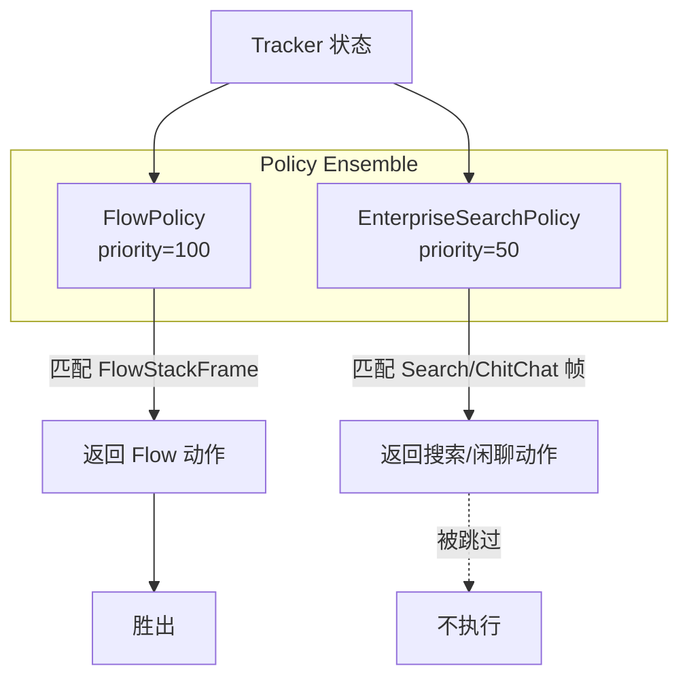
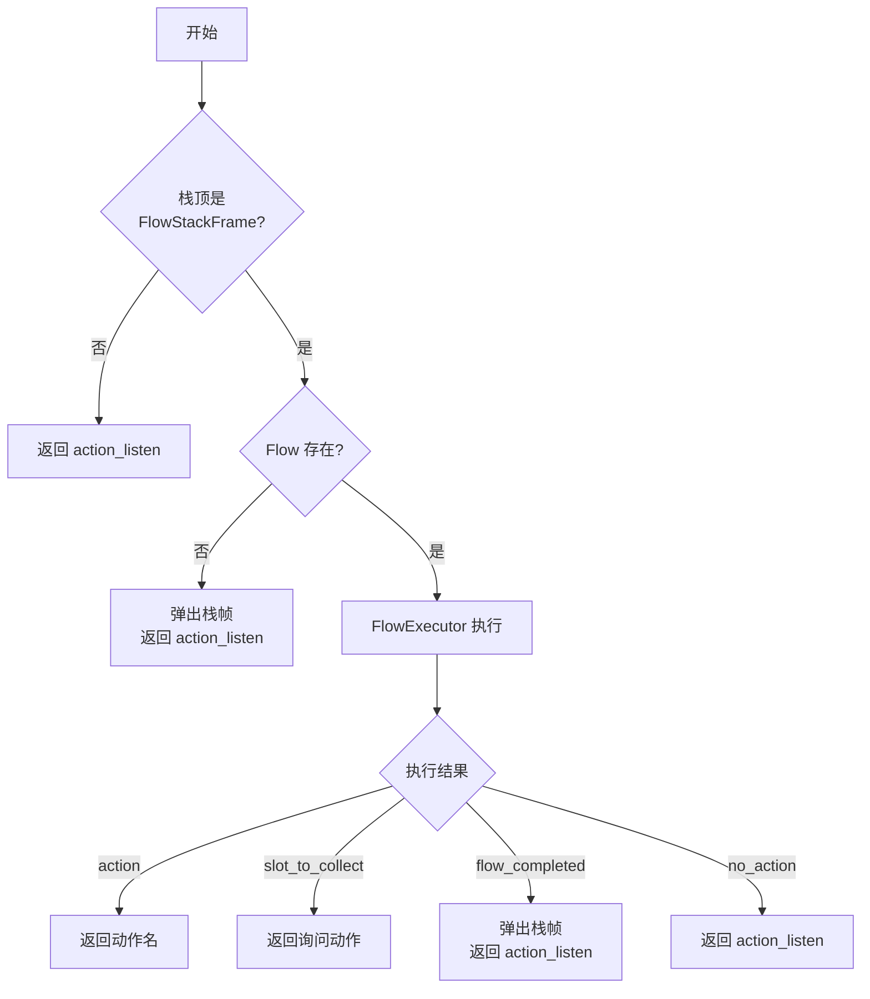
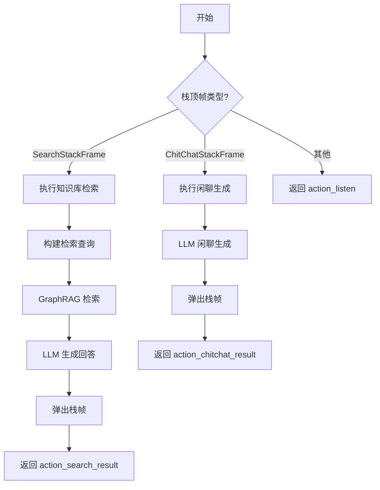
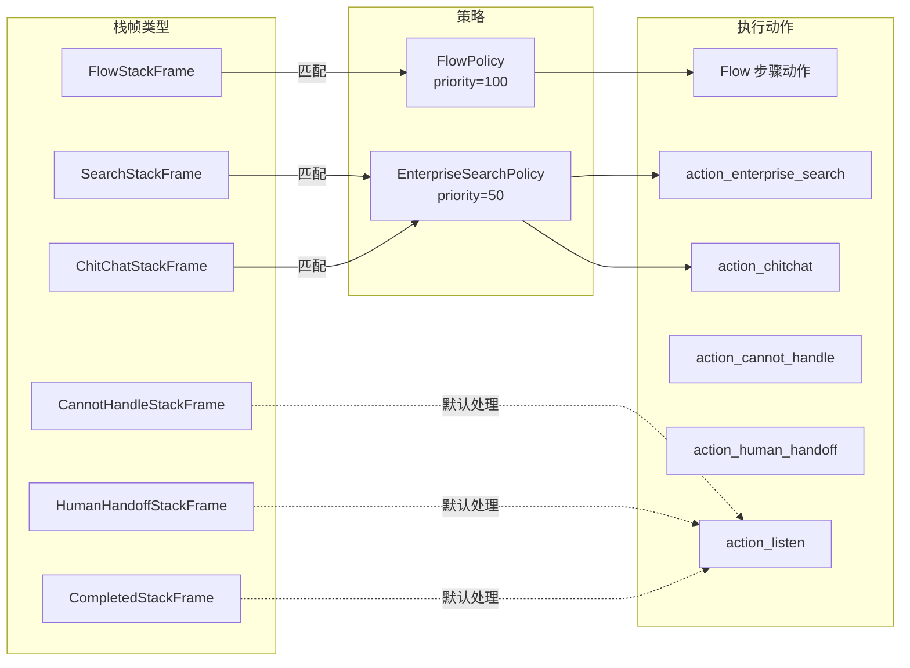
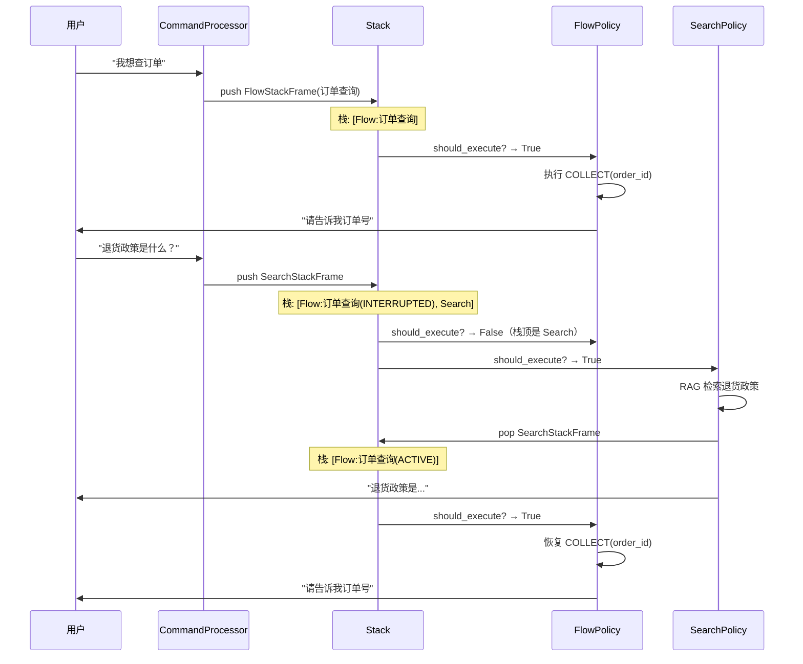

---
tags:
  - AI/对话系统
  - 策略系统
  - 状态机
created: 2026-06-29
---

# 策略系统

> [!abstract] 概要
> Policy 是连接"理解"和"执行"的桥梁，负责检测栈帧类型并决定执行什么动作。本项目采用策略集成（Policy Ensemble）模式，FlowPolicy（priority=100）和 EnterpriseSearchPolicy（priority=50）按优先级竞争，第一个匹配的策略胜出。

## 策略集成架构



### 竞争机制

```python
# Policy 按优先级降序排列
policies = sorted([flow_policy, search_policy], key=lambda p: -p.priority)
# [FlowPolicy(100), EnterpriseSearchPolicy(50)]

async def select_action(tracker):
    top_frame = tracker.dialogue_stack.top()

    for policy in policies:
        if policy.should_execute(tracker, top_frame):
            return await policy.predict(tracker)

    return "action_listen"  # 默认：等待用户输入
```

## FlowPolicy（priority=100）

### 职责

检测 FlowStackFrame，使用 FlowExecutor 执行 Flow 步骤，返回对应动作。

### 执行逻辑



### should_execute 方法

```python
class FlowPolicy(Policy):
    priority = 100

    def should_execute(self, tracker, top_frame) -> bool:
        """检测栈顶是否为 Flow 帧"""
        if top_frame is None:
            return False
        return isinstance(top_frame, FlowStackFrame)
```

### predict 方法

```python
async def predict(self, tracker) -> str:
    flow_frame = tracker.dialogue_stack.active_flow_frame()

    # 获取 Flow 定义
    flow = self.domain.flows.get_flow(flow_frame.flow_id)
    if flow is None:
        tracker.dialogue_stack.pop()
        return "action_listen"

    # 执行 Flow 步骤
    executor = FlowExecutor(flow, tracker, self.domain)
    result = executor.execute_step(flow_frame.step_id)

    if result.action:
        # 更新步骤位置
        flow_frame.step_id = result.next_step_id
        return result.action

    elif result.slot_to_collect:
        # 需要收集槽位，返回询问动作
        flow_frame.slot_to_collect = result.slot_to_collect
        return self._get_ask_action(flow_frame.slot_to_collect)

    elif result.flow_completed:
        # Flow 完成，弹出栈帧
        tracker.dialogue_stack.pop()
        tracker.add_to_flow_history(flow_frame.flow_id, "completed")
        return "action_listen"

    else:
        return "action_listen"
```

### COLLECT 步骤的询问动作降级

```python
def _get_ask_action(self, slot_name: str) -> str:
    """获取槽位询问动作，按优先级降级"""
    # 1. 显式指定的 action
    if slot_name in self.domain.collect_actions:
        return self.domain.collect_actions[slot_name]

    # 2. utter_ask_{slot_name}
    ask_utter = f"utter_ask_{slot_name}"
    if ask_utter in self.domain.responses:
        return ask_utter

    # 3. action_ask_{slot_name}
    ask_action = f"action_ask_{slot_name}"
    if ask_action in self.domain.actions:
        return ask_action

    # 4. 兜底
    raise ValueError(f"No ask action found for slot: {slot_name}")
```

## EnterpriseSearchPolicy（priority=50）

### 职责

检测 SearchStackFrame 和 ChitChatStackFrame，执行 RAG 检索或闲聊生成。

### 执行逻辑



### should_execute 方法

```python
class EnterpriseSearchPolicy(Policy):
    priority = 50

    def should_execute(self, tracker, top_frame) -> bool:
        """检测栈顶是否为搜索帧或闲聊帧"""
        if top_frame is None:
            return False
        return isinstance(top_frame, (SearchStackFrame, ChitChatStackFrame))
```

### predict 方法

```python
async def predict(self, tracker) -> str:
    top_frame = tracker.dialogue_stack.top()

    if isinstance(top_frame, SearchStackFrame):
        # 知识库检索
        return "action_enterprise_search"

    elif isinstance(top_frame, ChitChatStackFrame):
        # 闲聊生成
        return "action_chitchat"
```

### action_enterprise_search 实现

```python
@register_action("action_enterprise_search")
class EnterpriseSearchAction(Action):
    async def run(self, tracker, domain, **kwargs):
        # 1. 构建检索查询
        query = tracker.latest_message.text

        # 2. GraphRAG 检索
        results = await self.rag_engine.search(query, top_k=5)

        # 3. LLM 生成回答
        context = "\n".join([r.content for r in results])
        answer = await self.llm.generate_answer(query, context)

        # 4. 弹出 SearchStackFrame
        tracker.dialogue_stack.pop()

        return ActionResult(
            responses=[{"text": answer}],
            events=[]
        )
```

## 策略与栈帧的完整映射



## 多策略协作示例

用户在订单查询 Flow 中突然问退货政策：



## 自定义策略

```python
class CustomPolicy(Policy):
    priority = 75  # 在 FlowPolicy 和 SearchPolicy 之间

    def should_execute(self, tracker, top_frame) -> bool:
        # 自定义检测逻辑
        return (
            top_frame is not None
            and isinstance(top_frame, CustomStackFrame)
        )

    async def predict(self, tracker) -> str:
        # 自定义动作选择
        return "action_custom"
```

## 相关笔记

- [[03-对话栈与栈帧]] — 6 种栈帧类型
- [[04-Flow流程系统]] — FlowExecutor 的详细实现
- [[05-命令系统]] — Command 的栈帧化设计
- [[06-LangGraph图式编排]] — policy 节点如何调用策略
- [[10-检索增强RAG]] — GraphRAG 检索详解
- [[00-项目总览]] — 回到总览
