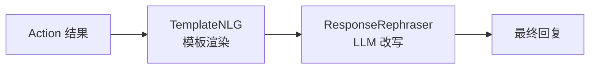
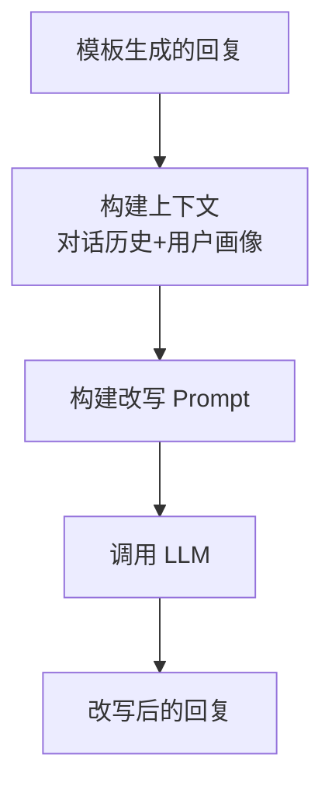
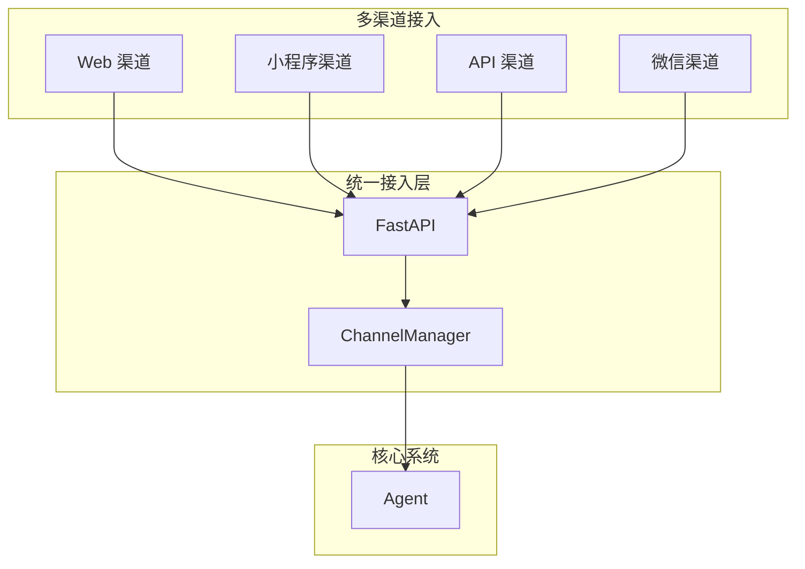

---
tags:
  - AI/对话系统
  - NLG
  - 多渠道
  - API
created: 2026-06-29
---

# NLG 与多渠道集成

> [!abstract] 概要
> NLG（自然语言生成）层将结构化的 Action 结果转换为自然语言回复，支持模板渲染和 LLM 改写两种模式。多渠道集成通过 FastAPI 提供 Web/小程序/API 等多渠道接入，统一消息格式和会话管理。

## NLG 架构



### 两层 NLG 设计

| 层次 | 职责 | 优点 | 缺点 |
|------|------|------|------|
| TemplateNLG | 模板渲染 + 变量替换 | 快速、可控、无幻觉 | 机械化、不够自然 |
| ResponseRephraser | LLM 改写模板回复 | 自然、上下文感知 | 有延迟和成本 |

## TemplateNLG

### 模板定义

在 domain.yml 中定义：

```yaml
responses:
  utter_greet:
    - text: "您好，有什么可以帮您？"

  utter_ask_order_id:
    - text: "请告诉我您的订单号"

  utter_order_status:
    - text: "您的订单{order_id}当前状态是：{order_status}"

  utter_logistics_info:
    - text: "您的订单已发货，物流公司：{logistics_company}，运单号：{tracking_number}"
```

### 模板渲染

```python
class TemplateNLG:
    def render(self, response: Dict, tracker: DialogueStateTracker) -> str:
        template_name = response.get("template")
        text = response.get("text", "")

        if template_name:
            # 从 Domain 获取模板
            templates = self.domain.get_response(template_name)
            if templates:
                text = templates[0]["text"]

        # 变量替换：{slot_name} → tracker.get_slot(slot_name)
        if text:
            slots = tracker.get_all_slots()
            for slot_name, slot_value in slots.items():
                text = text.replace(f"{{{slot_name}}}", str(slot_value))

        return text
```

### 动态模板选择

支持根据条件选择不同模板：

```yaml
responses:
  utter_order_result:
    - text: "您的订单{order_id}状态是：{order_status}"
      condition: "slots.order_status != 'cancelled'"
    - text: "您的订单{order_id}已取消"
      condition: "slots.order_status == 'cancelled'"
```

## ResponseRephraser

### LLM 改写流程



### 改写 Prompt

```python
class ResponseRephraser:
    def __init__(self, llm_provider, config):
        self.llm = llm_provider
        self.enabled = config.get("nlg_rephrase", False)
        self.style = config.get("nlg_style", "professional_friendly")

    async def rephrase(
        self,
        text: str,
        tracker: DialogueStateTracker
    ) -> str:
        if not self.enabled or not text:
            return text

        # 构建对话历史上下文
        history = tracker.get_messages_for_llm()[-6:]  # 最近3轮

        prompt = f"""你是一个智能客服助手。请将以下回复改写得更加自然、友好，同时保持原意。

风格要求：{self.style}
对话历史：{history}
原始回复：{text}

要求：
1. 保持核心信息不变
2. 语气友好专业
3. 适当使用口语化表达
4. 不超过100字

改写后的回复："""

        result = await self.llm.generate(prompt)
        return result.strip()
```

### 改写效果示例

| 原始模板回复 | 改写后回复 |
|-------------|-----------|
| "请告诉我您的订单号" | "好的，麻烦您提供一下订单号，我来帮您查询~" |
| "您的订单12345当前状态是：已发货" | "您的订单 12345 已经发货啦，正在路上哦~" |
| "退货政策是7天无理由退货" | "我们支持7天无理由退货的，如果您需要退货，我可以帮您处理~" |

## 多渠道集成

### 渠道抽象



### FastAPI 服务

```python
from fastapi import FastAPI, WebSocket
from pydantic import BaseModel

app = FastAPI(title="智能客服系统 API")

class MessageRequest(BaseModel):
    """统一消息请求格式"""
    sender_id: str           # 用户 ID
    message_text: str        # 消息内容
    channel: str = "web"     # 渠道
    metadata: Optional[Dict] = None  # 附加信息

class MessageResponse(BaseModel):
    """统一消息响应格式"""
    sender_id: str
    responses: List[Dict[str, Any]]
    session_id: str

@app.post("/chat", response_model=MessageResponse)
async def chat(request: MessageRequest):
    """HTTP 接口：发送消息，获取回复"""
    responses = await agent.handle_message(
        message_text=request.message_text,
        sender_id=request.sender_id,
        channel=request.channel,
        metadata=request.metadata
    )
    return MessageResponse(
        sender_id=request.sender_id,
        responses=responses,
        session_id=request.sender_id
    )
```

### WebSocket 实时通信

```python
@app.websocket("/ws/{sender_id}")
async def websocket_endpoint(websocket: WebSocket, sender_id: str):
    """WebSocket 接口：实时双向通信"""
    await websocket.accept()

    try:
        while True:
            # 接收消息
            data = await websocket.receive_json()
            message_text = data.get("message_text", "")

            # 处理消息
            responses = await agent.handle_message(
                message_text=message_text,
                sender_id=sender_id,
                channel="websocket"
            )

            # 逐条发送回复
            for response in responses:
                await websocket.send_json(response)

    except WebSocketDisconnect:
        await websocket.close()
```

### ChannelManager 渠道管理

```python
class ChannelManager:
    """渠道管理器：统一管理不同渠道的消息格式"""

    def format_response(
        self,
        response: Dict,
        channel: str
    ) -> Dict:
        """根据渠道格式化响应"""

        if channel == "web":
            return {
                "type": "text",
                "content": response["text"]
            }

        elif channel == "miniprogram":
            return {
                "msgtype": "text",
                "text": {"content": response["text"]}
            }

        elif channel == "wechat":
            return {
                "touser": response.get("sender_id"),
                "msgtype": "text",
                "text": {"content": response["text"]}
            }

        return response
```

## 会话管理

### 会话超时

```python
class SessionManager:
    """会话管理器"""

    SESSION_TIMEOUT = 1800  # 30分钟

    async def check_session(self, sender_id: str) -> bool:
        """检查会话是否有效"""
        last_active = await self.redis.get(f"session:{sender_id}:last_active")
        if last_active:
            elapsed = time.time() - float(last_active)
            if elapsed > self.SESSION_TIMEOUT:
                # 会话超时，清理 Tracker
                await self.tracker_store.delete(sender_id)
                return False
        return True

    async def update_activity(self, sender_id: str):
        """更新会话活动时间"""
        await self.redis.set(
            f"session:{sender_id}:last_active",
            str(time.time())
        )
```

### 多用户并发

```python
# FastAPI 自动支持异步并发
# 每个 sender_id 有独立的 Tracker
# Agent 是无状态的，可以安全地被多个请求共享

agent = Agent(...)  # 全局单例

@app.post("/chat")
async def chat(request: MessageRequest):
    # 每个 sender_id 独立处理
    responses = await agent.handle_message(
        message_text=request.message_text,
        sender_id=request.sender_id
    )
    return {"responses": responses}
```

## API 接口列表

| 方法 | 路径 | 说明 |
|------|------|------|
| POST | `/chat` | 发送消息，获取回复 |
| GET | `/health` | 健康检查 |
| GET | `/sessions/{sender_id}` | 获取会话状态 |
| DELETE | `/sessions/{sender_id}` | 清除会话 |
| WS | `/ws/{sender_id}` | WebSocket 实时通信 |

## 相关笔记

- [[06-LangGraph图式编排]] — response 节点调用 NLG
- [[07-Agent核心系统]] — Agent 的消息处理流程
- [[11-电商客服实战]] — 实际部署和渠道接入
- [[00-项目总览]] — 回到总览
