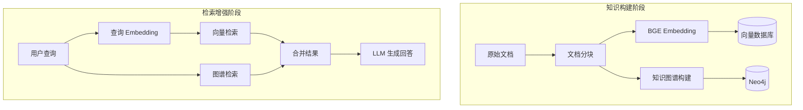
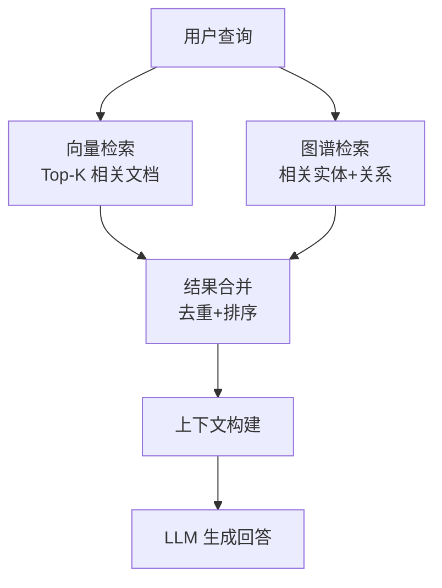

---
tags:
  - AI/RAG
  - 知识图谱
  - Neo4j
  - 向量检索
created: 2026-06-29
---

# 检索增强 RAG

> [!abstract] 概要
> 本项目采用 GraphRAG 架构，结合知识图谱（Neo4j）和向量检索（BGE embeddings），为客服系统提供政策问答和知识检索能力。支持标准 RAG、图谱增强 RAG 和混合检索三种模式。

## GraphRAG 架构



## 知识构建

### 文档分块

```python
class DocumentChunker:
    """文档分块器"""

    def chunk(self, document: str, chunk_size: int = 500) -> List[str]:
        """将文档分块"""
        # 按段落分块，保持语义完整性
        paragraphs = document.split("\n\n")
        chunks = []
        current_chunk = ""

        for para in paragraphs:
            if len(current_chunk) + len(para) <= chunk_size:
                current_chunk += "\n\n" + para
            else:
                if current_chunk:
                    chunks.append(current_chunk.strip())
                current_chunk = para

        if current_chunk:
            chunks.append(current_chunk.strip())

        return chunks
```

### BGE Embedding

```python
from FlagEmbedding import BGEM3FlagModel

class EmbeddingProvider:
    """BGE 向量化"""

    def __init__(self, model_name="BAAI/bge-m3"):
        self.model = BGEM3FlagModel(model_name, use_fp16=True)

    def embed(self, text: str) -> np.ndarray:
        """生成文本向量"""
        embeddings = self.model.encode(
            [text],
            batch_size=12,
            max_length=8192,
            return_dense=True
        )
        return embeddings["dense_vecs"][0]

    def embed_batch(self, texts: List[str]) -> np.ndarray:
        """批量生成向量"""
        embeddings = self.model.encode(
            texts,
            batch_size=12,
            max_length=8192,
            return_dense=True
        )
        return embeddings["dense_vecs"]
```

### 知识图谱构建

```python
class KnowledgeGraphBuilder:
    """知识图谱构建器"""

    def __init__(self, neo4j_driver):
        self.driver = neo4j_driver

    async def build_from_document(self, doc: str, doc_id: str):
        """从文档构建知识图谱节点和关系"""

        # 1. LLM 提取实体和关系
        entities, relations = await self.llm_extract(doc)

        # 2. 写入 Neo4j
        async with self.driver.session() as session:
            # 创建实体节点
            for entity in entities:
                await session.run(
                    "MERGE (n:Entity {name: $name, type: $type, doc_id: $doc_id})",
                    name=entity["name"],
                    type=entity["type"],
                    doc_id=doc_id
                )

            # 创建关系
            for relation in relations:
                await session.run("""
                    MATCH (a:Entity {name: $source})
                    MATCH (b:Entity {name: $target})
                    MERGE (a)-[r:RELATION {type: $rel_type}]->(b)
                """, source=relation["source"], target=relation["target"],
                    rel_type=relation["type"])
```

## 检索策略

### 1. 标准向量检索

```python
class VectorRetriever:
    """向量检索器"""

    async def search(self, query: str, top_k: int = 5) -> List[Document]:
        """向量相似度检索"""
        # 生成查询向量
        query_vec = self.embedding_provider.embed(query)

        # 向量数据库检索
        results = await self.vector_store.search(
            query_vector=query_vec,
            top_k=top_k
        )

        return results
```

### 2. 图谱增强检索

```python
class GraphRetriever:
    """知识图谱检索器"""

    async def search(self, query: str, depth: int = 2) -> List[Dict]:
        """图谱检索：找到相关实体及其邻居"""

        # 1. LLM 提取查询中的实体
        entities = await self.llm_extract_entities(query)

        # 2. 在图谱中查找相关节点和关系
        async with self.driver.session() as session:
            results = await session.run("""
                MATCH (n:Entity)
                WHERE n.name IN $entities
                CALL {
                    WITH n
                    MATCH (n)-[r*1..2]-(m:Entity)
                    RETURN n, r, m
                }
                RETURN n.name AS source, type(r[0]) AS relation,
                       m.name AS target, m.doc_id AS doc_id
            """, entities=entities)

            return [record.data() for record in results]
```

### 3. 混合检索



```python
class HybridRetriever:
    """混合检索器：向量 + 图谱"""

    def __init__(self, vector_retriever, graph_retriever):
        self.vector_retriever = vector_retriever
        self.graph_retriever = graph_retriever

    async def search(self, query: str, top_k: int = 5) -> RetrievalResult:
        # 1. 向量检索
        vector_results = await self.vector_retriever.search(query, top_k)

        # 2. 图谱检索
        graph_results = await self.graph_retriever.search(query)

        # 3. 合并去重
        merged = self._merge_results(vector_results, graph_results)

        # 4. 重排序
        reranked = self._rerank(merged, query)

        return RetrievalResult(
            documents=reranked[:top_k],
            graph_context=graph_results
        )
```

## LLM 生成回答

```python
class RAGAnswerGenerator:
    """RAG 回答生成器"""

    async def generate(
        self,
        query: str,
        retrieval_result: RetrievalResult,
        conversation_history: List[Dict] = None
    ) -> str:
        """基于检索结果生成回答"""

        # 构建上下文
        context_parts = []

        # 添加文档上下文
        for doc in retrieval_result.documents:
            context_parts.append(f"【文档】{doc.content}")

        # 添加图谱上下文
        if retrieval_result.graph_context:
            for item in retrieval_result.graph_context:
                context_parts.append(
                    f"【知识】{item['source']} -{item['relation']}-> {item['target']}"
                )

        context = "\n\n".join(context_parts)

        # 构建 Prompt
        prompt = f"""你是一个电商客服助手。根据以下知识库信息回答用户问题。

知识库信息：
{context}

对话历史：
{conversation_history or '无'}

用户问题：{query}

要求：
1. 基于知识库信息回答，不要编造
2. 如果知识库中没有相关信息，如实告知
3. 回答简洁明了

回答："""

        return await self.llm.generate(prompt)
```

## 与对话系统集成

### EnterpriseSearchPolicy 中的 RAG

```python
@register_action("action_enterprise_search")
class EnterpriseSearchAction(Action):
    async def run(self, tracker, domain, **kwargs):
        query = tracker.latest_message.text

        # 1. 混合检索
        retrieval_result = await self.hybrid_retriever.search(query)

        # 2. 生成回答
        answer = await self.rag_generator.generate(
            query=query,
            retrieval_result=retrieval_result,
            conversation_history=tracker.get_messages_for_llm()
        )

        # 3. 弹出 SearchStackFrame
        tracker.dialogue_stack.pop()

        return ActionResult(
            responses=[{"text": answer}],
            events=[]
        )
```

## Neo4j 图谱设计

### 节点类型

| 标签 | 属性 | 说明 |
|------|------|------|
| `Entity` | name, type, doc_id | 知识实体 |
| `Document` | id, content, source | 原始文档 |
| `Category` | name | 实体分类 |

### 关系类型

| 关系 | 说明 | 示例 |
|------|------|------|
| `RELATION` | 实体间关系 | 退货→7天 |
| `BELONGS_TO` | 归属关系 | 实体→分类 |
| `FROM_DOC` | 来源文档 | 实体→文档 |

### Cypher 查询示例

```cypher
// 查询退货政策相关知识
MATCH (n:Entity)-[r:RELATION]-(m:Entity)
WHERE n.name CONTAINS '退货'
RETURN n.name, type(r), m.name

// 查询某文档的所有实体
MATCH (e:Entity)-[:FROM_DOC]->(d:Document)
WHERE d.id = 'return_policy_v2'
RETURN e.name, e.type
```

## 性能优化

| 优化点 | 方法 | 效果 |
|--------|------|------|
| 向量检索 | FAISS 索引 | 毫秒级检索 |
| 图谱检索 | 限制遍历深度 | 避免全图扫描 |
| 缓存 | 查询结果缓存 | 减少重复计算 |
| 批量 Embedding | 批量编码 | 提高吞吐量 |

## 相关笔记

- [[08-策略系统]] — EnterpriseSearchPolicy 如何调用 RAG
- [[05-命令系统]] — KnowledgeAnswerCommand 压入 SearchStackFrame
- [[03-对话栈与栈帧]] — SearchStackFrame 的生命周期
- [[00-项目总览]] — 回到总览
