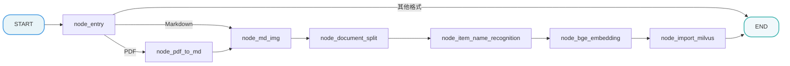

# 掌柜智库项目(RAG)实战

## 4. 导入数据图与状态定义

### 4.1 定义状态 (State)

所有节点共享同一个状态对象。我们需要定义它来存储处理过程中的数据（如 PDF 路径、MD 内容、切片列表、向量等）。


**文件**: `app/import_process/agent/state.py`

```python
from typing import TypedDict
import copy
from app.core.logger import logger

class ImportGraphState(TypedDict):
    """
    图的状态定义，包含所有节点产生和消费的数据字段。
    TypedDict 让我们在代码中能有自动补全和类型检查。
    使用字典式访问（如state["session_id"]、state.get("embedding_chunks")）
    """
    task_id: str          # 任务唯一ID，用于追踪日志

    # --- 流程控制标记 ---
    is_md_read_enabled: bool   # 是否启用 Markdown 读取路径
    is_pdf_read_enabled: bool  # 是否启用 PDF 读取路径


    # --- 切块相关 ---
    is_normal_split_enabled: bool
    is_silicon_flow_api_enabled: bool
    is_advanced_split_enabled: bool
    is_vllm_enabled: bool

    # --- 路径相关 ---
    local_dir: str        # 当前工作目录或输出目录
    local_file_path: str  # 原始输入文件路径
    file_title: str       # 文件标题（文件名去后缀）
    pdf_path: str         # PDF 文件路径 (如果输入是PDF)
    md_path: str          # Markdown 文件路径 (转换后或直接输入的)
    split_path: str       # 分块后的文件路径
    embeddings_path: str  # 向量数据库文件路径

    # --- 内容数据 ---
    md_content: str       # Markdown 的全文内容
    chunks: list          # 切片后的文本列表，包含 metadata
    item_name: str        # 识别出的主体名称 (如: "万用表")，用于增强检索

    # --- 数据库相关 ---
    embeddings_content: list # 包含向量数据的列表，准备写入 Milvus


# 建议定一个初始化对象，方便后续使用
# 定义图状态的默认初始值
graph_default_state: ImportGraphState = {
    "task_id":"",
    "is_pdf_read_enabled": False,
    "is_md_read_enabled": False,
    "is_normal_split_enabled": True,
    "is_silicon_flow_api_enabled": True,
    "is_advanced_split_enabled": False,
    "is_vllm_enabled": False,
    "local_dir": "",
    "local_file_path": "",
    "pdf_path": "",
    "md_path": "",
    "file_title": "",
    "split_path": "",
    "embeddings_path": "",
    "md_content": "",
    "chunks": [],
    "item_name": "",
    "embeddings_content": []
}

def create_default_state(**overrides) -> ImportGraphState:
    """
    创建默认状态，支持覆盖

    Args:
        **overrides: 要覆盖的字段（关键字参数解包）

    Returns:
        新的状态实例

    Examples:
        state = create_default_state(task_id="task_001", local_file_path="doc.pdf")
    """

    # 默认状态
    state = copy.deepcopy(graph_default_state)
    # 用 overrides 覆盖默认值
    state.update(overrides)
    # 返回创建好的状态字典实例
    return state

def get_default_state() -> ImportGraphState:
    """
    返回一个新的状态实例，避免全局变量污染
    """
    return copy.deepcopy(graph_default_state)


if __name__ == "__main__":
    """
    测试
    """
    # 创建默认状态
    state = create_default_state(local_file_path="万用表RS-12的使用.pdf")
    logger.info(state)
```

### 4.2 定义主图 

为了确保整体流程设计的科学性与执行连贯性，我们采用 **"Top-Down"（自顶向下）** 的开发模式，以 “总指挥部” 的全局视角统筹推进，具体实施步骤如下：

1. **搭建节点骨架（Stubs）**：优先定义全流程所需的所有功能节点，仅保留核心日志打印能力（如节点进入 / 退出日志），暂不实现内部复杂业务逻辑，快速搭建起流程的 “骨架结构”；
2. **串联主图（Graph）**：基于预设的业务流转规则，编写主图逻辑将所有节点骨架按序串联，明确节点间的输入输出关系、分支判断条件（如文件格式分流逻辑），形成完整的流程链路；
3. **验证流程通畅性**：启动端到端测试，验证节点间的调用链路是否通顺、数据流转是否符合预期、分支跳转是否准确，确保流程无阻塞、无逻辑漏洞；
4. **填充节点核心逻辑**：在流程链路验证通过后，再逐一聚焦每个节点的内部实现，完成复杂业务逻辑的开发（如 PDF 结构化转换、向量编码、重排序算法等），实现 “骨架” 到 “完整系统” 的落地。

该模式的核心优势在于：先保障 “流程走得通”，再聚焦 “功能做得好”，避免因局部逻辑复杂导致整体流程设计偏差，大幅提升开发效率与流程稳定性。

#### 4.2.1 第一步：创建节点骨架

我们需要先创建以下 8 个文件，每个文件里只写一个最简单的“空函数”，确保主图能导入它们。
**请在 `app/import_process/agent/nodes` 目录下创建以下文件，并将对应代码复制进去。**

**(1) 入口节点: `node_entry.py`**

```python
import sys

from app.core.logger import logger
from app.import_process.agent.state import ImportGraphState


def node_entry(state: ImportGraphState) -> ImportGraphState:
    """
    节点: 入口节点 (node_entry)
    为什么叫这个名字: 作为图的 Entry Point，负责接收外部输入并决定流程走向。
    未来要实现:
    1. 接收文件路径。
    2. 判断文件类型 (PDF/MD)。
    3. 设置 state 中的路由标记 (is_pdf_read_enabled / is_md_read_enabled)。
    """
    logger.info(f">>> [Stub] 执行节点: {sys._getframe().f_code.co_name}")

    # 模拟简单的路由逻辑，防止报错 (仅 node_entry 需要)
    if "local_file_path" in state:
        path = state["local_file_path"]
        if path.endswith(".pdf"):
            state["is_pdf_read_enabled"] = True
        elif path.endswith(".md"):
            state["is_md_read_enabled"] = True

    return state
```

**(2) PDF转换节点: `node_pdf_to_md.py`**

```python
import sys

from app.core.logger import logger
from app.import_process.agent.state import ImportGraphState


def node_pdf_to_md(state: ImportGraphState) -> ImportGraphState:
    """
    节点: PDF转Markdown (node_pdf_to_md)
    为什么叫这个名字: 核心任务是将 PDF 非结构化数据转换为 Markdown 结构化数据。
    未来要实现:
    1. 调用 MinerU (magic-pdf) 工具。
    2. 将 PDF 转换成 Markdown 格式。
    3. 将结果保存到 state["md_content"]。
    """
    logger.info(f">>> [Stub] 执行节点: {sys._getframe().f_code.co_name}")
    return state
```

**(3) 图片处理节点: `node_md_img.py`**

```python
import sys

from app.core.logger import logger
from app.import_process.agent.state import ImportGraphState

def node_md_img(state: ImportGraphState) -> ImportGraphState:
    """
    节点: 图片处理 (node_md_img)
    为什么叫这个名字: 处理 Markdown 中的图片资源 (Image)。
    未来要实现:
    1. 扫描 Markdown 中的图片链接。
    2. 将图片上传到 MinIO 对象存储。
    3. (可选) 调用多模态模型生成图片描述。
    4. 替换 Markdown 中的图片链接为 MinIO URL。
    """
    logger.info(f">>> [Stub] 执行节点: {sys._getframe().f_code.co_name}")
    return state
```

**(4) 文档切分节点: `node_document_split.py`**

```python
import sys

from app.core.logger import logger
from app.import_process.agent.state import ImportGraphState

def node_document_split(state: ImportGraphState) -> ImportGraphState:
    """
    节点: 文档切分 (node_document_split)
    为什么叫这个名字: 将长文档切分成小的 Chunks (切片) 以便检索。
    未来要实现:
    1. 基于 Markdown 标题层级进行递归切分。
    2. 对过长的段落进行二次切分。
    3. 生成包含 Metadata (标题路径) 的 Chunk 列表。
    """
    logger.info(f">>> [Stub] 执行节点: {sys._getframe().f_code.co_name}")
    return state
```

**(5) 主体识别节点: `node_item_name_recognition.py`**

```python
import sys

from app.core.logger import logger
from app.import_process.agent.state import ImportGraphState

def node_item_name_recognition(state: ImportGraphState) -> ImportGraphState:
    """
    节点: 主体识别 (node_item_name_recognition)
    为什么叫这个名字: 识别文档核心描述的物品/商品名称 (Item Name)。
    未来要实现:
    1. 取文档前几段内容。
    2. 调用 LLM 识别这篇文档讲的是什么东西 (如: "Fluke 17B+ 万用表")。
    3. 存入 state["item_name"] 用于后续数据幂等性清理。
    """
    logger.info(f">>> [Stub] 执行节点: {sys._getframe().f_code.co_name}")
    return state
```

**(6) 向量化节点: `node_bge_embedding.py`**

```python
import sys

from app.core.logger import logger
from app.import_process.agent.state import ImportGraphState

def node_bge_embedding(state: ImportGraphState) -> ImportGraphState:
    """
    节点: 向量化 (node_bge_embedding)
    为什么叫这个名字: 使用 BGE-M3 模型将文本转换为向量 (Embedding)。
    未来要实现:
    1. 加载 BGE-M3 模型。
    2. 对每个 Chunk 的文本进行 Dense (稠密) 和 Sparse (稀疏) 向量化。
    3. 准备好写入 Milvus 的数据格式。
    """
    logger.info(f">>> [Stub] 执行节点: {sys._getframe().f_code.co_name}")
    return state
```

**(7) 写入Milvus节点: `node_import_milvus.py`**

```python
import sys

from app.core.logger import logger
from app.import_process.agent.state import ImportGraphState

def node_import_milvus(state: ImportGraphState) -> ImportGraphState:
    """
    节点: 导入向量库 (node_import_milvus)
    为什么叫这个名字: 将处理好的向量数据写入 Milvus 数据库。
    未来要实现:
    1. 连接 Milvus。
    2. 根据 item_name 删除旧数据 (幂等性)。
    3. 批量插入新的向量数据。
    """
    logger.info(f">>> [Stub] 执行节点: {sys._getframe().f_code.co_name}")
    return state
```


#### 4.2.2 第二步：编写主图代码

节点思路总结：




**文件**: `app/import_process/agent/main_graph.py`

```python
# 加载环境变量：从 .env 文件读取配置（如Milvus地址、KG服务地址、BGE模型路径等）
from dotenv import load_dotenv
# 导入LangGraph核心依赖：StateGraph(状态图)、START/END(内置起始/结束节点常量)
from langgraph.graph import StateGraph, END, START

from app.core.logger import logger
# 导入自定义状态类：统一管理工作流全程的所有数据（各节点共享/修改）
from app.import_process.agent.state import ImportGraphState, create_default_state
# 导入所有自定义业务节点：每个节点对应知识库导入的一个具体步骤
from app.import_process.agent.nodes.node_entry import node_entry  # 入口节点：初始化参数、校验输入
from app.import_process.agent.nodes.node_pdf_to_md import node_pdf_to_md  # PDF转MD：解析PDF文件为markdown格式
from app.import_process.agent.nodes.node_md_img import node_md_img  # MD图片处理：提取/下载markdown中的图片、修复图片路径
from app.import_process.agent.nodes.node_document_split import node_document_split  # 文档分块：将长文档切分为符合模型要求的小片段
from app.import_process.agent.nodes.node_item_name_recognition import node_item_name_recognition  # 项目名识别：从分块中提取核心项目名称（业务定制化）
from app.import_process.agent.nodes.node_bge_embedding import node_bge_embedding  # BGE向量化：将文本分块转换为向量表示（适配Milvus向量库）
from app.import_process.agent.nodes.node_import_milvus import node_import_milvus  # 导入Milvus：将向量数据写入Milvus向量数据库


# 初始化环境变量：必须在配置读取前执行，确保后续节点能获取到环境变量中的配置信息
load_dotenv()

# ===================== 1. 初始化LangGraph状态图 =====================
# 核心：StateGraph是LangGraph的核心类，用于构建有状态的工作流
# 参数ImportGraphState：自定义TypedDict类型，定义了工作流的**全量状态字段**
# 作用：所有节点的入参都是该状态对象，节点返回的键值对会自动合并回状态，实现节点间数据共享
workflow = StateGraph(ImportGraphState)

# ===================== 2. 注册所有业务节点 =====================
# 语法：add_node("节点唯一标识", 节点函数)
# 要求：节点函数必须接收「状态对象」作为入参，返回字典（用于更新状态）
# 所有节点按「知识库导入流程」先后顺序注册，节点标识与函数名保持一致，便于维护
workflow.add_node("node_entry", node_entry)  # 流程入口：参数初始化、输入校验
workflow.add_node("node_pdf_to_md", node_pdf_to_md)  # PDF转MD：非MD格式文件的前置处理
workflow.add_node("node_md_img", node_md_img)  # MD图片处理：保证文档中图片的可访问性
workflow.add_node("node_document_split", node_document_split)  # 文档分块：解决大文本无法向量化/推理的问题
workflow.add_node("node_item_name_recognition", node_item_name_recognition)  # 项目名识别：业务定制化步骤，提取核心业务标识
workflow.add_node("node_bge_embedding", node_bge_embedding)  # BGE向量化：文本→向量，为Milvus存储做准备
workflow.add_node("node_import_milvus", node_import_milvus)  # 向量入库：将向量数据持久化到Milvus

# ===================== 3. 设置工作流入口节点 =====================
# 语法：set_entry_point("节点标识") → 推荐写法，直接指定流程起始节点
# 等效写法：workflow.add_edge(START, "node_entry")（START是LangGraph内置起始常量）
# 作用：指定工作流执行的第一个节点，替代手动添加START到目标节点的边，代码更简洁
workflow.set_entry_point("node_entry")

# ===================== 4. 定义条件路由函数（入口节点后的分支逻辑） =====================
# 核心：根据状态中的配置项，动态决定后续执行路径，实现「PDF导入」/「MD直接导入」分支
# 要求：接收状态对象为入参，返回「目标节点标识」或END（内置结束常量）
def route_after_entry(state: ImportGraphState) -> str:
    """
    入口节点后的条件路由逻辑
    :param state: 工作流全量状态对象，包含所有配置项和中间结果
    :return: 目标节点标识/END，LangGraph会自动跳转到对应节点
    """
    # 分支1：开启MD直接导入 → 跳过PDF转MD，直接执行MD图片处理
    if state.get("is_md_read_enabled"):
        return "node_md_img"
    # 分支2：开启PDF导入 → 执行PDF转MD，再走后续流程
    elif state.get("is_pdf_read_enabled"):
        return "node_pdf_to_md"
    # 分支3：未开启任何导入配置 → 直接终止工作流（END是LangGraph内置结束常量）
    else:
        return END

# 注册条件边：将入口节点与路由函数绑定
# 语法：add_conditional_edges("源节点标识", 路由函数)
# 作用：源节点执行完成后，调用路由函数，根据返回值动态跳转到目标节点
workflow.add_conditional_edges(
    "node_entry",
    route_after_entry,
    {
        "node_md_img": "node_md_img",
        "node_pdf_to_md": "node_pdf_to_md",
        END: END
    }
)

# ===================== 5. 注册静态顺序边（分支合并后的统一流程） =====================
# 核心：所有分支最终合并为「固定顺序执行流程」，从MD图片处理到知识图谱入库，一步到底
# 语法：add_edge("源节点标识", "目标节点标识/END") → 静态边，固定路由关系，无分支逻辑
workflow.add_edge("node_pdf_to_md", "node_md_img")  # PDF转MD完成 → MD图片处理
workflow.add_edge("node_md_img", "node_document_split")  # MD处理完成 → 文档分块
workflow.add_edge("node_document_split", "node_item_name_recognition")  # 分块完成 → 项目名识别
workflow.add_edge("node_item_name_recognition", "node_bge_embedding")  # 项目名识别完成 → BGE向量化
workflow.add_edge("node_bge_embedding", "node_import_milvus")  # 向量化完成 → 导入Milvus向量库
workflow.add_edge("node_import_milvus", END)  # Milvus入库完成 → 工作流执行结束（END是内置结束节点）

# ===================== 6. 编译工作流为可执行对象 =====================
# 语法：compile() → 将StateGraph构建的流程编译为LangGraph的可执行应用
# 作用：生成可调用的kb_import_app，通过invoke()方法触发工作流执行
# 特性：编译后可重复调用，支持传入不同的初始状态，实现多任务执行
kb_import_app = workflow.compile()
```

#### 4.2.3 第三步：验证图流程

在实现具体业务逻辑前，我们先跑一个测试脚本，看看图能不能跑通，路线对不对。

**创建测试文件**: `test/04-test_graph_flow.py` 

```python
import json

from app.import_process.agent.main_graph import kb_import_app
from app.import_process.agent.state import create_default_state
import sys
from app.core.logger import logger

logger.info("===== 开始测试 =====")

initial_state = create_default_state(local_file_path="万用表RS-12的使用.pdf")
final_state = None

# 只输出更最终的状态值（字典形式），不包含节点名称、执行日志、元数据等额外信息
for event in kb_import_app.stream(initial_state):
    for key, value in event.items():
        logger.info(f"节点: {key}")
        final_state = value

# 格式化输出最终状态
logger.info(f"最终状态: {json.dumps(final_state, indent=4, ensure_ascii=False)}")

logger.info("图结构:")
# uv add grandalf
kb_import_app.get_graph().print_ascii()

logger.info("===== 测试结束 =====")

```

**预期效果**:
你应该能看到控制台依次打印出每个节点的 `>>> [Stub] 执行节点: ...` 日志。

*   PDF 流程应包含：`node_entry` -> `node_pdf_to_md` -> `node_md_img` -> ... -> `node_import_milvus`
*   Markdown 流程应包含：`node_entry` -> `node_md_img` -> ... -> `node_import_milvus` **(跳过了 node_pdf_to_md)**
*   其他格式的文档只包含：`node_entry`**（直接结束）**

**如果能看到这些日志，说明我们的图结构搭建成功！接下来就可以放心地去填充每个节点的具体代码了。**

