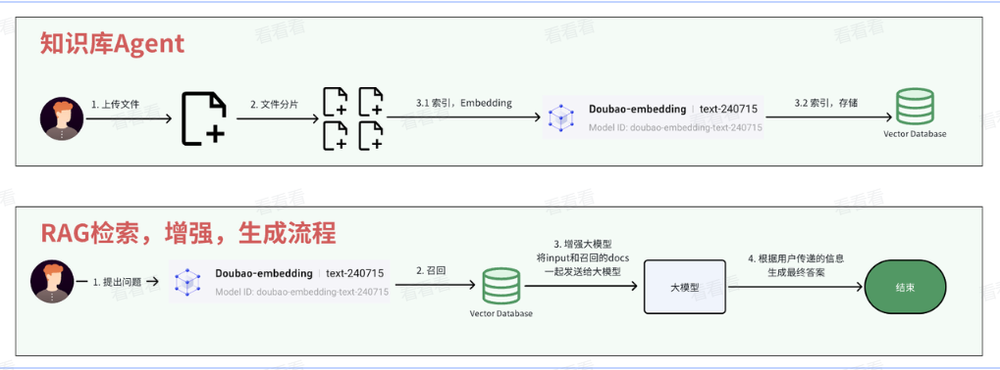

# 架构设计：RAG全流程解析

# 使用场景

**知识库Agent本质是就是RAG的过程 **。RAG（检索增强生成）是构建 **智能客服、企业知识库、产品问答助手 **的核心技术。当你需要让AI回答特定领域问题（如公司产品手册、内部文档）时，直接将长文本发送给模型，会受限于模型的上下文窗口大小，导致 **成本高、速度慢、准确率低 **。RAG通过 **先检索相关内容再生成答案 **的方式，完美解决了这些问题，广泛应用于企业知识管理、智能客服等场景 。 **在对话Agent和运维Agent里，都会使用到RAG。**

# 核心流程

RAG的整体流程分为两部分：​

- **提问前（数据准备） **：分片 \-\> embedding \-\> 存储

- **提问后（回答生成） **：召回 \-\> 重排 \-\> 生成

## 提问前链路（数据准备）

1. **分片 **：将原始文档（如业务告警处理手册）切割为多个语义完整的片段。

1. **索引 **：
  - 用Embedding模型将每个片段转为向量。

  - 将片段文本和向量存入向量数据库。

1. 完成后，知识库即构建完毕，等待用户提问。

### 分片：把文档拆成片段

分片是将完整文档切割为多个片段的过程，目的是让后续检索更精准。常见方式包括：​

- 按字数（如1000字/段）、按段落、按章节或页码拆分

- 核心原则： 确保每个片段语义完整，避免信息割裂

例如，一本1000页的产品手册可能被拆分为500个独立片段，每个片段聚焦一个具体功能或问题。

### 索引：将片段编成向量

索引是将分片后的文本转换为 向量 并存储的过程，分为两步：​

1. **Embedding（向量化） **：用专门的Embedding模型将文本片段转化为向量。 **核心：语义相近的文本，向量距离更近。**

1. **存储到向量数据库 **：将文本片段及其对应向量存入向量数据库（如Milvus），方便后续快速查询。

**向量数据库不仅存储向量，还保留原始文本，因为最终生成答案需要的是文本内容，向量只是用于相似度计算。**

向量是数学中的基础概念，代表 **有大小、有方向的量 **，用数组表示（比如 \[1, 2, 3\] 是三维向量），维度\=数组长度。低维向量（1\-3维）可画在坐标轴上，高维向量（几百/几千维）虽无法可视化，但高维向量包含的信息更丰富，能更细腻地表达文本特征。 通过Embedding模型将文本片段转化为向量后，就能用数学方法计算语义相似度。比如 小林写python 和 小林写golang 的向量会非常接近。

Embedding 简单说就是把文字转成向量的过程，意思相近的句子向量也相近 。 比如 小林写python 和 小林写golang 这两句话意思相近，经过 Embedding 后会变成两个非常相似的向量（比如 \[0\.8, 0\.2, \-0\.5\] 和 \[0\.78, 0\.22, \-0\.48\] ），而 牛牛玛特 的向量则会和它们相差很远。大模型本身看不懂文字，只能处理数字。通过 Embedding，文字的语义被转化成向量后，计算机就能通过计算向量之间的相似度来判断两句话是否相关。

向量数据库核心作用：​

1. **存储向量与文本 **：每个文档片段经过 Embedding 模型转换成向量后，会和原始文本一起存在向量数据库里（比如 小林coding 这句话，会存成 \[content: "小林coding", vector: \[0\.12, 0\.34, \.\.\.\]\]）

1. **相似性查询： **当用户提问时，问题会先转成向量，向量数据库通过计算向量相似度，快速从海量片段中找出最相关的结果（比如从 小林写python 能关联到 小林写golang ）

## 提问后链路（回答生成）

1. **召回 **：用户问题\-\>Embedding模型\-\>向量\-\>向量数据库\-\>Top 10相关片段。

1. **重排 **：Top 10片段\-\>Cross Encoder模型\-\>Top 3最相关片段。

1. **生成 **：Top 3片段\+用户问题\-\>大模型\-\>最终答案。

### 召回：快速捞出相关片段

当用户提问后，第一步是从向量数据库中召回相关片段：​

1. 将用户问题通过Embedding模型转化为向量。

1. 用 **向量相似度算法 **计算 **问题向量 **与数据库中所有 **片段向量 **的 **相似度 **，挑出Top N（如10个）最相关的片段。

1. 特点：速度快、成本低，但准确率有限，适合初步筛选（类比 从1000份简历中挑出10份合格的 ）。

**向量相似度算法：**

余弦相似度

- 原理：计算两个向量夹角的余弦值，范围在\-1到1之间。夹角越小，余弦值越接近1，相似度越高。

- 特点：只关注方向，不考虑向量长度，适合文本语义匹配。

- 欧式距离

- 原理：计算两个向量在空间中的直线距离，距离越小相似度越高。

- 特点：受向量长度影响较大，适合需要考虑数值大小的场景。

### 重排：给片段排优先级

召回的10个片段可能仍有冗余或相关性不足，需要进一步精筛：​

1. 使用专门计算文本对相似度的模型，逐对计算用户问题与每个召回片段的语义相关性。

1. 从10个片段中选出Top K（如3个）最相关的片段。

**为什么不直接召回3个？ **召回用向量相似度（快但准度低），重排用Cross Encoder模型（慢但准度高），二者结合实现 **先广撒网再精挑细选 **，效果优于一步到位。

### 生成：让AI 写出答案

将重排后的3个相关片段与用户问题一起投喂给大模型，模型基于这些片段生成准确、简洁的回答。

优势：避免模型幻觉 ， **答案严格基于检索到的事实性内容 **，且输入内容少（仅3个片段），成本和速度都更优。

# 总结

RAG通过 **分片\-索引\-召回\-重排\-生成 **的链路，解决了长文本问答的痛点，让AI既能懂知识又能说人话 。无论是企业知识库还是智能客服，掌握RAG技术就能搭建高效、可靠的问答系统
