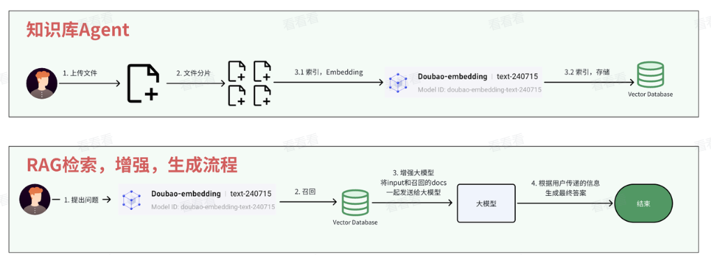
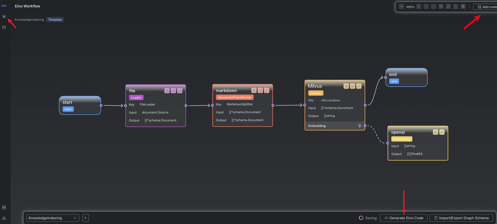
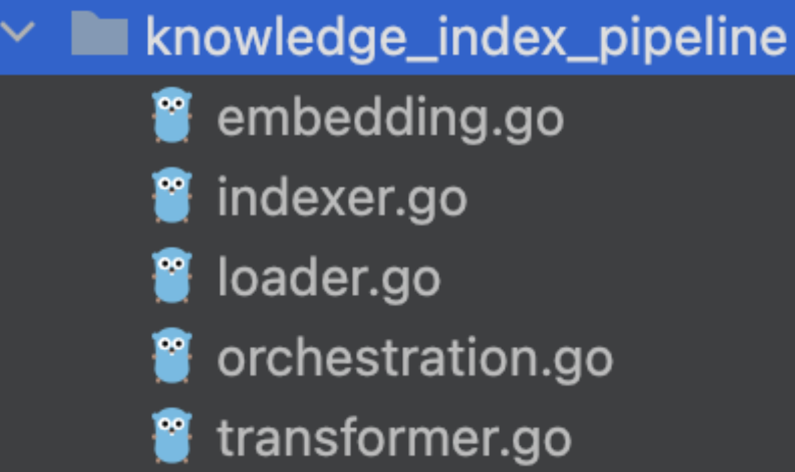
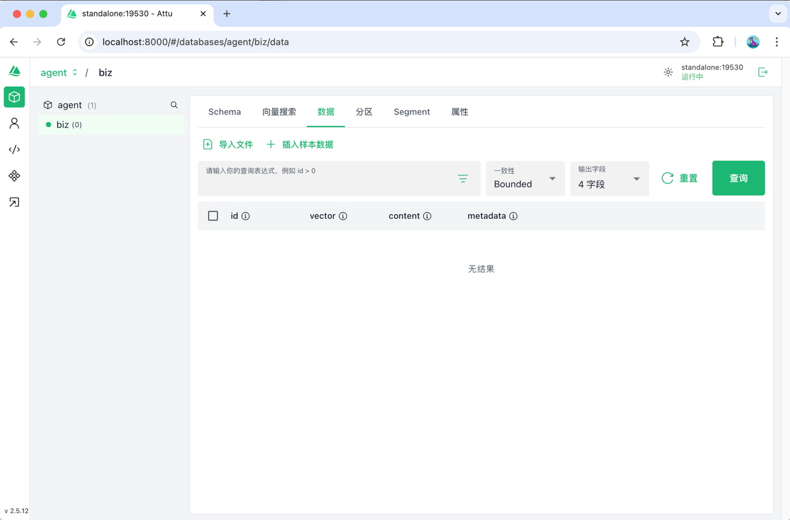
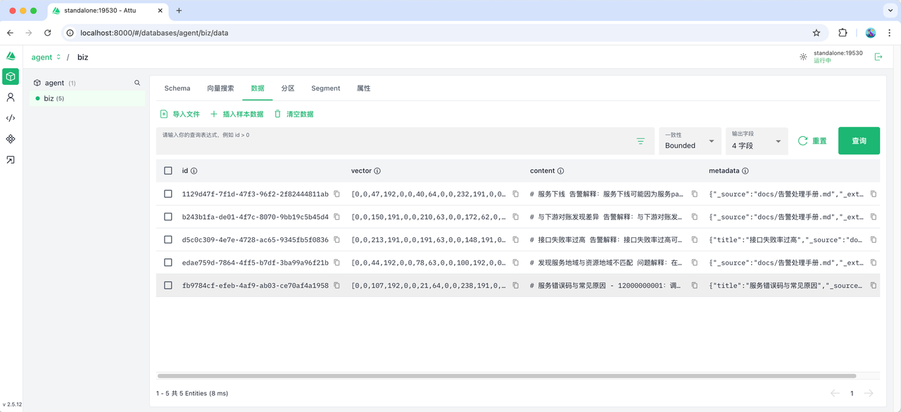

# 实战演练：RAG代码实战1\(Go\)

**注意，运行程序之前请先看：**

- 【飞书文档】环境准备教程
  - 左上角 搜索 \`环境准备教程\`

- 【飞书文档】运行项目教程
  - 左上角 搜索 \`运行项目教程\`

# 前言

# 前言

本节我们来实现知识库Agent的上半部分，即将文件向量化后存储到数据库中。

这部分代码在：SuperBizAgent/internal/ai/agent/knowledge\_index\_pipeline

运行的代码在：SuperBizAgent/internal/ai/cmd/knowledge\_cmd/main\.go



# 流程梳理

我们的目标是将文件向量化后存储到数据库中，这里面具体步骤：​

1. 读取文件

1. 切分文件

1. 索引（Embedding和存储）​

既然有3个步骤，我们可以使用eino的可视化编排插件，来进行流程的编排：​

1. 首先在Goland里面安装eino\-dev的插件。

1. 打开插件，点击右上角的add node，按照下图进行编排。\(或者使用右下角的导入功能， 直接导入SuperBizAgent/internal/ai/cmd/knowledge\_cmd/workflow\.json \)

1. 最后点击生成代码，插件会自动生成代码到你输入目标目录。



生成完后，会在目标目录看到生成出来的这些组件，下面我们来逐个介绍，注意看代码注释！



这部分代码在：SuperBizAgent/internal/ai/agent/knowledge\_index\_pipeline

# 实战

注意，在运行代码之前，务必先看

在运行之前，请在这个目录（ SuperBizAgent/internal/ai/cmd/knowledge\_cmd/docs ）下，随便放几个markdown文件。

向量数据库前端地址： [http://localhost:8000/\#/databases/agent/biz/data](https://my.feishu.cn/http%3A%2F%2Flocalhost%3A8000%2F%23%2Fdatabases%2Fagent%2Fbiz%2Fdata)

## Runnable执行器

### 运行前与运行后

在运行之前，我们先进入向量数据库页面观察一下，可以看到现在是没有数据的。



运行代码，将你docs目录下的md文件向量化到数据库中。

运行后，看到\[done\]就说明我们执行成功了。通过最后一行日志可以看到我们将文档切分成了5个分片。

```JSON

```

数据库前端页面也可以看到，我们存储了5行记录。



### 执行代码研究

好，执行完成后。我们来看看具体的代码实现是怎么样的。我们来重点看下面高亮的代码行：​

- 首先调用 knowledge\_index\_pipeline\.BuildKnowledgeIndexing 创建了一个runner执行器。

- 调用 runner 的 Invoke 方法，入参是文件的地址。

```Go

```

## BuildKnowledgeIndexing 研究

我们重点来看一下第一个返回值， r compose\.Runnable\[document\.Source, \[\]string\] ，这个返回值代表返回一个可以执行的执行器。

其中 \[document\.Source, \[\]string\] 对应着下面的Runnable接口的 \[I, O any\] 。

这是一个泛型，I代表Input，输入；O代表output输出。

所以这里我们输入了 document\.Source，其内部就是一个URI字段，存放路径。

通过注释我们可以知道， Invoke 方法就是直接输出的意思，Stream方法是流式输出的意思。

总结一下 BuildKnowledgeIndexing ：返回一个执行器，这个执行器的入参是文件地址，出参是一个string切片。

```Go

```

我们继续看看编排代码 BuildKnowledgeIndexing 的其他流程。

里面有很多AddEdge，这里面的点、边连接顺序，其实就是上面我们用eino\-dev插件编排的顺序。

执行顺序： START \-\> FileLoader \-\> MarkdownSplitter \-\> MilvusIndexer \-\> END

也就是说： BuildKnowledgeIndexing 返回的执行器，在调用后会按照这个顺序执行。

下面我们继续来看看每个节点\( FileLoader , MarkdownSplitter , MilvusIndexer \)具体做了什么？

```Go

```

## 文件加载\-Loader组件

我们先来观察下默认代码和返回值，可以看到返回值是一个 document\.Loader 接口，这个接口需要实现Load方法。也就是说，我们需要在newLoader函数里面，去返回一个实现了Load方法的类。

至于什么时候调用Load方法，框架编排后会自动帮我们调用。 **所以我们不需要考虑调用顺序的事情（因为你在编排graph的时候就包含了顺序），只需要考虑具体的功能实现**

```Go

```

这里我们使用官方默认实现的 file loader（file\.NewFileLoader）

我们来看看 file loader 的Load方法怎么写的：​

1. 打开文件：openFile

1. 记录文件元数据信息

1. 将文件内容读到内存中

1. 构造返回值，返回

```Go

```

## 文件分块\-DocumentTransformer组件

我们依旧来观察一下默认的代码和返回值。返回值是 document\.Transformer接口 ，这个接口需要实现 Transform方法 。

```Go

```

我们进一步看看这个 markdown\.NewHeaderSplitter 的 Transform 方法是怎么写的

1. 将文件内容，按照标题\#进行切分

1. 每个切分出来的分片，都赋予一个唯一的uuid

1. 对每个分片都增加元数据信息

1. 构造返回值，返回

```Go

```

## 文件索引\(向量化和存储到数据库\)\-Indexer组件

文档分块之后，就要对每个块进行embedding了。我们还是先来看一下代码，主要实现 Index接口 的 Store方法

```Go

```

进一步查看 milvus\.NewIndexer 实现的 Store方法 ：

1. 首先对所有分片进行向量化，获取向量数组

1. 构造符合milvus表记录的结构体。id、content、vector、metadata

1. 构造完记录后，插入到数据库中。最后返回所有的id

```Go

```

# 总结

到这里，提问前数据准备的三个流程就讲完了。其实代码实现并不难，核心是要搞懂这3个步骤里面都做了什么事情，以及代码是怎么讲流程串联起来的。
