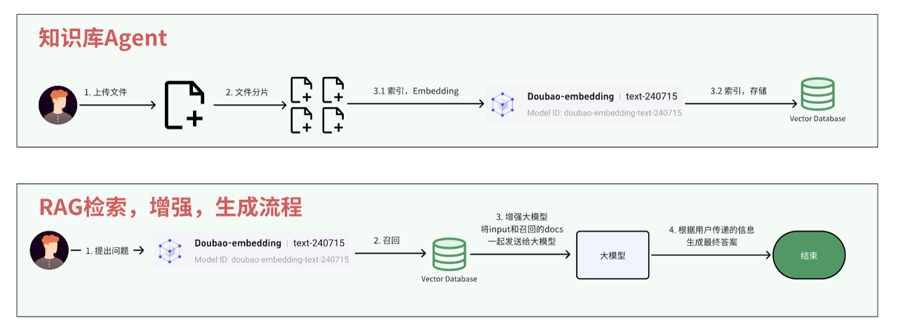

# 实战演练：RAG召回实战2\(Go\)

**注意，运行程序之前请先看：**

•【飞书文档】环境准备教程

•【飞书文档】运行项目教程

# 前言

上一节我们实现了知识库Agent的上半部分，这一节我们来实现知识库的召回功能。

核心代码： SuperBizAgent/internal/ai/cmd/recall\_cmd/main\.go



# 实战

观察代码，首先创建retriever组件，然后调用它的Retrieve方法进行查询，最后打印召回的内容。

我们直接先运行代码，来看看执行后的效果。

```Go

```

代码路径：SuperBizAgent/internal/ai/cmd/recall\_cmd/main\.go

通过输出可以看到，确实召回了我们上一节上传的文件内容。下面我们就来看看核心组件Retrieve到底做了什么。

```JSON

```

# 召回\-Retriever组件

我们之前是将文档存储到了Milvus向量数据库里面，所以召回的时候也是从这个数据库去查询。

首先我们对Milvus客户端进行一些配置，指定向量字段为vector，需要返回的字段有id、content、metadata。

```Go

```

在Eino框架里面， Retriever 组件是用来实现召回的，所以我们来看看 Retriever 这个接口。可以看到返回值是一个 Retriever接口 ，需要实现这个接口的 Retrieve方法 ：

1. 对输入的问题进行向量化，计算出向量

1. 调用Milvus数据库sdk的相似度查询接口

1. 构造返回结构体，返回

```Go

```

总结：对问题先进行向量化，然后根据向量，调用数据库的向量查询接口进行查询。

# 总结

至此，RAG的 分片、索引、召回 功能我们都实现完了。后续会介绍其他Agent是怎么使用知识库，怎么结合 **召回 **来与大模型进行交互的。
