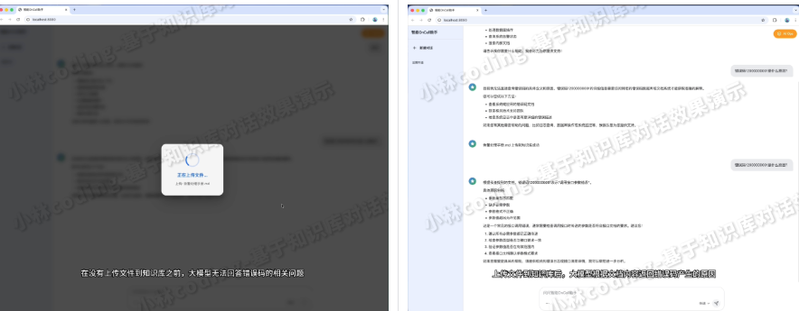
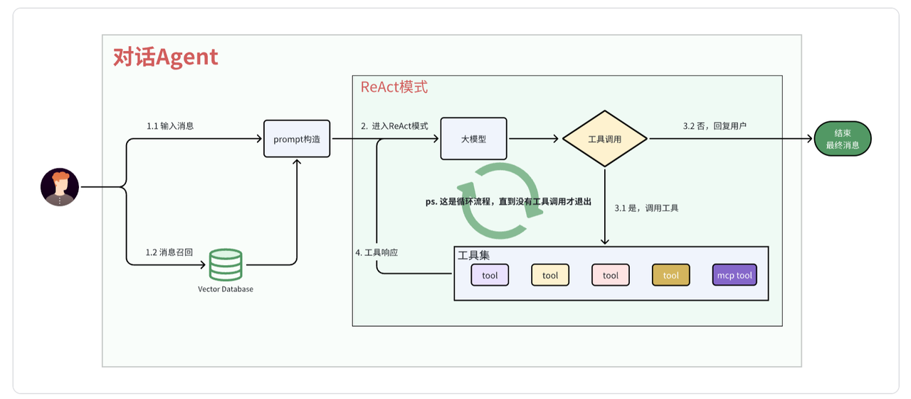

# 实战演练：对话Agent代码实现\(Python\)



# 前言

这部分代码在： app/api/chat\.py 和 app/services/rag\_agent\_service\.py



# 流程梳理

对话 Agent 的核心目标是结合外部知识（RAG 召回）与工具调用能力（ReAct 模式），解决复杂问题。

整体流程可概括为：

1. 用户输入 → embedding → 向量数据库召回

1. 将召回内容作为上下文注入 prompt

1. LangGraph ReAct 模式多轮工具调用

1. 流式输出最终答案

# 实战

### 消息召回

召回通过 retrieve\_knowledge 工具实现，Agent 在推理时会自动判断是否需要调用该工具检索知识库。工具内部通过 VectorStoreManager\.similarity\_search 完成向量检索，详见 RAG 召回章节。

```JSON

```

### 构建 prompt

系统提示词在 \_build\_system\_prompt 中构建，描述 Agent 的角色定位和行为准则。与工具列表无关——LangChain 框架会自动将工具信息传递给大模型，prompt 中无需手动列举：

```Python

```

会话历史由 LangGraph 的 MemorySaver checkpointer 自动管理，每次调用时传入相同的 thread\_id （即 session\_id ）即可自动携带上下文，无需手动拼接历史消息到 prompt。

### 创建 ReAct Agent

使用 LangChain 的 create\_agent 创建 Agent，绑定 ChatQwen 模型、工具列表和 MemorySaver 检查点。MCP 工具（腾讯云 CLS 日志、监控告警等）在首次请求时异步加载，与本地工具合并后一起绑定：

```Python

```

### 执行 ReAct Agent

#### 非流式调用

调用 agent\.ainvoke ，等待 Agent 完成全部推理和工具调用后一次性返回结果：

```Python

```

#### 流式调用

调用 agent\.astream ，使用 stream\_mode\="messages" 逐 token 输出，配合 FastAPI 的 SSE 接口实时推送给前端：

```Python

```

#### SSE 接口层

chat\_stream 接口将 query\_stream 产生的事件包装成 SSE 格式推送给客户端，不同类型的事件对应不同的前端展示逻辑：

```Python

```

curl 调用示例：

```Bash

```

# 总结

至此，对话 Agent 的核心流程——RAG 召回与 ReAct 模式的代码就讲完了。框架帮我们做了很多事情：LangChain 负责工具绑定与调用，LangGraph 负责多轮推理的状态流转， MemorySaver 负责会话历史管理。核心是要搞懂设计原理：RAG 补充外部知识，ReAct 让模型具备多步骤工具调用能力。
