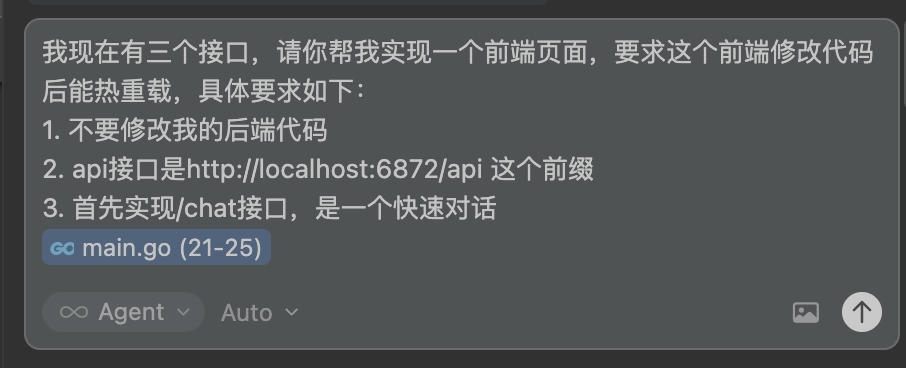
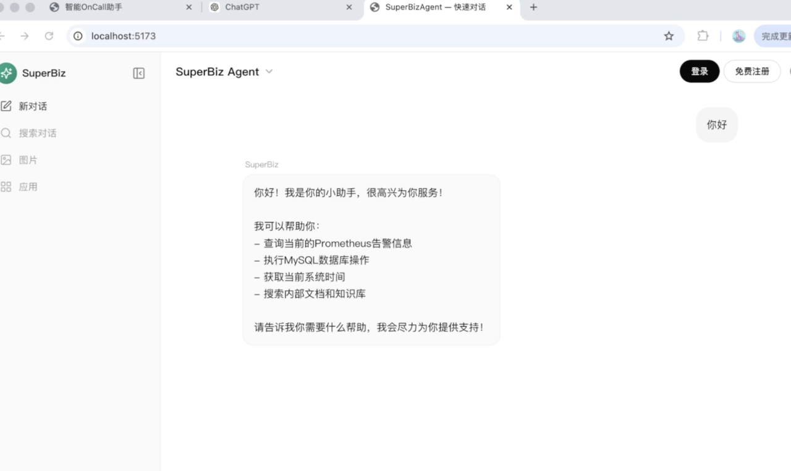
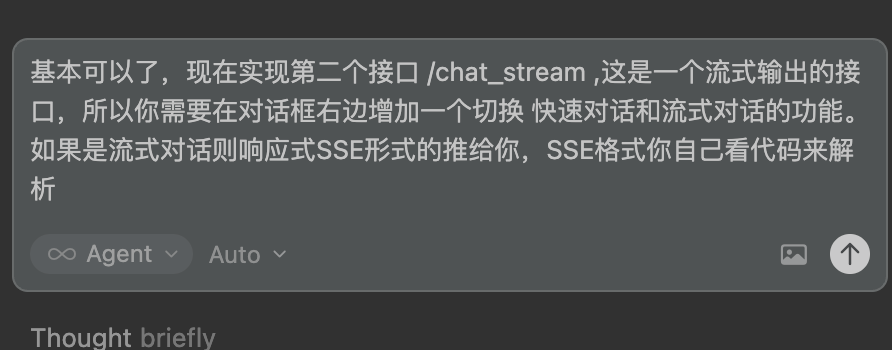
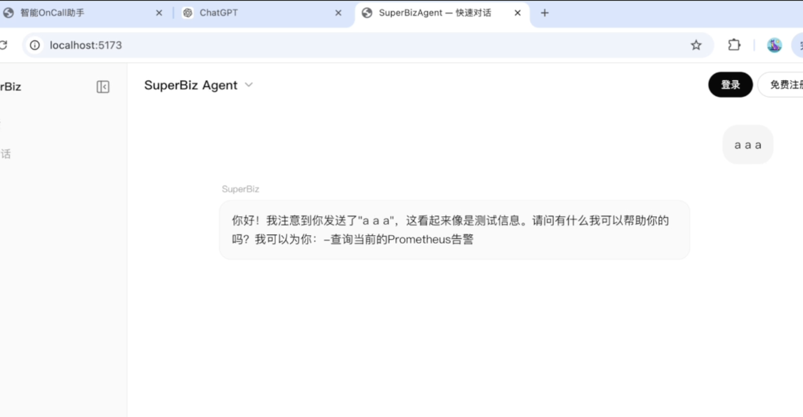
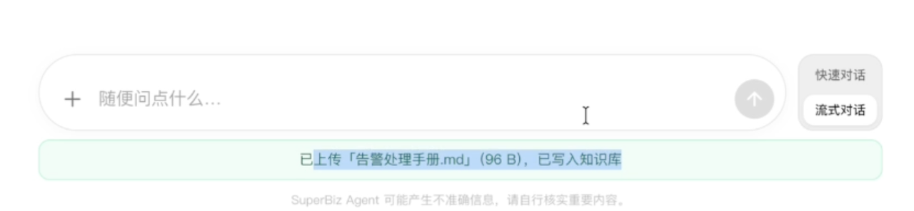
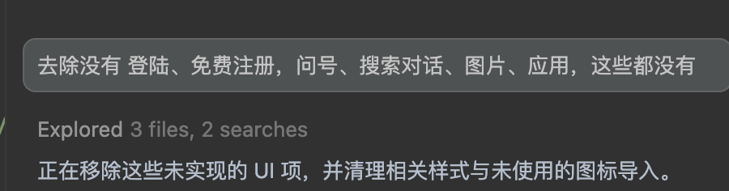
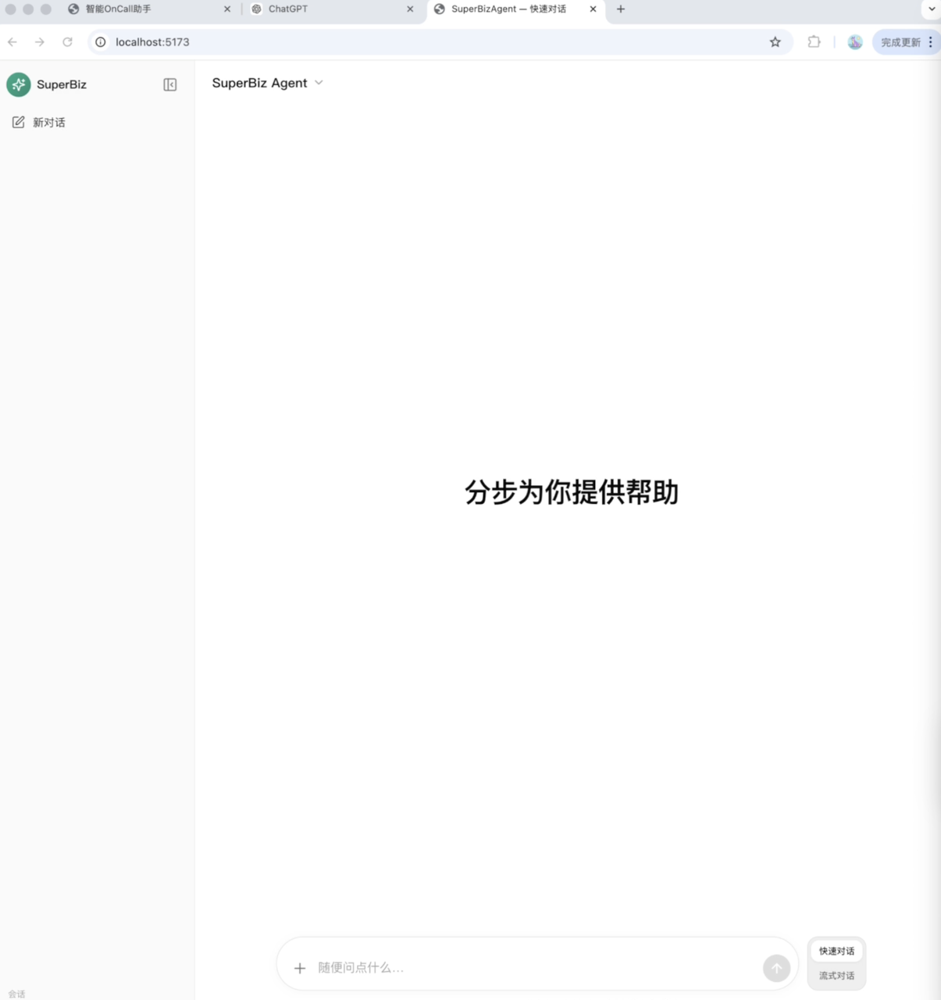
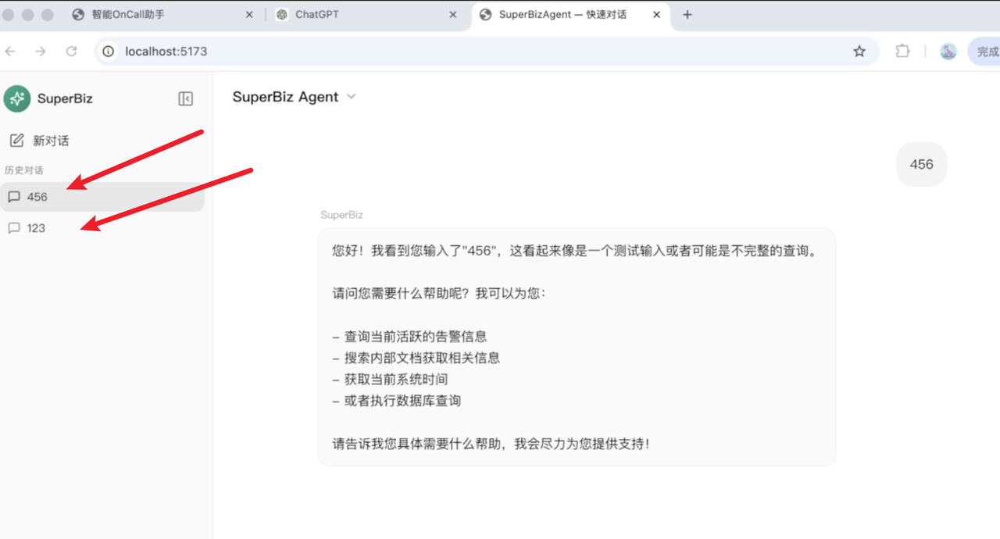
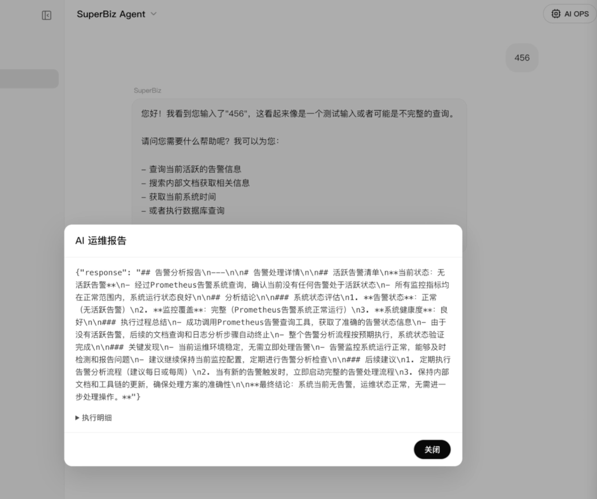
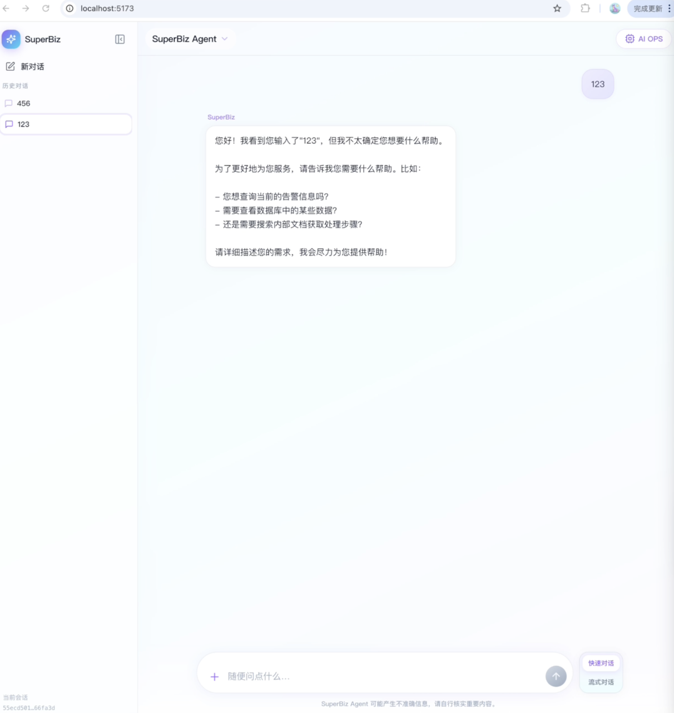

# 前端实现：vibe coding 开发前端页面演示

# 前言

AI IDE：cursor，模型用的auto，让cursor自己选

建议看视频，一共大概20分钟，ai就把前端写出来了，全程我只提需求

# 图片演示

1. 让它实现对话接口

2\.太丑了，让它模仿chatgpt

3\.继续让它实现流式接口

4\.实现上传文件的功能

5\.去除没实现的ui

6\.要求实现多会话的功能

7\.实现AI OPS功能

8\.功能实现完成了，改一下风格

# 视频演示

view

[1\_1\_快速对话与流式对话\.mp4](files/1_1_快速对话与流式对话.mp4)

view

[2\_2\_上传文件与AIOPS\.mp4](files/2_2_上传文件与AIOPS.mp4)
