# 环境准备教程

# 编辑器安装

## Go编辑器Goland安装

[https://www\.jetbrains\.com/go/download/](https://my.feishu.cn/https%3A%2F%2Fwww.jetbrains.com%2Fgo%2Fdownload%2F)

进行官网按照你电脑的对应版本即可

## Goland Eino\-Dev插件安装

进入设置\-\>插件，搜索eino，安装这个Eino Dev

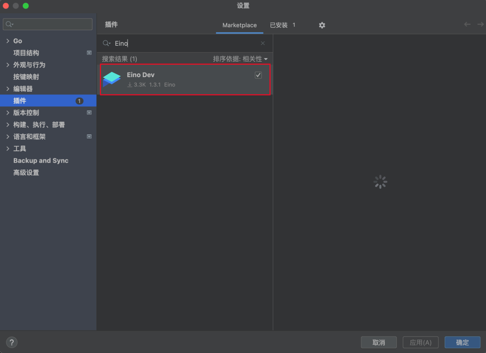

## Go 安装

Go安装： [https://goframe\.org/docs/install\-go/index](https://my.feishu.cn/https%3A%2F%2Fgoframe.org%2Fdocs%2Finstall-go%2Findex)

Go module配置： [https://goframe\.org/docs/install\-go/go\-module](https://my.feishu.cn/https%3A%2F%2Fgoframe.org%2Fdocs%2Finstall-go%2Fgo-module)

## Java编辑器IDEA安装

[https://www\.jetbrains\.com/idea/download/](https://my.feishu.cn/https%3A%2F%2Fwww.jetbrains.com%2Fidea%2Fdownload%2F)

进行官网按照你电脑的对应版本即可

# docker安装

[https://www\.runoob\.com/docker/windows\-docker\-install\.html](https://my.feishu.cn/https%3A%2F%2Fwww.runoob.com%2Fdocker%2Fwindows-docker-install.html)

根据你的电脑类型选择windows or mac安装即可

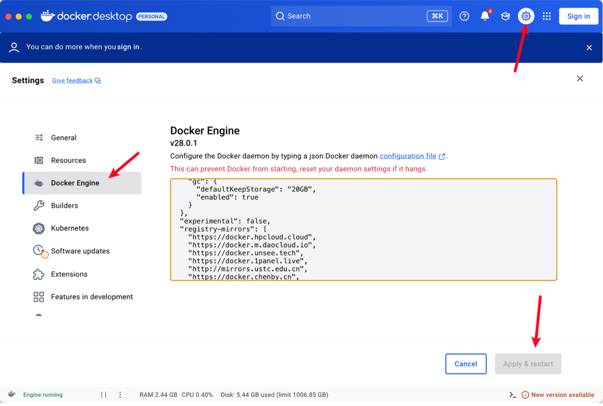

修改镜像源

```JSON

```

# 大模型开通

## Go版本（默认用字节的大模型）

1. 字节跳动的火山云，新注册送50w token： [https://console\.volcengine\.com/home](https://my.feishu.cn/https%3A%2F%2Fconsole.volcengine.com%2Fhome)

1. 注册好后，创建api key。这个api key需要你记住，等会要放到配置文件里面的： [https://console\.volcengine\.com/ark/region:ark\+cn\-beijing/apiKey](https://my.feishu.cn/https%3A%2F%2Fconsole.volcengine.com%2Fark%2Fregion%3Aark%2Bcn-beijing%2FapiKey)

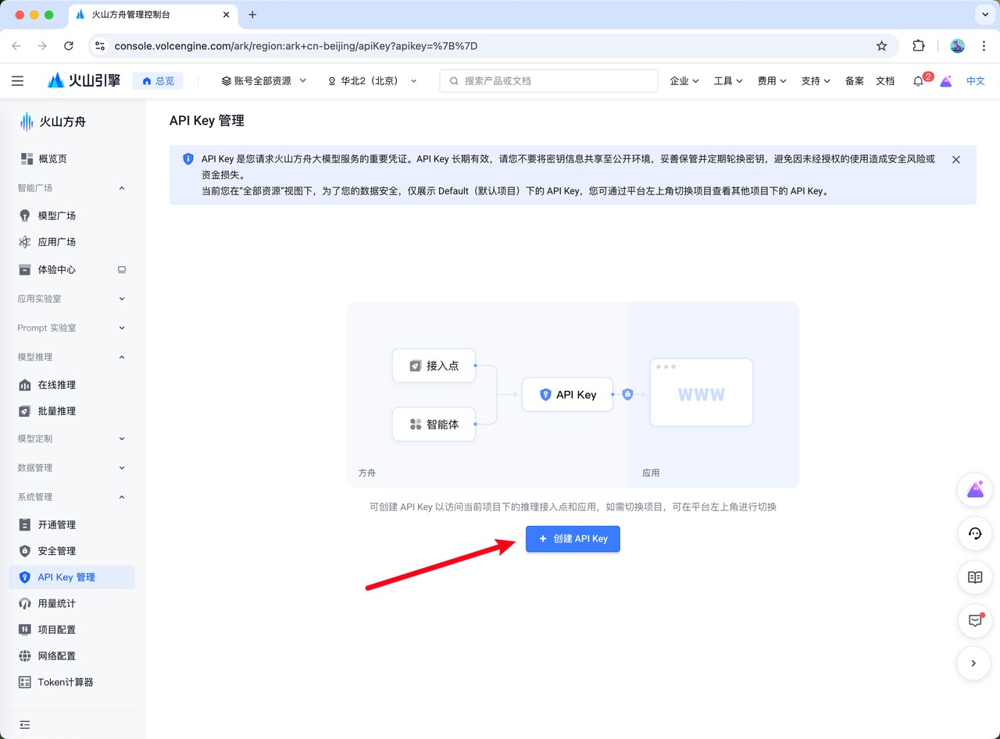

1. 开通2个模型： [https://console\.volcengine\.com/ark/region:ark\+cn\-beijing/openManagement](https://my.feishu.cn/https%3A%2F%2Fconsole.volcengine.com%2Fark%2Fregion%3Aark%2Bcn-beijing%2FopenManagement)

- 语言模型 \-\> DeepSeek\-V3\.1 开通

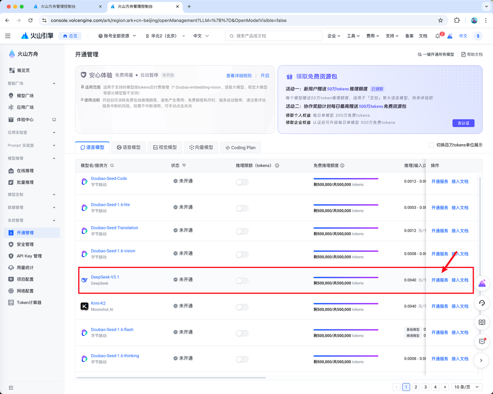

- 向量模型 \-\> Doubao\-embedding 开通

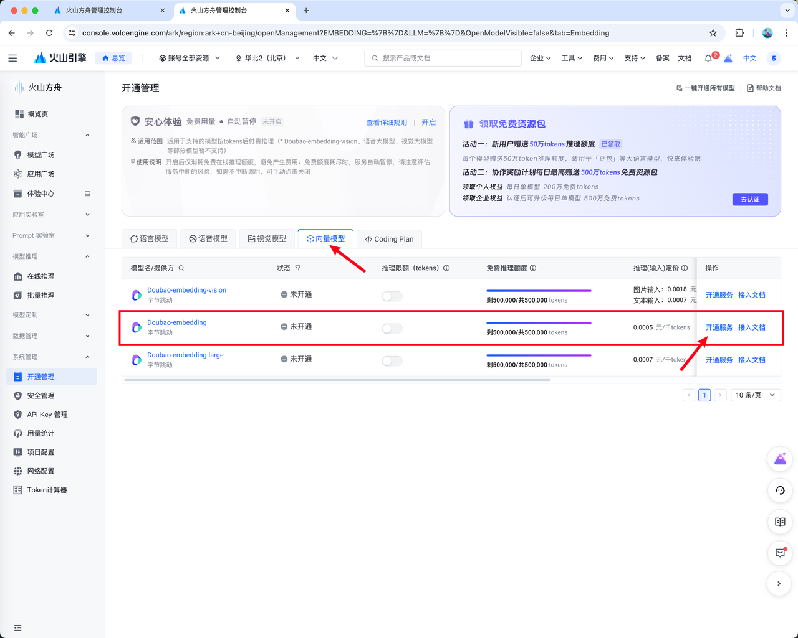

## Java版本（默认用阿里的大模型）

1. 先登录阿里云，新注册也免费送token： [https://bailian\.console\.aliyun\.com/?tab\=model\#/model\-market](https://my.feishu.cn/https%3A%2F%2Fbailian.console.aliyun.com%2F%3Ftab%3Dmodel%23%2Fmodel-market)

1. 创建api key： [https://bailian\.console\.aliyun\.com/?tab\=model\#/api\-key](https://my.feishu.cn/https%3A%2F%2Fbailian.console.aliyun.com%2F%3Ftab%3Dmodel%23%2Fapi-key)

1. 阿里云的模型不需要开启，可以直接使用，记住上面创建的密钥即可

# CLS MCP配置

1. 登陆腾讯云： [https://console\.cloud\.tencent\.com/](https://my.feishu.cn/https%3A%2F%2Fconsole.cloud.tencent.com%2F)

1. 创建密钥，secret id/key保存下来，后面要用： [https://console\.cloud\.tencent\.com/cam/capi](https://my.feishu.cn/https%3A%2F%2Fconsole.cloud.tencent.com%2Fcam%2Fcapi)

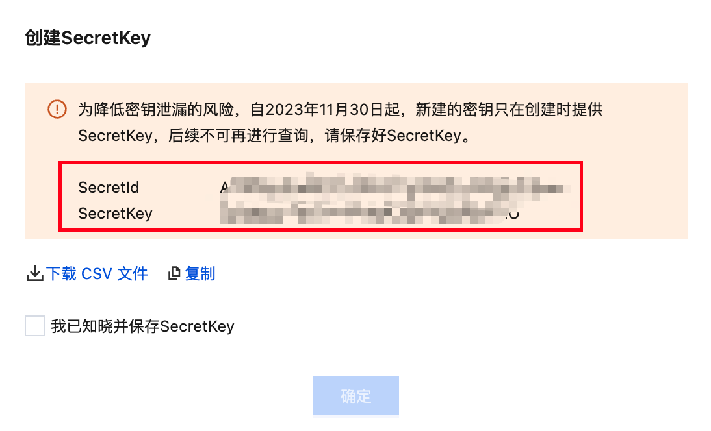

1. 任意找一个目录，创建\.env文件，里面填入：

```PlainText

```

1. 启动 SSE 服务，在\.env目录下执行：

```PlainText

```

1. 启动后，地址为：

```PlainText

```

Go版本配置修改处：

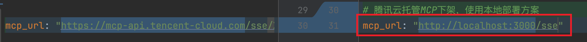

Java版本配置修改处：

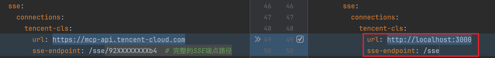

Python版本配置修改处：

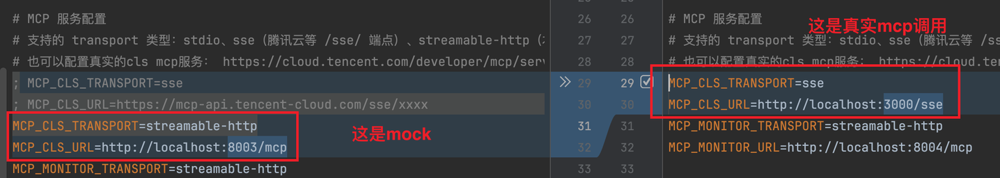

验证MCP是否连接成功，请在页面提问：你有哪些工具

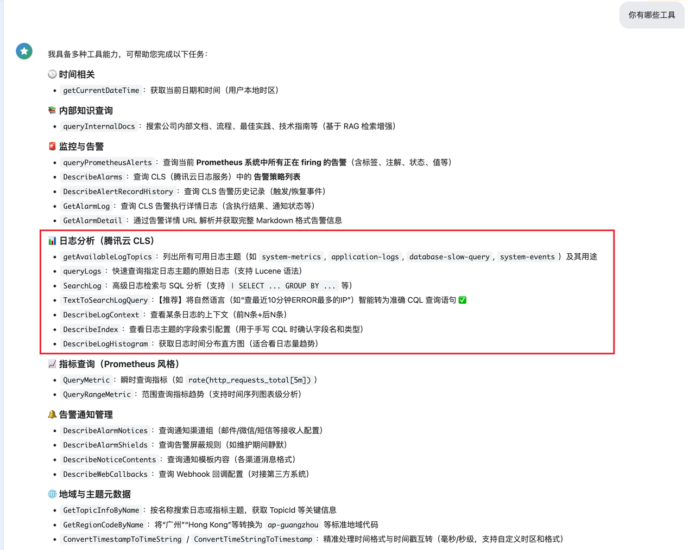

# 项目配置

## Go版本

替换：​

1. api\_key：如果你也用火山云，按照上述开通两个模型后，只需要替换下面的 api\_key 即可（所有模型共用同一个api key，不需要申请多个！）​

1. file\_dir：用于存储用户上传的文档目录，自行选择一个目录即可

1. cls\_mcp\_url：mcp的地址，替换成上一步骤的url即可

路径： SuperBizAgent/manifest/config/config\.yaml

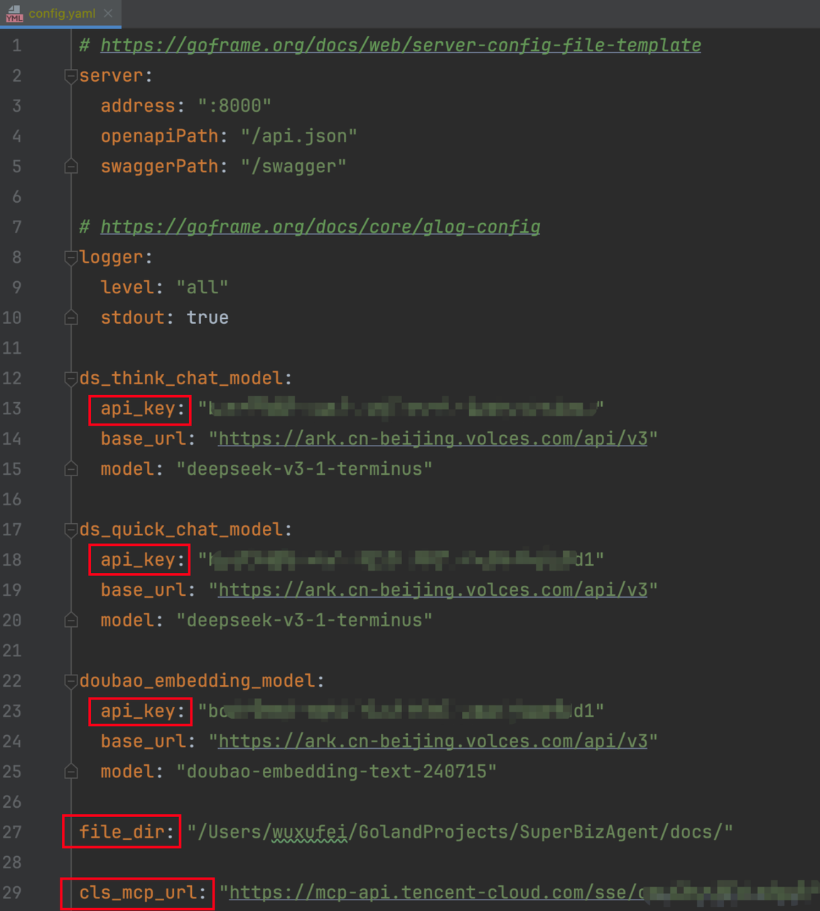

## Java版本

替换：​

1. 把红框里面替换成前面注册的阿里的api key

1. sse\-endpoint替换成上面注册的mcp地址

路径： SuperBizAgent/src/main/resources/application\.yml

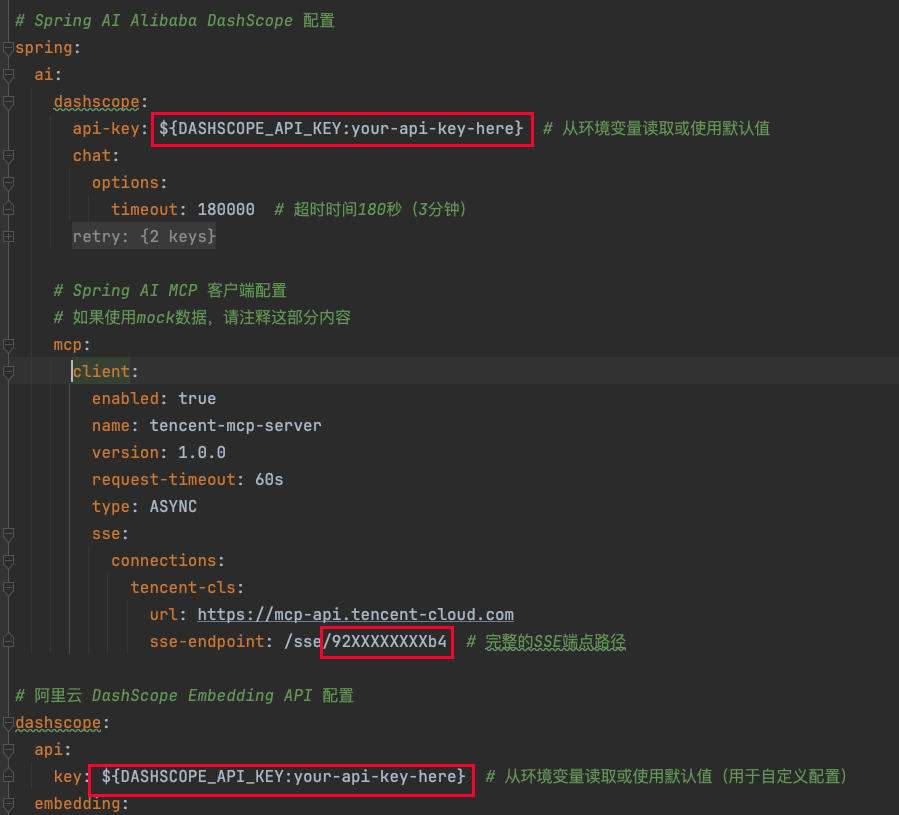
