# RAG 项目派聪明 Go 版如何通过 Docker 一键部署安装启动

RAG 项目派聪明 Go 版 AI 知识库代码库已经完成了，为了降低大家上手的难度，依据 Java 版球友们的反馈，我修正了 Go 版 Docker 的一键部署方案，这次大家应该不会再被环境卡住，基本上一天就能搞定 MinIO、ElasticSearch、Redis、MySQL、Kafka 的前置环境安装。

手把手教大家！​

## 一、申请向量化 API key

登录阿里百炼： [https://bailian\.console\.aliyun\.com/?tab\=model\#/api\-key](https://my.feishu.cn/https%3A%2F%2Fbailian.console.aliyun.com%2F%3Ftab%3Dmodel%23%2Fapi-key)[ ](https://my.feishu.cn/https%3A%2F%2Fbailian.console.aliyun.com%2F%3Ftab%3Dmodel%23%2Fapi-key)，申请 API key，然后复制，随后需要粘贴到 config\.yaml 中：

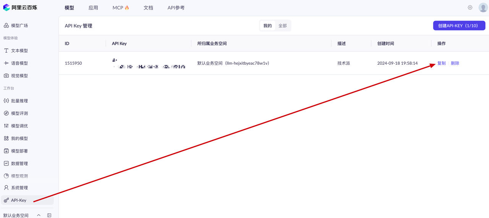

在这里可以查看： [https://bailian\.console\.aliyun\.com/?tab\=model\#/model\-market/all](https://my.feishu.cn/https%3A%2F%2Fbailian.console.aliyun.com%2F%3Ftab%3Dmodel%23%2Fmodel-market%2Fall)[ ](https://my.feishu.cn/https%3A%2F%2Fbailian.console.aliyun.com%2F%3Ftab%3Dmodel%23%2Fmodel-market%2Fall)通用文本向量\-v4

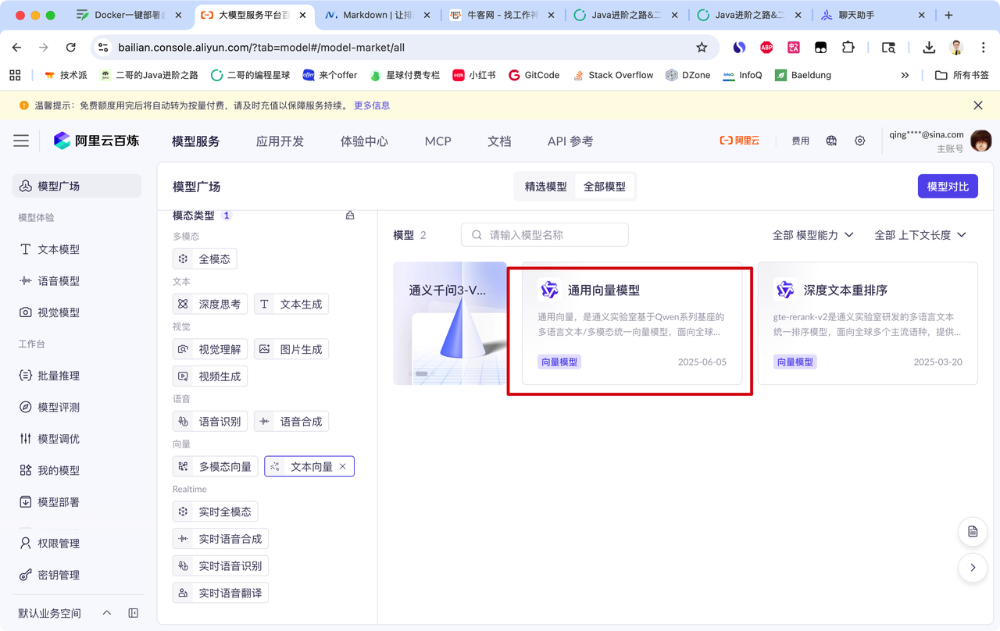

会免费送一批额度，基本上够我们派聪明使用了，😄 等用完了再充值。

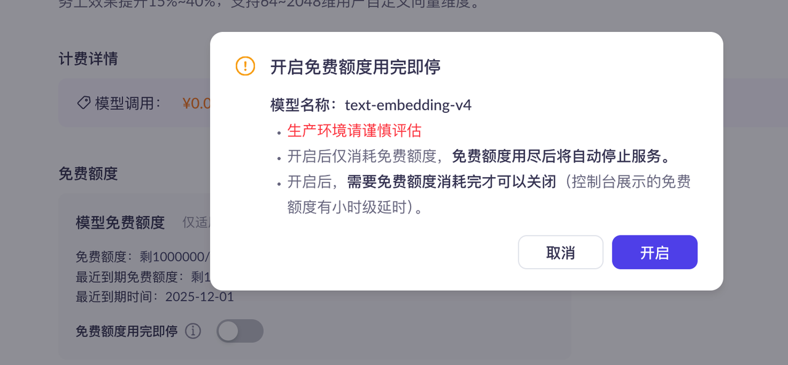

OK，然后把申请的 API key 粘贴到 config\.yaml 中。注意这里我们用的是 2048 维，一定要和 ElasticSearch 匹配哦。

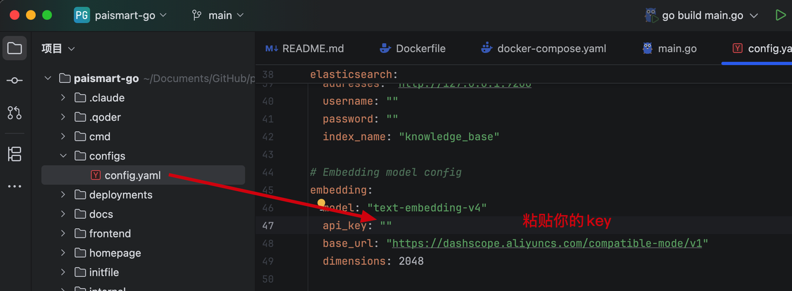

## 二、申请 DeepSeek API key

我们这里的模型用的是 DeepSeek。

DeepSeek API 的申请非常简单，直接到： [https://platform\.deepseek\.com/api\_keys](https://my.feishu.cn/https%3A%2F%2Fplatform.deepseek.com%2Fapi_keys)[ ](https://my.feishu.cn/https%3A%2F%2Fplatform.deepseek.com%2Fapi_keys)然后创建 api key 就行了。


记得充钱。

复制好 key 填到 config\.yaml 中就可以了。然后 URL 为 [https://api\.deepseek\.com/v1](https://my.feishu.cn/https%3A%2F%2Fapi.deepseek.com%2Fv1)[ ](https://my.feishu.cn/https%3A%2F%2Fapi.deepseek.com%2Fv1)model 为 deepseek\-chat ，key 就填你刚刚申请的就好了。

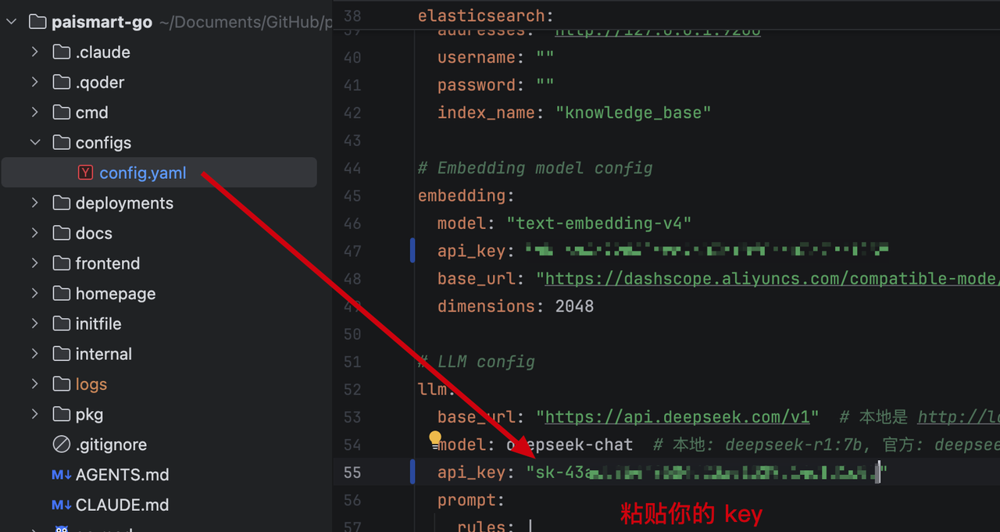

## 三、拉取源码

通过网盘分享的文件：paismart\-go\-main\.zip

链接: [https://pan\.baidu\.com/s/19SeWoEaLVXVgBhXlPoax5w](https://my.feishu.cn/https%3A%2F%2Fpan.baidu.com%2Fs%2F19SeWoEaLVXVgBhXlPoax5w)

**Color1**

对于 Go 的新手来说，这里简单解释两句，goland 是 Go 的 IDE，类似 IntelliJ IDEA。去官网下载，或者自己找对应的版本，老手这一步可以直接跳过。

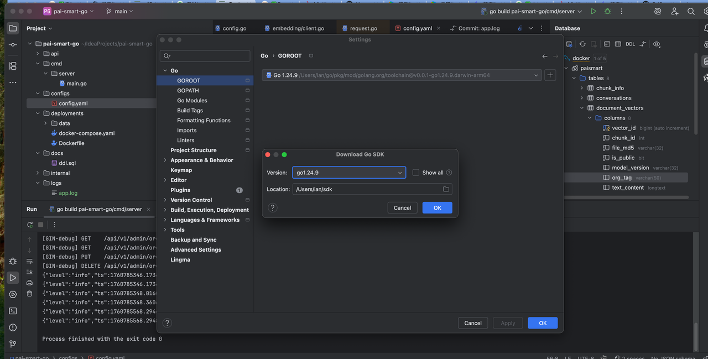

新手可以在 settings 中找到 go 找到 goroot，然后会自动下载 go 的 SDK。

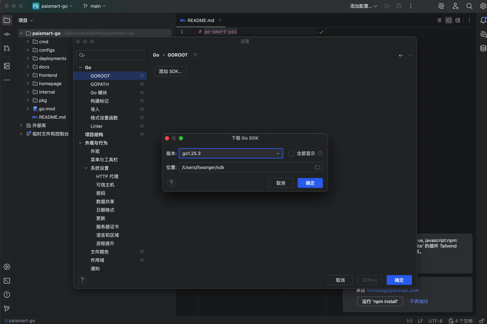

如果你是新手，发现代码一只飙红，点开 Go 模块，勾选 Go 模块集成一下就好了。

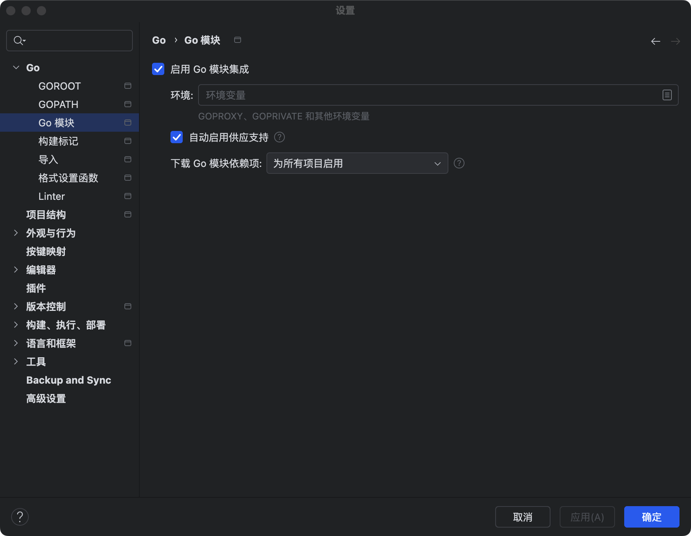

## 四、安装 docker

Docker 官网： [https://www\.docker\.com/](https://my.feishu.cn/https%3A%2F%2Fwww.docker.com%2F)

Windows 的话，之前 Java 版本也写有教程：​

[✅Docker 部署派聪明（懒人福音）](https://my.feishu.cn/https%3A%2F%2Fpaicoding.com%2Fcolumn%2F10%2F10)

二哥这里再赘述一下 macOS 版本，我是通过官网下载的，但下载好，拖到应用程序启动的时候，一直弹窗。

就一直不停的谈，点完成都没用，重启后把应用程序删掉，才不弹了，找了很多原因，有说签名不正确，有说 Docker 和 macOS 的理念冲突，导致误判，反正就是打不开呗。

那我就想到直接用 warp 这款工具，让他用 homebrew 来帮我安装，直接输入提示词“我想安装 Docker，下载的 Docker dmg 会提示不安全，有其他办法吗”

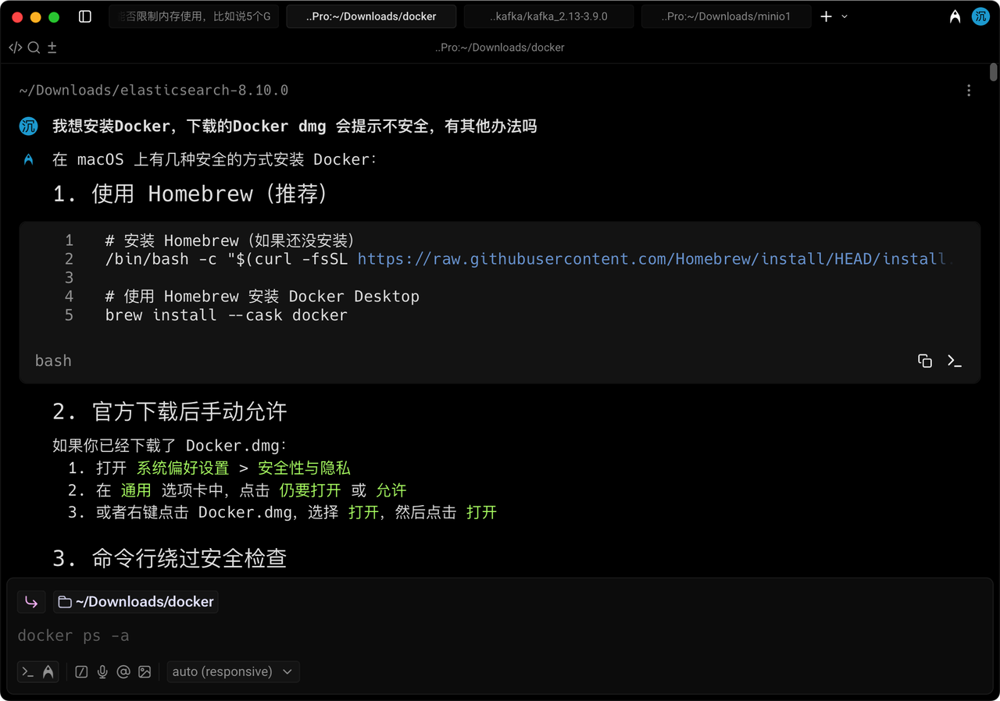

一开始没问题，但等安装的时候冲突了，可能前面没有卸载干净。

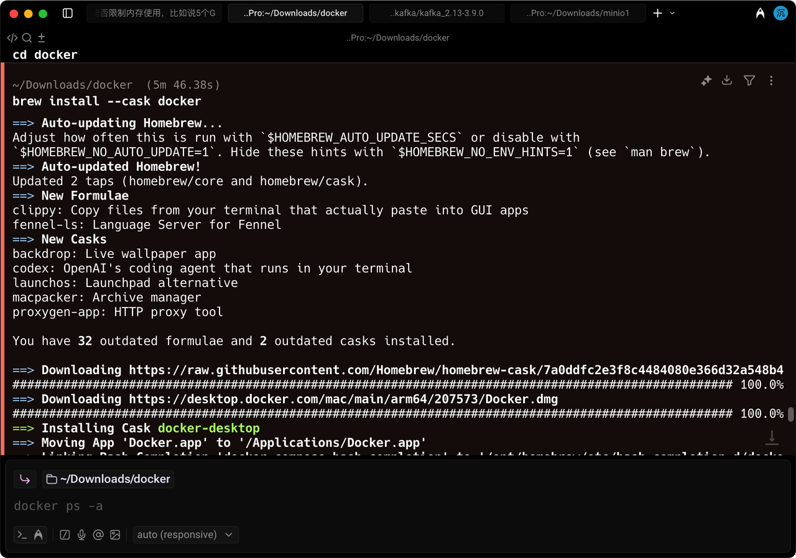

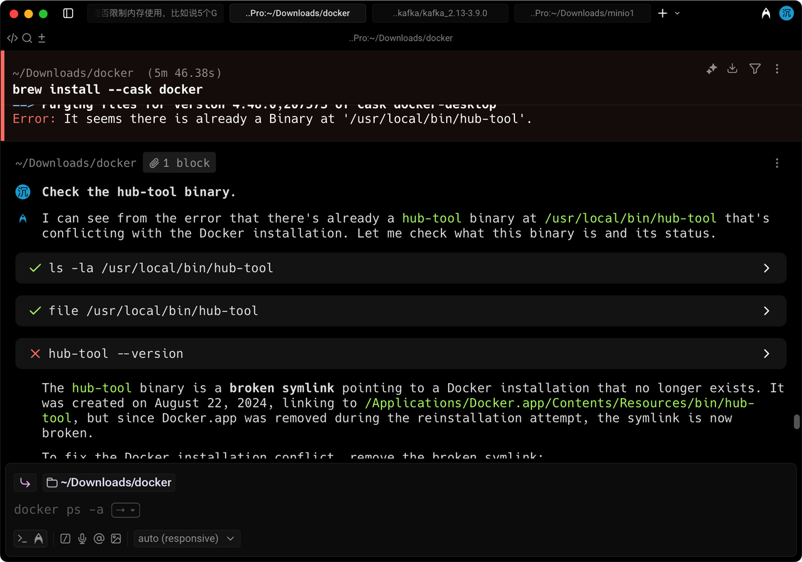

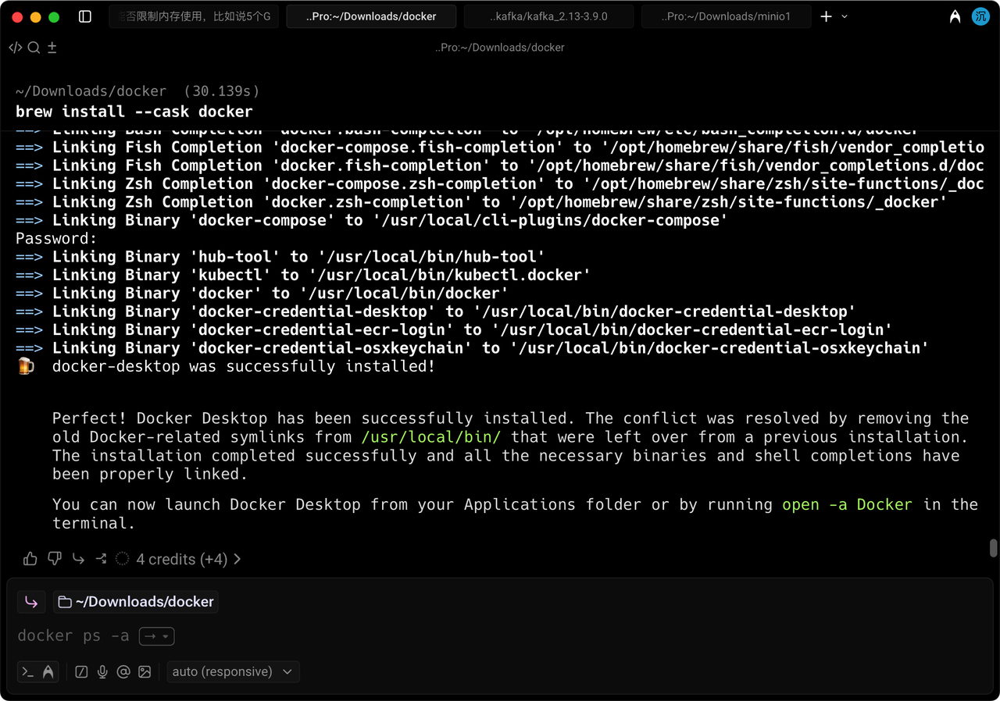

执行 open \-a Docker 后确实可以打开 Docker 了。

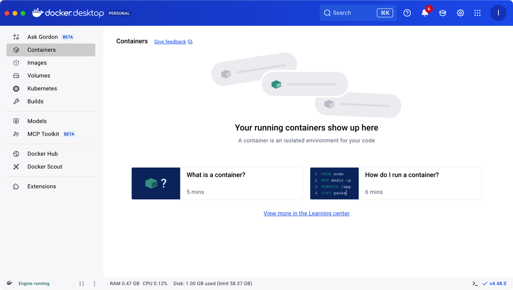

### 添加 docker 镜像源

找到 setting，点开 Docker engine，然后添加镜像。

```JSON

```

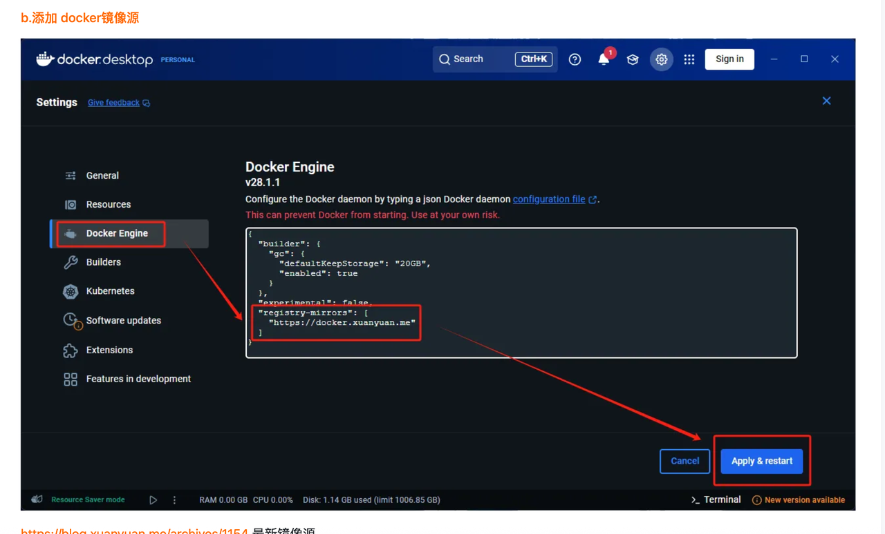

你也可以添加其他的镜像源，我这边有。

```JSON

```

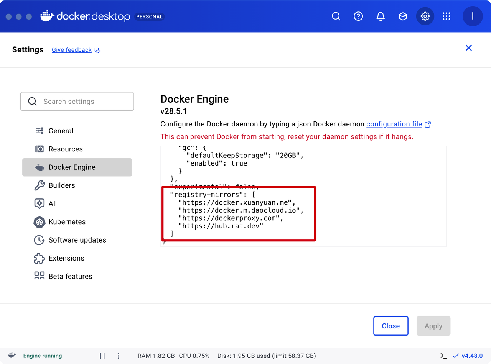

### Docker 安装前置环境

进入到项目目录下执行命令，我 go 版派聪明是放在这个路径下的，你要进入到你自己的路径下。

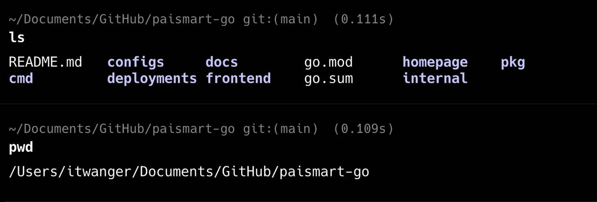
