# ✅Elasticsearch 8\.10安装教程（新人必看）

在 macOS 上使用 Homebrew 安装 Elasticsearch 时，可能会遇到 No available formula with the name "elasticsearch" 的错误。这是因为从 Elasticsearch 8\.x 开始，官方不再通过 Homebrew 提供安装包。

1. 安装 ES

步骤 1：下载 Elasticsearch

访问 Elasticsearch

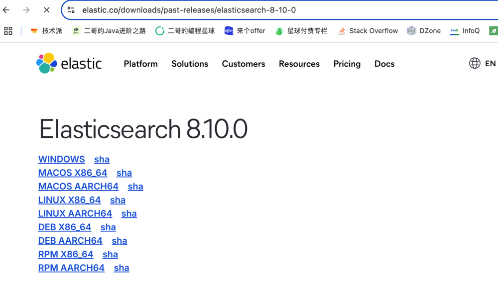

如果是 Windows 操作系统就下载第一个，如果是 Apple 芯片的 macOS 就下载第三个，如果是英特尔芯片的话，就下载第二个，二哥本机是 Apple 芯片的 macOS，所以下载的是第三个。

也可以通过 curl 下载 8\.10\.0 版本：

```Ruby

```

### 步骤 2：解压文件

直接用解压文件解压就行了。

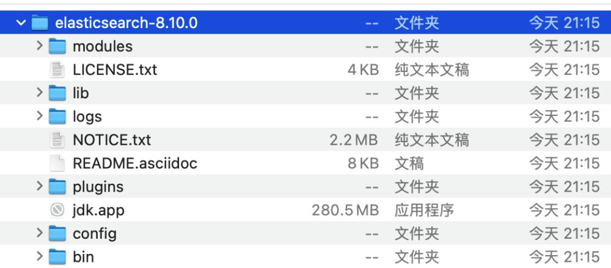

也可以通过 tar 命令。

```Bash

```

### 步骤 3：启动 Elasticsearch

可以直接进入到 bin 目录，然后执行 \./elasticsearch 启动 ES。

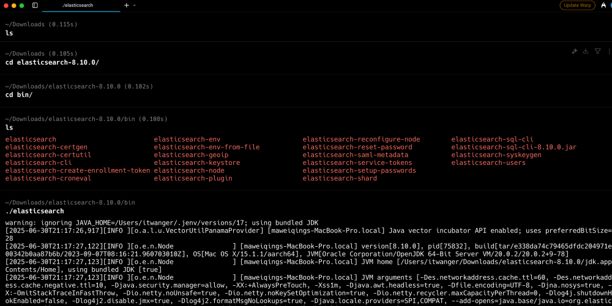

默认情况下，ES 默认是自动配置堆大小的，也就是没有设置固定的内存限制，所以 ES 会根据系统可用内存自动分配，我本机有时候能飙到 30 多个 G 的内存。如果你本机没有这么大的内存空间，你可以通过下面的命令运行：

```Plaintext

```

\-Xms 设置初始堆大小，\-Xmx 设置最大堆大小，建议将 \-Xms 和 \-Xmx 设置为相同值，避免堆动态调整的开销。

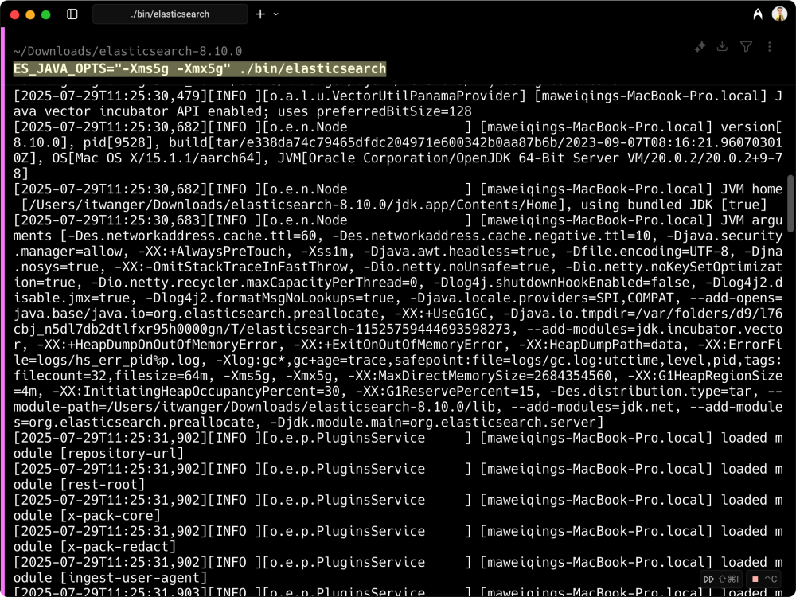

ES 8\.10\.0 需要 JDK 17 的版本，大家在跑 ES 的时候尽量先配置 JDK17。

可以通过这个连接对比： [https://www\.elastic\.co/cn/support/matrix\#matrix\_jvm](https://my.feishu.cn/https%3A%2F%2Fwww.elastic.co%2Fcn%2Fsupport%2Fmatrix%23matrix_jvm)

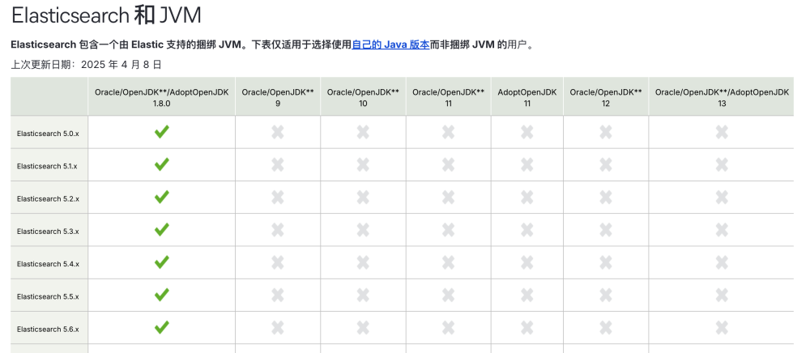

也可以直接在上一级目录执行下面的命令启动。

```Bash

```

默认情况下，Elasticsearch 会在前台运行，并监听 9200端口。但由于 ES 从 8\.x 版本开始，启用了安全功能，所以会有这样一段输出，注意保存一下。

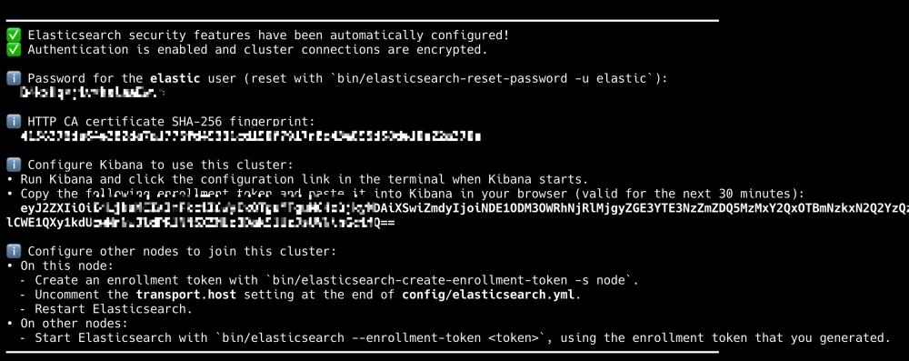

如果 ES 没有按照要求加载对应的 JDK 版本，我们可以这样执行：

```Plaintext

```

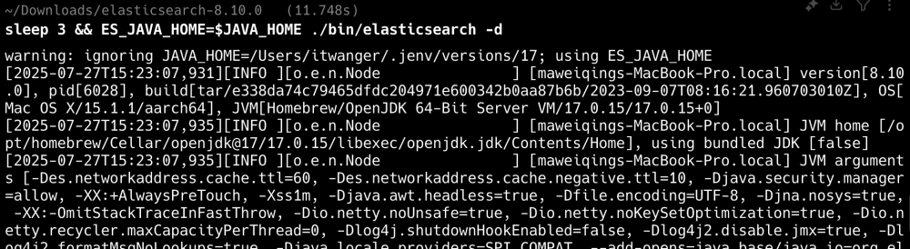

### Linux 服务器后台运行

如果你希望 Elasticsearch 在后台运行，可以使用 **nohup **：

```Bash

```

## ES安全功能解除方法

ES 的安全功能包括：

1. **HTTPS **：所有通信默认使用 HTTPS。

1. **身份验证 **：需要用户名和密码才能访问 Elasticsearch。

1. **证书生成 **：安装时会自动生成 TLS/SSL 证书。

Elasticsearch 启动时默认启用了 HTTPS（加密通信），如果尝试通过 HTTP（明文通信）访问 Elasticsearch，会导致了以下错误：

```Plaintext

```

这表明你的客户端（如 curl 或浏览器）发送的是 HTTP 请求，而 Elasticsearch 配置为仅接受 HTTPS 请求

### 方法 1：使用 HTTPS 访问 Elasticsearch

默认情况下，Elasticsearch 会在安装目录下生成一个自签名证书，并启用 HTTPS。你可以通过以下步骤使用 HTTPS 访问 Elasticsearch。

#### 步骤 1：找到生成的证书

在安装 Elasticsearch 时，系统会提示你保存以下信息：

**①、CA 证书路径 **：通常位于 elasticsearch\-8\.10\.0/config/certs/http\_ca\.crt 。

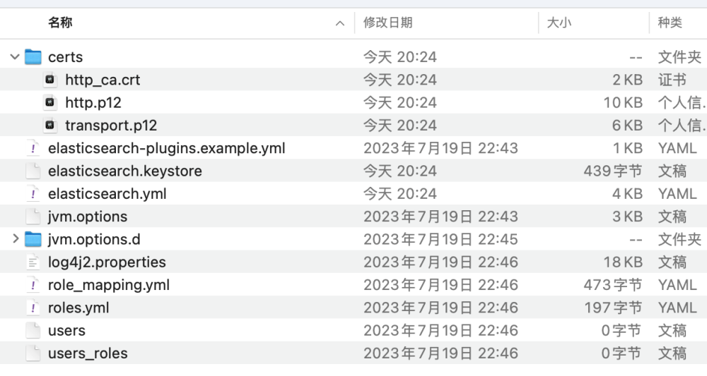

**②、 用户名和密码 **：默认用户是 elastic，密码会在启动时生成。

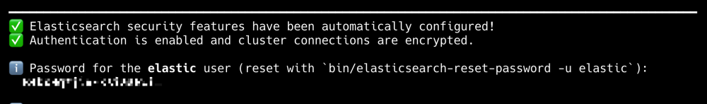

如果忘记了密码，可以通过以下命令重置：

```Bash

```

#### 步骤 2：使用 HTTPS 访问

回到解压目录（注意不是 bin 目录），运行以下命令，指定 CA 证书并使用 HTTPS 协议：

```Bash

```

系统会提示输入密码，输入 elastic 用户的密码后即可访问。

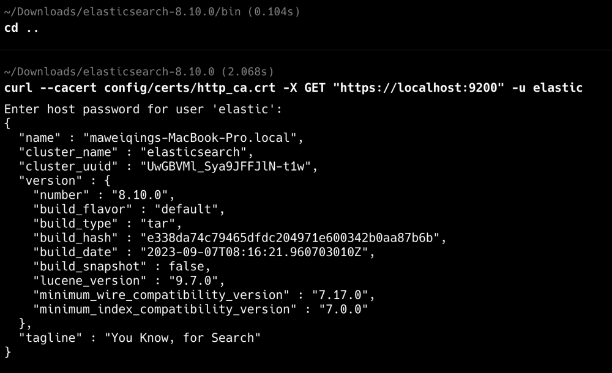

注意⚠️，要记得把 ES 的密码配置到你本地代码的 application\.yml 文件，和前面 ES 生成的密码是匹配的。

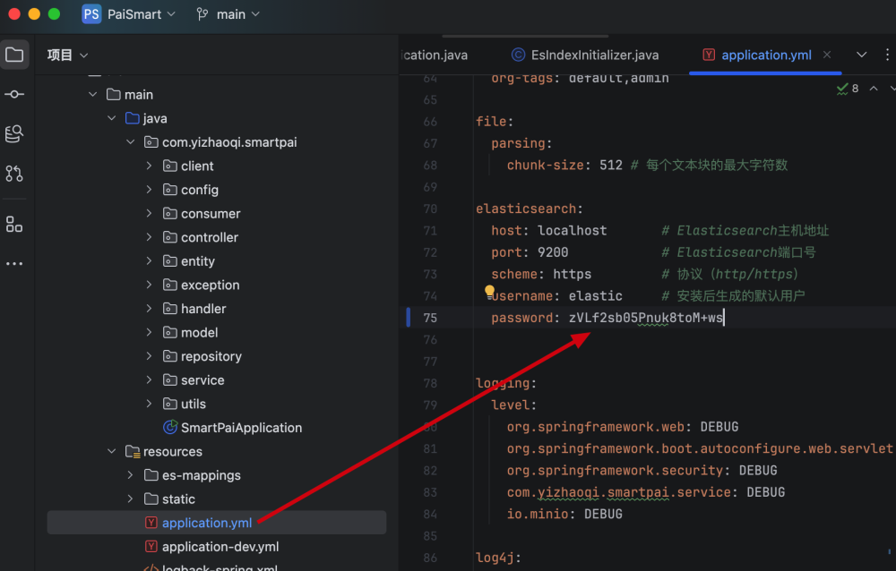

### ~~方法 2：禁用 HTTPS 和安全功能（仅限本地测试环境）~~

如果只是在本地开发环境中使用 Elasticsearch，也可以禁用 HTTPS 和身份验证。

#### 步骤 1：修改配置文件

编辑 config/elasticsearch\.yml 文件，把这两个配置项修改为 false。

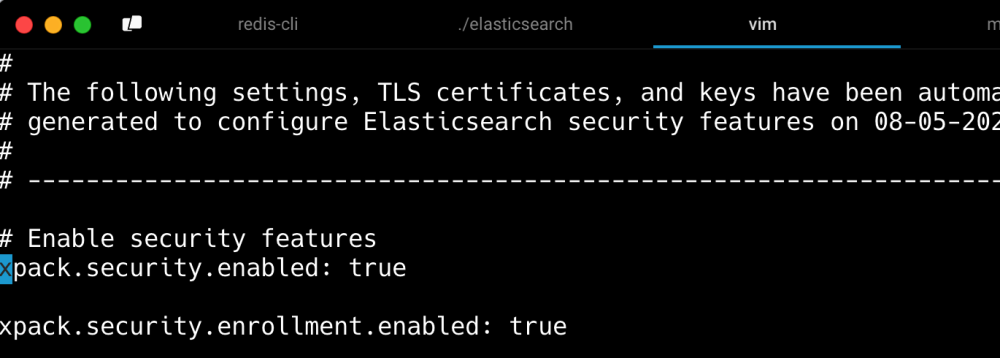

修改对应的内容为：

```YAML

```

#### 步骤 2：重启 Elasticsearch

重新启动 Elasticsearch：

```Bash

```

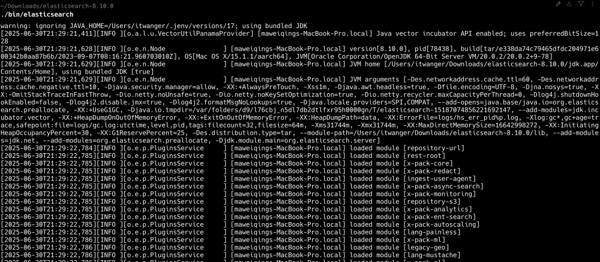

#### 步骤 3：使用 HTTP 访问

现在可以通过 HTTP 协议访问 Elasticsearch：

```SQL

```

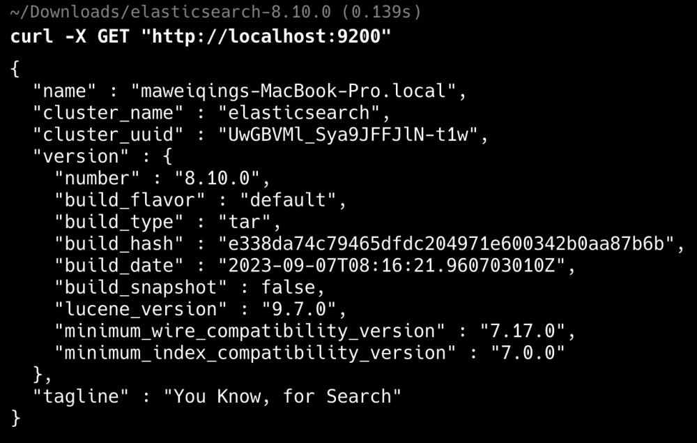

#### 注意事项

- 禁用安全功能仅适用于开发环境，生产环境中不建议这样做。

- 如果你在 Docker 中运行 Elasticsearch，请确保将 xpack\.security\.enabled 设置为 false。

这时候，还要确保 application\.yml 中的 ES 用的是 HTTP 请求。

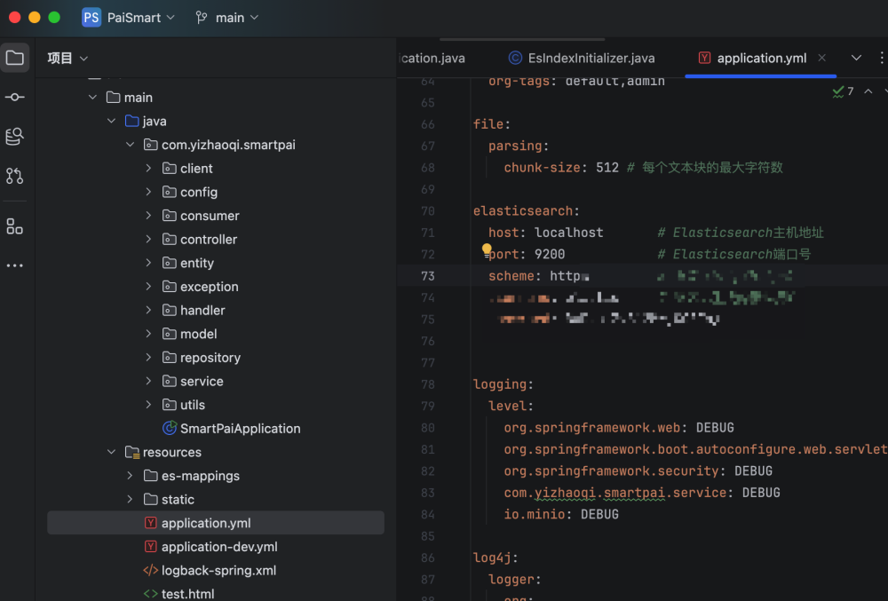

否则会在启动后端的时候报错 初始化索引失败。

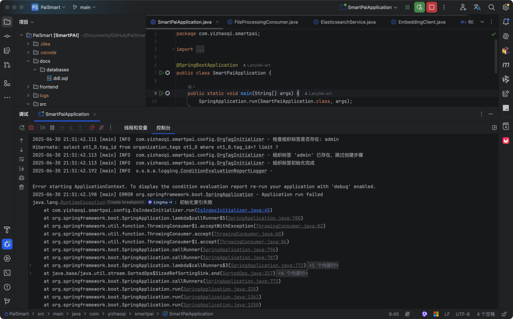

## ES 安装 IK 分词器插件

IK 分词器是阿里开源的一个中文分词工具，主要用于全文检索和文本分析。据说最初是由林良益开发的，是 Lucene 和 Elasticsearch 中最常用的中文分词插件之一： [https://github\.com/infinilabs/analysis\-ik](https://my.feishu.cn/https%3A%2F%2Fgithub.com%2Finfinilabs%2Fanalysis-ik)

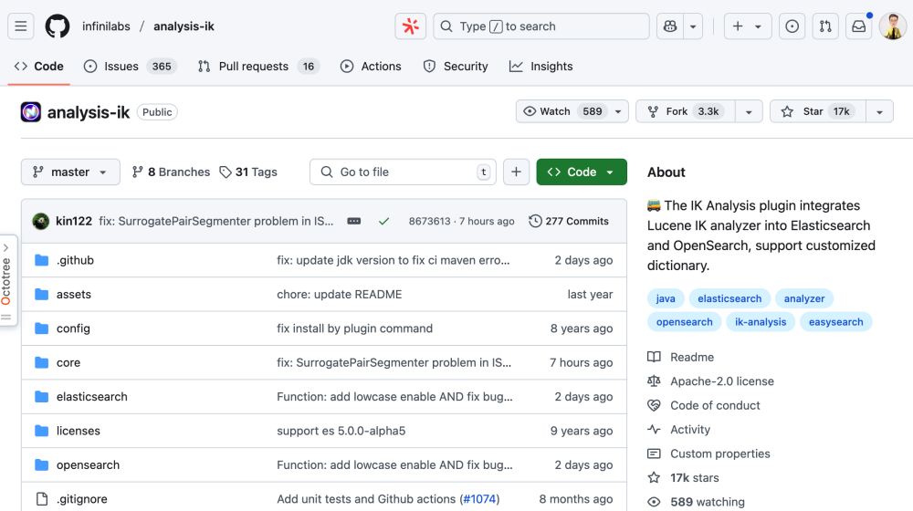

我去搜了一下，居然早在 2012 年就有了，当时还在 ITEYE 上有一篇博文介绍，这头像一看就是远古时期的程序员大佬。


死去的记忆又开始攻击我了，哈哈哈，我 2015 年之前也活越过这里。


传统的分词工具往往难以准确处理中文的歧义和复杂语境，而IK分词器可以：识别中文词组、处理专有名词、智能切分复杂句子。

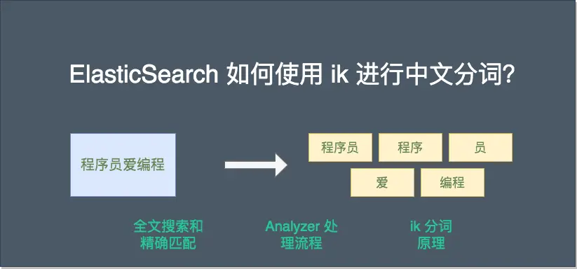

历小冰：IK 分词器

### 为什么要安装 IK 分词器呢？

Elasticsearch 默认的分词器（如 standard analyzer）针对英文等西方语言设计，对中文文本处理效果极其有限。这主要是因为英文单词之间有空格，而中文是连续书写的，没有自然分词的边界，标准的分词器会逐字切分，导致语义完全丢失。

比如说 程序员爱编程，默认的分词器会分割为 程 \| 序 \| 员 \| 爱 \| 编 \| 程，IK 分词器能够切分为 程序员｜爱｜编程。

IK分词器提供了两种主要分词模式：ik\_max\_word，最细粒度的分词模式，会穷尽所有可能的分词组合，适合全文检索；ik\_smart，智能分词模式，最少分词，尽可能保留语义完整的词组，适合精准匹配。

#### 下载并安装插件

IK 分词插件的 [GitHub 主页 ](https://my.feishu.cn/https%3A%2F%2Fgithub.com%2Finfinilabs%2Fanalysis-ik%3Ftab%3Dreadme-ov-file)里有提供插件的安装方式。

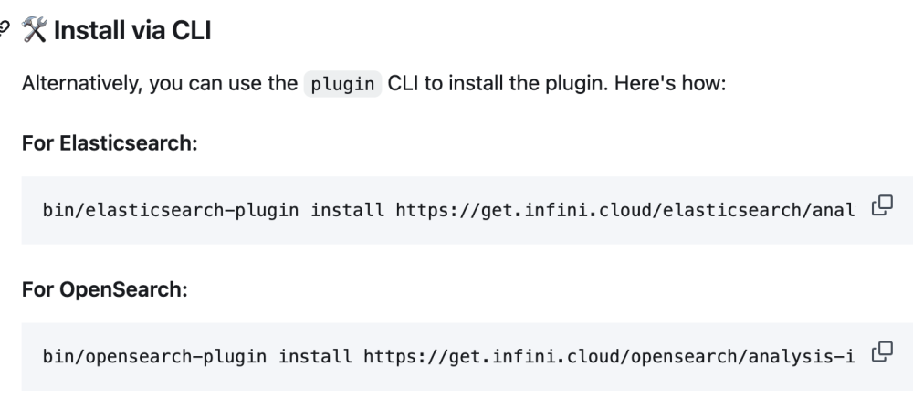

可以通过命令行直接安装，macOS 的执行命令如下所示：

```Bash

```

但很遗憾，我这里执行失败了。

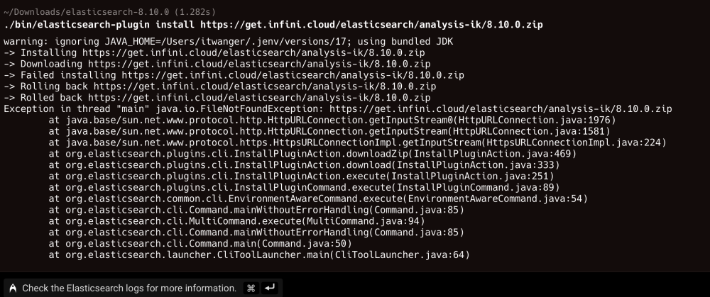

问了一嘴 Claude，说可以用 \./bin/elasticsearch\-plugin install https://github\.com/medcl/elasticsearch\-analysis\-ik/releases/download/v 版本号/elasticsearch\-analysis\-ik\-版本号\.zip 这个，我没有尝试，大家可以试一下。

那我们就换一种安装方式，先通过这个连接找到匹配的 IK 分词插件连接：

[http://cdn\-us\-west\-release\.infinilabs\.com/analysis\-ik/stable/](https://my.feishu.cn/http%3A%2F%2Fcdn-us-west-release.infinilabs.com%2Fanalysis-ik%2Fstable%2F)

比如说 8\.10 选这个：

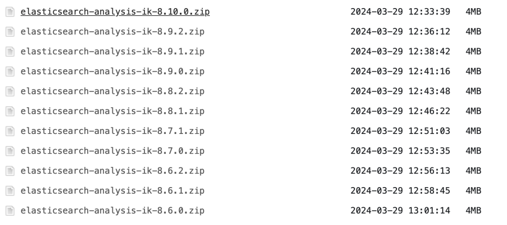

直接点击链接，下载到本地。再使用以下命令安装本地插件：

```Bash

```

注意这里的 /Users/itwanger/Downloads/ 替换成你本地的地址， file:// 前缀要保留。

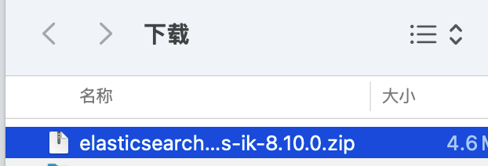

这次安装成功了，安装的过程中会提示 y/n，输入 y 就好了。

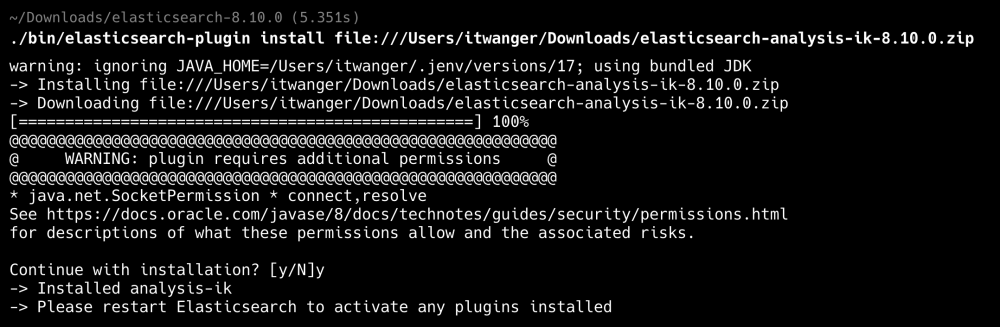

Windows 类似，只需要 \./bin 的 \./ 删掉就行了。

完成安装后，重启一下 ES。可以运行以下命令验证插件是否安装成功：

```SQL

```

输出应包含类似以下内容：

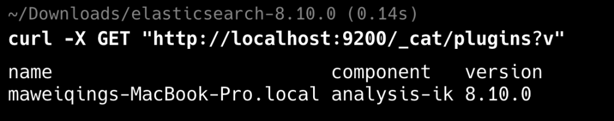

或者执行 \./bin/elasticsearch\-plugin lis

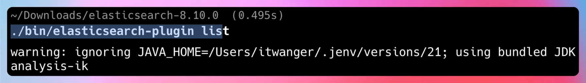

表示已经安装成功了。

为我们自己鼓个掌吧，不错不错😌
