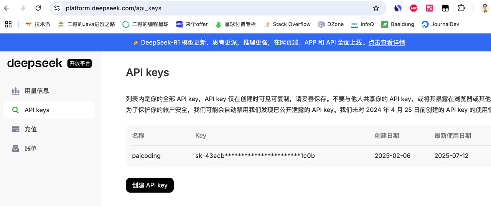
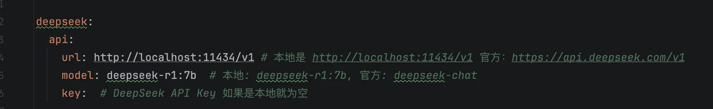
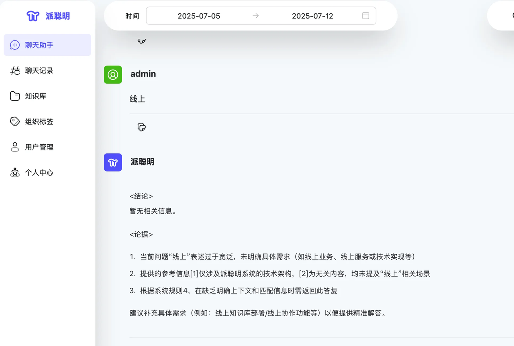

# ✅DeepSeek API申请（新人必看）

DeepSeek API 的申请非常简单，直接到： [https://platform\.deepseek\.com/api\_keys](https://my.feishu.cn/https%3A%2F%2Fplatform.deepseek.com%2Fapi_keys)然后创建 api key 就行了，复制好 key 填到 application\.yml 中就可以了。

记得充钱。

然后 URL 为 [https://api\.deepseek\.com/v1 ](https://my.feishu.cn/https%3A%2F%2Fapi.deepseek.com%2Fv1)model 为 deepseek\-chat

key 就填你刚刚申请的就好了。

启动项目后，可以通过聊天助手这里测试，随便输入内容，如果有内容返回，就表明配置正确了。

