# ✅本地运行派聪明指南（新人必看）

前置环境准备妥当后，接下来就需要从 GitCode 上拉取源码，然后在本地跑起来派聪明了。

## 一、拉取源码

拉取源码我个人比较喜欢的方式是，使用 GitHub 桌面版，图形化操作起来比较丝滑。

GitCode 地址： [https://gitcode\.com/qing\_gee/PaiSmart](https://my.feishu.cn/https%3A%2F%2Fgitcode.com%2Fqing_gee%2FPaiSmart)

这次代码采用的是邀请审核机制，获取邀请方法，请戳👉星球里这个帖子： [https://t\.zsxq\.com/XBc0a](https://my.feishu.cn/https%3A%2F%2Ft.zsxq.com%2FXBc0a)

如果你已经在本地安装了 GitHub 桌面版，可以直接点击 file 这里 clone 仓库。

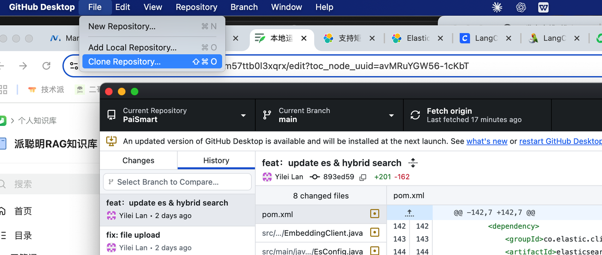

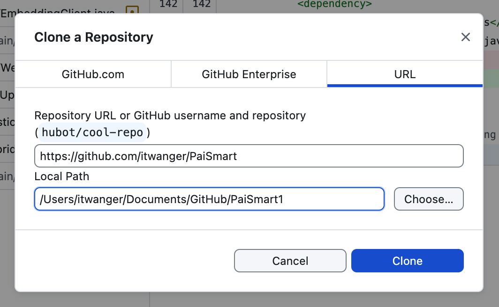

我本地已经 download 了。

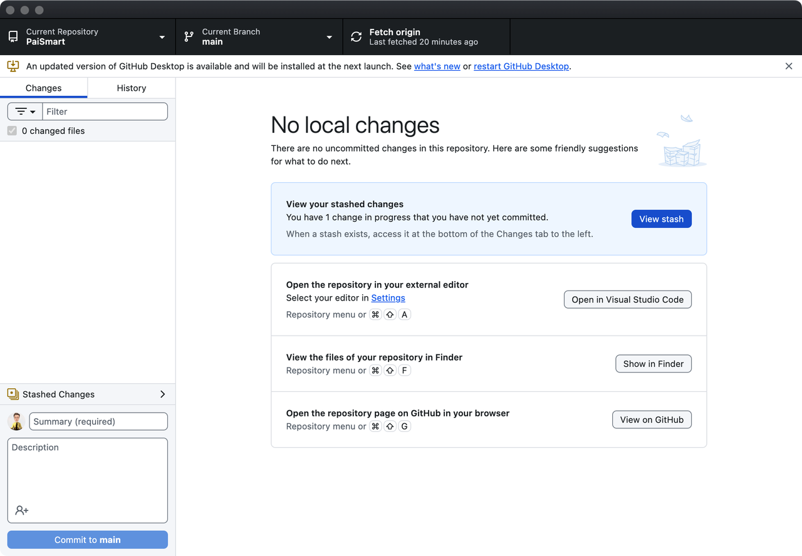

点击【show in finder】这里可以看到下面的目录仓库。

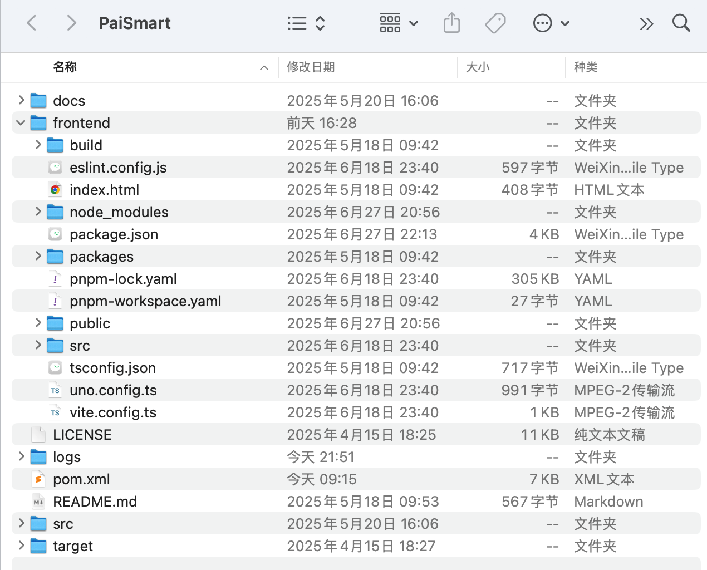

前端的 vue 代码在 frontend 目录在，后端的 Java 代码在 src 目录下。

## 二、启动后端

后端代码，建议用 IntelliJ IDEA 打开。

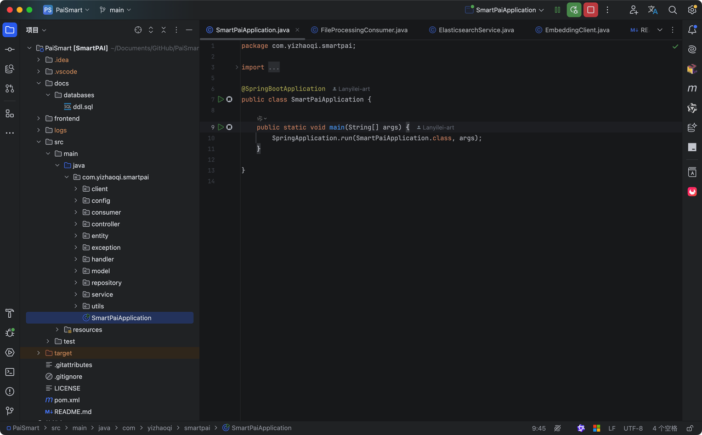

运行的话，直接点击运行/debug 按钮，或者直接 run main 方法，都可以。

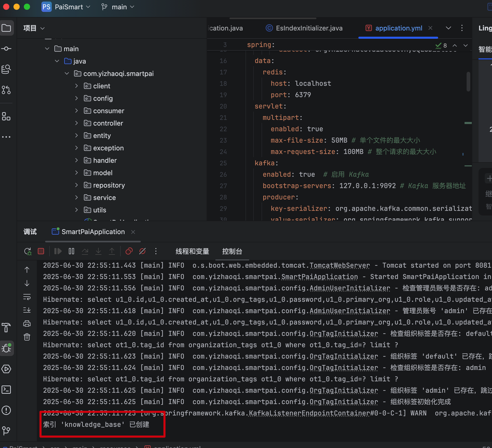

这里注意，前置环境 MySQL、Redis、ES、MinIO、Kafka 的配置信息都是对应上的。

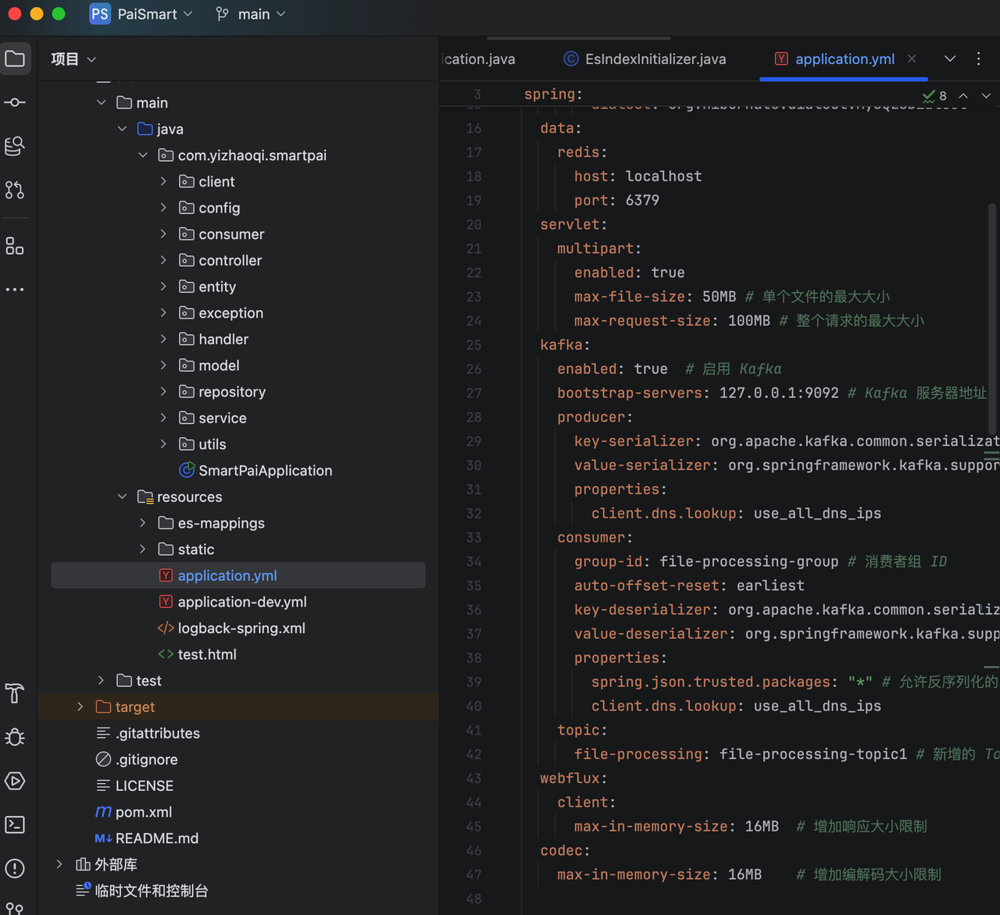

如果有遇到任何 sql 相关的错误，很有可能是数据库结构发生了变化。

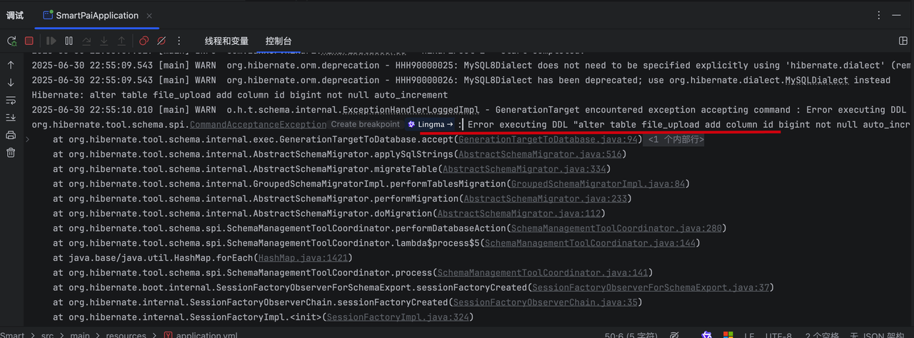

这个时候可以拉取最新的代码，并且把本地的 paismart 数据库删除，重新新建一个空的数据库。

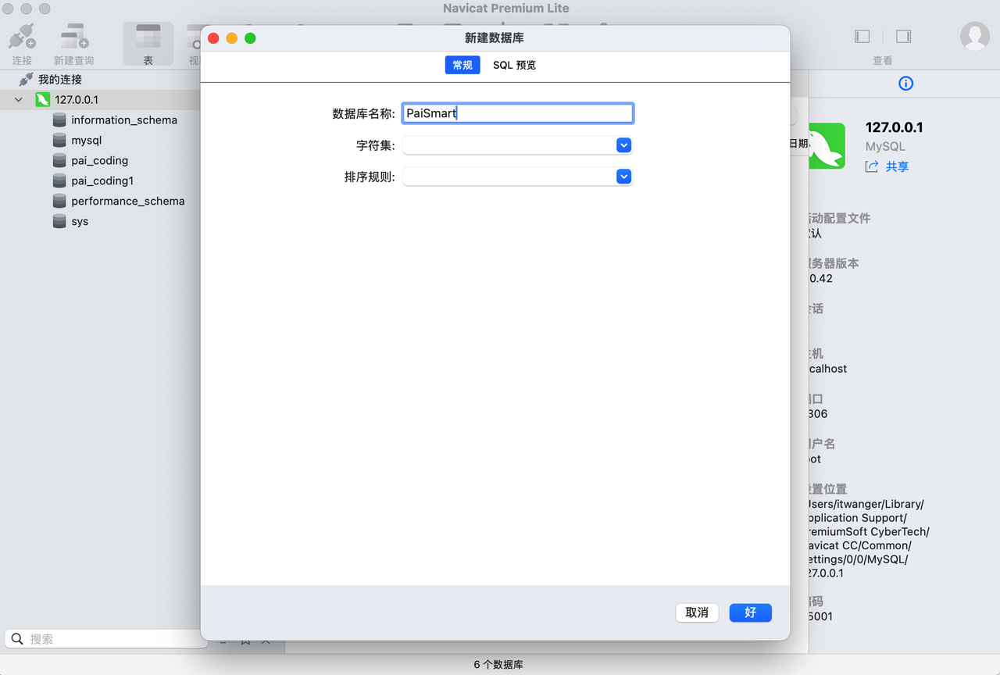

再次运行 SmartPaiApplication，让 sql 重新执行（我们已经让数据文件自动执行了），如果这次没有 sql 相关的报错，像下面这样，一般是可以正常启动的。

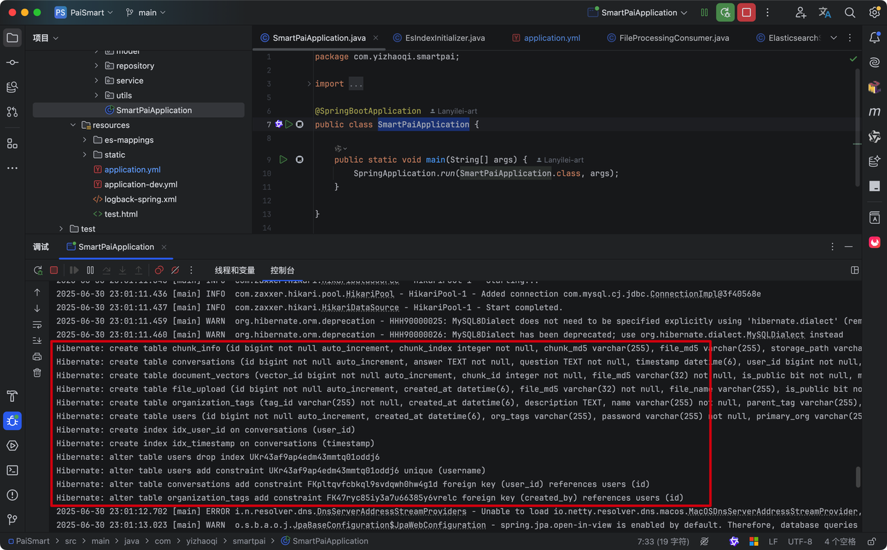

如果在后续上传文件时发现索引创建失败，那么可以执行 curl \-X DELETE ' http://localhost:9200/knowledge\_base' 删除，重新启动项目，保证索引是最新的，HTTPS 模式下的方法请参考： [https://t\.zsxq\.com/JTTyV](https://my.feishu.cn/https%3A%2F%2Ft.zsxq.com%2FJTTyV)

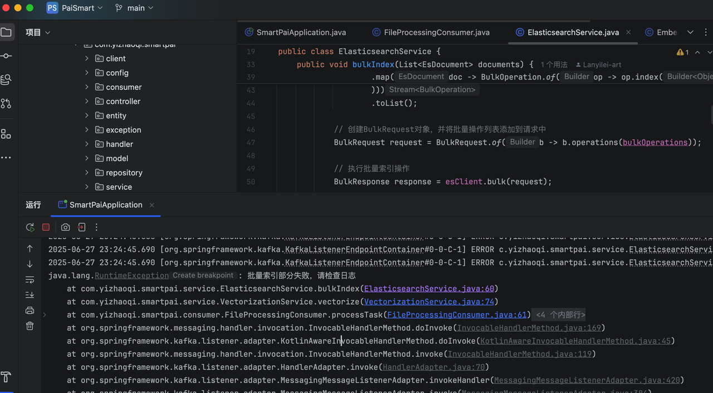

后端启动成功的标志就是 Tomcat started on port 8081。

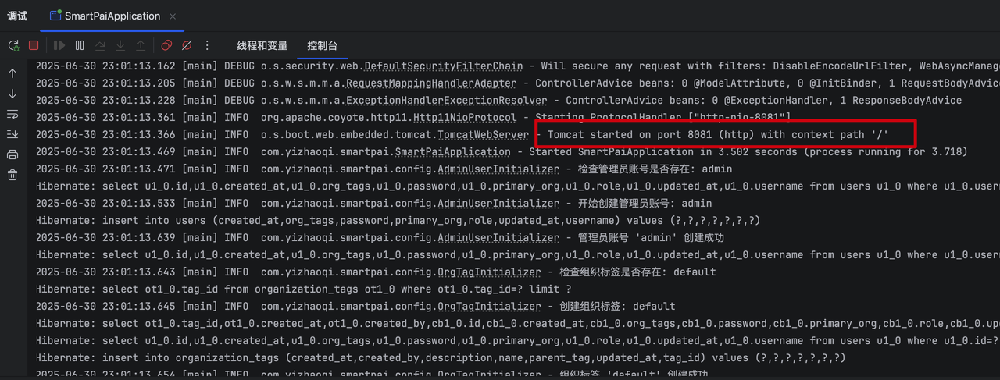

## 三、启动前端

前端的话，推荐用 Trae、VSCode 或者 Cursor 打开，我这里用的是 Trae。启动非常简单，切换到 frontend 目录， 然后先执行 pnpm i 安装依赖 ，然后执行 pnpm run dev 就可以启动前端了。

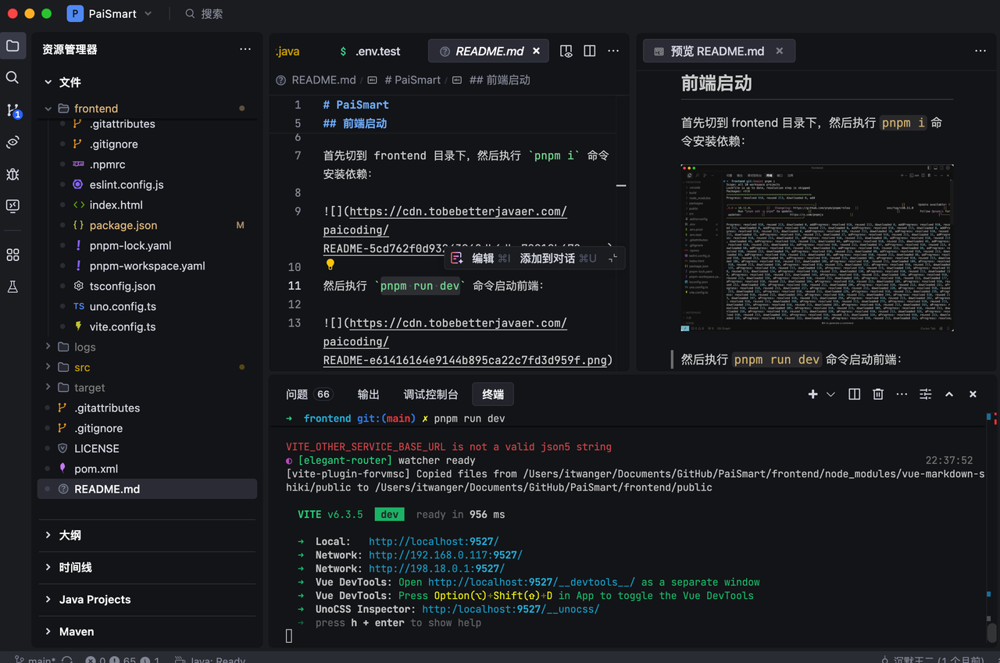

前端启动成功后，会自动在浏览器打开。项目登录账户密码：admin admin123

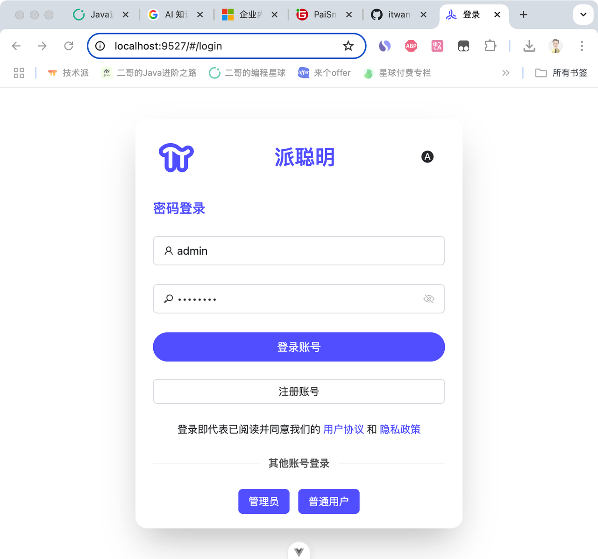
