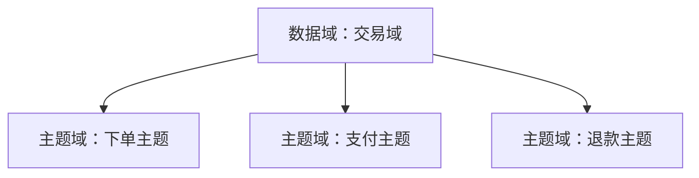

### **高分面试模板**

> 我们的数据域划分主要基于核心业务过程和核心实体对象进行设计。  
> 优先围绕稳定的业务过程划分事实域，比如交易域、营销域、履约域；  
> 再围绕核心实体划分维度域，比如用户域、商品域、组织域。  
> 数据域属于横向划分方式，每个数据域在 ODS、DWD、DWS 各层都会独立建设，保持高内聚、低耦合。  
> 同时我们控制数据域粒度，避免过大导致调度复杂，也避免过细造成模型碎片化。

---

## 一、什么是“数据域”

数据域（Data Domain）是：

> 按业务分析视角对数据进行横向分类的逻辑划分单位。

它的目标是：

- 降低复杂度  
- 统一口径  
- 便于建模和治理  
- 支撑后续数据资产管理  

数据域 ≠ 系统域  
数据域是按“业务过程”划分，不是按“来源系统”划分。

---

## 二、数据域如何划分（方法论）

### 1️⃣ 以业务过程为核心（优先）

一个稳定业务过程 = 一个事实数据域

例如电商：

- 交易域（下单、支付、退款）
- 履约域（发货、签收）
- 营销域（优惠券、活动）
- 行为域（浏览、点击）

原因：

- 业务过程天然具备时间属性
- 产生可度量指标
- 粒度清晰

---

### 2️⃣ 以核心实体对象补充

围绕长期稳定的实体：

- 用户域
- 商品域
- 门店域
- 组织域

这些通常以维度表为主。

---

### 3️⃣ 控制粒度（关键点）

常见错误：

- 域太大 → 调度依赖复杂
- 域太小 → 口径碎片化

经验建议：

一个数据域控制在 10–30 张核心模型表较合理。

---

## 三、数据域 vs 分层（面试必问）

| 对比 | 数据域 | 数仓分层 |
|------|--------|----------|
| 方向 | 横向 | 纵向 |
| 作用 | 业务分类 | 加工流程 |
| 示例 | 交易域 | ODS → DWD → DWS |

可以这样解释：

数据域是“按业务切”，  
分层是“按加工流程切”。

---

## 四、生产中如何划分（实战步骤）

### ✅ 第一步：梳理核心业务链路

画完整业务流程：

注册 → 浏览 → 下单 → 支付 → 发货 → 售后

把每个可独立分析的业务过程单独成域。

---

### ✅ 第二步：找“事实驱动点”

问三个问题：

1. 哪些行为会产生金额？
2. 哪些行为会产生次数？
3. 哪些行为会成为 KPI？

这些行为就是事实域候选。

---

### ✅ 第三步：抽离公共维度域

例如：

- 用户维度
- 商品维度
- 时间维度
- 地区维度

避免在多个域重复建维表。

---

### ✅ 第四步：建立域负责人机制（生产成熟做法）

每个域：

- 有 owner
- 有口径负责人
- 有血缘管理

否则容易口径失控。

---

## 五、常见数据域划分示例（电商）

- 用户域
- 商品域
- 交易域
- 营销域
- 履约域
- 行为域
- 售后域
- 组织域

---

## 六、生产踩坑总结

### 1️⃣ 按系统划分（错误）

例如：

- CRM域
- ERP域
- OMS域

这样会导致：

- 同一个用户在多个域
- 口径混乱

---

### 2️⃣ 事实和维度混杂

例如：

把交易明细和商品属性放在同一个域里，导致依赖混乱。

---

### 3️⃣ 域边界不清

比如：

“营销域”到底包不包含优惠券核销？

必须在设计阶段明确。

---

## 七、面试加分点

如果想拿更高分，可以补一句：

> 数据域划分本质是对企业核心业务能力的抽象建模，它直接决定数仓的扩展性和治理能力，因此我们在设计时会优先保证业务过程的稳定性和指标口径的一致性。

---
 #  数据域 vs 主题域区别  

> 数据域和主题域本质上都是对业务数据的横向划分，但抽象层级不同。  
> 数据域偏宏观，是对企业核心业务能力的一级划分；  
> 主题域是数据域下的进一步细分，通常围绕具体业务过程或分析场景展开。  
> 简单来说，数据域是“大类”，主题域是“子类”，两者是分层包含关系，而不是对立关系。

---

## 一、本质区别（核心理解）

可以用一句话概括：

> 数据域解决“企业有哪些核心业务板块”，  
> 主题域解决“这个板块里具体分析什么”。

数据域更偏战略层，  
主题域更偏建模层。

---

## 二、层级关系（结构视角）

一个典型关系如下：

也就是说：

- 数据域是一级分类
- 主题域是二级分类

---

## 三、从抽象层级看区别

| 维度 | 数据域 | 主题域 |
|------|--------|--------|
| 抽象层级 | 高 | 低 |
| 划分粒度 | 粗 | 细 |
| 面向对象 | 业务能力 | 具体业务过程 |
| 数量 | 少 | 多 |
| 作用 | 组织资产 | 指导建模 |

---

## 四、举例说明（电商场景）

### ✅ 数据域划分

- 用户域
- 商品域
- 交易域
- 营销域
- 履约域

### ✅ 交易域下面的主题域

- 下单主题
- 支付主题
- 退款主题
- 订单履约主题

可以看到：

交易域是大框架，  
主题域是可直接建事实表的分析单元。

---

## 五、为什么很多公司混用这两个概念？

原因有三个：

1. 小公司数仓规模小，没有分层概念
2. 主题域和数据域都是横向划分
3. 早期建模规范不统一

成熟企业通常：

数据域 → 主题域 → 事实表/维度表

---

## 六、生产中如何正确使用

### ✅ 第一步：先定数据域

明确公司核心业务能力：

- 交易
- 用户
- 商品
- 营销
- 财务

数量一般控制在 5–10 个。

---

### ✅ 第二步：再拆主题域

围绕具体业务过程拆分：

- 是否产生度量？
- 是否有时间属性？
- 是否可独立分析？

---

### ✅ 第三步：主题域驱动建模

主题域通常对应：

- 一个或多个事实表
- 若干维度表

---

## 七、面试加分表达

可以补充一句：

> 数据域更多解决数据治理和资产管理问题，而主题域更直接服务于维度建模和指标体系建设。

再高级一点可以说：

> 数据域是企业级数据资产目录的一级目录，主题域是面向分析建模的逻辑组织单元。

---

如果你愿意，我可以继续给你讲：

- 企业级数据域标准划分方法  
- 数据域设计踩坑案例  
- 数据资产目录如何和数据域结合  
- 数仓建模完整分层体系  

### **数据域设计踩坑主要集中在边界不清、按系统划分、事实维度混杂、域粒度失控四类问题，最容易导致后期治理困难和口径混乱。**

下面按照你要求的方式：先给“高分面试模板”，再给完整分析，再讲生产踩坑的真实案例。

---

## **高分面试模板**

> 数据域设计最常见的踩坑包括：第一，按来源系统划分导致域边界紊乱，比如把 CRM、OMS 当成数据域；第二，事实和维度混在同一个域，造成依赖链复杂；第三，数据域粒度过大或过小，不便于扩展和治理；第四，业务过程不清晰导致同一数据分散在不同域中。  
> 这些问题在生产中通常会带来指标不一致、血缘混乱、开发成本提高等后果，因此我们会优先围绕业务过程划分数据域，并为每个域设定明确边界和 owner，保证高内聚低耦合。

---

## **一、数据域设计的核心踩坑类型（分类讲）**

---

### **1️⃣ 按系统划分数据域（最常见且最致命）**

 **错误示例：**

- CRM域  
- ERP域  
- OMS域  
- WMS域  

这会导致：

- 同一实体（用户）在多个数据域重复出现  
- 指标口径混乱（订单在 OMS、ERP 都存在）  
- 系统结构变动会影响整个数据域逻辑  

**本质原因：**

系统是组织视角，数据域是业务视角，两者天然不一致。

---

### **2️⃣ 数据域边界不清（事实跨多个域）**

典型表现：

- “订单履约数据”到底属于交易域还是履约域？
- “优惠券核销”属于营销域还是交易域？
- “售后退款”既在交易域又在售后域出现

导致问题：

- 血缘链路复杂
- 两个域都生产同样的事实表
- 下游不知道该用哪个指标

**根源：**

业务过程分析不到位。

---

### **3️⃣ 事实和维度混放在一个域里（耦合巨大）**

例如有人把：

- 商品属性（维度）
- 商品价格变更流水（事实）
- 商品上下架记录（事实）

全部放在一个“商品域”里。

问题：

- 域内部依赖过多
- 事实表与维度构建顺序混乱
- 任务调度 DAG 爆炸

正确做法：

> 商品域下再分“商品维度主题”和“商品变更主题”。

---

### **4️⃣ 数据域粒度失控：过大 or 过小**

#### **过大（大杂烩）**

一个“交易域”包含：

- 下单
- 支付
- 发货
- 签收
- 售后
- 退款
- 平台券核销
- 物流轨迹

导致：

- 维护困难
- 代码耦合
- 任务链路太长

#### **过细（碎片化）**

例如：

- 下单域
- 支付域
- 退款域
- 售后域
- 发货域
- 轨迹域
- 配送域

问题：

- 同类事实分散
- 域 owner 激增
- 域间依赖复杂

要点：

> 数据域数量建议控制在 5–10 个；  
> 主题域数量控制在 20–40 个。

---

### **5️⃣ 数据域没有 Owner（口径无法固化）**

表现：

- 指标谁负责说了算？
- 表结构谁维护？
- 域边界和口径每个月都变

最终会造成：

- 数据资产不可控
- 新人难以上手

成熟做法：

> 每个数据域必须有唯一 owner，负责业务口径 + 模型规范。

---

### **6️⃣ 未考虑指标体系（域划分与指标冲突）**

例如把“用户行为域”和“推荐域”拆得太开，导致：

- 推荐指标需要行为域数据
- 行为流量指标需要推荐域曝光数据
- 域间来回跳，模型链路交错

最终导致指标不一致。

---

## **二、生产中的真实踩坑案例**

---

### **案例 1：按系统划分导致订单重复 & 指标失真（真实高频案例）**

某公司早期数据域划分为：

- OMS域
- ERP域
- WMS域
- CRM域

结果：

- 订单在 OMS 和 ERP 都存在  
- 支付数据在 ERP、第三方支付系统、财务系统都存在  
- 指标重复、口径不一致

典型事故：

> 营销活动 ROI 复盘数据差异超过 30%，发现是用错了“订单事实表”。

原因：数据域不以业务过程划分。

---

### **案例 2：交易域过大导致 DAG 过长，任务经常爆炸**

交易域包含十几个复杂业务过程：

- 下单、优惠计算、支付、发货、售后、退款…

每天凌晨：

- 1000+ 个调度任务
- DAG 超长
- 延迟经常发生

后续拆分为：

- 下单主题
- 支付主题
- 售后主题
- 退款主题

任务链路缩短了近 40%。

---

### **案例 3：事实和维度混在同域导致链路混乱**

在“商品域”里既有：

- 商品维度（稳定）
- 上下架记录（事实）
- 价格变更流水（事实）
- 促销价格策略（事实）

导致：

- 商品域某次维度变更，影响了 10 多个事实主题
- DAG 不断爆炸

最终拆成：

- 商品维度主题
- 商品价格主题
- 商品运营主题

之后调度稳定。

---

### **案例 4：没有 Owner 导致口径飘移**

某公司“用户域”没有固定负责人：

- 用户活跃定义一年换了四次
- DAU/MAU 全公司部门口径不一致
- 报表难以统一

建立 Owner 后：

- 固化指标体系
- 引入口径管理系统
- 所有下游统一依赖 DWS 层

---

## **三、面试加分总结**

最后你可以这样补一句提升水平：

> 数据域设计的核心不是技术，而是抽象企业业务能力。  
> 失败往往不是因为技术选型，而是因为域边界不清、口径不统一、负责制缺失。  
> 我们的经验是：数据域必须围绕业务过程划分，并保持高内聚低耦合。

---

如果你愿意，我还可以继续给你讲：

- 如何从 0 到 1 搭建数据域体系  
- 数据域 → 主题域 → 事实/维度 设计全流程  
- 企业级数据资产体系如何围绕数据域展开  

继续问就行。