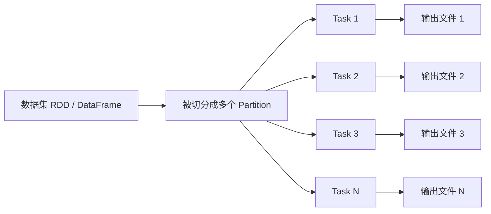
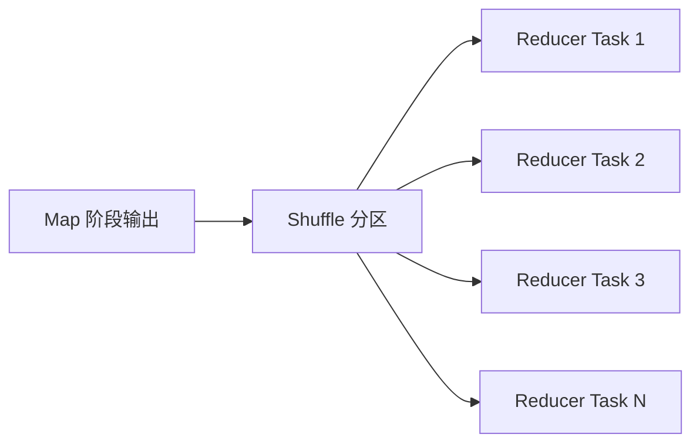
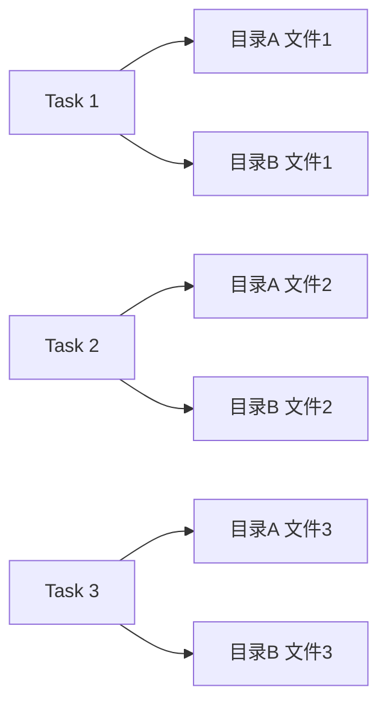

### **“控制 partition 数量”就是控制 Spark 在某个阶段会启动多少个 task 来并行处理数据。**

在 [[spark|Spark]] 里：

> 一个 partition = 一个 task  
> 一个 reducer = 一个 partition = 一个 task  

所以：

**控制 partition 数量，本质就是控制并行度。**

---

## 一、为什么 partition 数量这么重要？

因为它直接决定三件事：

1. 同时有多少个 task 在跑（并行度）
2. 每个 task 处理多少数据
3. 最终会生成多少个结果文件

---

## 二、举个直观例子

假设你有 100GB 数据。

### 情况 A：100 个 partition

- 每个 partition ≈ 1GB
- 会启动 100 个 task
- 并行度 = 100
- 每个 task 最终写 1 个文件

最终文件数 ≈ 100

---

### 情况 B：1000 个 partition

- 每个 partition ≈ 100MB
- 会启动 1000 个 task
- 并行度 = 1000
- 每个 task 写 1 个文件

最终文件数 ≈ 1000

---

你会看到：

> partition 越多 → task 越多 → 文件越多

---

## 三、在你这篇文章的场景里

如果：

```
spark.sql.shuffle.partitions = 2000
```

那么：

- ResultStage 会有 2000 个 task
- 每个 task 会写文件

如果表有 30 个分区：

```
文件数 ≈ 2000 × 30
```

所以：

> 控制 partition 数量 = 控制最终 task 数 = 控制文件数

---

## 四、partition 是什么时候决定的？

主要有三种情况：

### 1️⃣ 读数据时

由：

```
spark.hadoopRDD.targetBytesInPartition
```

决定读取阶段的 partition 数。

---

### 2️⃣ Shuffle 阶段

由：

```
spark.sql.shuffle.partitions
```

或者 AQE 动态计算决定 reducer 数。

---

### 3️⃣ 手动控制

例如：

```sql
repartition(500)
coalesce(200)
distribute by ...
```

你可以强行改 partition 数。

---

## 五、核心一句话

> partition 数量 = Spark 并行度 = task 数量 = 最终文件数量的根源

在多分区写表时，还会发生：

```
partition 数 × 表分区数
```

这就是文件爆炸的根本。

---

如果你愿意，我可以帮你画一个非常简单的示意图，让你彻底理解：

- partition
- task
- reducer
- 文件

四者到底是什么关系。

很好，我们把这件事一次讲透。


你刚刚看到一句话：

> 一个 partition = 一个 task

我给你画一个完整的执行关系图，你会彻底理解 Spark 里：

- partition
- task
- reducer
- 文件

到底是什么关系。

---

### 一、最基础关系图



含义是：

- 一个 Partition 会被一个 Task 处理
- 一个 Task 在写数据时会生成一个文件（在单目录情况下）

所以：

```
Partition 数 = Task 数 = 文件数（单分区表时）
```

---

### 二、加入 Shuffle 之后

当发生 shuffle 时：



此时：

- shuffle 分区数 = reducer 数
- reducer 数 = 最终 partition 数
- 最终 partition 数 = ResultStage task 数

---

### 三、问题真正爆炸的地方：动态分区写表

现在关键来了。

假设：

- reducer 数 = 3
- 表有 2 个分区目录（比如 type=A, type=B）

执行图变成这样：



你看到什么？

每个 Task：

- 会往 每个目录 写一个文件

于是：

- 每个目录 3 个文件
- 总文件数 = 3 × 2 = 6

这就是：

```
文件数 ≈ partition 数 × 表分区数
```

---

### 四、所以本质是什么？

在 ResultStage：

- 一个 partition = 一个 task
- 一个 task 在一个目录写一个文件
- 多目录就会乘法放大

这和 shuffle 机制无关。
这和 sort shuffle 无关。
这和 adaptive 是否开启无关。

这是写出阶段的物理行为。

---

### 五、总结成一句话

当你看到：

> 控制 partition 数量

本质就是在控制：

- 启动多少个 task
- 每个 task 产生多少文件
- 最终文件总数是多少

在多分区写表时：

```
最终文件数 ≈ reducer 数 × 表分区数
```

这就是文章里 2000 × 30 ≈ 6 万文件的根本原因。

---

如果你愿意，我可以再给你讲一个更深一层的问题：

# Spark 设计成“每个 task 在每个目录写一个文件”，而不是自动合并？

那个答案会让你彻底理解 Spark 的架构思想。


这个问题问得非常好。

如果你理解了这个设计逻辑，你就真正理解了 Spark 的架构哲学。

---

## 一、核心原因：Spark 是“分布式并行计算系统”，不是“文件优化系统”

Spark 的核心目标是：

> 最大化并行度  
> 最小化任务间协调  
> 保证任务可重试  

而不是：

> 自动帮你整理磁盘文件结构

---

## 二、为什么每个 task 自己写文件？

在 ResultStage：

- 每个 partition 对应一个 task
- 每个 task 运行在不同 executor 上
- 每个 task 是独立的

如果让多个 task：

- 写同一个文件
- 或协同合并文件

就会产生严重问题：

### 1️⃣ 需要分布式锁

多个 executor 同时写同一个文件：

- 谁先写？
- 谁追加？
- 谁关闭？

这会带来：

- 锁竞争
- 网络协调
- 性能下降

---

### 2️⃣ 破坏“失败可重试”模型

Spark 的容错模型是：

> 某个 task 失败 → 只重跑这个 task

如果多个 task 共同写一个文件：

- 其中一个失败
- 文件状态就不确定
- 无法简单重试

而现在的设计：

- 每个 task 写自己的临时文件
- 成功后统一 commit
- 失败就删掉重跑

逻辑非常清晰。

---

### 3️⃣ 避免跨节点数据移动

如果要自动合并文件：

必须：

- 把多个节点的数据再拉到一个节点
- 再写成大文件

这意味着：

- 额外一次 shuffle
- 额外 IO
- 额外资源消耗

Spark 设计者选择：

> 不默认帮你做这一步  
> 因为不是所有场景都需要

---

## 三、Spark 的设计哲学

Spark 是：

- 内存计算引擎
- DAG 执行系统
- 任务调度系统

它强调的是：

- 计算效率
- 并行吞吐
- 容错能力

文件组织属于：

> 存储优化层面的问题

Spark 把这个问题留给：

- 用户控制 partition
- 用户写 distribute by
- 或后置合并任务

---

## 四、为什么 Hive 会自动 merge？

Hive 的历史背景是：

- 基于 MapReduce
- 每个 MR 作业本来就是落盘计算
- 后置再跑一个 MR 合并文件成本可接受

而 Spark：

- 强调减少 stage
- 减少 IO
- 减少网络

自动 merge 会：

- 强制增加一个 stage
- 拉长任务时间
- 增加资源消耗

很多场景下这是浪费。

---

## 五、本质总结

Spark 选择：

✅ 简单  
✅ 可并行  
✅ 易容错  
✅ 无锁  

而不是：

✅ 自动文件整理  

因为：

> 自动合并一定意味着额外的分布式协调成本。

在分布式系统里：

> 协调是最贵的操作。

---

## 六、用一句话讲透

Spark 不是不会合并文件。

它只是认为：

> 合并文件是一个“业务层决策”，而不是“计算引擎的默认行为”。

这就是为什么：

- 默认一 task 一文件
- 多分区就乘法爆炸
- 但可控、可预测、可重试

---

如果你愿意，我可以再给你讲一个更底层的问题：

为什么 HDFS 小文件会让 NameNode 崩溃？

理解那个之后，你会更清楚为什么这个问题在大数据系统里这么敏感。


#  三种合并区别
很多人会误以为：  
**既然都能合并文件，那为什么还要分 Map 端、Shuffle 端、写后合并三种？**

因为它们解决的是 **完全不同阶段的问题**。

---

## 一、Map 端输入合并有什么用？

作用阶段：**读数据时**

解决的问题：

> 上游已经产生了大量小文件。

如果目录里有：

```
1000 个 5MB 文件
```

不开 Map 端合并：

- 1000 个 map task
- 调度压力大
- Task 启动慢
- Executor 频繁切换

开启后：

- 5GB / 256MB ≈ 20 个 task
- 直接减少 task 数
- 提高读效率

✅ 它解决的是：**输入侧 task 爆炸问题**  
❌ 它不控制最终输出文件数量

---

## 二、Shuffle 端（开启 AQE）有什么用？

作用阶段：**聚合 / join 之后**

解决的问题：

> reducer 太多 → 输出文件太多。

比如：

```
spark.sql.shuffle.partitions = 2000
```

但实际数据只有 100GB。

不开 AQE：

- 2000 个 reducer
- 2000 个输出文件
- 每个文件 50MB

开启 AQE：

- Spark 发现数据不多
- 自动合并 partition
- 变成 ~400 个 reducer
- 文件变成 250MB 左右

✅ 它解决的是：**输出文件数量过多问题**  
✅ 是小文件治理最核心的一步

---

## 三、写后合并有什么用？

作用阶段：**文件已经写出来之后**

解决的问题：

> 由于动态分区或极端[[数据倾斜实践|数据倾斜]]，仍然产生了很多小文件。

它会：

- 再启动一个 job
- 重新读文件
- 再写一次

✅ 是兜底方案  
❌ 成本最高  
❌ 会增加 NN 压力  

---

# 三者的本质区别

| 阶段        | 解决什么问题     | 是否影响最终文件数 |
| --------- | ---------- | --------- |
| Map 端     | 输入 task 过多 | ❌ 不直接影响   |
| Shuffle 端 | reducer 过多 | ✅ 直接决定    |
| 写后合并      | 结果已是小文件    | ✅ 但成本高    |

---

# 为什么不能只开 AQE？

因为如果：

- 上游有 10 万个小文件
- 不做 Map 端合并

即使 AQE 开了：

- 读阶段就已经 10 万个 task
- 作业启动就慢

AQE 只管 Shuffle，不管读文件。

---

# 最关键一句话

- Map 端：解决“读太碎”
- Shuffle 端：解决“写太碎”
- 写后合并：解决“已经碎了”

---

真正生产治理核心是：

> 优先控制 Shuffle，然后保证输入不爆炸，最后再兜底。

如果你愿意，我可以画一张完整流程图，把三者放在一个执行流程里讲清楚。