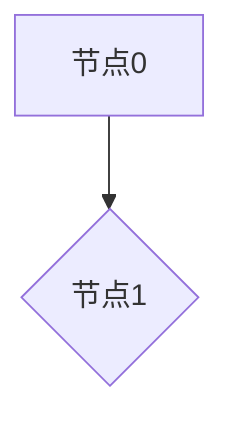

# 数据倾斜实践


<!-- TOC -->

# 一、什么是倾斜

1、数据倾斜的原理很简单：在进行shuffle的时候，必须将各个节点上相同的key拉取到某个节点上的一个task来进行处理，比如按照key进行聚合或join等操作。此时如果某个key对应的数据量特别大的话，就会发生数据倾斜。比如大部分key对应10条数据，但是个别key却对应了100万条数据，那么大部分task可能就只会分配到10条数据，然后1秒钟就运行完了；但是个别task可能分配到了100万数据，要运行一两个小时。因此，整个Spark作业的运行进度是由运行时间最长的那个task决定的。

![[fig_1_image.png]]


# 二、如何判断倾斜

## **平台侧：**

倾斜是一种状态，根据统计全天的任务数，算出"时间倾斜"和"输入数据倾斜"，以此制定出规则。

**时间倾斜和输入倾斜定义**
## 执行时间倾斜计算

    执行时间倾斜指的是stage中task的最长执行时间与中位数的差, 如图1所示的stage: 执行时间倾斜 = 42s(最大) - 4s(中位数) 

![[fig_2_image.png]]


图1

## 输入数据倾斜计算

    输入数据倾斜指的是stage中task的最大输入数据量与中位数的差, 如图1所示的stage: 输入数据倾斜 = 9.4MB(最大) - 2.7MB(中位数) 


## 作业倾斜度计算

### 作业执行时间倾斜

    execTimeSkew代表作业因为倾斜而增加的执行时间, 单位是s. 因为stage可以并行执行, 所以是取所有Stage中的最大值, 而不是求和

    $ExecTimeSkew = Max (T_{max_0}-T_{mid_0},  T_{max_1}-T_{mid_1},  T_{max_2}-T_{mid_2}, ...)$

$T{max_0}$: Stage0的task中执行时间的最大值, $T_{min_0}$: Stage0的task中执行时间的中位数; 最大值和中位数做差, 然后求出所有Stage中差距最大的.

### 作业输入数据倾斜

    inputDataSkew代表作业因为倾斜导致最大的task读入的数据量大, 这里求和是假设最坏的情况: 所有stage的最大task都分配在同一个executor执行时, 这个executor要多读入多少数据

    $InputDataSkew = \sum_{i=1}^n (D_{max_0}-D_{mid_0},  D_{max_1}-D_{mid_1}, ... , D_{max_n}-D_{mid_n})$

$D_{max_0}$: Stage0的task中输入数据量的最大值, $D_{mid_0}$:Stage0的task中输入数据量的中位数

输入数据量 = InputData(HDFS) + ShuffleReadData, 单位MB


详见：https://km.某互联网公司.com/page/331411284


**判断规则**
需要修复的倾斜作业**同时满足**以下判断条件:


1. 执行时间倾斜**超过10min**
2. 输入数据倾斜**超过1G**
3. 输入数据且stage中**输入数据最多**和**执行时间最长**是同一个task


## **琅琊榜：**

琅琊榜比照数平的数据倾斜的定义以及对标了其他企业（阿里）进而制定出下以规则

**判断规则**
执行时间倾斜度定义为：所有并行节点执行时长的最大值 (Max) 与中位数 (Median) 的比值；

数据量倾斜度定义为：所有并行节点所分配的数据量的最大值 (Max) 与中位数 (Median) 的比值;

数据倾斜分 Spark 任务数据倾斜、MR 任务数据倾斜两类：


1. Spark 任务数据倾斜：
任意 Stage 的


  1. Stage 的执行时长超过 1800 秒。
  2. 且执行时间倾斜度、数据量倾斜度均大于 2，

2. MR 任务数据倾斜：
任意 Stage 的


  1. Stage 的执行时长超过 1800 秒。
  2. 且Map 阶段的执行时间倾斜度、数据量倾斜度均大于 2，或 Reduce 阶段的执行时间倾斜度、数据量倾斜度均大于 2，


非同步类的任务，只要发生任一数据倾斜，即会被统计为作数据倾斜任务。


### **琅琊榜spark倾斜举例 **

http://spark-his.data.某互联网公司.com/history/application_1591139964203_77420039/1/stages/

**总结：**

首先该任务在stage3的执行时长超过1800s

![[fig_3_image.png.png]]


且该stage 执行时间倾斜度、数据量倾斜度均大于 2

![[fig_4_image.png.png]]


最后，这个任务是符合琅琊榜规则的spark任务倾斜。因此该任务判定为产生数据倾斜。


# 三、如何解决倾斜

## **解决倾斜方法汇总：**




## **3.1 **输入端倾斜

![[fig_5_image.png.png]]


**方案实现原理：**

在读orc表时，spark任务在创建map task时默认使用**BI策略****，**BI策略是以**文件**为粒度进行**split**划分；

**ETL策略**会将**文件**进行切分，**多个stripe**组成一个split；

**HYBRID**策略为：当文件的**平均大小**大于hadoop最大split值（默认**256M**）时使用ETL策略，否则使用BI策略；

目前平台已对小文件问题进行小文件合并，SET spark.sql.mergeSmallFileSize=1048576; 可以有效减少map输入端倾斜。

**解决方案：**

指定使用ETL策略：

**spark.hadoop.hive.exec.orc.split.strategy=**ETL;（该参数只对orc格式生效）

合并小文件：

**spark.hadoopRDD.targetBytesInPartition=**67108864;  (平台设置为：1M)  合并文件大小为64M

**方案优缺点：**

当ETL策略生效时，driver读取file footer等信息，若其footer（用于描述整个文件的基本信息、表结构信息、行数、各个字段的统计信息以及各个Stripe的信息）较大，可能会导致driver端OOM，因此这类表的读取建议使用BI策略。对于一些较小的尤其有数据倾斜的表（这里的数据倾斜指大量stripe存储于少数文件中），建议使用ETL策略。


## 3.2 shuffle倾斜

![[fig_6_image.png.png]]


### 3.2.1、key倾斜程度轻微

**方案实现原理：**

增加**shuffle read **task的数量，可以让原本分配给一个task的多个key分配给**多个task**，从而让每个task处理比原来**更少的**数据。举例来说，如果原本有5个key，每个key对应10条数据，这5个key都是分配给一个task的，那么这个task就要处理50条数据。而增加了shuffle read task以后，每个task就分配到一个key，即每个task就处理10条数据，那么自然每个task的执行时间都会变短了

**解决方案：**

**spark.sql.shuffle.partitions** = 4000 （默认500）

**方案优缺点：**

实现起来比较简单，可以有效缓解和减轻数据倾斜的影响。只是缓解了数据倾斜而已，没有彻底根除问题，根据实践经验来看，其效果有限。


### 3.3.2、少数key倾斜严重

**方案实现原理：**

将导致数据倾斜的少数key**过滤**之后，这些key就不会参与计算了，自然不可能产生数据倾斜。

**解决方案：**

在Spark SQL中可以使用where子句过滤掉这些key或者在Spark Core中对RDD执行filter算子过滤掉这些key。

```
// 代码块
where key is not in('bigkey')
```

**方案优缺点：**

实现简单，而且效果也很好，可以完全规避掉数据倾斜。适用场景不多，大多数情况下，导致倾斜的key还是很多的，并不是只有少数几个。


### 3.3.3、==reducebykey等聚合类shuffle算子==

**方案实现原理：**

将原本**相同的key**通过**附加随机前缀**的方式，变成多个不同的key，就可以让原本被一个task处理的数据**分散**到多个task上去做**局部聚合，**进而解决单个task处理数据量过多的问题。接着**去除**随机前缀，再次进行**全局聚合**，就可以得到最终的结果。具体原理见下图。

![[fig_7_image.png]]


**解决方案：**

将group by 产生的倾斜key 通过附加随机前缀的方式，进行聚合。

```
// 代码块
    select concat(cast(ceiling(rand(1)*10000) as int),activity_id) activity_id --将activity_id打散10000倍
          ,concat(cast(ceiling(rand(3)*10000) as int),action_id) action_id--将activity_id打散10000倍
```

**方案优缺点：**

对于**聚合类**的shuffle操作导致的数据倾斜，效果是非常不错的。通常都可以解决掉数据倾斜，或者至少是大幅度缓解数据倾斜，将Spark作业的性能提升数倍以上。

仅仅适用于聚合类的shuffle操作，适用范围相对较窄。如果是**join类**的shuffle操作，还得用其他的解决方案。


### 3.3.4、join类导致的key倾斜

####    3.3.4.1 维表小，将reduce join 变为map join

**方案实现原理：**

普通的join是会走**shuffle过程**的，而一旦shuffle，就相当于会将相同key的数据拉取到一个shuffle read task中再进行join，此时就是**reduce join**。但是如果一个RDD是比较小的，则可以采用**广播小表**+**map算子**来实现与join同样的效果，也就是**map join**，此时就不会发生shuffle操作，也就不会发生数据倾斜

**解决方案：将小表进行广播**

```
// 代码块
 select /*+ MAPJOIN(b) */
     a.poi_id
  from table a join b  
```

**方案优缺点：**

对join操作导致的数据倾斜，效果非常好。

这个方案只适用于一个大表和一个小表join的情况


##### **例：app_hotel.app_salary_poi_group_mtd_warzone4**

优化前：倾斜：**8028****M ，**优化后**179M**

http://spark-his.data.某互联网公司.com/history/application_1591139964203_26825238/1/SQL/execution/?id=0

![[fig_8_image.png.png]]


发现有两个小表没有被广播。一个是bd分区维表，一个是临时表

bd维表一天大小是2.8M左右。平台这边对于表是否被广播，是读取的该表元数据信息。分区表在matestore里基本都是没有元数据的，取不到的话就走默认值了（取int最大值)，临时表在matestore也没有存储表信息。因此，根据预估算法两个表没有广播。平台给出参数：

set spark.sql.statistics.fallBackToHdfs=true;

![[fig_9_image.png.png]]


**优化方案：**

```
// 代码块
set spark.sql.statistics.fallBackToHdfs=true;   

select /*+ MAPJOIN(qdup) */
       a.poi_id,a.goods_id,a.current_month_first_online_datekey,a.busi_type,
       sum(case when a.is_mt_online=1 and a.is_dp_online=1 then 1 else 0 end) valid_num ,-- 有效天数
       sum(goods_avalable_num) goods_avalable_num,  -- 这个计算逻辑是判断这个产品如果当天是双平台售卖且有价的那么把当天的有效产品数加起来
       sum(goods_all_num) goods_all_num -- 这个计算逻辑是判断这个产品如果当天是双平台售卖且有价的那么把当天的总产品数加起来
 from
    ba_hotel.dim_poi_valid_online_warzone a 
 join 
    ba_hotel.dim_goods_history b on a.datekey=b.datekey and a.busi_type=b.busi_type and a.goods_id=b.goods_id and b.datekey between $now.month_begin_date.datekey and $now.datekey
 join
   (select bd_id,
   datekey,
   region_id,
   department_id
   from ba_hotel.dim_hotel_bd_history 
   where datekey= $now.datekey and department_id=1854 
   )c
   on b.bd_id=c.bd_id 
 join
 		app_manual_hotel.partner_type1209 qdup  on c.region_id=qdup.region_id and qdup.partner_type=0
```

**结果如下：**<br>
    bd维表和临时表已广播。进而解决倾斜问题。<br>
![[fig_10_image.png.png]]


####    3.3.4.2 部分key倾斜严重，采样倾斜key，并拆分join

**方案实现原理：**

对于join导致的数据倾斜，如果只是**某几个key**导致了倾斜，可以将少数几个key**分拆**成独立RDD，并附加**随机前缀打散**成n份去进行join，此时这几个key对应的数据就不会集中在少数几个task上，而是分散到多个task进行join了

**解决方案：**

将**少数倾斜**key取出来，并将对应的维表扩容n倍，**非倾斜**的key正常join

**方案优缺点：**

对于join导致的数据倾斜，如果只是某几个key导致了倾斜，采用该方式可以用最有效的方式打散倾斜的key进行join。而且只需要针对少数倾斜key对应的数据进行扩容n倍，不需要对全量数据进行扩容。避免了占用过多内存。

如果导致倾斜的key特别多的话，比如成千上万个key都导致数据倾斜，那么这种方式也不适合。


####    3.3.4.3 大量key倾斜严重，采样随机前缀和扩容RDD

**方案实现原理：**

将原先相同的key通过附加**随机前缀**变成不同的key，然后就可以将这些处理后的“不同的key”分散到多个task中去处理，而不是让一个task处理大量的相同key。而这一种方案是针对有大量倾斜key的情况，没法将部分key拆分出来进行单独处理，因此只能对整个RDD维表进行数据扩容，对**内存资源**要求很高。

**解决方案：**

将倾斜key对应的b表进行**扩容n倍**。

```
// 代码块
 select order_key,
       concat(abs(hash(order_key,activity_key)%10),activity_key) activity_key, -- 随机扩容10倍
       source_system,
       max(activity_channel) activity_channel,
       activity_tag_id
     from  tablea
     left join tabelb 
```

**方案优缺点：**

对join类型的数据倾斜基本都可以处理，而且效果也相对比较显著，性能提升效果非常不错。

该方案更多的是缓解数据倾斜，而不是彻底避免数据倾斜。而且需要对整个RDD进行扩容，对**内存资源**要求很高。维表会**膨胀n倍。**运行时间会有影响，可能会变多。

注意：使用rand随机时，可能会有fetch失败情况，可能会导致数据有误。可以采用**hash取模**，但是效果稍差。

https://km.某互联网公司.com/page/211851725#id-shuffle%E4%B8%AD%E5%8C%85%E5%90%ABrand%E7%9A%84%E5%9C%BA%E6%99%AF%E4%BB%A5%E5%8F%8A%E5%BD%B1%E5%93%8D


##### 例:  app_hotel.app_cube_msp_trade

优化前：倾斜 **4174M ，**优化后 **545M**

定位到stage42发现倾斜，执行时长22min，总执行时长为1h

![[fig_11_image.png.png]]


定位对应sql：

![[fig_12_image.png.png]]


发现主表ba_hotel.topic_opt_msp_trade 的某些活动id对应量级达到千万级，其他活动id多是万级别，我们将以下大key拿出来：

![[fig_13_image.png.png]]


**优化方案：**

找到发生倾斜的key（采用使用随机前缀和扩容RDD进行join）扩容10倍

```
// 代码块
select order_key,
		concat(abs(hash(order_key,activity_key)%10),activity_key) activity_key,
		source_system
    ...
    from
```

**结果如下：**

     该stage倾斜得到显著优化。倾斜为 450M，资源充足情况下运行时间：9min。但仍有优化空间。需要找到时间和倾斜的平衡点，因为维表扩容会有执行时间变长和内存溢出的风险。

![[fig_14_image.png.png]]


####    3.3.4.4 大量key倾斜严重，动态一分为二

**方案实现原理：**

对于**倾斜**的值和**非倾斜**的值分开处理，最后**union all**。

**解决方案：**

需要**临时表**存放倾斜的键。将b表倾斜值**扩容n倍**。对于**倾斜**的key的维表进行mapjoin（广播）或者关联，**非倾斜**的key正常join

**方案优缺点：**

比较通用，自由度高，但是对于代码的更改最大，更改代码框架。

对于维表b**数据量大或者分区多**，可能会出现优化后效果不如3.3.4.3，且实际运行时间也比3.3.4.3方案运行时间长。


## 3.4 膨胀倾斜

![[fig_15_image.png.png|642]]


**方案实现原理：**

在数据处理中有一种特殊的情况，两个**多对多**关系的表进行join，会发生**数据膨胀**。

**解决方案：**

在数据处理中应该尽可能的避免**笛卡尔积**，以及**热点key**的**多对多**关系。如果业务上确实需要多对多关系，可以从这几点考虑优化


- 能否**去掉**一些热点的大key
- 能否**增加**一些关联条件，减少最终的结果数据
- 能否在数据范围上做减少，对于笛卡尔积的关联需要把数据条数控制在**1亿**以内
- 如果是**M*N**（M>>N）的**多对多**关系,可以考虑把小表N**广播**出去，对于大表M**切分**成多个很小的数据分片，进行**mapjoin**


##### 例：ba_hotel.dim_poi_landmark

优化前：任务执行时间>2h，优化后：运行时间为562s

![[fig_16_image.png.png]]


定位到这一步：

![[fig_17_image.png.png]]


查看city_id 的统计。发现会出现笛卡尔积。比如city_id=1 数据量级就到了百亿级。（一般笛卡尔积数据量级不超过1亿）左边是c表city_id的统计，右边是b表city_id的统计

![[fig_18_image.png]]


**优化方案：**

将ba_hotel.dim_hotel_location（b表）广播出去。增加过滤条件，减少最终的结果数据.最终表量级3736条。filter后393

```
// 代码块
 select distinct a.poi_id,
               a.city_id
          from ba_hotel.dim_hotel_poi a
          join ba_hotel.dim_hotel_location c
            on a.city_location_id=c.city_location_id
           and c.type='市'
         where a.is_main_poi=1
           and a.province_location_name not in ('南极洲','澳门特别行政区','台湾','香港特别行政区')
           and a.city_location_id>0
           and a.province_location_name is not null
           and a.city_id is not null 
           and a.city_id!=0
           and a.poi_type NOT IN (1,6,13,15,19,20)
           and a.close_status=0
           and a.accurate_result = 1
           and a.merge_id=0
```

将origindb_ss.hotel_searchdata_hotelsearch__hotel_loction_common_table （c表）广播出去。建立临时表，过滤后有78M，并且将广播阀门调为80M。

```
// 代码块
set spark.sql.autoBroadcastJoinThreshold=83886080;

cache table dim_com_landmark_city_rela as 
(
        select distinct 
               id,
               if(city_id=964,62,city_id) city_id
          from origindb_ss.hotel_searchdata_hotelsearch__hotel_loction_common_table
         where dt='$now.datekey'
);
```

**结果如下：**

![[fig_19_image.png.png]]


将关联的key 对应的表都广播出去了。优化完毕。且运行时间为562s。


