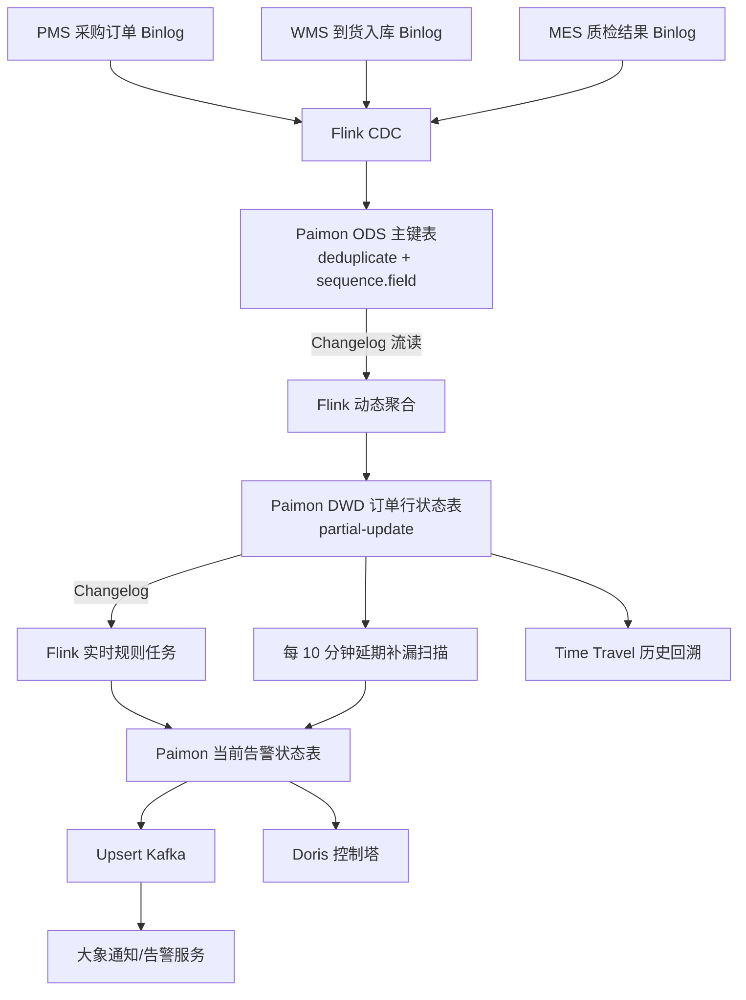

---
tags:
  - 面试
  - 实时数仓
  - 供应链
  - Paimon
  - Flink
  - 实时预警
created: 2026-07-19
source: https://km.sankuai.com/collabpage/2334097267
related:
  - "[[✅供应链实时数仓]]"
  - "[[供应链实时数仓_面试问答]]"
---

# Paimon 采购异常实时预警：开发实现

> [!abstract] 简历原文
> 基于 Paimon Changelog 流读消费采购订单变更数据，对交期延迟、到货差异、质检异常等关键节点实时规则预警，同时支持 Time Travel 按时间点回溯订单状态，替代原 T+1 报表发现问题的模式。

## 一、业务问题

原来采购执行异常主要依靠 T+1 离线报表发现。采购订单当天发生延期、少到货或质检不合格，采购员往往第二天才能看到，无法及时催交、补货或处理供应商质量问题。

这个场景需要同时结合三个系统：

```text
PMS：采购数量、订单状态、约定交期
WMS：到货数量、入库数量、收货状态
MES：报检数量、合格数量、拒收数量、质检结论
```

单个后端系统只能看见自己的业务环节，无法独立判断整条采购链路是否异常。因此由实时数仓异步汇总跨系统状态，后端继续负责交易校验，实时数仓负责跨域监控、预警和历史复盘。

## 二、整体架构



整体职责划分是：Flink CDC 负责采集，Paimon ODS 负责主键去重与乱序过滤，DWD 负责形成订单行级完整状态，Flink 规则任务负责异常判定，Kafka 负责消息分发，Doris 负责控制塔查询，Paimon Snapshot 负责历史状态回溯。

## 三、ODS 主键表

三个系统分别建立 Paimon 主键表。以 PMS 采购订单行为例：

```sql
CREATE TABLE ods_pms_purchase_order_line (
    po_line_id           STRING,
    po_no                STRING,
    supplier_id          STRING,
    material_id          STRING,
    purchase_qty         DECIMAL(18,4),
    expected_delivery_dt TIMESTAMP(3),
    cancelled_qty        DECIMAL(18,4),
    order_status         STRING,
    update_time          TIMESTAMP(3),
    PRIMARY KEY (po_line_id) NOT ENFORCED
) WITH (
    'merge-engine'       = 'deduplicate',
    'sequence.field'     = 'update_time',
    'changelog-producer' = 'lookup',
    'bucket'             = '4'
);
```

关键属性说明：

| 配置 | 作用 |
|---|---|
| `deduplicate` | 相同业务主键合并为最新有效状态 |
| `sequence.field` | 乱序到达时比较版本，避免旧数据覆盖新数据 |
| `changelog-producer=lookup` | 输出包含 Update Before/After 的完整变更流 |

`sequence.field` 必须可靠单调。生产环境优先使用源库版本号或 `update_time + binlog_offset` 组合，仅使用秒级更新时间可能无法区分同一秒内的多次更新。

## 四、DWD 采购订单行状态表

DWD 统一采用 `po_line_id` 粒度，一行表示一个采购订单行在 PMS、WMS、MES 三个系统中的完整状态：

```sql
CREATE TABLE dwd_purchase_order_status (
    po_line_id              STRING,
    po_no                   STRING,
    supplier_id             STRING,
    material_id             STRING,
    purchase_qty            DECIMAL(18,4),
    expected_delivery_dt    TIMESTAMP(3),
    cancelled_qty           DECIMAL(18,4),
    order_status            STRING,
    total_received_qty      DECIMAL(18,4),
    total_qualified_qty     DECIMAL(18,4),
    total_rejected_qty      DECIMAL(18,4),
    latest_inspection_result STRING,
    is_closed               BOOLEAN,
    pms_update_time         TIMESTAMP(3),
    wms_update_time         TIMESTAMP(3),
    mes_update_time         TIMESTAMP(3),
    PRIMARY KEY (po_line_id) NOT ENFORCED
) WITH (
    'merge-engine' = 'partial-update',
    'changelog-producer' = 'lookup',
    'partial-update.ignore-delete' = 'true'
);
```

三个输入流分别更新不同字段：

```text
PMS → purchase_qty、expected_delivery_dt、order_status
WMS → total_received_qty、wms_update_time
MES → total_qualified_qty、total_rejected_qty、质检状态
```

`pending_qty` 不直接落在 DWD 表中，避免不同输入流通过 `partial-update` 覆盖同一个派生字段。规则层动态计算：

```text
待入库数量
= MAX(采购数量 - 累计到货数量 - 已取消数量, 0)
```

WMS 和 MES 的一对多明细必须先按 `po_line_id` 动态聚合，再写入状态表：

```sql
SELECT
    po_line_id,
    SUM(received_qty) AS total_received_qty,
    MAX(update_time)  AS wms_update_time
FROM ods_wms_receipt_detail
GROUP BY po_line_id;
```

不能直接把采购订单、到货单和质检单平铺 Join，否则多个一对多关系会造成数量放大。

## 五、三类预警规则

### 1. 交期延迟

```text
当前时间 > 约定交付时间
AND 待入库数量 > 0
AND 订单未关闭或取消
```

SQL 口径：

```sql
expected_delivery_dt < CURRENT_TIMESTAMP
AND GREATEST(
      purchase_qty
      - COALESCE(total_received_qty, 0)
      - COALESCE(cancelled_qty, 0),
      0
    ) > 0
AND COALESCE(is_closed, false) = false
```

例子：采购 100 件，交期为 7 月 10 日，截至 7 月 11 日累计入库 60 件，则剩余 40 件属于延期未交，而不是整单 100 件全部延期。

> [!warning] Changelog 的时间盲区
> Changelog 只在字段发生变化时触发。如果订单过了交期却没有产生任何新 CDC 事件，仅靠流读不会发现“静默延期”。因此还需使用 Flink Timer，或每 10 分钟批量扫描未完成订单补漏。

### 2. 到货差异

```text
到货差异量 = 实际到货数量 - 本次应到数量
到货差异率 = ABS(实际到货数量 - 本次应到数量) ÷ 本次应到数量
```

演示规则：

```sql
received_qty > 0
AND received_qty < purchase_qty * 0.95
AND is_closed = false
```

5% 只是示例容差，生产中应按品类、供应商或采购方式配置。采购订单允许分批到货时，不能第一次收货后就拿累计到货量和整单采购量比较；应在 ASN、收货批次或订单交付完成后再判断，避免误报。

### 3. 质检异常

```text
质检结论为 NG
OR 拒收数量 > 0
OR 处置方式为返修、退货或报废
```

需要区分抽样不合格、整批拒收、返修、退货和让步接收，不同结果对应不同告警等级。最新质检结论不能用 `MAX(inspection_result)` 获取，应按照 `update_time` 做 Top1；如果仅需要判断是否存在不合格，也可以直接使用累计拒收数量。

## 六、告警幂等与状态机

当前告警表使用以下唯一键：

```text
alert_id = po_line_id + '_' + alert_type
```

例如：

```text
POL1001_DELAY
POL1001_SHORTAGE
POL1001_QUALITY_NG
```

Paimon 当前表通过 `deduplicate + sequence.field` 保证相同 `alert_id` 只保留一条最新状态。但“当前表没有重复行”不等于“通知不会重复”，消息服务还需要维护状态机：

```text
NORMAL → ALERTING → RESOLVED
              ↓
          冷却期内抑制
```

首次由正常转为异常时发送通知；异常持续期间只按冷却周期提醒；恢复正常时发送恢复通知；之后再次异常再生成新告警。完整告警历史应写入独立的 Append-only 审计表，当前状态表只负责展示最新告警状态。

## 七、Time Travel 回溯

实时告警解决“现在是否异常”，Time Travel 解决“当时为什么异常”。

```sql
-- 上午 10:00 的订单状态
SELECT *
FROM dwd_purchase_order_status
FOR SYSTEM_TIME AS OF TIMESTAMP '2024-07-19 10:00:00'
WHERE po_no = 'PO-2024-001';

-- 下午 14:00 的订单状态
SELECT *
FROM dwd_purchase_order_status
FOR SYSTEM_TIME AS OF TIMESTAMP '2024-07-19 14:00:00'
WHERE po_no = 'PO-2024-001';
```

通过比较两个快照，可以定位约定交期、累计到货量或质检结果在什么时间发生变化。例如上午交期是 7 月 20 日，下午被改成 7 月 18 日，那么下午触发延期告警是符合当时数据状态的。

Time Travel 只能恢复某个快照时点的表状态，不能自动回答“是谁修改了交期、为什么修改”。具体操作人和修改原因仍需结合源系统审计日志。

生产环境还要配置 Snapshot 保留策略；默认保留期可能不足以支持长期回溯，可调大保留数量或创建 Tag。

## 八、首次部署顺序

```text
1. 创建 Paimon Catalog 和数据库
2. 创建 PMS/WMS/MES ODS 主键表
3. 创建 DWD 订单行状态表
4. 先启动 DWD 消费任务，准备读取 ODS 当前快照和后续增量
5. 再启动三个 Flink CDC 采集任务
6. 创建告警表并启动实时规则任务
7. 配置每 10 分钟一次的延期补漏扫描
8. 启动 Upsert Kafka 告警分发任务
9. 启动 Doris 状态同步任务
```

首次启动时不要随意使用 `scan.mode='latest'`。该模式只读取任务启动后的变化，如果历史基线没有提前写入，会造成漏数。正常从 Checkpoint 或 Savepoint 恢复时，则从已记录的 Snapshot 继续消费。

## 九、关键技术边界

| 问题 | 处理方式 |
|---|---|
| 同一主键 CDC 重复 | ODS `deduplicate` 合并 |
| CDC 乱序 | `sequence.field` 比较可靠版本字段 |
| 多系统更新不同字段 | DWD `partial-update` 按主键合并 |
| 派生字段被覆盖 | 不落 DWD，在规则层动态计算 |
| 一对多 Join 放大 | 到货、质检先聚合到订单行粒度 |
| 静默延期无 Changelog | Timer 或周期扫描补漏 |
| 重复告警 | `alert_id` + 状态机 + 冷却期 |
| 历史状态复盘 | Snapshot + Time Travel |
| 查询修改人 | 结合源系统审计日志 |
| 首次启动漏历史 | 读取当前快照后持续消费 |

## 十、面试回答

> 原来采购异常依赖 T+1 报表，延期或质检问题通常第二天才能发现。我们通过 Flink CDC 将 PMS 采购订单、WMS 到货入库和 MES 质检数据分别写入 Paimon ODS 主键表，通过 `deduplicate + sequence.field` 维护最新状态并过滤重复、乱序更新。
>
> DWD 层统一采用采购订单行粒度，使用 `partial-update` 将 PMS 的采购数量和约定交期、WMS 的累计到货量、MES 的质检数量合并成一行完整状态。到货和质检明细先按订单行聚合，避免一对多 Join 导致指标膨胀；待入库数量不落表，而是在规则层根据采购量、到货量和取消量动态计算。
>
> 下游 Flink 消费 DWD Changelog，只处理发生变化的订单，实时判断交期延迟、到货差异和质检异常。告警使用“订单行 ID + 异常类型”作为唯一键写入 Paimon 当前告警表，再通过 Upsert Kafka 分发给控制塔和通知服务。对于仅由时间流逝造成、没有 CDC 事件的延期，我们另外每 10 分钟扫描一次未完成订单补漏。
>
> Paimon 历史 Snapshot 支持 Time Travel，可以恢复告警发生时的订单状态，用于解释是哪次交期、到货量或质检结果变化触发了告警。这样把异常发现从次日缩短到分钟级；离线报表仍保留用于日终核对和经营汇总。

## 十一、代码位置

完整示例代码位于：

`/Users/szx/Documents/catdesk/code/paimon-purchase-alert-demo/`

主要文件包括：

```text
01_paimon_catalog.sql
02_ods_paimon_tables.sql
03_flink_cdc_source.sql
04_dwd_purchase_order_status.sql
05_dwd_etl_stream.sql
06_alert_rules_stream.sql
07_time_travel_query.sql
08_delay_timer_scan.sql
09_kafka_alert_sink.sql
10_doris_sync.sql
```

