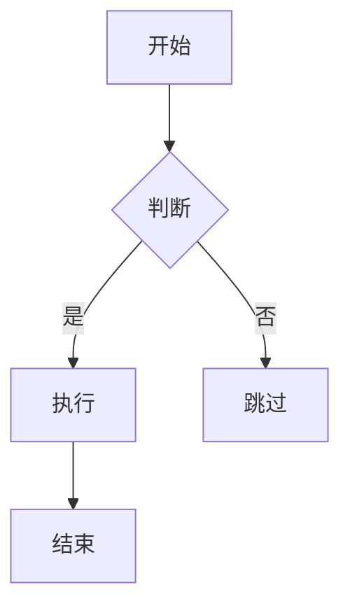

# Markdown 语法详细说明

## 标题

```markdown
# 一级标题
## 二级标题
### 三级标题
#### 四级标题
##### 五级标题
###### 六级标题
```

---

## 文本格式

```markdown
*斜体文本*
**粗体文本**
***粗斜体文本***
~~删除线文本~~
`行内代码`
```

效果：**粗体**、*斜体*、***粗斜体***、~~删除线~~、`行内代码`

---

## 段落与换行

```markdown
这是第一段。

这是第二段（空一行分段）。

这是第一行（行尾加两个空格）  
这是第二行（软换行）
```

---

## 列表

**无序列表**（`-`、`*`、`+` 均可）：

```markdown
- 苹果
- 香蕉
  - 香蕉子项（缩进两格）
- 橙子
```

**有序列表**：

```markdown
1. 第一步
2. 第二步
   1. 子步骤
3. 第三步
```

**任务列表**：

```markdown
- [x] 已完成任务
- [ ] 未完成任务
```

---

## 链接与图片

```markdown
[链接文字](https://example.com)
[带标题的链接](https://example.com "鼠标悬停提示")


<!-- 引用式链接 -->
[链接文字][ref]
[ref]: https://example.com
```

---

## 引用块

```markdown
> 这是一段引用文字
>
> 引用可以多段
>> 嵌套引用（两个 >）
```

---

## 代码块

**行内代码**：

```markdown
使用 `console.log()` 打印输出
```

**围栏代码块**（支持语法高亮）：

````markdown
```python
def hello():
    print("Hello, World!")
```
````

常用语言标识：`python`、`javascript`、`sql`、`bash`、`json`、`yaml`、`markdown`

---

## 分隔线

```markdown
---
***
___
```

三种写法效果相同，均渲染为水平分割线。

---

## 表格

```markdown
| 列1   | 列2   | 列3   |
|-------|:-----:|------:|
| 左对齐 | 居中  | 右对齐 |
| 数据A | 数据B | 数据C |
```

对齐方式：`----` 默认左对齐，`:----:` 居中，`----:` 右对齐。

---

## 脚注

```markdown
这里有一个脚注[^1]，还有另一个[^note]。

[^1]: 这是第一个脚注的内容。
[^note]: 这是命名脚注的内容。
```

---

## 数学公式（LaTeX）

**行内公式**：

```markdown
质能方程 $E = mc^2$ 是物理学基础。
```

**块级公式**：

```markdown
$$
\sum_{i=1}^{n} x_i = \frac{n(n+1)}{2}
$$
```

---

## HTML 内嵌

```markdown
<details>
<summary>点击展开</summary>
这里是折叠内容
</details>

<kbd>Ctrl</kbd> + <kbd>C</kbd>

<mark>高亮文本</mark>
```

---

## 转义字符

用反斜杠 `\` 转义 Markdown 特殊字符：

```markdown
\*不是斜体\*
\# 不是标题
\[不是链接\]
```

可转义的特殊字符：`\` `` ` `` `*` `_` `{}` `[]` `()` `#` `+` `-` `.` `!`

---

## Mermaid 图表（部分平台支持）

````markdown

````

---

## 常用技巧速查

| 需求 | 语法 |
|------|------|
| 粗体 | `**文字**` |
| 斜体 | `*文字*` |
| 删除线 | `~~文字~~` |
| 行内代码 | `` `代码` `` |
| 链接 | `[文字](url)` |
| 图片 | `` |
| 引用 | `> 文字` |
| 分隔线 | `---` |
| 任务列表 | `- [x]` / `- [ ]` |
| 转义 | `\*` |
